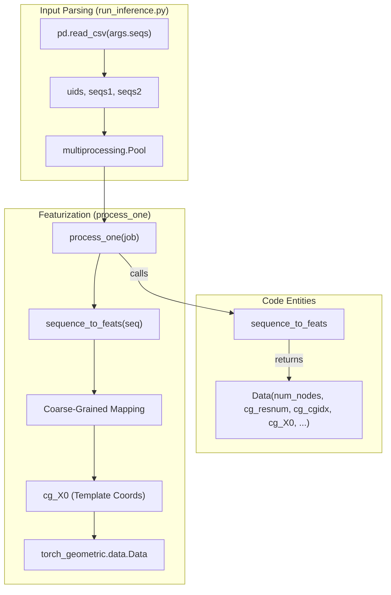
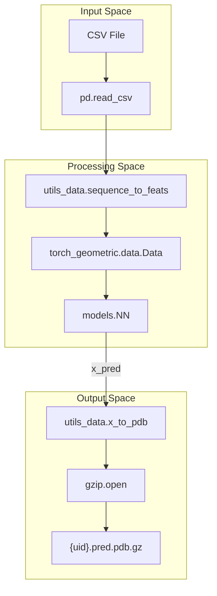

# Input & Output Formats

# Input & Output Formats

> **Relevant source files**
> - [run\_inference\.py](https://github.com/Genentech/equifold/blob/2e466856/run_inference.py)
> - [tests/data/inference\_ab\_input\.csv](https://github.com/Genentech/equifold/blob/2e466856/tests/data/inference_ab_input.csv)
> - [tests/data/inference\_science\_input\.csv](https://github.com/Genentech/equifold/blob/2e466856/tests/data/inference_science_input.csv)
> - [utils\_data\.py](https://github.com/Genentech/equifold/blob/2e466856/utils_data.py)

 EquiFold processes protein sequence data through two distinct pipelines: a **Science** pipeline for single\-chain proteins and an **Antibody \(Ab\)** pipeline for paired heavy and light chains\. This page details the structured CSV schemas required for input and the compressed PDB formats generated as output\.

## Input CSV Schemas

 The inference entrypoint `run_inference.py` [run\_inference\.py L48-L55](https://github.com/Genentech/equifold/blob/2e466856/run_inference.py#L48-L55) accepts a `--seqs` argument pointing to a CSV file\. The required columns depend on the `--model` flag\.

### 1\. Science Pipeline \(Single\-Chain\)

 Used for general protein folding \(e\.g\., mini\-proteins\)\. The pipeline expects a single sequence per row\.

| Column | Description | Example |
| --- | --- | --- |
| uid | Unique identifier for the protein\. Used as the output filename\. | EHEE\_rd3\_0145 |
| seq | Amino acid sequence \(1\-letter codes\)\. | GSSEQTYTFDNSKQAK\.\.\. |

 **Example File:** `tests/data/inference_science_input.csv` [inference\_science\_input\.csv L1-L2](https://github.com/Genentech/equifold/blob/2e466856/tests/data/inference_science_input.csv#L1-L2)

### 2\. Antibody Pipeline \(Paired\-Chain\)

 Used for Fv region folding\. The pipeline expects both heavy and light chain sequences\. EquiFold automatically handles the chain offset using `MAX_DIST` \(32\) to separate the chains in the graph representation [run\_inference\.py L22-L24](https://github.com/Genentech/equifold/blob/2e466856/run_inference.py#L22-L24)

| Column | Description | Example |
| --- | --- | --- |
| uid | Unique identifier for the antibody\. | 6mh2 |
| heavy | Heavy chain amino acid sequence\. | EVQLVESGGGLVQPGG\.\.\. |
| light | Light chain amino acid sequence\. | DIQMTQSPSSLSASVG\.\.\. |

 **Example File:** `tests/data/inference_ab_input.csv` [inference\_ab\_input\.csv L1-L2](https://github.com/Genentech/equifold/blob/2e466856/tests/data/inference_ab_input.csv#L1-L2)

 **Sources:** [run\_inference\.py L68-L76](https://github.com/Genentech/equifold/blob/2e466856/run_inference.py#L68-L76) [inference\_science\_input\.csv L1-L2](https://github.com/Genentech/equifold/blob/2e466856/tests/data/inference_science_input.csv#L1-L2) [inference\_ab\_input\.csv L1-L2](https://github.com/Genentech/equifold/blob/2e466856/tests/data/inference_ab_input.csv#L1-L2)

---

## Data Flow: From CSV to Graph Features

 The following diagram illustrates how raw CSV rows are transformed into `torch_geometric.data.Data` objects via the `process_one` function\.

### Sequence Featurization Data Flow

 **Sources:** [run\_inference\.py L17-L45](https://github.com/Genentech/equifold/blob/2e466856/run_inference.py#L17-L45) [run\_inference\.py L78-L83](https://github.com/Genentech/equifold/blob/2e466856/run_inference.py#L78-L83) [utils\_data\.py L10-L12](https://github.com/Genentech/equifold/blob/2e466856/utils_data.py#L10-L12)

---

## Output Format: Compressed PDB

 EquiFold writes the predicted 3D structures to the directory specified by `--out_dir`\. Each input row generates one file named `{uid}.pred.pdb.gz`\.

### PDB Generation Logic

 The system converts internal coordinate tensors back to PDB strings using `x_to_pdb` [utils\_data\.py L154-L201](https://github.com/Genentech/equifold/blob/2e466856/utils_data.py#L154-L201)

 1. **Coordinates**: Extracted from the final refinement iteration of the model: `results_dict["x_pred"][0][-1]` [run\_inference\.py L95](https://github.com/Genentech/equifold/blob/2e466856/run_inference.py#L95-L95)
2. **Compression**: Files are written using `gzip.open` with "wb" mode [run\_inference\.py L98](https://github.com/Genentech/equifold/blob/2e466856/run_inference.py#L98-L98)
3. **Structure**: - **Record Type**: `ATOM` [utils\_data\.py L171](https://github.com/Genentech/equifold/blob/2e466856/utils_data.py#L171-L171) - **Chain ID**: Defaults to `A` [utils\_data\.py L166](https://github.com/Genentech/equifold/blob/2e466856/utils_data.py#L166-L166) - **B\-factors**: Set to `0.00` by default during inference [utils\_data\.py L169](https://github.com/Genentech/equifold/blob/2e466856/utils_data.py#L169-L169) - **Atom Names**: Derived from the `dst_atom` feature [run\_inference\.py L102](https://github.com/Genentech/equifold/blob/2e466856/run_inference.py#L102-L102)

### PDB Column Mapping

| PDB Field | Source Variable | Implementation Detail |
| --- | --- | --- |
| Atom Name | dst\_atom | 4\-character alignment utils\_data\.py172 |
| Residue Name | dst\_resname | 3\-letter code utils\_data\.py183 |
| Residue Num | dst\_resnum | Global index utils\_data\.py184 |
| Coordinates | x\_pred | Float8\.3 format utils\_data\.py185 |

 **Sources:** [run\_inference\.py L94-L102](https://github.com/Genentech/equifold/blob/2e466856/run_inference.py#L94-L102) [utils\_data\.py L154-L201](https://github.com/Genentech/equifold/blob/2e466856/utils_data.py#L154-L201)

---

## Technical Entity Mapping

 This diagram bridges the conceptual "Input/Output" steps to the specific Python functions and classes responsible for the data transformation\.

### I/O Implementation Map

 **Sources:** [run\_inference\.py L3-L13](https://github.com/Genentech/equifold/blob/2e466856/run_inference.py#L3-L13) [run\_inference\.py L62](https://github.com/Genentech/equifold/blob/2e466856/run_inference.py#L62-L62) [run\_inference\.py L92](https://github.com/Genentech/equifold/blob/2e466856/run_inference.py#L92-L92) [utils\_data\.py L154](https://github.com/Genentech/equifold/blob/2e466856/utils_data.py#L154-L154)

---
*Source: [https://deepwiki.com/Genentech/equifold/1.2-input-and-output-formats](https://deepwiki.com/Genentech/equifold/1.2-input-and-output-formats) on DeepWiki*