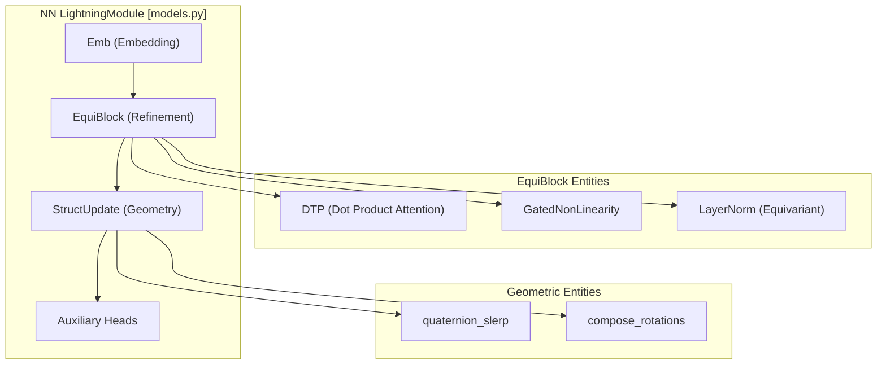
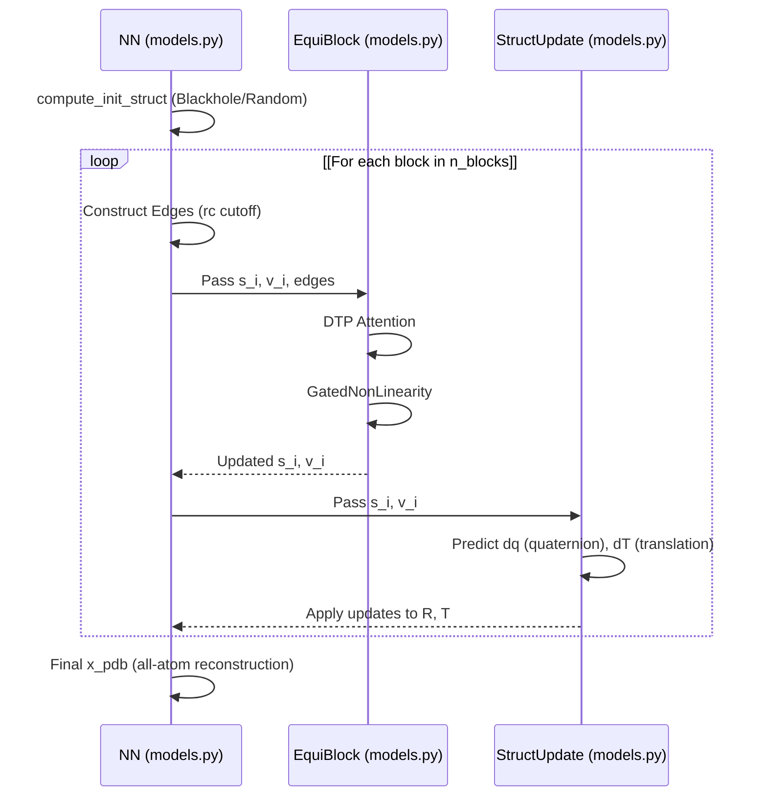

# Neural Network Model \(NN & E3NN\)

# Neural Network Model \(NN & E3NN\)

> **Relevant source files**
> - [models\.py](https://github.com/Genentech/equifold/blob/2e466856/models.py)

 The EquiFold neural network is a specialized architecture designed for coarse\-grained protein folding\. It utilizes a series of equivariant blocks to iteratively refine the 3D structure of a protein, represented as a graph of beads\. The model is implemented as a `pytorch-lightning` module and leverages the `e3nn` library for SE\(3\)\-equivariant operations\.

## Architecture Overview

 The core model is encapsulated in the `NN` class [models\.py L534-L565](https://github.com/Genentech/equifold/blob/2e466856/models.py#L534-L565) It consists of an embedding layer, a sequence of refinement blocks, and a structural update mechanism\. The network operates on scalar features \($s$\) and vector features \($v$\), ensuring that physical rotations of the input result in corresponding rotations of the output coordinates\.

### Data Flow and Iterative Refinement

 The model follows an iterative refinement loop where the protein structure \(Rotation $R$ and Translation $T$\) is updated multiple times\.

 1. **Initialization**: Coordinates are initialized using a "blackhole" \(all at origin\) or "random" scheme [models\.py L21-L36](https://github.com/Genentech/equifold/blob/2e466856/models.py#L21-L36)
2. **Embedding**: Amino acid types and bead identities are mapped to initial scalar and vector features [models\.py L172-L195](https://github.com/Genentech/equifold/blob/2e466856/models.py#L172-L195)
3. **Refinement Loop**: For a specified number of `n_blocks` \(defined in config\), the model performs: - Graph construction based on a distance cutoff `rc`\. - Geometric Attention via `DTP` blocks\. - Structural updates to $R$ and $T$\.
4. **Auxiliary Heads**: Predicts inter\-bead distances and orientations for loss calculation [models\.py L756-L785](https://github.com/Genentech/equifold/blob/2e466856/models.py#L756-L785)

### High\-Level Model Structure

 The following diagram maps the logical components to the specific classes in the codebase\.

 **Model Component Mapping**

 **Sources:** [models\.py L534-L600](https://github.com/Genentech/equifold/blob/2e466856/models.py#L534-L600) [models\.py L721-L750](https://github.com/Genentech/equifold/blob/2e466856/models.py#L721-L750)

---

## Key Components

### 1\. Embedding Layer \(`Emb`\)

 The `Emb` class [models\.py L172-L195](https://github.com/Genentech/equifold/blob/2e466856/models.py#L172-L195) converts node types \(amino acid/bead identity\) into scalar and vector embeddings\. Vector embeddings are initialized in a local frame and then rotated into the global frame using the current rotation matrix $R$ via `rotate_embedding` [models\.py L197-L198](https://github.com/Genentech/equifold/blob/2e466856/models.py#L197-L198)

### 2\. Geometric Attention \(`DTP`\)

 The `DTP` \(Depthwise Tensor Product\) block [models\.py L318-L406](https://github.com/Genentech/equifold/blob/2e466856/models.py#L318-L406) implements the geometric attention mechanism\. It uses the `e3nn` tensor product to combine node features with spherical harmonics of the relative distance vectors between nodes\.

 - **RadialNN**: A sub\-network [models\.py L93-L136](https://github.com/Genentech/equifold/blob/2e466856/models.py#L93-L136) that processes scalar distances using a `BesselBasis` [models\.py L70-L90](https://github.com/Genentech/equifold/blob/2e466856/models.py#L70-L90) to generate weights for the tensor product\.
- **Attention Mechanism**: Computes queries, keys, and values\. The attention weights are derived from scalar products and modulated by the `RadialNN` output\.

### 3\. Equivariant LayerNorm

 Standard LayerNorm is not equivariant for vector features\. EquiFold implements a custom `LayerNorm` [models\.py L139-L168](https://github.com/Genentech/equifold/blob/2e466856/models.py#L139-L168) that:

 - Normalizes scalar features by subtracting the mean and dividing by the RMS [models\.py L150-L158](https://github.com/Genentech/equifold/blob/2e466856/models.py#L150-L158)
- Normalizes vector features by their RMS across the vector channels, preserving their direction [models\.py L161-L166](https://github.com/Genentech/equifold/blob/2e466856/models.py#L161-L166)

### 4\. Structural Update \(`StructUpdate`\)

 The `StructUpdate` block [models\.py L463-L531](https://github.com/Genentech/equifold/blob/2e466856/models.py#L463-L531) converts the high\-dimensional scalar and vector features back into updates for the 3D structure\.

 - **Translation Update**: Vector features are mapped to a $\\Delta T$ vector in the global frame\.
- **Rotation Update**: Scalar and vector features are mapped to a quaternion, which is then converted to a rotation matrix $R\_\{update\}$ and composed with the previous rotation [models\.py L516-L524](https://github.com/Genentech/equifold/blob/2e466856/models.py#L516-L524)

---

## Refinement Loop Logic

 The refinement process is central to EquiFold's accuracy\. The `forward` pass of the `NN` module manages the state of the protein geometry across iterations\.

 **Iterative Update Logic**

 **Sources:** [models\.py L683-L754](https://github.com/Genentech/equifold/blob/2e466856/models.py#L683-L754) [models\.py L495-L531](https://github.com/Genentech/equifold/blob/2e466856/models.py#L495-L531)

---

## Implementation Details

### Radial Basis Functions

 EquiFold uses a sinusoidal radial basis, referred to as `BesselBasis` in the code [models\.py L70-L90](https://github.com/Genentech/equifold/blob/2e466856/models.py#L70-L90) It expands a scalar distance $r$ into a vector of basis functions: $$ \\text\{basis\}\(r\) = \\frac\{2\}\{r\_c\} \\sin\\left\(\\frac\{n \\pi r\}\{r\_c\}\\right\) $$ where $r\_c$ is the cutoff radius [models\.py L89](https://github.com/Genentech/equifold/blob/2e466856/models.py#L89-L89)

### Gated Nonlinearity

 To maintain equivariance while introducing non\-linearity, the model uses `GatedNonLinearity` [models\.py L276-L315](https://github.com/Genentech/equifold/blob/2e466856/models.py#L276-L315) Scalar features are passed through a `silu` activation, while vector features are scaled by a "gate" scalar derived from the node features [models\.py L307-L313](https://github.com/Genentech/equifold/blob/2e466856/models.py#L307-L313)

### Distance and Orientation Prediction

 In the final stages of the forward pass, the model uses `compute_d_ijab_pred` [utils\.py L175-L189](https://github.com/Genentech/equifold/blob/2e466856/utils.py#L175-L189) and `compute_X_uv_pred` [utils\.py L22-L38](https://github.com/Genentech/equifold/blob/2e466856/utils.py#L22-L38) to generate auxiliary outputs\. These are used during training to calculate the FAPE loss and structural violation losses\.

| Class/Function | File Path | Role |
| --- | --- | --- |
| NN | models\.py534 | Main LightningModule and loop controller\. |
| EquiBlock | models\.py409 | Wrapper for DTP and LayerNorm\. |
| DTP | models\.py318 | Equivariant geometric attention block\. |
| StructUpdate | models\.py463 | Translates hidden states to $R, T$ updates\. |
| RadialNN | models\.py93 | MLP\-based weight generator for tensor products\. |
| quaternion\_slerp | utils\.py145 | Smooth interpolation of rotations during warmup\. |

 **Sources:** [models\.py L1-L785](https://github.com/Genentech/equifold/blob/2e466856/models.py#L1-L785) [utils\.py L1-L200](https://github.com/Genentech/equifold/blob/2e466856/utils.py#L1-L200)

---
*Source: [https://deepwiki.com/Genentech/equifold/2.2-neural-network-model-(nn-and-e3nn)](https://deepwiki.com/Genentech/equifold/2.2-neural-network-model-(nn-and-e3nn)) on DeepWiki*