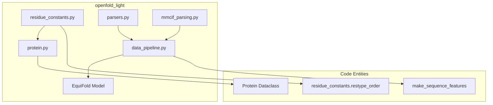
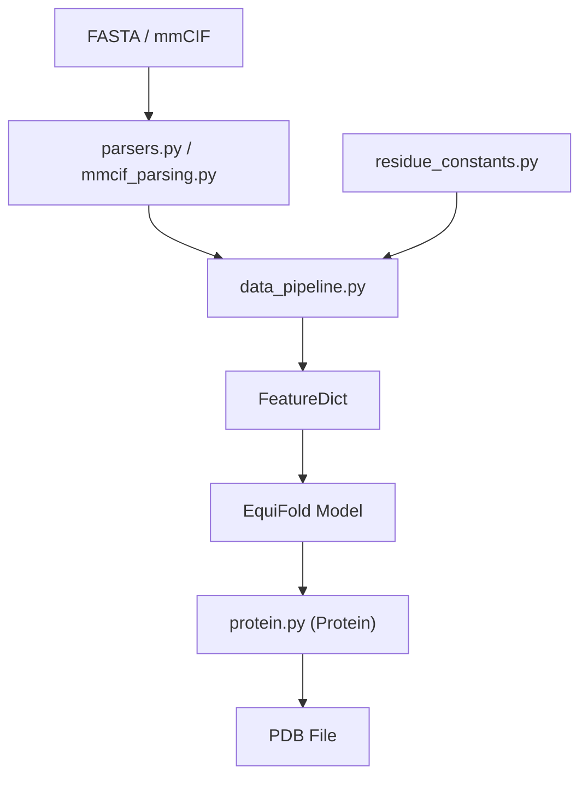

# openfold_light Library

> **Relevant source files**
> * [openfold_light/__init__.py](https://github.com/Genentech/equifold/blob/2e466856/openfold_light/__init__.py)
> * [openfold_light/residue_constants.py](https://github.com/Genentech/equifold/blob/2e466856/openfold_light/residue_constants.py)

The `openfold_light` library is a streamlined, lightweight version of the OpenFold codebase bundled within EquiFold. Its primary purpose is to provide the necessary biological and structural foundations required for protein modeling, including residue constants, standard protein data structures, and robust file parsers for FASTA and mmCIF formats.

By centralizing these utilities, `openfold_light` ensures that EquiFold operates on standardized representations of amino acids and atomic coordinates consistent with AlphaFold2 and OpenFold conventions.

### Library Role and Architecture

`openfold_light` acts as the data utility layer for EquiFold. It handles the transition from raw biological files (like PDB or FASTA) into structured Python objects that the EquiFold pipeline can then transform into geometric graphs.

**Sources:** [openfold_light/residue_constants.py L1-L17](https://github.com/Genentech/equifold/blob/2e466856/openfold_light/residue_constants.py#L1-L17)

 [openfold_light/protein.py L1-L30](https://github.com/Genentech/equifold/blob/2e466856/openfold_light/protein.py#L1-L30)

---

### Core Components

The library is organized into three major functional areas, each detailed in its own sub-page:

#### 1. Residue Constants & Stereo-Chemical Properties

This module defines the fundamental physical and chemical constants of amino acids. It includes mappings for atom types, residue-specific atom lists, chi angle definitions, and rigid group positions used for frame-based geometry. It also incorporates `stereo_chemical_props.txt`, which defines the ideal bond lengths and angles used to calculate structural violation losses during training.

* **Key Entities:** `residue_atoms`, `restype_name_to_atom14_names`, `chi_angles_atoms`, `rigid_group_atom_positions`.
* **For details, see [Residue Constants & Stereo-Chemical Properties](/Genentech/equifold/5.1-residue-constants-and-stereo-chemical-properties).**

**Sources:** [openfold_light/residue_constants.py L35-L79](https://github.com/Genentech/equifold/blob/2e466856/openfold_light/residue_constants.py#L35-L79)

 [openfold_light/residue_constants.py L144-L200](https://github.com/Genentech/equifold/blob/2e466856/openfold_light/residue_constants.py#L144-L200)

#### 2. Protein Data Structures & PDB Parsing

This module provides the `Protein` dataclass, the primary internal representation for a protein structure within the library. It includes utilities to convert this structure to and from PDB strings, handling atom masks, B-factors, and residue indexing. It also contains error handling for multi-chain complexities.

* **Key Entities:** `Protein` (dataclass), `from_pdb_string`, `to_pdb`.
* **For details, see [Protein Data Structures & PDB Parsing](/Genentech/equifold/5.2-protein-data-structures-and-pdb-parsing).**

**Sources:** [openfold_light/protein.py L46-L68](https://github.com/Genentech/equifold/blob/2e466856/openfold_light/protein.py#L46-L68)

 [openfold_light/protein.py L100-L120](https://github.com/Genentech/equifold/blob/2e466856/openfold_light/protein.py#L100-L120)

#### 3. Data Pipeline & File Parsers

These modules manage the ingestion of external data. `parsers.py` handles FASTA sequences and template hits, while `mmcif_parsing.py` extracts structural information from mmCIF files. `data_pipeline.py` orchestrates these parsers to build the `FeatureDict` required by the neural network.

* **Key Entities:** `make_sequence_features`, `parse_fasta`, `MmcifObject`.
* **For details, see [Data Pipeline & File Parsers](/Genentech/equifold/5.3-data-pipeline-and-file-parsers).**

**Sources:** [openfold_light/data_pipeline.py L38-L60](https://github.com/Genentech/equifold/blob/2e466856/openfold_light/data_pipeline.py#L38-L60)

 [openfold_light/parsers.py L30-L50](https://github.com/Genentech/equifold/blob/2e466856/openfold_light/parsers.py#L30-L50)

---

### Data Flow Overview

The following diagram illustrates how raw input files are processed through the `openfold_light` modules to become model-ready features.

| Step | Module | Output |
| --- | --- | --- |
| **Parsing** | `parsers.py` / `mmcif_parsing.py` | `Raw sequence / coords` |
| **Featurization** | `data_pipeline.py` | `FeatureDict` (aatype, residue_index, etc.) |
| **Standardization** | `residue_constants.py` | `Atom14 / Atom37 mappings` |
| **Structure Representation** | `protein.py` | `Protein` dataclass for PDB export |

**Sources:** [openfold_light/data_pipeline.py L150-L180](https://github.com/Genentech/equifold/blob/2e466856/openfold_light/data_pipeline.py#L150-L180)

 [openfold_light/protein.py L158-L175](https://github.com/Genentech/equifold/blob/2e466856/openfold_light/protein.py#L158-L175)