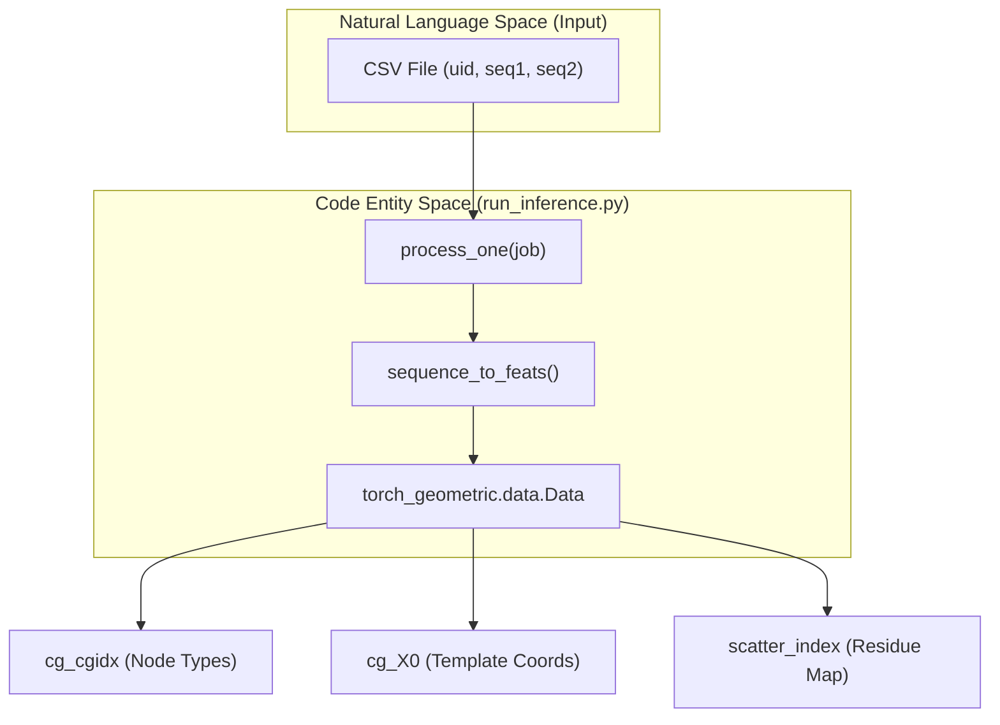

# run_inference.py Entrypoint

> **Relevant source files**
> * [models/ab_weights.pt](https://github.com/Genentech/equifold/blob/2e466856/models/ab_weights.pt)
> * [models/science_weights.pt](https://github.com/Genentech/equifold/blob/2e466856/models/science_weights.pt)
> * [run_inference.py](https://github.com/Genentech/equifold/blob/2e466856/run_inference.py)

The `run_inference.py` script serves as the primary command-line interface for generating 3D protein structures from amino acid sequences. It handles the end-to-end pipeline: from parsing input CSV files and featurizing sequences using multiprocessing to executing the forward pass of the EquiFold model and saving compressed PDB results.

### Argument Parsing and Model Initialization

The script begins by defining the execution environment and loading the model architecture based on the selected pipeline (Antibody `ab` or General Protein `science`).

1. **CLI Arguments**: The script uses `argparse` to configure the model type, directory for weights/configs, input sequence file, CPU count for preprocessing, and the output directory [run_inference.py L49-L55](https://github.com/Genentech/equifold/blob/2e466856/run_inference.py#L49-L55)
2. **Configuration Loading**: It reads a JSON configuration file (e.g., `ab_config.json`) to instantiate the `NN` (LightningModule) class with the correct hyperparameters [run_inference.py L59-L62](https://github.com/Genentech/equifold/blob/2e466856/run_inference.py#L59-L62)
3. **Weight Loading**: Pre-trained weights are loaded into the model via `load_state_dict`, and the model is moved to the target `device` (CUDA if available) in evaluation mode [run_inference.py L63-L65](https://github.com/Genentech/equifold/blob/2e466856/run_inference.py#L63-L65)

| Argument | Type | Default | Description |
| --- | --- | --- | --- |
| `--model` | `str` | `"ab"` | Choices: `ab` (Antibody) or `science` (General). |
| `--model_dir` | `str` | `"models"` | Path to the directory containing `.pt` weights and `.json` configs. |
| `--seqs` | `str` | `None` | Path to the input CSV file containing sequences. |
| `--ncpu` | `int` | `1` | Number of CPU workers for parallel sequence featurization. |
| `--out_dir` | `str` | `"out"` | Directory where `.pdb.gz` files will be saved. |

**Sources:** [run_inference.py L49-L65](https://github.com/Genentech/equifold/blob/2e466856/run_inference.py#L49-L65)

 [models/__init__.py L1-L3](https://github.com/Genentech/equifold/blob/2e466856/models/__init__.py#L1-L3)

---

### Data Ingestion and Multiprocessing

EquiFold processes sequences by converting them into a coarse-grained graph representation. To handle large batches of sequences efficiently, the script utilizes a `multiprocessing.Pool`.

#### CSV Schema Handling

The script expects different CSV columns based on the model type:

* **Antibody (ab)**: Requires `uid`, `heavy`, and `light` columns for paired-chain folding [run_inference.py L71-L73](https://github.com/Genentech/equifold/blob/2e466856/run_inference.py#L71-L73)
* **Science**: Requires `uid` and `seq` columns for single-chain folding [run_inference.py L74-L76](https://github.com/Genentech/equifold/blob/2e466856/run_inference.py#L74-L76)

#### Parallel Featurization

The `process_one` function is the worker unit for the `Pool`. It performs the following:

1. **Feature Generation**: Calls `sequence_to_feats` to convert raw strings into indices for the coarse-grained dictionary (`cg_cgidx`), residue numbers, and atom mapping metadata [run_inference.py L19-L21](https://github.com/Genentech/equifold/blob/2e466856/run_inference.py#L19-L21)
2. **Chain Concatenation**: For antibody models, it joins the Heavy and Light chains. It introduces a `seq2_offset` using `MAX_DIST` to ensure residue numbering and spatial distancing are maintained between the two chains in the graph [run_inference.py L22-L29](https://github.com/Genentech/equifold/blob/2e466856/run_inference.py#L22-L29)
3. **Data Object Construction**: Wraps the resulting tensors into a `torch_geometric.data.Data` object, including the template coordinates `cg_X0` indexed by the coarse-grained bead types [run_inference.py L33-L43](https://github.com/Genentech/equifold/blob/2e466856/run_inference.py#L33-L43)

**Entity Relationship: Sequence to Graph Data**

**Sources:** [run_inference.py L17-L45](https://github.com/Genentech/equifold/blob/2e466856/run_inference.py#L17-L45)

 [run_inference.py L68-L83](https://github.com/Genentech/equifold/blob/2e466856/run_inference.py#L68-L83)

 [utils_data.py L10](https://github.com/Genentech/equifold/blob/2e466856/utils_data.py#L10-L10)

---

### Inference Loop and PDB Generation

Once the dataset is featurized, the script uses a standard PyTorch `DataLoader` to feed the model.

1. **Batching**: The `DataLoader` uses a custom `collate_fn` to handle the geometric data objects [run_inference.py L86](https://github.com/Genentech/equifold/blob/2e466856/run_inference.py#L86-L86)  Note that inference is typically performed with `batch_size=1`.
2. **Forward Pass**: The model is called with `compute_loss=False` and `return_struct=True` [run_inference.py L92](https://github.com/Genentech/equifold/blob/2e466856/run_inference.py#L92-L92)  The model performs iterative refinement, and the script extracts the final predicted coordinates (`x_pred`) from the last iteration [run_inference.py L95](https://github.com/Genentech/equifold/blob/2e466856/run_inference.py#L95-L95)
3. **PDB Reconstruction**: The predicted coordinates (which are at the atom level, decoded from the coarse-grained nodes) are passed to `x_to_pdb` along with residue and atom metadata [run_inference.py L99-L102](https://github.com/Genentech/equifold/blob/2e466856/run_inference.py#L99-L102)
4. **Gzip Output**: The resulting PDB string is encoded and written to a `.pdb.gz` file named after the `uid` [run_inference.py L98](https://github.com/Genentech/equifold/blob/2e466856/run_inference.py#L98-L98)

**Data Flow: Model to PDB**

**Sources:** [run_inference.py L86-L102](https://github.com/Genentech/equifold/blob/2e466856/run_inference.py#L86-L102)

 [utils_data.py L10](https://github.com/Genentech/equifold/blob/2e466856/utils_data.py#L10-L10)