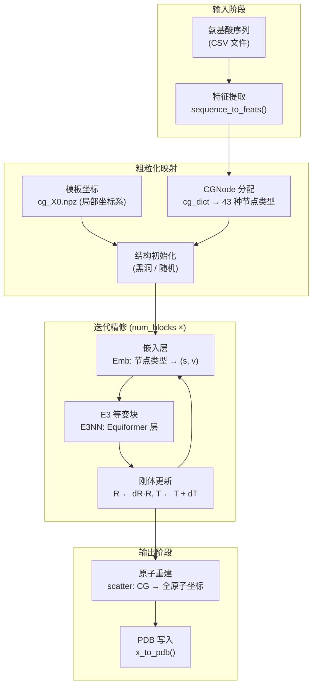

---
slug:1-overview
blog_type:normal
---


**EquiFold** 是一个用于**蛋白质结构预测**的 E3 等变深度学习系统，它引入了一种新颖的**粗粒化结构表示**。该系统由 Prescient Design（Genentech 加速器项目）开发，它摒弃了 AlphaFold2 的全原子或仅主链范式，转而将蛋白质建模为局部刚体的集合——每个刚体编码一组具有化学意义的原子——其位置通过等变神经网络进行迭代精修。最终形成了一个轻量且富有表达力的框架，在微型蛋白质和抗体结构预测任务上均取得了极具竞争力的准确度。

来源: [README.md](/README.md#L1-L4), [models.py](/models.py#L249-L282)

## EquiFold 的功能

给定一段氨基酸序列（或一对重/轻抗体链），EquiFold 能够预测蛋白质的完整 3D 原子坐标，并将输出写入 **gzip 压缩的 PDB 文件**。该系统开箱即支持两种预训练模型配置：

| 模型 | 目标域 | 配置 | 权重 | 输入格式 |
|-------|--------------|--------|---------|--------------|
| **`ab`** | 抗体（重链 + 轻链） | `ab_config.json` | `ab_weights.pt` | 包含 `uid, heavy, light` 列的 CSV |
| **`science`** | 微型蛋白质（单链） | `science_config.json` | `science_weights.pt` | 包含 `uid, seq` 列的 CSV |

这两种模型共享相同的神经网络架构；它们的区别在于超参数，例如迭代精修块的数量（抗体为 6，微型蛋白质为 4）、空间截断半径以及训练策略。

来源: [run_inference.py](/run_inference.py#L48-L76), [models/ab_config.json](/models/ab_config.json#L1-L1), [models/science_config.json](/models/science_config.json#L1-L1)

## 核心创新：粗粒化表示

EquiFold 架构上的核心突破在于其对蛋白质几何结构的**粗粒化（CG）表示**。它不再独立地处理每个原子，而是将每个氨基酸残基分解为 **2–4 个原子组**（CG 节点），其中每个组共享一个共同的局部刚体坐标系（旋转 **R** + 平移 **T**）。例如：

- **丙氨酸** → 2 个 CG 节点：`(C, CA, CB, N)` 和 `(C, CA, O)`
- **苯丙氨酸** → 3 个 CG 节点：`(C, CA, CB, N)`、`(C, CA, O)` 和 `(CG, CD1, CD2, CE1, CE2, CZ)` —— 芳香环作为单一刚体组
- **色氨酸** → 3 个 CG 节点，双环吲哚系统被归为一组

这种设计在所有 20 种标准氨基酸中产生了 **43 种独特的 CG 节点类型**。每个节点存储模板局部坐标（`X0`），这些坐标通过其刚体坐标系转换为全局坐标：**X = R · X0 + T**。与全原子模型相比，这极大地减少了自由度，同时保留了关键的化学几何信息。

来源: [cg.py](/cg.py#L1-L55), [utils_data.py](/utils_data.py#L14-L21)

## 架构一览

下图展示了 EquiFold 从序列输入到 PDB 输出的端到端流程：



来源: [models.py](/models.py#L343-L446), [run_inference.py](/run_inference.py#L17-L45), [utils_data.py](/utils_data.py#L209-L399)

## 项目结构

```
equifold/
├── run_inference.py          # 入口点：加载模型 → 预测 → 写入 PDB
├── models.py                 # 核心神经网络：NN, E3NN, Equiformer, MLP 等
├── cg.py                     # 粗粒化方案：每个残基的原子组定义
├── utils.py                  # 几何操作：FAPE 损失，欧几里得变换，SLERP
├── utils_data.py             # 数据流水线：CG 映射，PDB I/O，结构违规损失
├── cg_X0.npz                 # 所有 CG 类型的预计算模板局部坐标
├── models/                   # 预训练模型权重和配置
│   ├── ab_config.json        #   抗体超参数
│   ├── ab_weights.pt         #   抗体 PyTorch 权重
│   ├── science_config.json   #   微型蛋白质超参数
│   └── science_weights.pt    #   微型蛋白质 PyTorch 权重
├── openfold_light/           # 轻量级 AlphaFold 实用程序（残基常数，解析器）
└── tests/data/               # 示例推理输入
    ├── inference_ab_input.csv
    └── inference_science_input.csv
```

来源: [README.md](/README.md#L1-L11), [cg.py](/cg.py#L1-L10), [models.py](/models.py#L1-L18)

## 关键技术支柱

| 支柱 | 描述 | 核心模块 |
|--------|-------------|------------|
| **粗粒化表示** | 残基被分解为刚性原子组；每个组携带一个局部坐标系 (R, T) 和模板坐标 X0 | `cg.py` |
| **E3 等变网络** | 具有标量/向量特征、球谐函数和深度张量积的 Equiformer 风格注意力机制 | `models.py` → `Equiformer`, `E3NN` |
| **迭代精修** | 多个块逐步更新刚体变换；每个块在当前几何形状下重新嵌入节点 | `models.py` → `NN.forward()` |
| **FAPE 损失** | 帧对齐点误差，用于衡量预测与真实原子位置之间的局部坐标系距离 | `utils.py` → `compute_FAPE_uv()` |
| **SLERP 预热** | 训练通过四元数球面插值将预测初始化在真实值附近，逐渐退火至模型自身的预测 | `utils.py` → `quaternion_slerp()` |
| **结构违规损失** | 针对键长、键角和空间位阻的物理感知惩罚项 | `utils.py` → `compute_struct_loss()` |

<CgxTip>粗粒化表示正是 EquiFold 在架构上区别于 AlphaFold2 的关键所在。AF2 预测的是逐残基坐标系和侧链扭转角，而 EquiFold 预测的是逐 CG 节点的刚体变换——这赋予了对化学连贯原子组的直接几何控制能力，而非仅控制单个扭转自由度。</CgxTip>

<CgxTip>每个精修块都会在**当前**的预测几何形状 (R_pred) 下重新嵌入节点特征，这意味着等变网络始终在反映最新结构估计的坐标系下运行。这形成了一个反馈循环：更优的几何形状 → 更优的嵌入 → 更优的更新。</CgxTip>

来源: [models.py](/models.py#L832-L937), [utils.py](/utils.py#L13-L108), [cg.py](/cg.py#L10-L48)

## 依赖与运行时

EquiFold 基于 **PyTorch** 构建，使用 **PyTorch Geometric** 进行图操作，使用 **e3nn** 处理不可约表示和球谐函数。原始实验在 NVIDIA A100 GPU 上运行。关键依赖包括：

- `pytorch` (1.11+) — 核心张量操作与自动求导
- `e3nn` — E(3) 等变神经网络原语（不可约表示，球谐函数）
- `torch_geometric` — 图构建与消息传递基础设施
- `pytorch_lightning` — 训练循环编排
- `einops` — 张量重塑工具

来源: [README.md](/README.md#L12-L29), [models.py](/models.py#L5-L12)

## 接下来去哪

既然你已经对 EquiFold 的目标和架构有了宏观认知，可以遵循以下阅读路径进一步深入：

1. **[快速上手](2-quick-start)** — 使用预训练模型运行你的首次推理
2. **[架构概览](3-architecture-overview)** — 完整系统设计的详细剖析
3. **[粗粒化表示](4-coarse-grained-representation)** — 原子组与刚体坐标系是如何定义的
4. **[E3 等变神经网络](5-e3-equivariant-neural-network)** — Equiformer 交互块与张量积
5. **[迭代结构精修](6-iterative-structure-refinement)** — 逐块更新循环与刚体组合
6. **[推理与 PDB 输出](11-inference-and-pdb-output)** — 从预测结果到原子坐标