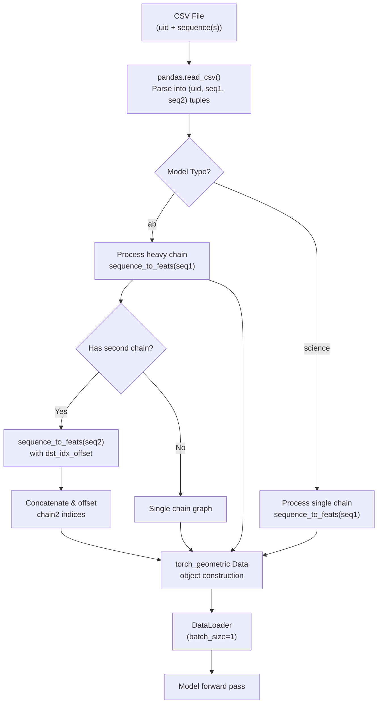
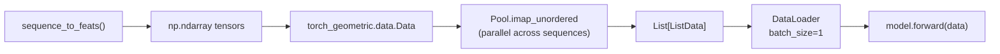

---
slug:10-input-data-pipeline
blog_type:normal
---


EquiFold 的输入数据管道填补了原始氨基酸序列与 E3-equivariant 神经网络所消耗的图结构张量表示之间的鸿沟。该管道在两种截然不同的模式下运行——**推理**（仅序列）和**训练**（基于 PDB）——两者最终都汇聚于共享的粗粒化（CG）特征化，该过程将每个残基分解为刚性分子片段。理解此管道至关重要，因为流入模型的每个张量均确定性地派生自这些特征化步骤，且 CG 映射中的错误会直接传播至结构预测中。

来源: [run_inference.py](/run_inference.py#L1-L103), [utils_data.py](/utils_data.py#L1-L471), [openfold_light/data_pipeline.py](/openfold_light/data_pipeline.py#L1-L625)

## 输入格式：抗体 vs. 科学序列

EquiFold 支持通过 `--model` 标志选择两种输入模式，每种模式由相应的 CSV 格式支撑。**抗体（`ab`）**模型期望在单行中配对重链和轻链序列，而**科学（`science`）**模型则处理单链序列。两种格式均要求每行具有唯一标识符（`uid`）。

| 字段 | 抗体 (`ab`) | 科学 (`science`) |
|---|---|---|
| `uid` | 唯一标识符 | 唯一标识符 |
| `heavy` | 重链序列（单字母码） | — |
| `light` | 轻链序列（单字母码） | — |
| `seq` | — | 单链序列（单字母码） |

位于 `tests/data/inference_ab_input.csv` 和 `tests/data/inference_science_input.csv` 的 CSV 文件具体展示了这些格式。抗体示例（PDB `6mh2`）同时提供了一个 120 残基的重链和一个 107 残基的轻链，而科学示例则提供了一个 46 残基的从头设计序列，其 `uid` 为 `EHEE_rd3_0145`。

来源: [tests/data/inference_ab_input.csv](/tests/data/inference_ab_input.csv#L1-L2), [tests/data/inference_science_input.csv](/tests/data/inference_science_input.csv#L1-L3), [run_inference.py](/run_inference.py#L67-L76)

## 管道架构

数据管道遵循三阶段转换：**CSV 解析** → **序列特征化** → **图构建**。在推理时，该管道完全由序列驱动（无 MSA 或模板搜索），这是一项经过深思熟虑的架构选择，消除了多序列比对带来的计算瓶颈。



来源: [run_inference.py](/run_inference.py#L17-L45), [run_inference.py](/run_inference.py#L67-L86)

## 序列特征化：`sequence_to_feats`

函数 `sequence_to_feats` 是训练期间使用的更丰富的 `pdb_feats_to_data` 在推理时的对应版本。仅给定一个氨基酸序列字符串，它便生成模型推理所需的最小张量集合——具体而言，即 CG 节点索引、残基编号映射，以及将 CG 节点预测还原回全原子输出坐标的散射归约索引。

### 步骤 1：残基至 CG 节点扩展

输入序列中的每个氨基酸根据[粗粒化表示](4-coarse-grained-representation)中定义的 CG 字典，被分解为一个或多个**粗粒化节点**。对于每种残基类型，该函数遍历 `cg_dict` 中定义的 CG 组，为每个组分配唯一的 CG 类型索引（`cg_cgidx`）并记录父残基编号（`cg_resnum`）。例如，丙氨酸（`ALA`）产生两个 CG 节点——主链组 `(C, CA, CB, N)` 和羰基组 `(C, CA, O)`——而精氨酸（`ARG`）产生四个节点，包括胍基平面组。

来源: [utils_data.py](/utils_data.py#L425-L440), [cg.py](/cg.py#L10-L31)

### 步骤 2：原子偏移计算

为了支持从 CG 节点空间到全原子空间的散射归约，管道计算每个残基的偏移量（`resnum_to_offset`）。该偏移量考虑了每种残基类型中重原子数量的差异（例如，甘氨酸有 4 个原子，而色氨酸有 14 个）。累积偏移量实现了一种扁平索引方案，使得整个序列中的每个原子都具有一个唯一的全局索引。

来源: [utils_data.py](/utils_data.py#L442-L448)

### 步骤 3：散射索引构建

**散射索引**和**散射权重**（`scatter_index`，`scatter_w`）定义了从 CG 节点预测到全原子坐标的映射。对于每个 CG 节点，`cgidx_to_atomidx` 查找提供目标残基名称、原子名称、该残基内的原子索引以及**权重因子** `w`。该权重因子是原子在多个 CG 组中出现的重数——被多个 CG 组共享的原子（例如，`C` 和 `CA` 同时出现在主链组和羰基组中）具有 `w > 1`，其散射权重被设置为 `1/w`，以确保在归约期间正确平均。散射索引将每个源位置（`i * N_CG_MAX + k`）映射到全局原子目标索引，并通过 `dst_idx_offset` 进行偏移以支持多链。

来源: [utils_data.py](/utils_data.py#L450-L470), [cg.py](/cg.py#L92-L102)

## 多链拼接

对于抗体模型，重链和轻链通过分别调用 `sequence_to_feats` 进行独立处理，然后通过索引偏移进行拼接。轻链的 `dst_idx_offset` 被设置为重链的总原子数，其残基编号偏移 `len(seq1) + MAX_DIST`（其中 `MAX_DIST = 32`）。这种距离填充确保了在图构建步骤中，链之间不会形成伪边——重链最后一个残基与轻链第一个残基之间的残基距离超过了图半径阈值。

```python
# 多链拼接逻辑（简化版）
cg_cgidx2, ..., offset2 = sequence_to_feats(seq2, dst_idx_offset=offset)
seq2_offset = len(seq1) + MAX_DIST  # = len(seq1) + 32
cg_resnum = np.concatenate([cg_resnum, cg_resnum2 + seq2_offset])
```

<CgxTip>链之间 `MAX_DIST = 32` 的填充至关重要：它保证了链之间的图隔离。如果此值小于模型中使用的 `radius_graph` 阈值，初始化时将出现链间边，这可能在迭代精化收敛前导致非预期的跨链相互作用。</CgxTip>

来源: [run_inference.py](/run_inference.py#L18-L29), [utils_data.py](/utils_data.py#L14-L15)

## 图数据对象构建

特征化后的数组被封装为 `torch_geometric.data.Data` 对象，包含以下字段，这些字段构成了神经网络的完整推理时输入：

| 字段 | 形状 | 描述 |
|---|---|---|
| `num_nodes` | 标量 | 所有残基的 CG 节点总数 |
| `cg_resnum` | `[N_CG]` | 每个 CG 节点的残基索引 |
| `cg_cgidx` | `[N_CG]` | CG 类型索引（映射至模板坐标） |
| `cg_X0` | `[N_CG, N_CG_MAX, 3]` | 来自 `cg_X0.npz` 的模板参考坐标 |
| `scatter_index` | `[N_CG × N_CG_MAX]` | 用于散射归约的目标原子索引 |
| `scatter_w` | `[N_CG × N_CG_MAX]` | 散射权重（1/重数）用于平均 |
| `dst_resnum` | `[N_atoms]` | 每个输出原子的残基编号 |
| `dst_atom` | `[N_atoms]` | 每个输出原子的原子名称 |
| `dst_resname` | `[N_atoms]` | 每个输出原子的残基名称（3 字母） |
| `uid` | 标量 | 此预测的唯一标识符 |

`cg_X0` 字段通过在模块初始化时加载的预计算模板坐标数组 `cg_X0.npz` 进行索引填充。这些模板坐标作为每个 CG 节点的初始参考系，`get_cg_RT` 中的 Kabsch 比对利用它们来建立局部到全局的旋转和平移。

来源: [run_inference.py](/run_inference.py#L31-L44), [utils_data.py](/utils_data.py#L16-L21)

## 训练管道：`pdb_feats_to_data`

在训练期间，由于具备真实 3D 坐标，管道更为丰富。函数 `pdb_feats_to_data` 在 `sequence_to_feats` 的基础上扩展了几项额外计算：

1. **原子位置提取**：从 PDB 特征中读取全原子位置（`[N_res, 37, 3]`）和掩码，其中 37 表示 AlphaFold/OpenFold 中的标准重原子排序。
2. **CG 帧计算**：对于每个 CG 节点，局部坐标系（旋转 `cg_R` 和平移 `cg_T`）由真实原子位置计算得出，可通过简单的三点法（`get_euclidean`）或针对模板坐标的 Kabsch 比对（`get_euclidean_kabsch`）实现。
3. **模板 RMSD 过滤**：当 `real_pdb=True` 时，重建位置与模板坐标偏差过大（RMSD > 1.0 Å）的 CG 节点将通过 `cg_mask` 掩码屏蔽，将解析度较差的残基排除在训练之外。
4. **180° 对称性备选**：对于具有命名歧义的 CG 组（ASP OD1/OD2、GLU OE1/OE2、PHE CD1/CD2、TYR），计算备选原子排列（`cg_X_alt`、`cg_R_alt`、`cg_T_alt`），以处理简并的 chi 角对称性。
5. **结构违规索引**：预计算的键长、键角和范德华宽度数组（`dst_bonds_*`、`dst_angles_*`、`dst_atom_widths`）按残基组装，并辅以残基间肽键约束进行增强。

来源: [utils_data.py](/utils_data.py#L209-L422)

## 序列特征构建：OpenFold Light 层

`openfold_light/data_pipeline.py` 模块提供了改编自 OpenFold/AlphaFold 的底层特征构建函数。这些函数生成训练中使用的规范特征字典：

- **`make_sequence_features`**：从字符串序列生成独热氨基酸编码（`aatype`）、残基索引、序列长度和域名。独热映射使用 `restype_order_with_x`，将 20 种标准残基加上未知（'X'）映射到整数索引。
- **`make_msa_features`**：从多序列比对构建 MSA 整数数组和删除矩阵。在推理时，这被完全绕过——EquiFold 不需要 MSA 输入。
- **`make_template_features`**：组装模板特征（模板氨基酸类型、原子位置、原子掩码、概率总和）。当没有可用的模板命中（推理默认情况）时，返回空的零形状数组。
- **`make_mmcif_features`** / **`make_pdb_features`**：从 mmCIF 或 PDB 结构中提取全原子位置、掩码、分辨率和发布日期，并与序列特征合并。

`DataPipeline` 类（目前已被注释掉）将通过 `process_fasta`、`process_mmcif`、`process_pdb` 和 `process_core` 方法协调这些步骤，每个方法从序列、MSA 和模板特征中组装组合特征字典。EquiFold 的推理管道完全绕过该层，仅依赖 `sequence_to_feats`。

来源: [openfold_light/data_pipeline.py](/openfold_light/data_pipeline.py#L66-L121), [openfold_light/data_pipeline.py](/openfold_light/data_pipeline.py#L181-L214), [openfold_light/data_pipeline.py](/openfold_light/data_pipeline.py#L29-L63)

## 数据加载与整理

推理管道使用自定义的 `collate_fn`，将批处理数据封装到 `ListData` 容器中，而非默认的 PyTorch Geometric 整理方式。`ListData` 类提供了一个简单的 `.to(device)` 方法，可将所有张量元素移动到目标设备。`DataLoader` 配置为 `batch_size=1`、`drop_last=False` 和 `pin_memory=True`，以实现高效的 GPU 传输。输入处理通过 `multiprocessing.Pool` 的 `imap_unordered` 在 CPU 间并行化以提升吞吐量，由 `--ncpu` 标志控制。



<CgxTip>EquiFold 的推理管道刻意采用无 MSA 和无模板设计。此设计选择以 AlphaFold 利用进化信息为代价，换取了极大的速度提升和更简单的部署。粗粒化表示通过模板坐标和 CG 分解本身编码强大的结构先验，从而对此进行补偿。</CgxTip>

来源: [utils_data.py](/utils_data.py#L133-L151), [run_inference.py](/run_inference.py#L78-L92)

## 特征总结：推理 vs. 训练

下表总结了推理与训练数据管道之间的主要差异，突出显示了每种模式下可用的特征及其计算来源。

| 特征 | 推理 | 训练 | 来源 |
|---|---|---|---|
| `cg_cgidx` | ✅ | ✅ | 序列 → CG 映射 |
| `cg_resnum` | ✅ | ✅ | 序列残基索引 |
| `scatter_index` / `scatter_w` | ✅ | ✅ | CG → 原子归约映射 |
| `cg_X0` (模板坐标) | ✅ | ✅ | `cg_X0.npz` 查找 |
| `cg_X` (真实坐标) | ❌ | ✅ | PDB 原子位置 |
| `cg_R`, `cg_T` (CG 帧) | ❌ | ✅ | 源自 PDB 的 Kabsch / Euclidean |
| `cg_mask` (节点有效性) | ❌ | ✅ | 原子存在性 + RMSD 过滤 |
| `cg_R_alt`, `cg_T_alt` (对称性备选) | ❌ | ✅ | 180° 排列 |
| `dst_bonds_*`, `dst_angles_*` | ❌ | ✅ | 立体化学约束 |
| MSA 特征 | ❌ | ✅ (可选) | 比对运行器 |
| 模板特征 | ❌ | ✅ (可选) | HHsearch 命中 |

来源: [utils_data.py](/utils_data.py#L380-L420), [run_inference.py](/run_inference.py#L31-L43)

---

**下一步**：了解这些特征化输入如何流经模型以生成最终 PDB 坐标，请参阅[推理与 PDB 输出](11-inference-and-pdb-output)。有关支撑此管道的 CG 表示理论，请参阅[粗粒化表示](4-coarse-grained-representation)。