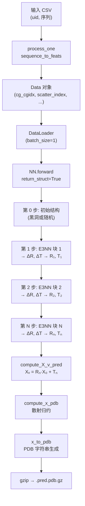

---
slug:11-inference-and-pdb-output
blog_type:normal
---


EquiFold 的推理流程将氨基酸序列转换为全原子 3D 蛋白质结构，并输出可用于生产的 PDB 文件。该流程是一个自包含的单次处理过程：序列特征被组装为粗粒化（CG）图节点，等变神经网络迭代优化刚体变换，最终的 CG 级坐标被散射回逐原子的笛卡尔坐标位置，随后序列化为 gzip 压缩的 PDB 文件。本文将逐步介绍该流程的每个阶段——从输入 CSV 到磁盘上的 `.pdb.gz` 文件——并解释将 CG 表示桥接至全原子输出的坐标重建逻辑。

来源: [run_inference.py](run_inference.py#L1-L103), [models.py](models.py#L249-L503), [utils_data.py](utils_data.py#L1-L471), [utils.py](utils.py#L340-L344)

## 推理入口与 CLI 参数

`run_inference.py` 脚本是生产推理的唯一入口。它接受四个命令行参数，用于控制模型选择、数据来源、并行度以及输出位置：

| 参数 | 默认值 | 描述 |
|---|---|---|
| `--model` | `"ab"` | 模型变体：`"ab"` 代表抗体（重链+轻链），`"science"` 代表单链科学蛋白质 |
| `--model_dir` | `"models"` | 包含 `{model}_weights.pt` 和 `{model}_config.json` 的目录 |
| `--seqs` | `None` | 输入 CSV 文件的路径（必填） |
| `--ncpu` | `1` | 用于并行特征计算的 CPU 进程数 |
| `--out_dir` | `"out"` | gzip 压缩 PDB 输出文件的目录 |

该脚本从 JSON 加载模型配置，实例化 `NN` 模块，通过 `torch.load` 恢复权重，并切换至评估模式。设备选择是自动的——如果可用则使用 CUDA，否则使用 CPU。

来源: [run_inference.py](run_inference.py#L48-L65)

## 输入格式与序列特征提取

EquiFold 消费一个 CSV 文件，其模式取决于模型变体。**抗体模型**（`--model ab`）期望的列为 `uid`、`heavy` 和 `light`，其中 `heavy` 和 `light` 分别是重链和轻链的单字母氨基酸序列。**科学模型**（`--model science`）期望的列为 `uid` 和 `seq`，用于单链序列。

```
# 抗体输入 (tests/data/inference_ab_input.csv)
uid,heavy,light
6mh2,EVQLVESGGGLVQPGGSLRLSCAASGFNIKDTYIHWVRQAPGKGLEWVARIYPTNGYTRYADSVKGRFTISADTSKNTAYLQMNSLRAEDTAVYYCSRWGGDGFYAMDYWGQGTLVTVSS,DIQMTQSPSSLSASVGDRVTITCRASQDVNTAVAWYQQKPGKAPKLLIYSASFLYSGVPSRFSGSRSGTDFTLTISSLQPEDFATYYCQQHYTTPPTFGQGTKVEIK

# 科学输入 (tests/data/inference_science_input.csv)
uid,seq
EHEE_rd3_0145,GSSEQTYTFDNSKQAKKFAKELKKKGIPFQLHQKNGKWQVTKQ
```

强制要求唯一标识符（`uid`）唯一——重复的 UID 将触发断言失败。对于抗体推理，两条链会被一起处理：轻链的残基编号和原子索引会偏移 `len(seq1) + MAX_DIST`（其中 `MAX_DIST = 32`），以避免与重链发生冲突，同时保留边类型编码的语义。

来源: [run_inference.py](run_inference.py#L67-L83), [tests/data/inference_ab_input.csv](tests/data/inference_ab_input.csv#L1-L2), [tests/data/inference_science_input.csv](tests/data/inference_science_input.csv#L1-L3)

## `process_one` 函数：从序列到图数据

每一输入行通过 `process_one` 被转换为 `torch_geometric.data.Data` 对象，该函数通过 `multiprocessing.Pool` 在 CPU 核心上并行执行。该函数调用 `sequence_to_feats` 从原始氨基酸字符串派生出以下张量：

| 字段 | 形状 | 用途 |
|---|---|---|
| `cg_cgidx` | `[N_cg]` | 每个节点的 CG 类型索引（映射到模板坐标和嵌入） |
| `cg_resnum` | `[N_cg]` | 每个 CG 节点的残基编号（驱动边类型计算） |
| `scatter_index` | `[N_cg × N_CG_MAX]` | 散射归约的目标原子索引（CG → 全原子） |
| `scatter_w` | `[N_cg × N_CG_MAX]` | 每个散射原子的逆多重性权重 |
| `dst_resnum` | `[N_atoms]` | 每个输出原子的残基编号 |
| `dst_atom` | `[N_atoms]` | 每个输出原子的原子名称（如 `"CA"`、`"CB"`） |
| `dst_resname` | `[N_atoms]` | 每个输出原子的三字母残基名称 |

`cg_X0` 模板坐标（从 `cg_X0.npz` 加载）通过 `cg_cgidx` 进行索引，并附加到每个 Data 对象上，提供网络预测的刚体变换所作用的局部坐标系参考坐标。

来源: [run_inference.py](run_inference.py#L17-L45), [utils_data.py](utils_data.py#L425-L470)

## 散射归约：从 CG 坐标到全原子位置

从 CG 节点坐标映射回逐原子笛卡尔坐标位置的过程是一个**散射归约**——同一个原子可能出现在多个 CG 节点中（例如，对于某些残基，`CA` 同时属于主链 CG 和侧链 CG），因此其最终位置是加权平均值。`compute_x_pdb` 函数实现了这一点：

```python
def compute_x_pdb(X_v_pred, scatter_index, scatter_w, natoms):
    X_pred_flat = X_v_pred.reshape(-1, 3) * scatter_w.reshape(-1, 1)
    X_pred_pdb = scatter(X_pred_flat, scatter_index, dim=0, dim_size=natoms)
    return X_pred_pdb
```

权重 `scatter_w` 是每个原子在其残基 CG 分解中的**逆多重性**。例如，如果 `CA` 出现在两个 CG 组中，则每次出现的权重为 `1/2`，因此散射求和产生两个预测的平均值。这是在 `sequence_to_feats` 期间通过 `cg.py` 中的 `cg_atom_weight` 计数器预先计算的，该计数器统计每个原子属于多少个 CG 组。

<CgxTip>跨 CG 节点共享的原子（如主链中的 CA、C、N）在散射归约期间会被平均。这不是 Bug——这是为解决粗粒化分解中固有重叠而设计的机制，确保将冲突的局部坐标系预测协调为单一一致的位置。</CgxTip>

来源: [utils.py](utils.py#L340-L344), [utils_data.py](utils_data.py#L450-L470), [cg.py](cg.py#L93-L102)

## 模型前向传播：迭代结构优化

在推理期间，模型的调用参数为 `compute_loss=False` 和 `return_struct=True`。`NN.forward` 方法迭代 `num_blocks + 1` 步（第 0 步存储初始结构；第 1 步到第 `num_blocks` 步应用等变网络块）。在每一步中，当前的全原子坐标通过以下方式计算：

1. 将预测的刚体变换**应用于**模板坐标：`X_v_pred = R_pred @ X0 + T_pred`（`compute_X_v_pred` 函数）
2. **散射归约**至逐原子位置：`x_pred = compute_x_pdb(X_v_pred, scatter_index, scatter_w, natoms)`

推理循环在每次优化步骤存储 `R_pred`、`T_pred`、`X_pred`（CG 级）和 `x_pred`（原子级）。最终的 PDB 输出仅使用**最后一步的** `x_pred`——通过 `results_dict["x_pred"][0][-1]` 访问，其中索引 `0` 选取第一个（也是唯一的，因为 batch_size=1）样本，`[-1]` 选取最终的优化迭代。



来源: [models.py](models.py#L343-L503), [run_inference.py](run_inference.py#L89-L102)

## PDB 文件生成：`x_to_pdb` 函数

`x_to_pdb` 函数将预测的原子坐标转换为符合标准的 PDB 字符串。它接收四个必需参数——`x`（坐标 `[N_atoms, 3]`）、`resnum`（残基编号）、`resname`（三字母残基名称）和 `atoms`（原子名称）——以及一个可选的 `b_factors` 数组（默认为零）。

每个原子作为 `ATOM` 记录输出，采用 PDB v3.3 列格式：

| 列 | 字段 | 来源 |
|---|---|---|
| 1–6 | 记录类型 | `"ATOM"` |
| 7–11 | 原子序列号 | 递增整数 |
| 13–16 | 原子名称 | 若小于 4 个字符则左填充 |
| 18–20 | 残基名称 | 三字母代码 |
| 22 | 链标识符 | 硬编码为 `"A"` |
| 23–26 | 残基序列号 | 来自 `resnum` |
| 31–38 | X 坐标 | `pos[0]`，8.3f 格式 |
| 39–46 | Y 坐标 | `pos[1]`，8.3f 格式 |
| 47–54 | Z4 Z 坐标 | `pos[.2]`，8.3f 格式 |
| 55–60 | 占据率 | `1.00` |
| 61–66 | B 因子 | 来自 `b_factors` |
| 77–78 | 元素符号 | 原子名称的首字符 |

PDB 文件由 `MODEL     1` / `ENDMDL` / `END` 记录包裹，并在最后一个原子后包含一行 `TER`。

<CgxTip>无论输入是单链还是重链+轻链抗体对，所有输出原子均被分配至链 `A`。如果下游工具需要单独的链标识符，则需对 PDB 文件进行后处理。</CgxTip>

来源: [utils_data.py](utils_data.py#L154-L206)

## 输出格式与文件命名

最终输出是写入 `{out_dir}/{uid}.pred.pdb.gz` 的 **gzip 压缩 PDB 文件**。gzip 压缩通过 Python 的 `gzip.open` 以二进制写入模式应用，PDB 字符串在写入前编码为 UTF-8。这种压缩格式是结构生物学流程中的标准格式，可被 `PyMOL` 等工具直接读取（`load filename.pdb.gz`），或使用 `gunzip` 解压。

完整的推理循环每次处理一个结构（`batch_size=1`），在 `torch.no_grad()` 和进度条的伴随下迭代 DataLoader：

```python
with torch.no_grad():
    for data in tqdm(loader):
        data = data.to(device)
        results_dict = model(data, compute_loss=False, return_struct=True, ...)
        x_pred = results_dict["x_pred"][0][-1]   # 最终优化步骤
        with gzip.open(f"{out_dir}/{data[0].uid}.pred.pdb.gz", "wb") as f:
            f.write(x_to_pdb(x_pred.cpu(), ...).encode())
```

来源: [run_inference.py](run_inference.py#L86-L103)

## 完整推理流程总结

下表总结了各流程阶段的数据转换，追踪单个蛋白质从序列到 PDB 的全过程：

| 阶段 | 输入 | 输出 | 关键操作 |
|---|---|---|---|
| 1. CSV 解析 | `uid, heavy, light`（或 `uid, seq`） | UID 和序列的 Python 列表 | `pandas.read_csv` |
| 2. 特征提取 | 氨基酸字符串 | `Data(cg_cgidx, cg_resnum, scatter_index, scatter_w, dst_*, cg_X0)` | 经由 `multiprocessing.Pool` 的 `sequence_to_feats` |
| 3. 模型前向传播 | 设备上的 `Data` 对象 | 包含每次优化步骤 `x_pred` 的 `results_dict` | `NN.forward(return_struct=True)` |
| 4. 坐标选择 | `results_dict["x_pred"][0]`（所有步骤） | 最终原子位置 `x_pred[-1]` | 索引 `[-1]` 取最后一次优化结果 |
| 5. PDB 序列化 | `(x_pred, dst_resnum, dst_resname, dst_atom)` | PDB 格式字符串 | `x_to_pdb` |
| 6. 压缩与 I/O | PDB 字符串 | 磁盘上的 `{uid}.pred.pdb.gz` | `gzip.open` + 写入 |

来源: [run_inference.py](run_inference.py#L48-L103)

## 后续内容

推理流程已完整梳理，逻辑上的下一步是理解控制模型架构和推理行为的配置参数——从优化块的数量到径向截断距离。请参阅 [模型配置参考](12-model-configuration-reference) 获取完整的参数目录，或重温 [输入数据流程](10-input-data-pipeline) 以深入了解 `sequence_to_feats` 的特征工程逻辑。