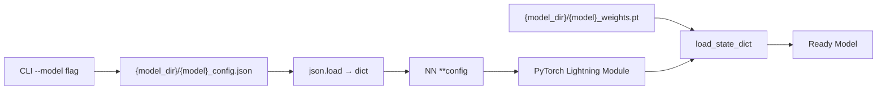
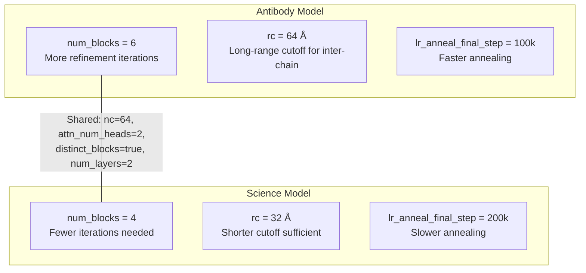

---
slug:12-model-configuration-reference
blog_type:normal
---


EquiFold 的模型行为完全由单个 JSON 配置文件控制，该文件的键值对会在实例化时直接解包并传入 `NN` 构造函数。本页提供了完整的参数参考，解释了每个参数的架构作用，并比较了内置的两种预设 —— **ab**（抗体）和 **science**（单链）—— 以便你在训练自定义模型前，能够合理评估需要修改的内容。

来源: [models.py](models.py#L249-L311), [run_inference.py](run_inference.py#L57-L62)

## 配置加载机制

在推理时，`--model` CLI 标志会选择 `models/` 目录下的一对文件：`{model}_config.json` 用于超参数，`{model}_weights.pt` 用于已学习的参数。配置 JSON 通过 `json.load` 加载，并作为关键字参数解包传入 `NN(**config)`。由于 `NN.__init__` 为每个参数都定义了默认值，因此配置文件可以省略任何键 —— 此时将使用相应的默认值。这意味着你可以创建仅覆盖你关注参数的最小化配置文件。



来源: [run_inference.py](run_inference.py#L48-L64)

## 完整参数参考

下表列出了 `NN.__init__` 接受的所有参数，并按子系统分组。**Default** 列显示了 Python 级别的默认值（即当 JSON 中缺少该键时的取值）。**ab** 和 **science** 列显示了内置预设配置中的值。

### 优化与学习率调度

| 参数 | 类型 | 默认值 | ab | science | 描述 |
|---|---|---|---|---|---|
| `lr` | float | `1e-5` | `0.001` | `0.001` | Adam 优化器的基础学习率 |
| `wd` | float | `1e-8` | `1e-8` | `1e-8` | 权重衰减（L2 正则化） |
| `lr_warmup` | bool | `false` | `true` | `true` | 在 `warmup_steps` 内从 0 线性预热至 `lr` |
| `lr_anneal` | bool | `false` | `true` | `true` | 预热完成后进行余弦退火 |
| `lr_anneal_final_step` | int | `200000` | `100000` | `200000` | 退火达到下限 `0.1 × lr` 时的步数 |
| `slerp_warmup` | bool | `true` | `true` | `true` | 预热期间从真实值到初始方案的 SLERP 插值 |
| `warmup_steps` | int | `1` | — | — | SLERP 和 LR 预热的训练步数 |
| `accumulate_grad_batches` | int | `1` | — | — | 优化器执行步骤前的梯度累积步数 |
| `gradient_clip_val` | float | `5.0` | — | — | `clip_grad_norm_` 的最大梯度范数 |

学习率调度为三阶段曲线：(1) 在 `warmup_steps` 内从 0 → `lr` 的**线性预热**；(2) 预热完成后在 `lr_anneal_final_step` 步内从 `lr` → `0.1 × lr` 的**余弦退火**；(3) 此后保持 `0.1 × lr` 的**恒定下限**。`lr_anneal_final_step` 是预设间的主要区分点 —— 抗体模型的退火速度（10 万步）是科学模型（20 万步）的两倍，这反映了抗体结构预测的典型训练集规模较小。

来源: [models.py](models.py#L250-L282), [models.py](models.py#L505-L537)

### 网络架构

| 参数 | 类型 | 默认值 | ab | science | 描述 |
|---|---|---|---|---|---|
| `nc` | int | `32` | `64` | `64` | 通道数 —— 控制标量（`d_s = nc`）和向量（`d_v = 3×nc`）嵌入的宽度 |
| `num_blocks` | int | `4` | `6` | `4` | 迭代细化块（每个块 = 嵌入 → E3NN → 预测 ΔR, ΔT） |
| `num_layers` | int | `3` | `2` | `2` | 每个块中的 Equiformer 层数（位于最终的欧几里得预测层之前） |
| `interaction_type` | str | `"attn-direct"` | `"attn-direct"` | `"attn-direct"` | 交互模块类型；目前仅支持 `"attn-direct"` |
| `attn_num_heads` | int | `1` | `2` | `2` | Equiformer 注意力机制中的注意力头数 |
| `distinct_blocks` | bool | `false` | `true` | `true` | 若为 true，每个细化块将拥有独立的 E3NN 参数 |
| `distinct_embeddings` | bool | `false` | `true` | `true` | 若为 true，每个块将拥有独立的节点嵌入表 |
| `rc` | float | `100.0` | `64.0` | `32.0` | Bessel 基和软权重截断的径向截断距离 (Å) |
| `d_edge` | int | `32` | `32` | `32` | 残基间隔边特征的边嵌入维度 |
| `radial_num_basis` | int | `32` | — | — | Bessel 径向基函数的数量 |
| `radial_num_hidden` | int | `32` | — | — | 径向 MLP 的隐藏层维度 |
| `apply_layer_norm` | bool | `false` | — | — | 在注意力和前馈层之前应用等变 LayerNorm |
| `attend_to_self` | bool | `false` | — | — | 允许节点自注意力（否则将掩码自注意力） |
| `disable_cutoff` | bool | `false` | — | — | 禁用软径向权重截断（所有节点对贡献相等） |

**`nc` 是影响最大的单一参数** —— 它决定了标量特征（`nc`）和向量特征（`3 × nc`）的嵌入维度，并传播至每个 `Linear`、`Equiformer` 和 `RadialNN` 子模块。两种预设均将其默认值翻倍至 64。**截断半径 `rc`** 是第二个关键架构旋钮：抗体模型使用 `rc = 64 Å`（用于捕获重/轻链间的长程接触），而科学模型使用 `rc = 32 Å`（足以应对单链折叠）。**`num_blocks`** 控制迭代细化的深度：抗体为 6 个块（需更多迭代以解析链间几何结构），单链为 4 个块。

<CgxTip>当 `distinct_blocks = true` 且 `distinct_embeddings = true` 时（如两种预设的情况），每次细化迭代都拥有完全独立的参数 —— 该模型实际上是 `num_blocks` 个专用网络的集合，而非单一共享权重的循环回路。这会显著增加参数量，但能防止跨迭代的表征坍缩。</CgxTip>

来源: [models.py](models.py#L249-L340), [models.py](models.py#L313-L323)

### 损失与结构违规

| 参数 | 类型 | 默认值 | ab | science | 描述 |
|---|---|---|---|---|---|
| `fape_clip_val` | float | `10.0` | — | — | FAPE 损失的 `d_max` 截断值 —— 超出此范围的距离将被封顶 |
| `weight_struct_loss` | float | `1.0` | — | — | 结构违规损失（键长 + 键角 + 空间冲突）的缩放因子 |
| `weight_struct_loss_scale` | str | `"constant"` | — | — | 逐块缩放配置：`"constant"`、`"linear"` 或 `"quadratic"` |

`weight_struct_loss_scale` 控制结构违规损失在各细化块间的爬升方式。使用 `"constant"` 时，每个块的贡献权重相等。使用 `"linear"` 时，后续块的权重更大（缩放系数 = `i / num_blocks`）。使用 `"quadratic"` 时，爬升更陡峭（缩放系数 = `(i / num_blocks)²`）。块 `i` 的总结构损失为：

```
loss_struct_i = τ × weight_struct_loss × scale(i) × (loss_bond + loss_angle + loss_clash)
```

其中 `τ` 为 SLERP 预热插值因子（在 `warmup_steps` 内从 0 → 1）。

来源: [models.py](models.py#L278-L282), [models.py](models.py#L448-L474)

### 初始化与推理控制

| 参数 | 类型 | 默认值 | ab | science | 描述 |
|---|---|---|---|---|---|
| `init_scheme` | str | `"blackhole"` | — | — | 初始结构：`"blackhole"`（恒等旋转，零平移）或 `"random"` |

`init_scheme` 决定了迭代细化的起点。`"blackhole"` 将所有 CG 节点置于原点并赋予恒等旋转 —— 网络必须学会将结构向外“爆炸”展开。`"random"` 使用随机 SO(3) 旋转和高斯采样平移（`σ = 1.0`）进行初始化，这有助于早期训练阶段的探索，但会引入噪声。

来源: [models.py](models.py#L21-L35), [models.py](models.py#L273)

## 预设对比：ab vs. science

这两种内置配置在**抗体**（双链重+轻链）和**单链科学**用例之间体现了一种刻意的架构权衡：



| 方面 | ab | science | 原理 |
|---|---|---|---|
| 细化深度 | 6 个块 | 4 个块 | 链间几何结构需要更多迭代 |
| 空间感受野 | 64 Å | 32 Å | 抗体需要跨链注意力 |
| 训练调度 | 10 万步退火 | 20 万步退火 | 抗体数据集较小 → 需更快的收敛目标 |
| 边嵌入维度 | 32 | 32 | 相同 —— 残基间隔编码与领域无关 |
| 通道宽度 | 64 | 64 | 相同 —— 两者均受益于更宽的表征 |

来源: [models/ab_config.json](models/ab_config.json#L1-L1), [models/science_config.json](models/science_config.json#L1-L1)

## 导出量与内部架构

多个配置参数会传播并衍生出架构维度。在修改 `nc`、`attn_num_heads` 或 `d_edge` 时，理解这些关系至关重要：

| 导出量 | 公式 | 源参数 |
|---|---|---|
| 标量嵌入维度 (`d_s`) | `nc` | `nc` |
| 向量嵌入维度 (`d_v`) | `3 × nc` | `nc` |
| 嵌入输入词表大小 | `NUM_CG_TYPES + 1` | [cg.py](cg.py#L48)（由粗粒化方案计算得出） |
| 边类型词表大小 | `2 × MAX_DIST + 2 = 66` | [utils_data.py](utils_data.py#L14-L15)（`MAX_DIST = 32`） |
| 每头通道数 | `nc // attn_num_heads` | `nc`, `attn_num_heads` |
| DTP 后乘积维度 | `2 × nc_per_head` | `nc`, `attn_num_heads` |
| 注意力前 DTP 权重元素数 | `4 × nc_per_head × attn_num_heads` | `nc`, `attn_num_heads` |
| 前馈扩展维度 | `ff_mul × nc`（其中 `ff_mul = 3`） | `nc` |
| 最终欧几里得层输出不可约表示 | `(0, 2)` — 2 个向量通道 | 硬编码 |

<CgxTip>`nc` 必须能被 `attn_num_heads` 整除（通过 `nc_by_head = nc // num_heads` 隐式强制执行）。当 `nc = 64` 且 `attn_num_heads = 2` 时，每个头操作 32 个通道。如果在 `nc = 64` 时尝试设置 `attn_num_heads = 3`，将导致 `DTPByHead` 模块出现维度不匹配错误。</CgxTip>

来源: [models.py](models.py#L172-L198), [models.py](models.py#L656-L678), [models.py](models.py#L832-L905)

## 推理时 CLI 参数

`run_inference.py` 脚本接受以下控制加载配置的 CLI 参数：

| 参数 | 类型 | 默认值 | 描述 |
|---|---|---|---|
| `--model` | str | `"ab"` | 模型预设名称；必须与 `model_dir` 中的 `{name}_config.json` 和 `{name}_weights.pt` 匹配。可选值：`"ab"`、`"science"` |
| `--model_dir` | str | `"models"` | 包含配置 JSON 和权重文件的目录 |
| `--seqs` | str | `None` | 输入 CSV 的路径（必填） |
| `--ncpu` | int | `1` | 数据预处理的 CPU 并行度 |
| `--out_dir` | str | `"out"` | 预测 PDB 文件的输出目录（gzip 压缩） |

要使用自定义配置，请将 `{name}_config.json` 和 `{name}_weights.pt` 放入 `model_dir`，然后传入 `--model {name}`。配置 JSON 只需包含你想要覆盖的参数 —— 其余参数将回退至 `NN.__init__` 的默认值。

来源: [run_inference.py](run_inference.py#L48-L55)

## 创建自定义配置

在设计新配置时，请遵循此决策框架：

1. **领域复杂度** → 设置 `num_blocks`（多链或大蛋白质需要更多块）和 `rc`（长程接触需要更大的截断值）
2. **模型容量** → 设置 `nc`（更宽的通道以增强表达能力）和 `attn_num_heads`（更多的头以获取更丰富的注意力模式，确保 `nc % attn_num_heads == 0`）
3. **训练预算** → 设置 `lr_anneal_final_step`（更大数据集需要更长退火步数）和 `accumulate_grad_batches`（增加此值以模拟更大的批大小）
4. **正则化** → 设置 `gradient_clip_val` 和 `wd`（若训练不稳定则增加）；在 `nc` 较高时将 `apply_layer_norm` 设为 `true` 以提升训练稳定性

仅覆盖关键架构参数的最小化自定义配置：

```json
{
  "nc": 48,
  "num_blocks": 5,
  "rc": 48.0,
  "attn_num_heads": 2,
  "lr": 0.0005,
  "lr_anneal_final_step": 150000
}
```

来源: [models.py](models.py#L249-L282)

## 下一步

- 了解这些参数如何在迭代细化循环中流转，请参阅 [迭代结构细化](6-iterative-structure-refinement)
- 了解由 `fape_clip_val` 和 `weight_struct_loss` 控制的损失函数，请参阅 [FAPE 损失函数](7-fape-loss-function) 和 [结构违规损失](8-structure-violation-losses)
- 了解由 `slerp_warmup` 和 `warmup_steps` 控制的 SLERP 预热机制，请参阅 [使用 SLERP 预热进行训练](9-training-with-slerp-warmup)