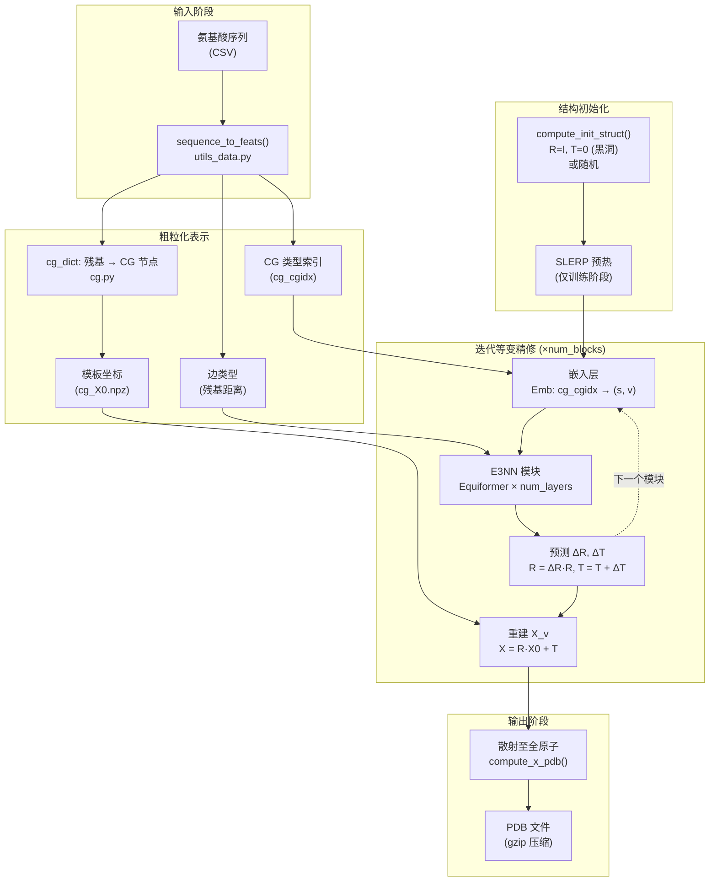

---
slug:3-architecture-overview
blog_type:normal
---


EquiFold 是一个用于**从头蛋白质结构预测**的 E(3)-等变神经网络，它脱离了 AlphaFold2 的 MSA 与模板范式。相反，它引入了一种**新颖的粗粒化（CG）表示**，将每个残基分解为小的刚性原子簇，并通过一个**迭代等变精修循环**直接预测 SE(3) 坐标系更新，从而仅凭序列即可组装出完整的 3D 结构。本页映射了完整的系统架构——从输入序列到输出 PDB——明确了核心模块、数据流以及将它们绑定在一起的设计决策。

## 项目结构

```
equifold/
├── run_inference.py          # 入口点：加载模型、准备数据、运行预测
├── models.py                 # 核心神经网络架构：NN, E3NN, Equiformer, 嵌入层
├── cg.py                     # 粗粒化方案：残基 → CG 节点映射
├── cg_X0.npz                 # CG 局部坐标系的模板坐标
├── utils.py                  # 几何操作：FAPE 损失、欧几里得变换、结构损失
├── utils_data.py             # 数据流水线：序列→特征、PDB 写入、结构违规预计算
├── openfold_light/           # 轻量级 AlphaFold 残基常数与解析工具
│   ├── residue_constants.py  # 原子类型、键几何、刚体群位置
│   ├── protein.py            # 蛋白质数据容器
│   ├── mmcif_parsing.py      # mmCIF 格式解析器
│   ├── parsers.py            # PDB/FASTA 解析器
│   └── data_pipeline.py      # 数据流水线辅助工具
├── models/                   # 预训练模型权重与配置
│   ├── ab_config.json        # 抗体模型超参数
│   ├── ab_weights.pt         # 抗体模型权重
│   ├── science_config.json   # 微型蛋白模型超参数
│   └── science_weights.pt    # 微型蛋白模型权重
└── tests/data/               # 推理输入示例 (CSV)
```

来源: [run_inference.py](/run_inference.py#L1-L103), [models.py](/models.py#L1-L937), [cg.py](/cg.py#L1-L103)

## 系统架构图

下图捕捉了推理期间的端到端数据流，从输入氨基酸序列经过粗粒化表示、迭代等变精修，到最终的全原子重建：



来源: [models.py](/models.py#L265-L400), [run_inference.py](/run_inference.py#L80-L102), [utils_data.py](/utils_data.py#L1-L50)

## 核心架构组件

EquiFold 的架构由四个紧密耦合的组件构成，每个组件贯穿于代码库的实现中。下表将每个组件映射到其负责的模块及关键的类/函数：

| 组件 | 主文件 | 关键抽象 | 角色 |
|---|---|---|---|
| **粗粒化表示** | `cg.py`, `utils_data.py` | `cg_dict`, `cg_to_idx`, `cg_X0` | 将每个残基的原子映射为刚性局部坐标系；提供模板坐标与类型索引 |
| **E3-等变神经网络** | `models.py` | `E3NN`, `Equiformer`, `DTPByHead`, `RadialNN` | 采用深度张量积与注意力机制的等变消息传递 |
| **迭代结构精修** | `models.py` | `NN.forward()`, `compute_init_struct()` | 反复嵌入 CG 节点，运行 E3NN 模块，预测坐标系更新 ΔR, ΔT |
| **损失与训练** | `utils.py`, `models.py` | `compute_FAPE_uv()`, `compute_struct_loss()`, `quaternion_slerp()` | 帧对齐点误差 + 结构违规惩罚；SLERP 预热 |

来源: [cg.py](/cg.py#L1-L103), [models.py](/models.py#L1-L200), [utils.py](/utils.py#L1-L200)

## 粗粒化表示

EquiFold 最基础的设计选择在于如何参数化蛋白质的 3D 结构。它没有直接预测笛卡尔坐标，而是将每个残基**分解为小的原子群**（CG 节点），每个群表示为一个**刚体坐标系**——即旋转矩阵 **R** ∈ SO(3) 和平移向量 **T** ∈ ℝ³。每个 CG 节点内的原子在由模板坐标 `cg_X0` 定义的**局部坐标系**中指定，全原子位置可通过 **X = R · X₀ + T** 恢复。

例如，丙氨酸被分解为两个 CG 节点：主链帧 `{C, CA, CB, N}` 和羰基氧 `{C, CA, O}`。20 种标准氨基酸各自拥有一个手动定义的分解方式，存储在 `cg_dict` 中。系统通过断言每个残基在所有 CG 节点上的原子并集等于来自 `residue_atoms` 的完整原子集，来验证其完备性。

来源: [cg.py](/cg.py#L14-L43), [cg.py](/cg.py#L56-L75)

## E3-等变网络模块

`E3NN` 模块是等变主干。每个实例包含 `num_layers` 个 `Equiformer` 交互层，随后是一个最终的**欧几里得输出层**，用于预测帧更新 (ΔR, ΔT)。`Equiformer` 层实现了一种基于注意力的消息传递机制，其子结构如下：

1. **边嵌入**：残基序列距离通过 `nn.Embedding` 嵌入，提供相对位置编码
2. **初始混合**：源节点和目标节点的特征通过学习的 `Linear` 层进行投影，并通过逐通道张量积进行组合（标量×标量，标量×向量，向量×标量，向量·向量）
3. **预注意力 DTP**：具有球谐方向向量的深度张量积（`DTPByHead`），由依赖于节点间距离的 `RadialNN`（Bessel 基 → MLP）加权
4. **注意力**：计算门控消息，从标量特征导出注意力分数，并通过 softmax 归一化的注意力聚合来自邻居的消息
5. **前馈**：一个门控非线性模块（ff1 → SiLU/sigmoid 门控 → ff2），带有可选的 ResNet 跳跃连接

最终的欧几里得层输出不可约表示 `(0, 2)`——零个标量通道和两个向量通道——它们被解释为平移更新 `dT` 和无约束旋转参数 `u`，后者通过 `R_from_quaternion_u()` 转换为旋转矩阵。

来源: [models.py](/models.py#L830-L937), [models.py](/models.py#L607-L797), [models.py](/model.py#L477-L605)

## 迭代精修循环

`NN.forward()` 方法编排了整个预测流水线。在初始化结构（默认：单位旋转和零平移——“黑洞”方案）之后，模型迭代 `num_blocks + 1` 步：

- **模块 0**：存储初始结构而不进行网络评估（用于计算起点的损失）
- **模块 1…N**：每个模块重新嵌入 CG 节点（可选地为每个模块使用不同的嵌入），运行 E3NN 模块以预测 (ΔR, ΔT)，并更新帧：`R = ΔR · R`，`T = T + ΔT`。随后，更新后的帧被用于重建坐标 `X_v = R · X₀ + T`，并将其散射至全原子位置

在训练期间，**SLERP 预热**利用四元数球面线性插值，将初始帧从真实值逐渐插值到初始化方案，此过程由在 `warmup_steps` 期间从 0→1 递增的预热参数 τ 控制。这通过使网络从接近正确结构的状态开始，从而稳定了早期训练。

来源: [models.py](/models.py#L265-L500), [utils.py](/utils.py#L208-L260)

## 损失函数架构

EquiFold 采用结合了**帧对齐点误差（FAPE）**与**结构违规惩罚**的复合损失：

| 损失组件 | 函数 | 衡量内容 | 权重 |
|---|---|---|---|
| **FAPE** | `compute_FAPE_uv()` | 在与每个局部坐标系对齐后，预测与真实原子位置之间的距离 | 始终激活 |
| **键长** | `compute_struct_loss()` | 预测键长偏离立体化学标准的程度（超出容差） | `weight_struct_loss × scale` |
| **键角** | `compute_struct_loss()` | 预测键角偏离理想值的程度（超出容差） | `weight_struct_loss × scale` |
| **冲突** |+ `compute_struct_loss()` | 原子对距离小于范德华半径之和减去容差 | `weight_struct_loss × scale` |

结构违规缩放可按照在精修模块间的 `constant`、`linear` 或 `quadratic` 计划进行。FAPE 在每个 CG 节点的局部坐标系中计算，使其天然具有 **SE(3)-不变性**——这是等变架构的关键属性。由 180° 对称性引起的歧义（例如，ASP 的 OD1/OD2 互换）通过将预测距离与主要和替代的真实值进行比较来解决，选择匹配度更好的一个。

来源: [utils.py](/utils.py#L47-L80), [utils.py](/utils.py#L262-L340), [models.py](/models.py#L460-L490)

## 模型变体

提供了两种预训练模型配置，它们在精修模块数量和空间截断半径上有所不同：

| 参数 | 抗体 (`ab`) | 微型蛋白 (`science`) |
|---|---|---|
| `num_blocks` | 6 | 4 |
| `num_layers` | 2 | 2 |
| `nc` (通道数) | 64 | 64 |
| `attn_num_heads` | 2 | 2 |
| `rc` (截断) | 64.0 Å | 32.0 Å |
| `lr_anneal_final_step` | 100,000 | 200,000 |
| `distinct_blocks` | true | true |
| `distinct_embeddings` | true | true |

抗体模型使用了更多的精修模块和更大的空间截断，以适应抗体 CDR 环所特有的长程相互作用，而微型蛋白模型则使用了适合紧凑球状结构域的较小截断。

来源: [models/ab_config.json](/models/ab_config.json#L1), [models/science_config.json](/models/science_config.json#L1)

## 关键设计原则

**构造性 E(3)-等变**：网络绝不直接处理原始笛卡尔坐标。所有中间表示要么是标量特征（不变），要么是向量特征（等变），预测的更新 (ΔR, ΔT) 通过群操作与现有帧复合，保证了旋转/平移输入会产生输出的相同变换。

**帧对齐损失**：通过在每个 CG 节点的局部坐标系而非全局坐标中计算 FAPE，损失天然对全局 SE(3) 变换保持不变，消除了训练期间进行外部对齐（例如 Kabsch 算法）的需要。

**作为归纳偏置的粗粒化**：CG 分解将搜索空间从独立预测所有原子位置缩减为预测每个残基的少量刚体变换。这将每个残基内强烈的几何约束（键长、键角、平面性）编码到表示本身中，让网络去学习更困难的残基间几何结构。

<CgxTip>`compute_init_struct("blackhole")` 初始化将所有 CG 节点置于原点并赋予单位旋转——在结构上毫无意义，但在等变性上有效。SLERP 预热对训练收敛至关重要：若没有它，来自完全坍缩初始状态的 FAPE 梯度信号过于弥散，无法引导网络生成有意义的结构。</CgxTip>

来源: [models.py](/models.py#L18-L32), [models.py](/models.py#L830-L937), [utils.py](/utils.py#L47-L80)

## 导航指南

要深入理解每个组件，请遵循以下深度剖析部分的阅读路径：

1. **[粗粒化表示](4-coarse-grained-representation)** — 残基如何分解为刚性帧与模板坐标
2. **[E3-等变神经网络](5-e3-equivariant-neural-network)** — Equiformer 交互层、张量积与注意力机制
3. **[迭代结构精修](6-iterative-structure-refinement)** — 精修循环、帧更新与 SLERP 预热
4. **[FAPE 损失函数](7-fape-loss-function)** — 帧对齐点误差与对称性歧义消解
5. **[结构违规损失](8-structure-violation-losses)** — 键长、键角与冲突惩罚计算
6. **[使用 SLERP 预热进行训练](9-training-with-slerp-warmup)** — 四元数插值与学习率调度
7. **[输入数据流水线](10-input-data-pipeline)** — 推理期间的序列特征化与 CG 映射
8. **[推理与 PDB 输出](11-inference-and-pdb-output)** — 端到端预测与坐标重建
9. **[模型配置参考](12-model-configuration-reference)** — `NN.__init__()` 的完整参数目录