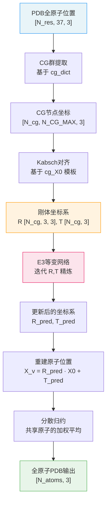

---
slug:4-coarse-grained-representation
blog_type:normal
---


EquiFold的粗粒度（CG）表示是一种基础抽象，它将蛋白质的全原子结构转换为由**刚体节点**构成的图——每个节点编码一个局部坐标系（旋转**R** + 平移**T**）以及一组刚性运动的原子位置。这种分解使得E3等变网络能够在紧凑且具备旋转感知的特征上运算，而非直接处理原始笛卡尔坐标，从而在保留蛋白质折叠所必需的几何结构的同时，大幅降低了维度。

## 刚性群分解

核心思想是，每个氨基酸残基可以被划分为若干**刚性群**——即由键几何结构固定了相对位置的原子簇，它们仅在扭转角变化时作为整体重新定向。这与AlphaFold2的刚性群分解相呼应，其中骨架原子构成一个群，侧链原子则根据可旋转键分裂为不同的群。每个刚性群成为EquiFold图中的一个**CG节点**，携带自身的SO(3)坐标系和局部原子坐标。

[cg.py](cg.py)中的`cg_dict`为所有20种标准氨基酸定义了该分解。每个残基映射到一个元组列表，其中每个元组包含属于同一个刚性群的原子名称：

```python
cg_dict = {
    "ALA": [("C", "CA", "CB", "N"), ("C", "CA", "O")],
    "ARG": [("C", "CA", "CB", "N"), ("C", "CA", "O"), ("CB", "CG", "CD"), ("NE", "NH1", "NH2", "CZ")],
    "PHE": [("C", "CA", "CB", "N"), ("C", "CA", "O"), ("CG", "CD1", "CD2", "CE1", "CE2", "CZ")],
    "TRP": [("C", "CA", "CB", "N"), ("C", "CA", "O"), ("CG", "CD1", "CD2", "CE2", "CE3", "CZ2", "CZ3", "CH2", "NE1")],
    ...
}
```

来源: [cg.py](cg.py#L1-L31)

### 每个残基的群结构

每个残基遵循一致的模式分解为**2至4个刚性群**。第一个群始终捕获**骨架坐标系**（N–CA–C加上适用的CB），第二个群将**羰基氧**锚定到骨架上。附加群则捕获由chi扭转角分隔的侧链刚性片段。

| 残基 | 群数量 | 群1 (骨架) | 群2 (羰基) | 群3+ (侧链) |
|---------|----------|-------------------|--------------------|-----------------------|
| GLY | 2 | C, CA, N | C, CA, O | — |
| ALA | 2 | C, CA, CB, N | C, CA, O | — |
| SER | 3 | C, CA, CB, N | C, CA, O | CA, CB, OG |
| PHE | 3 | C, CA, CB, N | C, CA, O | CG, CD1, CD2, CE1, CE2, CZ |
| TRP | 3 | C, CA, CB, N | C, CA, O | CG, CD1, CD2, CE2, CE3, CZ2, CZ3, CH2, NE1 |
| ARG | 4 | C, CA, CB, N | C, CA, O | CB, CG, CD \| NE, NH1, NH2, CZ |
| ILE | 4 | C, CA, CB, N | C, CA, O | CB, CG1, CG2 \| CB, CG1, CD1 |
| LYS | 4 | C, CA, CB, N | C, CA, O | CB, CG, CD \| CD, CE, NZ |

来源: [cg.py](cg.py#L10-L31)

该分解是**完备的**——运行时断言验证了所有CG群中原子的并集，与[openfold_light/residue_constants.py](openfold_light/residue_constants.py#L356-L405)中`residue_atoms`定义的每个残基的完整重原子集完全匹配：

```python
for res, atoms in residue_atoms.items():
    assert set([atom for cg in cg_dict[res] for atom in cg]) == set(atoms)
```

来源: [cg.py](cg.py#L37-L38)

## CG节点类型索引

每个不同的（残基类型，群索引）对被分配一个**唯一整数ID**，从而创建了一个由网络嵌入的有限CG节点类型词表。该索引通过按规范顺序迭代20种标准残基（排除UNK）确定性地构建：

```python
cg_to_idx = {}
idx = 0
for res in resnames[:-1]:  # skip UNK
    for j in range(len(cg_dict[res])):
        cg_to_idx[(resname_to_idx[res], j)] = idx
        idx += 1
```

这产生了**60种独特的CG类型**（`NUM_CG_TYPES = 60`），嵌入层将其用作词表大小（`NUM_CG_TYPES + 1`以适应填充）。逆映射`idx_to_cg`允许从任何CG类型ID恢复（残基索引, 群编号）对。

来源: [cg.py](cg.py#L41-L48), [models.py](models.py#L313-L316)

### 最大群规模

常量`N_CG_MAX`捕获了所有CG群中的最大原子数：

```python
N_CG_MAX = max([max(len(y) for y in x) for x in cg_dict.values()])
```

该值为**9**，由TRP的侧链群决定，其包含（CG, CD1, CD2, CE2, CE3, CZ2, CZ3, CH2, NE1）。所有CG节点坐标数组都被填充至该大小，无论每个群中实际存在多少原子，都能生成统一的`[N_CG, N_CG_MAX, 3]`张量。

来源: [cg.py](cg.py#L33-L34)

## 坐标系构建：从原子到刚体

[utils_data.py](utils_data.py)中的数据流水线通过`pdb_feats_to_data()`函数将原始全原子位置转换为CG表示。对于每个残基，它遍历`cg_dict`中定义的CG群，从37通道的全原子数组中提取相关原子位置，并计算刚体坐标系。

### 通过Kabsch算法计算坐标系

每个CG节点的旋转**R**和平移**T**，是通过使用Kabsch算法将节点的当前原子位置与**模板坐标**（`cg_X0`）对齐而获得的——Kabsch算法是求解两个配对点集间最优旋转的闭式解：

```python
def get_cg_RT(cg_cgidx, cg_X, cg_mask, cg_atom_mask, use_kabsch):
    if not use_kabsch:
        cg_T, cg_R = get_euclidean(torch.from_numpy(cg_X[:, :3]))
    else:
        cg_T, cg_R = get_euclidean_kabsch(torch.from_numpy(cg_X), cg_X0[cg_cgidx], 
                                           torch.from_numpy(cg_atom_mask))
```

模板坐标`cg_X0`被预计算并存储在[cg_X0.npz](cg_X0.npz)中，为每种CG类型提供规范的“理想”局部坐标系。这意味着**R**和**T**编码了每个刚性群与其理想几何的偏差——这种表示既紧凑，又非常适合迭代精炼。

来源: [utils_data.py](utils_data.py#L122-L130), [utils_data.py](utils_data.py#L17-L21)

### 掩码与缺失原子

流水线通过双层掩码方案谨慎处理缺失原子（在实验PDB结构中很常见）：

- **`cg_mask`**（节点级）：仅当CG节点的**前三个原子**全部存在时，该节点才有效（1.0）——这些原子定义了局部坐标系。如果任何定义坐标系的原子缺失，则整个节点将被掩码屏蔽。
- **`cg_atom_mask`**（原子级）：在有效节点内，单个原子仍可能缺失。此逐原子掩码对于FAPE损失至关重要，该损失必须忽略未观测原子的预测位置。

对于被掩码屏蔽的节点，模板坐标将被作为虚拟值代入，并且在减去质心后，平移/旋转将被置零或设为单位矩阵，以防止梯度污染。

来源: [utils_data.py](utils_data.py#L244-L276), [utils_data.py](utils_data.py#L110-L119)

## 180°对称性与命名歧义

四种氨基酸——**ASP, GLU, PHE, TYR**——包含在180°旋转下不可区分的对称原子对。AlphaFold2通过定义原子重命名交换解决了此问题；EquiFold通过`cg_dict_rename`继承了此约定：

```python
cg_dict_rename = {
    "ASP": [None, None, (0, 2, 1)],       # OD1 ↔ OD2
    "GLU": [None, None, (0, 1, 3, 2)],    # OE1 ↔ OE2
    "PHE": [None, None, (0, 2, 1, 4, 3, 5)],  # CD1↔CD2, CE1↔CE2
    "TYR": [None, None, (0, 2, 1, 4, 3, 5, 6)],  # CD1↔CD2, CE1↔CE2
    ...
}
```

这些排列被编译为训练期间使用的两个numpy数组：

- **`cg_atom_rename_np`**：每种CG类型的排列索引，用于构建“备选真值”坐标。
- **`cg_atom_ambiguous_np`**：一个二值掩码，指示每种CG类型内哪些原子受歧义影响（非恒等排列）。

数据流水线同时生成主坐标和备选（排列后）坐标、旋转及平移，使得[FAPE损失](7-fape-loss-function)能够选择产生较低误差的对齐方式。

来源: [cg.py](cg.py#L58-L89), [utils_data.py](utils_data.py#L297-L302)

## 逆映射：从CG节点回到全原子

由于原子可以在CG群之间共享（例如，CB同时出现在SER的骨架群和侧链群中），从CG预测逆映射回全原子坐标需要谨慎的加权平均。`cg_atom_weight`字典记录了每个原子参与的CG群数量：

```python
cg_atom_weight = {}
for resn, atomss in cg_dict.items():
    cg_atom_weight[resn] = Counter([y for x in atomss for y in x])
```

逆索引`cgidx_to_atomidx`为每种CG类型提供了从原子在CG群内位置到其在完整残基原子列表中位置的映射，及其权重因子。在推理期间，`compute_x_pdb()`函数使用带有这些权重的**分散归约**，从重叠的CG节点预测中重建全原子坐标：

```python
scatter_w[src_idx] = 1 / w  # w = 共享原子的 cg_atom_weight
```

这确保了由多个CG群预测的原子能获得逆加权平均值，从而防止重复计算。

来源: [cg.py](cg.py#L93-L102), [utils_data.py](utils_data.py#L360-L377)

## 流水线中的数据流

下图展示了CG表示如何从PDB输入流经网络并返回至全原子输出：



来源: [utils_data.py](utils_data.py#L209-L399), [models.py](models.py#L356-L446)

## 关键派生常量摘要

| 常量 | 值 | 定义 | 用于 |
|----------|-------|------------|---------|
| `N_CG_MAX` | 9 | 任意单个CG群中的最大原子数 | 坐标填充, FAPE损失 |
| `NUM_CG_TYPES` | 60 | 不同的（残基，群）对总数 | 嵌入词表大小 |
| `cg_to_idx` | Dict | (res_idx, group_j) → 唯一整数 | 节点特征索引 |
| `cg_to_np` | Dict | (res_idx, group_j) → 原子索引 | 从37通道数组提取位置 |
| `cg_atom_rename_np` | Array | 每种CG类型的排列索引 | 备选真值构建 |
| `cg_atom_ambiguous_np` | Array | 每种CG类型的二值歧义掩码 | FAPE损失歧义消解 |
| `cgidx_to_atomidx` | Dict | CG索引 → (残基名, 原子, 原子索引, 权重) | PDB输出的分散归约 |

来源: [cg.py](cg.py#L33-L102)

<CgxTip>CG表示不仅仅是一种降维手段——它是一种**几何重参数化**。通过将结构编码为与理想模板的偏差（R, T）而非原始坐标，网络在一个恒等变换对应于“完美局部几何”的空间中运作，使得迭代精炼任务变得显著容易。</CgxTip>

<CgxTip>在CG群之间共享的原子（如骨架群和侧链群中的CB）会被独立预测多次。带有逆计数权重（`1/w`）的分散归约对这些预测进行平均，为共享原子提供了一种隐式集成的形式，从而提升了鲁棒性。</CgxTip>

## 下一步

CG表示为网络运算提供了节点特征和刚体坐标系。若要了解这些坐标系如何被E3等变架构迭代精炼，请参阅[E3等变神经网络](5-e3-equivariant-neural-network)。有关FAPE损失如何针对主CG真值和备选CG真值评估预测的详细信息，请参阅[FAPE损失函数](7-fape-loss-function)。关于从PDB输入构建CG特征的完整数据流水线，请参阅[输入数据流水线](10-input-data-pipeline)。