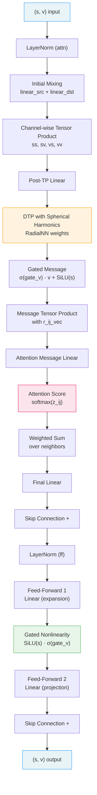
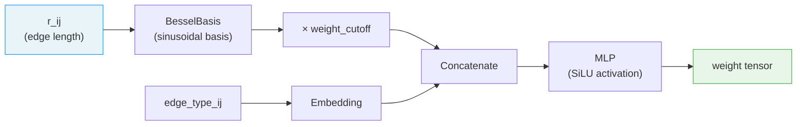
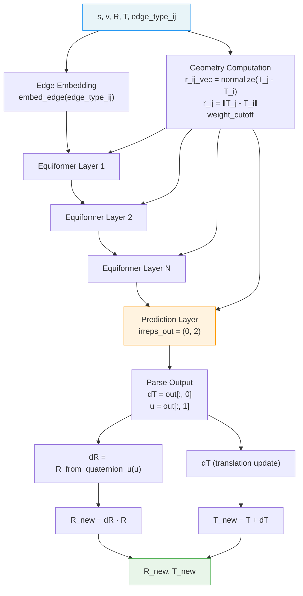

---
slug:5-e3-equivariant-neural-network
blog_type:normal
---


E3等变神经网络是EquiFold的计算核心——这是一种定制架构，直接作用于附属于粗粒化（CG）节点的SE(3)坐标系，并产生对旋转矩阵**R**和平移向量**T**的等变更新。与AlphaFold2的不变点注意力不同，该网络在其各层中始终保持显式的SO(3)等变表示，并利用e3nn库的不可约表示机制在构造上强制实现精确的旋转等变性。该架构融合了**深度张量积**（DTP）、球谐耦合、多头等变注意力、门控非线性以及最终的坐标系预测头——所有这些组合成迭代结构精炼块。

## 表示空间：标量-向量不可约表示

网络中的每个节点携带一个特征对**(s, v)**，其中`s ∈ ℝ^{nc}`是标量（不变）通道，`v ∈ ℝ^{nc×3}`是向量（等变）通道。它们对应于重复`nc`次的不可约表示`0e ⊕ 1e`——在代码中统一表示为不可约表示元组`(nc, nc)`。标量特征在旋转下发生平凡变换（s → s），而向量特征按`v → Rv`变换。这种分离表示是贯穿每一层传播的基本数据结构。

| 组件 | 不可约表示 | 形状 | 变换 |
|-----------|-------|-------|----------------|
| 标量特征`s` | L=0（不变） | `[N, nc]` | s → s |
| 向量特征`v` | L=1（等变） | `[N, nc, 3]` | v → Rv |

不可约表示元组`(nc, nc)`在所有内部交互层中保持固定，仅最后的预测层将输出不可约表示更改为`(0, 2)`——即零个标量通道和两个向量通道——它们编码了SE(3)坐标系的更新。

来源: [models.py](/models.py#L833-L855), [models.py](/models.py#L610-L654)

## 嵌入层：旋转等变初始化

`Emb`模块将离散的CG节点类型映射到可学习的标量和向量嵌入。关键的设计选择是，向量嵌入在输入网络之前会**被当前的帧旋转R旋转**，从而确保初始特征相对于节点的当前朝向是等变的：

```
s = embed_s(cg_type)                          # [N, nc]    — 不变
v = rotate_embedding(embed_v(cg_type), R)      # [N, nc, 3] — 等变
```

旋转通过`rotate_embedding(v, R) = einsum("rij, rkj -> rki", R, v)`应用，即用节点的3×3旋转矩阵对每个向量通道进行左乘。该嵌入支持**每个精炼块使用独立的嵌入**（`distinct_embeddings=True`），允许每次迭代基于当前结构从全新的特征初始化开始。

来源: [models.py](/models.py#L172-L198)

## Equiformer交互块

`Equiformer`类实现了主要的等变交互模块——这是为标量-向量不可约表示空间适配的Equiformer架构（原论文图1b）的修改版本。每个块由通过残差连接的两个子模块组成：



### 注意力模块

注意力模块在所有节点对之间执行**等变消息传递**。计算过程分为以下几个阶段：

**初始混合。** 源和目标特征分别通过`linear_src`和`linear_dst`（两者均为`Linear`层，映射`(nc, nc) → (nc, nc)`）进行投影，然后通过将通道维度分割为`num_heads`个大小为`nc_by_head = nc / num_heads`的组，重塑为多头格式。

**逐通道张量积。** 混合特征经过受Clebsch-Gordan启发的张量积，枚举标量和向量通道之间所有四种耦合模式：

| 乘积 | 输入 | 输出不可约表示 | 公式 |
|---------|-------|-------------|---------|
| s_i ⊗ s_j | L=0 ⊗ L=0 | L=0（标量） | `s_i * s_j` |
| s_i ⊗ v_j | L=0 ⊗ L=1 | L=1（向量） | `s_i · v_j` |
| v_i ⊗ s_j | L=1 ⊗ L=0 | L=1（向量） | `v_i * s_j` |
| v_i ⊗ v_j | L=1 ⊗ L=1 | L=0（标量） | `(v_i · v_j)` |

标量输出`ss`和`vv`被拼接；向量输出`sv`和`vs`被拼接。随后，逐头线性投影将其映射为每个头`nc_by_head`个通道。

**带球谐函数的预注意力DTP。** `DTPByHead`模块执行深度张量积，其中节点间的几何耦合由**单位方向向量**`r_ij_vec`（节点间的归一化位移）介导。径向依赖由产生位置依赖权重的`RadialNN`捕获，随后这些权重通过四个张量积通道（`w_ss, w_sv, w_vs, w_vv`）将节点特征与方向信息耦合。这是网络学习遵循Wigner-Eckart定理约束的**方向依赖**消息函数的机制。

**门控消息计算。** DTP输出被分为三部分：注意力分数特征`s_ij0`、向量门`gate_v`和消息特征`s_ij`。随后对消息进行门控：标量为`s_ij → SiLU(s_ij)`，向量为`v_ij → σ(gate_v) · v_ij`，其中σ是sigmoid函数。这种**门控非线性**是在等变网络中应用激活函数的标准技术——sigmoid门控的向量通道确保输出仍是规范的L=1表示。

**注意力聚合。** 注意力分数计算为`z_ij = attn_w · s_ij0`（标量分数特征的可学习线性投影），在源维度上经过softmax，并用于计算消息特征的加权和。通过用大负值（−1e9）掩蔽对角线，可以选择性地禁用自注意力。

来源: [models.py](/models.py#L610-L829)

### 前馈模块

在注意力模块（带残差连接）之后，一个**门控前馈网络**扩展然后投影特征：

1. **FF1**：`Linear(nc, ff_mul × nc + ff_mul × nc, nc, ff_mul × nc)` —— 将表示扩展`ff_mul`倍（默认为3）
2. **Gate**：扩展后的标量输出被分割 —— 前`ff_mul × nc_s_out`个通道通过`SiLU`，剩余通道作为向量特征的门控，经由`σ(gate_v) · v`起作用
3. **FF2**：`Linear(ff_mul × nc, nc, ff_mul × nc, nc)` —— 投影回原始通道维度

残差（ResNet）连接包裹整个前馈模块。层归一化在注意力和前馈模块之前独立应用，使用自定义的`LayerNorm`，它在遵循等变性的同时分别归一化标量和向量通道。

来源: [models.py](/models.py#L797-L829), [models.py](/models.py#L139-L168)

## 深度张量积 (DTPByHead)

`DTPByHead`模块是几何耦合引擎，在节点对之间产生**方向感知消息**。给定每个节点对的特征`(s, v)`和单位方向向量`r_ij_vec`，它执行：

**步骤1 —— 加权张量积。** `RadialNN`产生的权重（在每个头中重塑为四组`w_ss, w_sv, w_vs, w_vv`）缩放四个张量积通道：

| 通道 | 表达式 | 输出类型 |
|---------|-----------|-------------|
| ss | `w_ss * s` | 标量 |
| sv | `w_sv * s * r_ij_vec` | 向量 |
| vs | `w_vs * v` | 向量 |
| vv | `w_vv * (v · r_ij_vec)` | 标量 |

**步骤2 —— 拼接与线性投影。** 标量通道`(ss, vv)`沿特征维度拼接；向量通道`(sv, vs)`类似地拼接。随后，一个带偏置的逐头线性层将其投影到输出维度`(nc_s_out_by_head, nc_v_out_by_head)`。

径向网络产生的权重参数总数为`4 × nc_s_in × num_heads`，这决定了`RadialNN`的输出大小。

来源: [models.py](/models.py#L554-L606)

## 径向网络与基函数

`RadialNN`模块通过两阶段流水线捕获节点间交互的**距离依赖性**：



**BesselBasis。** 计算正弦径向基函数：对于`k = 1, ..., radial_num_basis`，`φ_k(r) = (2/rc) × sin(kπr/rc)`。它们构成了`[0, rc]`上平方可积函数的完备基，并为径向坐标提供了平滑、可微的表示。

**权重截断。** 来自e3nn的平滑截断函数`soft_unit_step(10 × (1 − r/rc))`确保消息在截断半径`rc`（默认100Å）处平滑衰减至零，防止边界处的不连续性。

**边特征融合。** 基于残基距离的边类型嵌入在MLP之前与径向基拼接，使网络能够区分序列相邻（例如，肽键相连的残基）和空间相邻。

来源: [models.py](/models.py#L70-L135), [models.py](/models.py#L38-L39)

## E3NN块：完整更新网络

`E3NN`类为单次精炼步骤编排完整的等变更新流水线。其前向传播接收当前嵌入`(s, v)`和帧参数`(R, T)`，并产生更新的帧`(R_new, T_new)`：



### 几何计算（无梯度）

节点间几何量在**`torch.no_grad()`**下计算，这反映了一个关键设计原则：网络应专注于在给定当前几何结构下学习“下一步移动”，而不是通过几何嵌入进行反向传播。这阻止了通过距离计算的梯度流，并稳定了训练。

### 层堆叠

`num_layers`个Equiformer层（默认为3）在保持`(nc, nc)`不可约表示签名的同时传播嵌入。每一层接收相同的几何输入（边嵌入、距离、方向向量、截断权重），但对不断演化的节点特征进行操作。

### 帧预测头

最后的`Equiformer`层将输出不可约表示更改为**(0, 2)**——产生零个标量通道和恰好两个向量通道。它们被解释为：

- **`dT = out[:, 0]`** —— ℝ³中的平移更新向量
- **`u = out[:, 1]`** —— ℝ³中的旋转参数向量，通过`R_from_quaternion_u(u)`转换为旋转矩阵

旋转参数化使用**无约束四元数**形式：给定`u ∈ ℝ³`，四元数为`q = (1, u₁, u₂, u₃) / ‖(1, u₁, u₂, u₃)‖`，这总能产生一个有效的旋转矩阵。这避免了万向节死锁并确保了平滑的梯度。

### SE(3)帧更新

帧更新在**局部坐标系**中应用预测的增量：

- **平移**：`T_new = T + dT` —— 在全局坐标系中的加性更新
- **旋转**：`R_new = dR · R` —— 旋转更新与当前帧旋转的左复合

此复合规则`compose_rotations(dR, R) = einsum("rij, rjk -> rik", dR, R)`确保更新`dR`被解释为在节点局部坐标系中的旋转，这是帧相对校正的自然参数化。

来源: [models.py](/models.py#L833-L937), [utils.py](/utils.py#L13-L14), [utils.py](/utils.py#L138-L166)

## 等变层归一化

自定义的`LayerNorm`独立归一化标量和向量通道，保持等变性：

**标量通道**经过标准LayerNorm：减去均值，除以RMS，然后应用可学习的增益γ_s和偏置β_s。

**向量通道**通过其在通道和空间维度上的RMS范数归一化：`rms = √(Σ(v²) / nc_v + ε)`，然后由可学习的增益γ_v缩放。**不对向量通道应用偏置**——这会破坏等变性，因为添加常向量不是旋转等变的。

来源: [models.py](/models.py#L139-L168)

## 迭代结构精炼

顶层`NN`模块通过重复应用`E3NN`块来编排迭代精炼。每次迭代：

1. 使用当前帧旋转**重新嵌入**节点：`s, v = emb(cg_type, R_pred)`
2. **应用**E3NN块：`R_pred, T_pred = block(s, v, R_pred, T_pred, edge_type_ij)`
3. **计算**预测结构：`X_v_pred = R_pred · X0 + T_pred`
4. 在每个块**评估**损失（FAPE + 结构违规）

这些块可以在迭代间**共享**（`distinct_blocks=False`，默认）或**独立**。跨迭代共享权重的共享块类似于循环网络，而独立块允许每个精炼阶段学习专门的更新。

### 初始化方案

| 方案 | R_pred | T_pred | 用例 |
|--------|--------|--------|----------|
| `blackhole` | 单位矩阵（I₃） | 零向量（0） | 默认；所有帧从原点开始 |
| `random` | 随机SO(3)矩阵 | 高斯噪声 | 探索 / 多样性 |

`blackhole`初始化将所有CG节点置于具有单位旋转的原点——网络必须学会从单点“爆发”出结构外向展开，这在训练期间通过SLERP预热策略进行正则化。

<CgxTip>预测层中的`(0, 2)`输出不可约表示是深思熟虑的架构约束——它将网络限制为仅输出SE(3)帧更新所需的自由度（3个用于平移 + 3个用于旋转），防止其将容量浪费在未使用的标量预测上。</CgxTip>

<CgxTip>围绕几何计算（`r_ij`、`r_ij_vec`、`weight_cutoff`）的`torch.no_grad()`上下文是关键的训练稳定性选择——它防止网络通过距离度量本身接收梯度，强制其学习基于（分离的）几何上下文的帧更新，而不是直接优化嵌入几何。</CgxTip>

来源: [models.py](/models.py#L249-L503), [models.py](/models.py#L21-L35)

## 架构总结

| 模块 | 输入不可约表示 | 输出不可约表示 | 关键操作 |
|--------|-------------|---------------|---------------|
| `Emb` | CG类型索引 | `(nc, nc)` | 可学习 + 旋转等变嵌入 |
| `Equiformer`（内部） | `(nc, nc)` | `(nc, nc)` | 带门控非线性的Attn + FF |
| `Equiformer`（预测） | `(nc, nc)` | `(0, 2)` | 帧更新预测 |
| `E3NN` | `(s, v, R, T)` | `(R_new, T_new)` | N层 + 预测 + SE(3)更新 |
| `DTPByHead` | 逐头特征 | 逐头特征 | 带球谐函数的深度TP |
| `RadialNN` | `r_ij`，边类型 | 权重张量 | Bessel基 + MLP |
| `Linear` | `(nc_s, nc_v)` | `(nc_s', nc_v')` | 独立的等变投影 |

**默认配置**（`nc=32, num_layers=3, num_blocks=4, rc=100.0`）：网络使用32个标量 + 32个向量通道，每块3个Equiformer层，以及4个迭代精炼块，交互截断半径为100Å。这产生了一个紧凑而富有表达力的模型，能够仅从序列预测全原子蛋白质结构。

来源: [models.py](/models.py#L249-L341), [models.py](/models.py#L833-L937)

## 与粗粒化表示和迭代精炼的关系

E3等变网络位于EquiFold三阶段流水线的中心。它从[粗粒化表示](4-coarse-grained-representation)模块接收**预计算的CG节点嵌入和初始帧**，并产生在[迭代结构精炼](6-iterative-structure-refinement)循环中迭代更新的**SE(3)帧**。随后，预测的帧通过`X_v_pred = R_pred · X0 + T_pred`用于重建全原子坐标，其中`X0`是由粗粒化方案定义的局部模板坐标。指导此帧预测的损失景观由[FAPE损失函数](7-fape-loss-function)和[结构违规损失](8-structure-violation-losses)塑造，而训练稳定性则通过[使用SLERP预热训练](9-training-with-slerp-warmup)来维持。