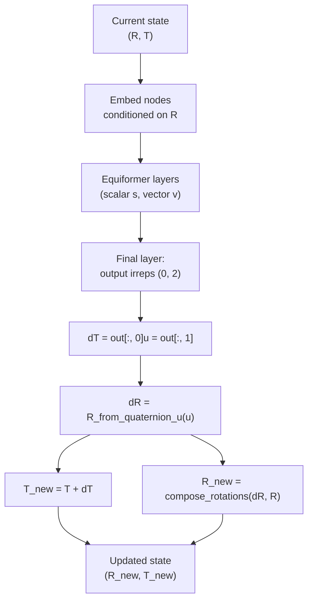
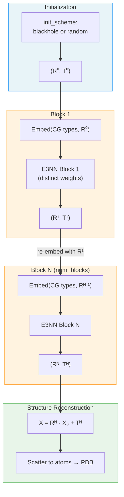

---
slug:6-iterative-structure-refinement
blog_type:normal
---


EquiFold 通过**迭代粗粒度修正**预测蛋白质结构：一系列 E3 等变块逐步更新逐节点旋转 (R) 和平移 (T) 的预测，将初始化的退化结构转换为物理上合理的 3D 构象。每个块消耗当前几何状态，通过四元数组合旋转和残差平移预测增量更新，并生成日益清晰的结构。本页将剖析迭代循环、更新机制、梯度流架构以及稳定早期训练的预热策略。

## 修正循环

核心迭代位于 `NN.forward()` 中，执行 `num_blocks + 1` 步——第 0 步存储初始结构而不应用任何神经网络，第 1 步到第 `num_blocks` 步每步应用一个完整的 E3 等变块。该循环操作逐粗粒度节点旋转矩阵 `R_pred` 和平移向量 `T_pred`，它们共同为每个 CG 节点定义了一个从局部到全局的欧几里得变换：

```python
for i in range(self.num_blocks + 1):
    if i == 0 and skip_first:
        continue  # skip initial during training
    if i > 0:
        s, v = emb(data["cg_cgidx"], R_pred)
        R_pred, T_pred = block(s, v, R_pred, T_pred, edge_type_ij)
    # compute structure from current (R, T)
    X_v_pred = compute_X_v_pred(X0, R_pred, T_pred)
    x_pred = compute_x_pdb(X_v_pred, ...)
```

在每次迭代中，嵌入模块基于**当前**旋转 `R_pred` 重新编码节点类型——这是几何信息跨块传播的*导向*机制。随后，该块预测对 `R` 和 `T` 的更新，并通过将更新后的变换应用于标准 CG 模板坐标 `X0` 来重建原子级结构。

来源: [models.py](/models.py#L414-L446)

## 初始化方案

在第一个修正块之前，必须初始化逐节点旋转和平移。通过 `init_scheme` 参数可使用两种方案：

| 方案 | 旋转 `R_pred` | 平移 `T_pred` | 效果 |
|--------|-------------------|----------------------|--------|
| **`blackhole`** | 每个节点的单位矩阵 (3×3) | 每个节点的零向量 | 所有 CG 节点以单位方向从原点开始——一种退化的“黑洞” |
| **`random`** | 通过 `o3.rand_matrix` 生成的随机 SO(3) 矩阵 | 高斯噪声 (σ=1.0) | 随机的初始位置和方向 |

`blackhole` 方案是默认且更常见的选择。其刻意的退化性迫使网络从头学习整个结构组装，而 SLERP 预热（下文讨论）使这在早期训练中变得可行。`random` 方案可用于测试等变性或在训练期间进行数据增强。

```python
def compute_init_struct(init_scheme, resnum, dtype):
    N_cg = len(resnum)
    if init_scheme == "blackhole":
        R_pred = torch.eye(3, ...).repeat((N_cg, 1, 1))
        T_pred = torch.zeros((N_cg, 3), ...)
    elif init_scheme == "random":
        R_pred = o3.rand_matrix(N_cg, ...)
        T_pred = 1.0 * torch.randn((N_cg, 3), ...)
```

来源: [models.py](/models.py#L21-L35)

## 更新机制：加性平移，组合旋转

E3NN 块不直接输出新的 (R, T) 值。相反，它输出**增量更新**——平移增量 `dT` 和旋转增量 `dR`——它们与当前状态进行组合。这在架构上具有重要意义：加性/组合结构保留了 SE(3) 的流形几何，并确保无论当前状态的幅度如何，更新都能保持良好的行为。



旋转更新使用**球极投影四元数参数化**。网络不输出完整的 4 分量四元数（这需要归一化），而是输出一个 3 分量向量 `u`，该向量通过以下方式映射为单位四元数：

```
norm = √(1 + ||u||²)
q = (1/norm, u₁/norm, u₂/norm, u₃/norm)
```

该参数化覆盖了 SO(3) 并避免了原始四元数的双覆盖问题。然后，将生成的旋转 `dR` 通过矩阵乘法与当前旋转组合：`R_new = dR @ R`。平移更新则是简单的加法：`T_new = T + dT`。

```python
# Inside E3NN.forward():
_, out = self.layer_euclidean(s, v, edges_ij, r_ij, r_ij_vec, weight_cutoff)
dT = out[:, 0]        # [N_cg, 3] translation delta
u = out[:, 1]         # [N_cg, 3] stereographic quaternion params
dR = R_from_quaternion_u(u)  # [N_cg, 3, 3] rotation delta

T = T + dT
R = compose_rotations(dR, R)  # dR @ R
```

最终的欧几里得预测层输出不可约表示 `(0, 2)`——零个标量通道和两个向量通道——恰好对应于 3D 平移增量和 3D 旋转参数。

来源: [models.py](/models.py#L907-L936), [utils.py](/utils.py#L138-L166)

## 几何条件化消息传递

在每个 E3NN 块内，用于消息传递的成对几何在每次迭代中都**从当前 T 位置重新推导**。这意味着空间图——边距离、方向和截断掩码——随着结构的修正而演化：

```python
with torch.no_grad():
    r_ij_vec = T[None, :] - T[:, None]      # pairwise displacement
    r_ij = (r_ij_vec.square().sum(-1) + 1e-6).sqrt()  # distances
    r_ij_vec = r_ij_vec / r_ij.unsqueeze(-1)           # unit directions
    weight_cutoff = compute_weight_cutoff(r_ij, self.rc)
```

使用 `torch.no_grad()` 上下文是刻意的：梯度不流经几何计算。其设计原理是，网络应专注于在给定特定几何的情况下预测“下一步动作”，而不是对空间图本身进行微分。这保持了梯度路径的清晰，并避免了对依赖于距离的注意力模式进行微分的复杂性。**软单位阶跃截断** `compute_weight_cutoff` 随着距离接近截断半径 `rc` 平滑地将边权重衰减至零，防止了硬不连续性。

来源: [models.py](/models.py#L914-L918), [models.py](/models.py#L38-L39)

## 独立与共享块权重

修正迭代支持由 `distinct_blocks` 和 `distinct_embeddings` 控制的两种权重共享机制：

| 配置 | `distinct_blocks=False` | `distinct_blocks=True` |
|---------------|------------------------|------------------------|
| **E3NN 权重** | 所有迭代共享单个块 | 每次迭代使用独立的 `E3NN` 模块 |
| **嵌入权重** | 共享单个嵌入（`distinct_embeddings` 必须为 False） | 当 `distinct_embeddings=True` 时，每次迭代使用独立的嵌入 |
| **梯度缩放** | 损失除以 `num_blocks`（共享权重平均） | 无额外缩放 |
| **容量** | 固定容量，权重绑定的修正 | 增长容量，逐阶段特化 |

当块共享权重时，损失显式除以 `num_blocks` 以计算相同参数的重复应用 (models.py#L481)。使用独立块时，每次迭代学习一种特化的变换——早期块可能执行粗略的位置调整，而后期块则修正局部几何。

生产配置同时使用 `distinct_blocks=True` 和 `distinct_embeddings=True`：
- **抗体模型**：6 个独立块，每个包含 2 个 Equiformer 层
- **科学模型**：4 个独立块，每个包含 2 个 Equiformer 层

来源: [models.py](/models.py#L320-L323), [models.py](/models.py#L313-L316), [models.py](/models.py#L476-L481), [models/ab_config.json](/models/ab_config.json#L1-L1), [models/science_config.json](/models/science_config.json#L1-L1)

## 梯度流：块间分离

一个关键的架构选择：在每个块的损失计算并反向传播后，更新后的 `R_pred` 和 `T_pred` 会**从计算图中分离**：

```python
# compute and backprop loss for this block
self.manual_backward(loss_for_grad)
# detach to stop gradient flow across block boundaries
R_pred = R_pred.detach()
T_pred = T_pred.detach()
```

这意味着**梯度不会跨修正迭代流动**。每个块被训练为在给定输入状态的情况下产生良好的更新，但链式法则不会穿过顺序组合进行传播。此设计具有几个含义：

1. **训练稳定性**：没有跨块梯度流，每个块的训练信号是独立的，避免了在展开迭代中出现梯度消失/爆炸。
2. **推理连贯性**：在推理时，块仍按顺序执行——每个块看到前一个块的输出——因此迭代修正仍然有效。
3. **隐式优化框架**：每个块可以被视为学习隐式结构优化的单个“步骤”，而不是像循环网络那样被微分。

来源: [models.py](/models.py#L493-L495)

## SLERP 预热：稳定早期训练

从退化的 `blackhole` 初始化开始训练具有挑战性——初始结构没有为消息传递图提供任何空间信息。**SLERP 预热**通过在早期训练步骤中将初始 (R, T) 在真值和初始化方案之间进行线性插值来解决此问题：

```python
tau = min(1., self.trainer.global_step / self.warmup_steps) if is_train else 1.0
if self.slerp_warmup and tau < 1.0:
    unmasked = mask == 1.
    T_pred[unmasked] = tau * T_pred[unmasked] + (1 - tau) * T[unmasked]
    R_pred[unmasked] = quaternion_slerp(R[unmasked], R_pred[unmasked], tau)
```

插值调度由 `tau` 控制，它在 `warmup_steps` 训练步骤中从 0 递增到 1：
- **τ = 0**：初始状态等于真值（减去质心）——网络看到近乎正确的结构并学习微小修正。
- **τ = 1**：初始状态等于 `init_scheme` 的输出——网络必须执行完整的结构预测。

平移插值是线性的：`T = τ · T_init + (1-τ) · T_gt`。旋转插值使用四元数空间中的**球面线性插值 (SLERP)**，它遵循 SO(3) 上的测地线并生成平滑、恒速的旋转路径。实现使用了幂公式：`slerp(R₀, R₁, t) = q₀ · (q₀⁻¹ · q₁)^t`，其中四元数幂 `(q₀⁻¹ · q₁)^t` 将旋转角度缩放 `t` 倍。

对于被掩码的节点（那些没有真值的节点），直接应用初始化方案而不进行插值。

来源: [models.py](/models.py#L384-L397), [utils.py](/utils.py#L238-L253)

## 跨块结构违例损失缩放

结构违例损失（键长、键角、空间冲突）可以通过 `weight_struct_loss_scale` 在不同修正块间进行差异化缩放：

| 缩放模式 | 块 `i` 处的公式 | 行为 |
|------------|---------------------|----------|
| `constant` | `1.0` | 所有块权重相等 |
| `linear` | `i / num_blocks` | 从 0 递增至 1——早期块仅关注 FAPE |
| `quadratic` | `(i / num_blocks)²` | 对早期块的抑制更强 |

此缩放通过 `tau` 乘子与 SLERP 预热交互：有效结构损失权重为 `τ · weight_struct_loss · scale · loss_struct`。在预热期间 (τ < 1)，结构违例损失被全局抑制；然后逐块缩放决定了它在后续迭代中递增的幅度。`linear` 和 `quadratic` 模式体现了这样的设计直觉：早期块应专注于获得正确的粗略几何（通过 FAPE），而后期块则更适合强制执行精确的立体化学。

来源: [models.py](/models.py#L466-L474)

## 推理：选择最终修正结构

在推理时，模型运行所有 `num_blocks` 次迭代并在每一步存储预测的原子级坐标。最终输出从**最后一个块**中提取：

```python
results_dict = model(data, compute_loss=False, return_struct=True, ...)
x_pred = results_dict["x_pred"][0][-1]  # last block's prediction
```

来自早期块的中间预测可在返回的字典中获取（用于分析或可视化），但不用于最终的 PDB 输出。这遵循了迭代修正模型的标准做法：最深的迭代经历了最多轮次的几何修正，能产生质量最高的结构。

来源: [run_inference.py](/run_inference.py#L92-L95), [run_inference.py](/run_inference.py#L98-L102)

## 架构总结



完整的修正管线通过以下阶段将氨基酸序列转换为 3D 结构：(1) 初始化逐 CG 节点 SE(3) 变换，(2) 迭代应用几何条件化的 E3 等变块以预测增量旋转和平移更新，(3) 从应用于标准 CG 模板的最终变换中重建原子位置，以及 (4) 将 CG 级预测分散到完整的原子级坐标。每个块的 E(3) 等变性保证了整个修正过程相对于输入结构的全局旋转和平移是协变的。

<CgxTip>添加新的修正块时，请记住块间的梯度分离意味着每个块是独立训练的——增加 `num_blocks` 并不会创建更深的反向传播链。容量增益来自额外的特化参数，而非可微深度。</CgxTip>

<CgxTip>球极投影四元数参数化 (`R_from_quaternion_u`) 将无约束的 3D 向量映射到 SO(3) 而无需归一化，但它无法表示 180° 旋转 (u → ∞)。在实践中，网络避免了此奇点，因为蛋白质结构更新在单个块中很少达到此幅度。</CgxTip>

**下一步**：修正块预测的结构由 [FAPE 损失函数](7-fape-loss-function) 评估，该函数在局部坐标系中测量帧对齐位置误差。有关使此迭代过程从一开始就保持稳定的训练策略，请参阅 [使用 SLERP 预热训练](9-training-with-slerp-warmup)。