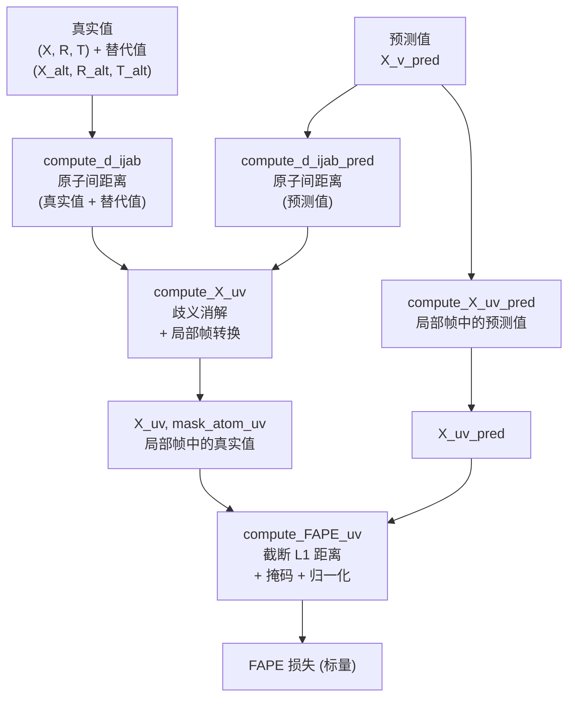

---
slug:7-fape-loss-function
blog_type:normal
---


**帧对齐点误差（FAPE）** 是 EquiFold 中的主要结构损失，它在预测和真实原子位置都被转换到共享的局部坐标系后，衡量两者之间的差异。与对齐整个结构的全局 RMSD 不同，FAPE **在所有局部帧上成对计算误差**，使其对局部几何和长程结构一致性均具有敏感性——这一特性对于蛋白质结构预测至关重要，因为局部正确性和全局折叠必须被同时约束。

来源：[utils.py](utils.py#L94-L108), [models.py](models.py#L448-L457)

## 数学基础

FAPE 基于**帧相对比较**原理运行：对于粗粒度（CG）节点 $(u, v)$ 的每个有序对，属于节点 $v$ 的原子被转换到由节点 $u$ 的旋转 $R_u$ 和平移 $T_u$ 定义的局部坐标系中。这产生了一个形状为 $[N, N, N_a, 3]$ 的张量 $X_{uv}$，其中 $N$ 是 CG 节点数，$N_a$ 是每个 CG 节点的最大原子数。对预测坐标应用相同的转换。损失计算如下：

$$\mathcal{L}_{\text{FAPE}} = \frac{1}{|\mathcal{M}| \cdot Z} \sum_{u,v,a} \mathcal{M}_{uva} \cdot \min\left(\|X_{uva} - \hat{X}_{uva}\|, \, d_{\max}\right)$$

其中 $\mathcal{M}$ 是有效原子对的二进制掩码，$d_{\max}$ 是截断距离，$Z$ 是归一化常数（设为等于 $d_{\max}$）。截断操作确保训练早期严重不准确的预测不会主导梯度，从而在迭代精修过程中提供鲁棒性。

来源：[utils.py](utils.py#L94-L108)

## 计算流程

FAPE 损失通过四阶段流程计算：将坐标转换到局部帧、解决对称性歧义以及聚合逐原子误差。下图展示了该流程：



每个阶段在确保损失既**具有几何意义**又**对对称性具有鲁棒性**方面发挥着独特作用。

来源：[utils.py](utils.py#L59-L108), [models.py](models.py#L448-L457)

## 阶段 1：原子间距离计算

在帧对齐之前，流程会计算所有 CG 节点间的逐对原子间距离。此步骤服务于一个关键目的：**对称性歧义消解**。某些氨基酸侧链（例如 ASP 的 OD1/OD2，PHE 的芳香环）存在命名歧义——即存在通过 180° 旋转关联的两种有效标记。函数 `compute_d_ijab` 计算所有成对距离 $d_{ijab} = \|X_{i,a} - X_{j,b}\|$ 以及一个掩码，该掩码隔离出一个原子有歧义而另一个原子无歧义的原子对：

```python
# mask_ijab 选择: (原子 ia 有歧义) 且 (原子 jb 无歧义)
mask_ijab = mask_atom_ijab * mask_amb[:, None, :, None] * mask_nonamb[None, :, None, :]
```

该掩码确保距离比较针对的是有信息量的原子对——将两个有歧义的原子相互比较是无意义的，因为两种标记会产生相同的成对距离。对规范和替代真实构型以及当前预测均执行相同的计算。

来源：[utils.py](utils.py#L31-L45)

## 阶段 2：歧义消解与局部帧转换

函数 `compute_X_uv` 依次执行两项操作：

**歧义消解。** 对于每个 CG 节点 $i$，比较规范真实值与预测值之间的绝对距离误差之和，以及使用替代（对称重命名）真实值的相同和：

$$d_i = \sum_{j,a,b} \mathcal{M}_{ijab} \cdot |d_{ijab} - \hat{d}_{ijab}|$$

如果替代构型产生较小的误差（$d_i > d_i^{\text{alt}}$），则该节点的真实坐标、旋转和平移将与其替代值交换。这是一个**逐节点贪心**决策——并非全局最优，但高效且经验上有效。

**局部帧转换。** 消解后，每个节点 $v$ 中的所有原子通过以下方式转换到每个节点 $u$ 的局部帧中：

$$X_{uv} = R_u^T (X_v - T_u)$$

此操作由 `apply_inverse_euclidean_uv` 实现，该函数利用单个 `einsum` 操作在所有 $(u, v)$ 对上进行广播以提升效率。结果 `X_uv` 的形状为 $[N, N, N_a, 3]$——一个表示所有成对局部帧中所有原子的四阶张量。

来源：[utils.py](utils.py#L59-L79), [utils.py](utils.py#L130-L135)

## 阶段 3：预测帧对齐

预测的原子坐标经历相同的帧对齐过程。首先，`compute_X_v_pred` 将预测的旋转和平移应用于模板坐标 $X_0$：

$$\hat{X}_v = R_v^{\text{pred}} X_0 + T_v^{\text{pred}}$$

然后 `compute_X_uv_pred` 使用**预测的**旋转和平移将这些坐标转换到成对的局部帧中：

$$\hat{X}_{uv} = (R_u^{\text{pred}})^T (\hat{X}_v - T_u^{\text{pred}})$$

这是关键的设计选择：**真实值和预测值均表示在各自的局部帧中**，因此 FAPE 损失衡量的是帧相对结构误差，而非单一全局帧中的误差。这使得损失对应用于任一结构的全局 SE(3) 变换保持不变。

来源：[utils.py](utils.py#L82-L91), [utils.py](utils.py#L130-L135)

## 阶段 4：截断距离聚合

`compute_FAPE_uv` 中的核心 FAPE 计算如下：

```python
d_uv = ((X_uv - X_uv_pred).square().sum(-1) + eps).sqrt().clamp(max=d_max)
loss = (d_uv * mask_atom_uv).sum() / natom_pairs / Z
```

逐原子的欧氏距离在 `d_max`（默认 10.0 Å）处被**截断**，然后被 `mask_atom_uv` 掩码处理，该掩码将缺失或无效原子的条目置零。总和除以有效原子对数和缩放常数 $Z = d_{\max}$ 进行归一化。这种双重归一化确保损失：（1）与蛋白质大小无关，且（2）当所有距离超过截断值时，其值有界于 $[0, 1]$。

来源：[utils.py](utils.py#L94-L108)

## 与训练循环的集成

FAPE 在迭代结构预测流程的**每个精修块**中计算。在 `NN.forward` 方法中，损失在所有块（索引 0 到 `num_blocks`）中累加，梯度从块 1 及后续块流过：

```python
for i in range(self.num_blocks + 1):
    # ... 通过 E3NN 块更新结构 ...
    X_v_pred = compute_X_v_pred(X0, R_pred, T_pred)
    d_ijab_pred = compute_d_ijab_pred(X_v_pred)
    X_uv, mask_atom_uv = compute_X_uv(...)
    X_uv_pred = compute_X_uv_pred(X_v_pred, R_pred, T_pred)
    loss = compute_FAPE_uv(X_uv, mask_atom_uv, X_uv_pred,
                           eps=1e-4, d_max=self.fape_clip_val)
```

块 0 迭代在**初始结构**（任何神经网络更新之前）上评估 FAPE，提供基线。当 `distinct_blocks` 为 `False` 时，损失进一步除以 `num_blocks` 以考虑跨块参数共享。结构违反损失（键长、键角、空间冲突）以可配置的权重和缩放计划添加到 FAPE 中。

来源：[models.py](models.py#L414-L491)

## 配置参数

| 参数 | 默认值 | 描述 |
|-----------|---------|-------------|
| `fape_clip_val` | `10.0` | 用于截断和归一化的最大距离（$d_{\max}$ 和 $Z$） |
| `eps` | `1e-4` | 用于 sqrt 中数值稳定性的小常数 |
| `weight_struct_loss` | `1.0` | 添加到 FAPE 中的结构违反损失权重 |
| `weight_struct_loss_scale` | `"constant"` | 依赖于块的缩放：`constant`、`linear` 或 `quadratic` |
| `warmup_steps` | `1` | SLERP 预热步数；预热期间 FAPE 按 $\tau$ 缩放 |

`fape_clip_val` 参数影响最大：设置过低会使损失对大误差不敏感（减慢收敛），而设置过高会削弱截断带来的好处，即防止训练早期严重错误预测导致的梯度爆炸。

来源：[models.py](models.py#L279-L281), [models.py](models.py#L465-L474)

## 与 AlphaFold2 FAPE 的关系

EquiFold 的 FAPE 采用了 AlphaFold2 的相同核心理念——帧相对点误差——但由于粗粒度表示，在几个重要方面有所不同：

| 方面 | AlphaFold2 | EquiFold |
|--------|-----------|----------|
| **帧定义** | 逐残基骨架帧 (N, Cα, C) | 来自 CG 刚体组的逐 CG 节点帧 |
| **比较的原子** | 每个残基的所有重原子 | 每个 CG 节点内的所有原子 |
| **歧义消解** | 全局（逐结构） | 逐 CG 节点贪心 |
| **距离截断** | 骨架/侧链分别使用 `d_max` | 单一 `fape_clip_val` |
| **损失计划** | 多尺度（多个 `d_max` 值） | 每块单一尺度 |

粗粒度表示意味着每个“帧”支配着可变数量的原子（从 GLY 骨架的 2 个到 TRP 吲哚基团的 9 个），并且歧义消解必须处理这些基团内的侧链对称性，而不是在单个残基层面上。

来源：[utils.py](utils.py#L59-L79), [cg.py](cg.py#L10-L31)

## 实际考量

<CgxTip>`X_uv` 张量（形状 $[N, N, N_a, 3]$）的 $O(N^2)$ 内存开销是处理大蛋白质时的主要瓶颈。`mask_atom_uv` 张量原则上允许稀疏计算，尽管当前实现是密集的。</CgxTip>

<CgxTip>当向 `compute_FAPE_uv` 传入 `return_count=True` 时，该函数分别返回未归一化的损失总和与原子对计数。这使得在批处理中跨多个蛋白质聚合 FAPE 时能够正确归一化——将所有未归一化的损失求和，然后除以总原子对计数。</CgxTip>

来源：[utils.py](utils.py#L94-L108), [utils.py](utils.py#L130-L135)

## 后续步骤

- FAPE 损失由**结构违反损失**（键长、键角、空间冲突）补充，后者强制执行物理约束——参见 [结构违反损失](8-structure-violation-losses)。
- 在训练早期，**SLERP 预热**机制将预测帧与真实值混合，FAPE 损失相应缩放——参见 [使用 SLERP 预热进行训练](9-training-with-slerp-warmup)。
- 输入 FAPE 的粗粒度帧和模板坐标 $X_0$ 在数据流程中构建——参见 [粗粒度表示](4-coarse-grained-representation)。