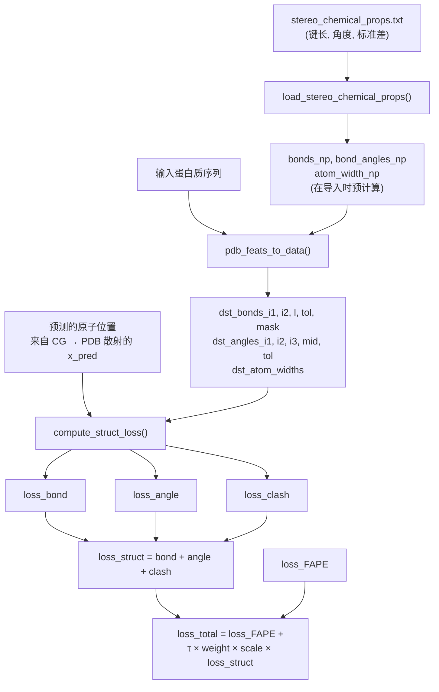

---
slug:8-structure-violation-losses
blog_type:normal
---


EquiFold 通过复合的**结构违反损失** 来惩罚偏离已知立体化学约束的偏差，从而强制实现物理上真实的蛋白质结构。与衡量相对于真实值的全局坐标精度的 [FAPE 损失函数](7-fape-loss-function) 不同，结构违反损失作用于**局部几何不变量** —— 键长、键角和原子间距离 —— 这些不变量独立于任何坐标系。这使得它们成为一种强大的正则化器，可以防止 E3 等变网络生成在全局上接近目标但在局部上不符合物理规律的结构。这三个组件 —— 键长违反、键角违反和空间碰撞违反 —— 由 `compute_struct_loss` 函数一起计算，并求和为单个 `loss_struct` 项，在训练期间作为 FAPE 损失的补充。

来源: [utils.py](/utils.py#L256-L337), [models.py](/models.py#L460-L474)

## 立体化学参考数据

在计算任何损失之前，系统必须知道“正确”的几何结构是什么样的。EquiFold 从随 OpenFold 分发的 `stereo_chemical_props.txt` 文件中获取其参考值，该文件包含每个氨基酸残基的实验测量键长、键长标准差、键角和键角标准差。这些数据通过 `load_stereo_chemical_props()` 加载，然后在模块初始化时在 `utils_data.py` 中进行预处理。

预处理构建了三个查找字典 —— `bonds_np`、`bond_angles_np` 和 `atom_width_np` —— 以残基名称为键。每个条目包含原子索引、目标值和表示为 `tol_factor × stddev` 的容差窗口，其中 `tol_factor = 3`。这个 3σ 容差窗口至关重要：它定义了一个**软约束**而非硬约束，允许损失在物理预期范围内的偏差保持为零，仅惩罚真正异常的几何结构。对于键角，容差在余弦空间中计算以保持对称性，使用 `mid = (cos(θ - 3σ) + cos(θ + 3σ)) / 2` 和 `tol = |cos(θ - 3σ) - mid|`。

一个关键的细微差别是**歧义掩码** (`dst_bonds_mask`)。完全包含在单个粗粒度节点内且不涉及歧义原子的键和角度被排除在键/角度损失之外，因为 FAPE 损失已经通过直接坐标监督约束了节点内几何结构。只有**跨 CG** 约束 —— 跨越两个 CG 节点的键/角度，或涉及 CG 节点间共享原子的键/角度 —— 的歧义掩码值为 1.0，并对违反损失产生贡献。残基间肽键约束（C[i]–N[i+1] 和 Cα–Cα 距离，加上 C-N-Cα 和 Cα-C-N 角度）在数据整理期间被追加，从而连接链上的相邻残基。

来源: [utils_data.py](/utils_data.py#L22-L100), [utils_data.py](/utils_data.py#L304-L353), [openfold_light/residue_constants.py](/openfold_light/residue_constants.py#L1-L30)

## 键长违反损失

键长违反损失惩罚偏离容差窗口超出其立体化学参考值的预测原子间距离。给定预测的原子位置 `X`、键索引数组 `dst_bonds_i1` 和 `dst_bonds_i2`、参考长度 `dst_bonds_l` 和容差 `dst_bonds_tol`，计算过程如下：

```
l_pred = ||X[i1] - X[i2]||₂
loss_bond = clamp(|dst_bonds_l - l_pred| - bond_tol_scale × dst_bonds_tol, min=0)
```

`clamp(min=0)` 实现了**单侧软惩罚**：容差窗口内的违反产生零损失，而容差窗口外的违反产生的损失与超出容差的程度成正比。`bond_tol_scale` 参数（默认为 1.0）允许在调用时对容差窗口进行全局缩放。在使用 `dst_bonds_mask`（以及可选的缺失原子的逐原子掩码）进行掩码处理后，损失在所有活动（未掩码）键上取平均值。

当 `return_full=True` 时，该函数使用 `scatter` 归约返回逐原子细分，而不是标量平均值，并将每个键两端原子的贡献对称化。这种逐原子模式可用于诊断，但在标准训练路径中未使用。

来源: [utils.py](/utils.py#L278-L293)

## 键角违反损失

键角违反损失强制执行每个成键原子三元组周围的正确局部几何结构。给定三个原子索引 `dst_angles_i1`、`dst_angles_i2`（中心原子）和 `dst_angles_i3`，预测角度通过其余弦值计算：

```
v1 = X[i1] - X[i2]
v2 = X[i3] - X[i2]
cosa_pred = (v1 · v2) / (||v1||₂ × ||v2||₂)
loss_angle = clamp(|dst_angles_mid - cosa_pred| - dst_angles_tol, min=0)
```

在**余弦空间**而非角度空间中工作是一个深思熟虑的设计选择。余弦在 [0, π] 上是单调递减函数，因此微小的角度偏差对应于微小的余弦偏差。更重要的是，参考值 `mid` 和容差 `tol` 在数据准备期间已在余弦空间中预计算（考虑了从角度到余弦的非线性映射），这避免了在训练时重复调用三角函数，并提高了数值稳定性。适用相同的单侧钳位模式：在余弦空间中处于其 3σ 窗口内的角度产生零损失。

请注意，键角仅针对**跨 CG 三元组或涉及歧义原子的三元组**强制执行。完全由粗粒度节点内部几何结构确定的节点内角度被排除，因为它们已经通过每个 CG 节点内原子坐标的 FAPE 监督被隐式约束。

来源: [utils.py](/utils.py#L295-L311), [utils_data.py](/utils_data.py#L64-L98)

## 空间碰撞违反损失

碰撞损失防止非键合原子重叠，强制执行原子不能占据同一空间区域的物理原理。它使用来自残基常数的**范德华半径** 来定义最小允许原子间距离：

```
d = ||X[:, None] - X[None, :]||₂          # 全对距离矩阵
d_min = vdW_radius[:, None] + vdW_radius[None, :]  # 半径之和
clash_tol = 0.1
loss_clash = clamp(d_min - d - clash_tol, min=0)
```

当两个原子之间的距离 `d` 小于 `d_min - clash_tol` 时，即当原子重叠超过 0.1 Å 的微小容差时，就会发生违反。掩码策略对计算效率和正确性至关重要：(1) 仅考虑 8 Å 以内的原子对 (`mask_clash = d < 8.0`)，(2) 键合原子对从碰撞检查中排除，(3) 通过对角线排除自交互，(4) 缺失原子（当 `apply_mask=True` 时）在两个维度上均被掩码排除。损失在所有活动（未掩码）对上取平均值。

`clash_tol = 0.1` 的值非常严格 —— 之前的实验尝试过 1.5 和 0.5 Å 的容差，最终确定为 0.1。这反映了一个观察结果：宽松的碰撞容差允许网络通过轻微压缩结构来“作弊”，生成在 FAPE 上得分良好但具有不真实空间堆积的模型。

来源: [utils.py](/utils.py#L313-L335)

## 损失组合与缩放

三个违反组件通过简单求和组合：`loss_struct = loss_bond + loss_angle + loss_clash`。然后，此复合损失通过由 `weight_struct_loss` 和 `weight_struct_loss_scale` 超参数控制的两个缩放级别整合到总训练目标中：

```python
loss = loss_FAPE + τ × weight_struct_loss × loss_struct × scale
```

**SLERP 预热因子 τ**（在预热阶段范围从 0 到 1）控制结构损失的贡献，确保仅在模型学习了合理的初始结构后才完全应用它。`weight_struct_loss_scale` 参数控制结构损失权重在迭代精修块中的变化方式：

| 缩放模式 | 公式 | 行为 |
|---|---|---|
| `constant` | `scale = 1` | 每个精修块的权重相等 |
| `linear` | `scale = i / num_blocks` | 从块 0 的 0 逐渐提升至最终块的 1 |
| `quadratic` | `scale = (i / num_blocks)²` | 缓慢提升，强烈倾向于后序块的执行 |

非恒定缩放模式背后的直觉是，早期精修块生成粗略结构，在此阶段严格的立体化学强制执行会产生反效果 —— 网络需要自由移动原子较长距离。后期块进行更精细的调整，应生成全局准确（低 FAPE）且局部符合物理规律（低违反）的结构。

<CgxTip>当 `weight_struct_loss_scale` 设置为 `linear` 或 `quadratic` 时，结构违反损失在早期精修块中被有意减弱。这不是缺陷 —— 它反映了粗略几何校正应先于精细立体化学强制的架构原则。监视逐块的 `losses_bond`、`losses_angle` 和 `losses_clash` 指标（记录为 `train_loss_{bond,angle,clash}_final`），以验证违反损失在训练期间跨块单调递减。</CgxTip>

来源: [models.py](/models.py#L460-L474), [models.py](/models.py#L280-L281)

## 数据流与计算图

下图追踪了从立体化学参考数据到训练步骤中损失计算的完整路径：



输入到 `compute_struct_loss` 的预测原子位置 `x_pred` 是通过 `compute_x_pdb()` 将 CG 级别的预测坐标 `X_v_pred` 散射到完整的原子级 PDB 表示而获得的。此散射步骤 —— 使用预计算的 `scatter_index` 和 `scatter_w` 数组将每个 CG 节点的预测原子映射到扁平原子数组中的正确位置 —— 正是将 E3 等变网络的 CG 级别预测与原子级立体化学约束连接起来的关键。

来源: [models.py](/models.py#L438-L463), [utils.py](/utils.py#L340-L344), [utils_data.py](/utils_data.py#L359-L419)

## 配置参考

| 参数 | 默认值 | 类型 | 描述 |
|---|---|---|---|
| `weight_struct_loss` | `1.0` | `float` | 总目标中 `loss_struct` 的全局权重。设为 0 以禁用。 |
| `weight_struct_loss_scale` | `constant` | `str` | 逐块缩放：`constant`、`linear` 或 `quadratic` |
| `bond_tol_scale` | `1.0` | `float` | 3σ 键容差窗口的乘数（在调用时传递） |
| `clash_tol` | `0.1` | `float` | 低于范德华最小距离的硬编码容差 (Å) |
| `tol_factor` | `3` | `int` | 立体化学容差窗口的标准差倍数 |

<CgxTip>`tol_factor = 3` 和 `clash_tol = 0.1` 是硬编码的，而不是作为超参数暴露。如果你在验证中观察到系统的键长违反，请考虑在 `compute_struct_loss` 调用处调整 `bond_tol_scale`，而不是修改全局 `tol_factor`，因为后者会影响模块初始化时预计算的数据数组，并需要重启 Python 解释器。</CgxTip>

来源: [models.py](/models.py#L280-L281), [utils.py](/utils.py#L256-L258), [utils_data.py](/utils_data.py#L24-L24)

## 与训练流水线的关系

结构违反损失与训练流水线的其他两个组件交互。[FAPE 损失函数](7-fape-loss-function) 提供主要的坐标级监督信号，而结构违反损失充当 FAPE 无法表达的补充正则化器 —— FAPE 测量位置误差，但无法直接强制键长或角度保持物理规律，因为它在 SE(3) 对齐后对坐标进行操作。[SLERP 预热训练](9-training-with-slerp-warmup) 机制通过 τ 因子控制结构损失，确保早期训练（预测远离目标）不会因激进的立体化学强制执行而失稳。这三个组件共同构成一个课程：SLERP 预热提供平滑初始化，FAPE 驱动全局结构收敛，而结构违反损失在全局支架大致正确后精修局部几何结构。