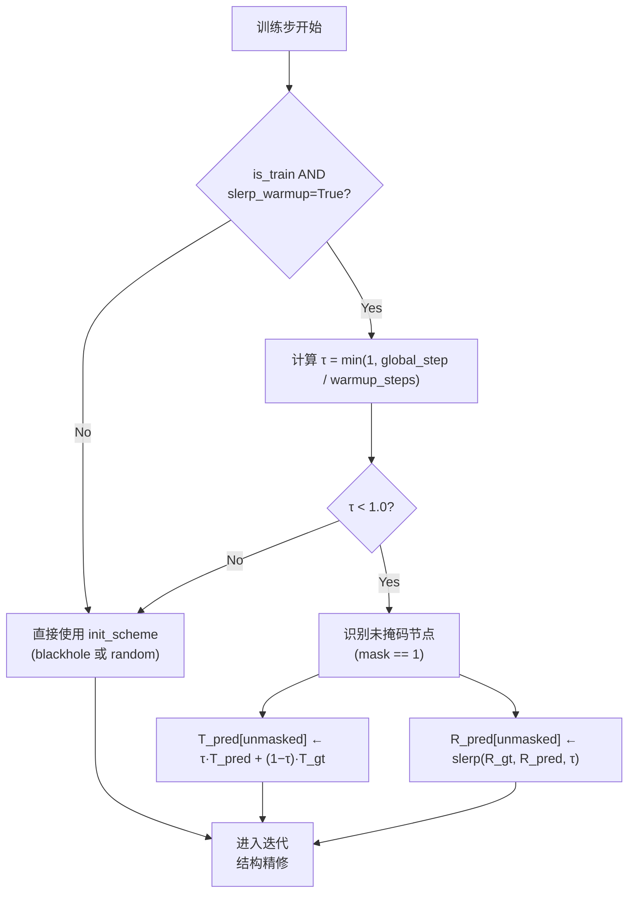
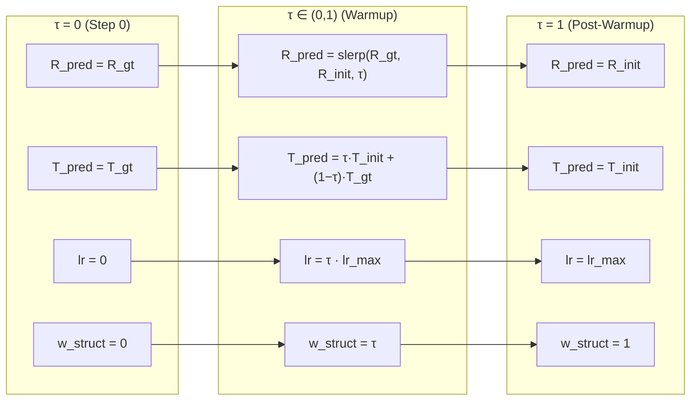

---
slug:9-training-with-slerp-warmup
blog_type:normal
---

EquiFold 采用**球面线性插值 (SLERP) 预热**策略来稳定训练的早期阶段，在该阶段，模型预测的刚体变换（旋转和平移）会从真实值初始化逐渐过渡到模型自身学习到的初始化方案。该技术解决了迭代结构精修中的一个基本自举问题：E3等变网络必须从第一步起就产生有意义的旋转更新，但其初始预测是任意的。SLERP 预热提供了一种几何原则明确的课程学习机制来弥补这一差距。

## 自举问题

在训练期间，EquiFold 的迭代精修循环从由 `init_scheme` 定义的初始结构开始——即 `"blackhole"`（单位旋转，零平移）或 `"random"`（随机旋转，高斯平移）。在早期训练步中，网络预测的更新 (ΔR, ΔT) 本质上是未经训练的噪声。将这些噪声更新与无意义的初始结构组合，会产生不连贯的中间帧，使得 [FAPE 损失函数](7-fape-loss-function)的梯度充满噪声，优化地形变得险恶。若不加干预，模型必须同时学习*从何处开始*和*如何移动*——这是一个减缓收敛并带来不稳定风险的鸡生蛋问题。

来源: [models.py](models.py#L21-L35), [models.py](models.py#L343-L362)

## SLERP 预热机制

预热定义了一个混合参数 **τ**，该参数在 `warmup_steps` 训练步内从 0 线性增加至 1：

$$\tau = \min\left(1,\ \frac{\text{global\_step}}{\text{warmup\_steps}}\right)$$

在每个训练步中，初始预测的旋转 `R_pred` 和平移 `T_pred` 会与所有未掩码（已观测）粗粒度节点的真实值 `R` 和 `T` 进行混合：

- **平移**使用标准线性插值：`T_pred = τ · T_pred + (1 − τ) · T`
- **旋转**使用四元数 SLERP：`R_pred = slerp(R, R_pred, τ)`

当 τ = 0 时，模型在每个精修周期都从真实结构（减去质心）开始。当 τ = 1 时，模型使用完整的初始化方案。核心思想在于，**平移在欧几里得空间中进行线性插值**，而**旋转沿旋转群 SO(3) 的测地线进行插值**——这尊重了流形的几何结构，而非直接穿透它。

来源: [models.py](models.py#L384-L397)

## 四元数 SLERP 实现

EquiFold 通过**幂公式**而非更常见的几何（基于 sin）公式来实现 SLERP。给定两个旋转矩阵 R₀ 和 R₁ 及其对应的单位四元数 q₀ 和 q₁，插值公式为：

$$\text{slerp}(q_0, q_1, t) = q_0 \cdot (q_0^{-1} \cdot q_1)^t$$

这可分解为三个操作：(1) 计算相对旋转 `q₀⁻¹ · q₁`，(2) 通过轴角分解将该四元数提升至 t 次幂——即 `exp(t · ln(q₀⁻¹ · q₁))`——该方法在保持旋转轴不变的同时将旋转角缩放 t 倍，(3) 与 q₀ 重新组合。对于所有 t ∈ [0, 1]，幂公式在数值上都是稳定的，并避免了当 q₀ ≈ q₁ 时几何公式出现的除零奇异性。

该实现还包含一个替代的 `quaternion_slerp2`，它使用几何公式并在接近恒等变换时显式回退到线性插值，但基于幂公式的 `quaternion_slerp` 才是训练中使用的函数。

| 实现 | 公式 | 奇异性处理 | 训练中是否使用 |
|---|---|---|---|
| `quaternion_slerp` | q₀(q₀⁻¹q₁)^t | 通过幂公式实现固有稳定性 | **是** |
| `quaternion_slerp2` | (sin((1−t)θ)·q₀ + sin(tθ)·q₁) / sin(θ) | 当 θ ≈ 0 时回退至 lerp | 否 (仅供参考) |

来源: [utils.py](utils.py#L238-L253), [utils.py](utils.py#L210-L229), [utils.py](utils.py#L232-L235)

## 与学习率预热及结构损失的交互

SLERP 预热并非孤立运行。`warmup_steps` 参数同时控制着在早期训练期间协同作用的三个预热机制：

1. **SLERP 预热** (`slerp_warmup=True`)：将初始化从真实值混合过渡至初始化方案（控制旋转/平移的起始点）。
2. **学习率预热** (`lr_warmup=True`)：在 `warmup_steps` 步内将学习率从 0 线性增加至 `lr`，防止在模型预测仍严重依赖真实值时出现较大的梯度步。
3. **结构违背损失缩放**：结构损失（键长 + 键角 + 空间冲突）乘以 τ，意味着其权重从零开始并逐渐增加至满权重。这可以防止当模型本质上只是在复制真实值时，[结构违背损失](8-structure-violation-losses)占据主导地位。

该三元组确保了连贯的训练动态：模型首先学习重现真实值（τ ≈ 0，低学习率，无结构损失压力），然后随着优化器逐渐获得信心且结构约束开始生效，模型逐渐接管其初始化过程。

来源: [models.py](models.py#L384-L397), [models.py](models.py#L474-L474), [models.py](models.py#L510-L533)

## 配置参考

发布的两个模型配置均默认启用 SLERP 预热。相关的超参数及其交互作用如下：

| 参数 | 默认值 | AB 模型 | Science 模型 | 作用 |
|---|---|---|---|---|
| `slerp_warmup` | `True` | `true` | `true` | 启用/禁用旋转 SLERP 混合 |
| `warmup_steps` | `1` | 依赖配置 | 依赖配置 | τ 从 0→1 增加的训练步数 |
| `lr_warmup` | `False` | `true` | `true` | 将学习率预热与 SLERP 预热协调 |
| `lr_anneal` | `False` | `true` | `true` | 在预热后启用余弦退火 |
| `init_scheme` | `"blackhole"` | — | — | 当 τ = 1 时的目标初始化方案 |
| `weight_struct_loss` | `1.0` | — | — | 结构违背损失的基础权重 |
| `weight_struct_loss_scale` | `"constant"` | — | — | 结构损失的逐块缩放配置 |

<CgxTip>设置 `warmup_steps = 1`（代码默认值）实际上会禁用 SLERP 预热，因为 τ 会立即变为 1。要激活预热课程学习，必须将 `warmup_steps` 设置为远大于 1 的值（例如数千步）。发布的配置文件使用了自定义的 warmup_steps 值——在复现训练运行时，请务必检查此参数。</CgxTip>

<CgxTip>SLERP 预热仅适用于**未掩码**节点（即 `mask == 1` 的节点）。掩码节点——代表缺失或未观测的残基——始终使用原始的 `init_scheme` 初始化，因为不存在可供混合过渡的真实变换。这对于部分结构预测场景至关重要。</CgxTip>

来源: [models.py](models.py#L249-L282), [models/ab_config.json](models/ab_config.json#L1-L1), [models/science_config.json](models/science_config.json#L1-L1)

## 验证行为

在验证和测试步期间，SLERP 预热会被显式禁用。前向传播将以 `is_train=False` 被调用，无论全局步数多少，这都会强制设定 `τ = 1.0`。这确保了评估始终衡量模型从其自身初始化方案起步的性能——从而对学习到的结构预测能力提供客观评估，而非评估受真实值引导的训练行为。