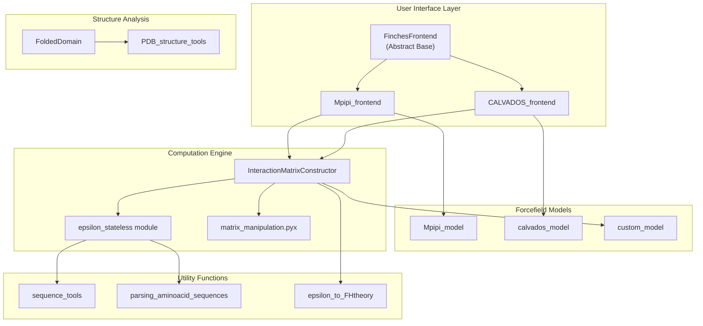
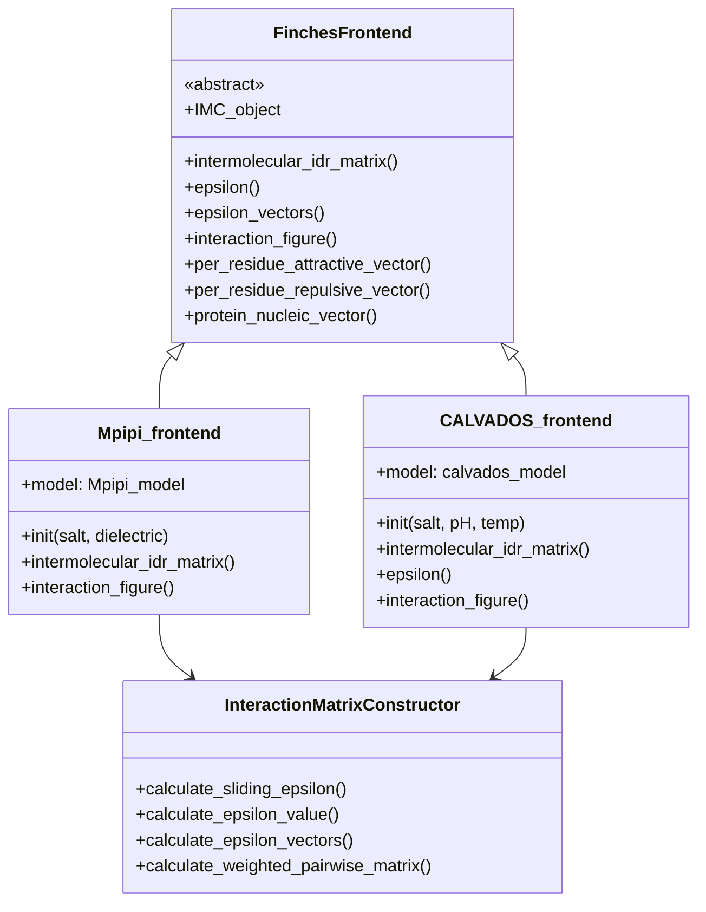
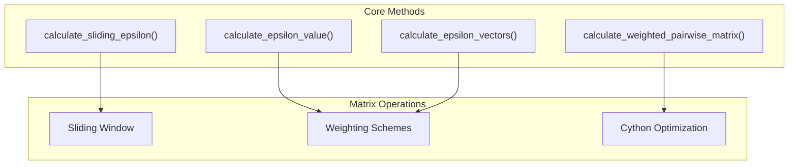
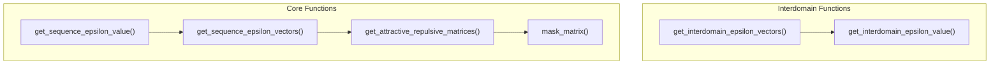

# API Reference

> **Relevant source files**
> * [docs/api.rst](https://github.com/idptools/finches/blob/5b52ba40/docs/api.rst)
> * [docs/conf.py](https://github.com/idptools/finches/blob/5b52ba40/docs/conf.py)
> * [finches/data/fingerprints.py](https://github.com/idptools/finches/blob/5b52ba40/finches/data/fingerprints.py)
> * [finches/epsilon_stateless.py](https://github.com/idptools/finches/blob/5b52ba40/finches/epsilon_stateless.py)
> * [finches/frontend/calvados_frontend.py](https://github.com/idptools/finches/blob/5b52ba40/finches/frontend/calvados_frontend.py)
> * [finches/frontend/frontend_base.py](https://github.com/idptools/finches/blob/5b52ba40/finches/frontend/frontend_base.py)
> * [finches/frontend/mpipi_frontend.py](https://github.com/idptools/finches/blob/5b52ba40/finches/frontend/mpipi_frontend.py)

This page provides comprehensive technical documentation for all public classes, methods, and functions in the FINCHES library. It covers the complete programmatic interface for calculating epsilon values, generating interaction matrices, and analyzing IDR-folded domain interactions.

For conceptual explanations of the underlying algorithms and theory, see [Core Concepts](/idptools/finches/4-core-concepts). For practical usage examples, see [Examples and Tutorials](/idptools/finches/6-examples-and-tutorials).

## API Architecture Overview

The FINCHES API is organized around a frontend-backend architecture where user-facing frontend classes provide a simplified interface to the underlying computation engine.



**Sources:** [finches/frontend/frontend_base.py L20-L41](https://github.com/idptools/finches/blob/5b52ba40/finches/frontend/frontend_base.py#L20-L41)

 [finches/frontend/mpipi_frontend.py L12-L21](https://github.com/idptools/finches/blob/5b52ba40/finches/frontend/mpipi_frontend.py#L12-L21)

 [finches/frontend/calvados_frontend.py L28-L43](https://github.com/idptools/finches/blob/5b52ba40/finches/frontend/calvados_frontend.py#L28-L43)

## Core Class Hierarchy

The main API entry points are the frontend classes that inherit from a common base class and provide access to different forcefield models.



**Sources:** [finches/frontend/frontend_base.py L20-L283](https://github.com/idptools/finches/blob/5b52ba40/finches/frontend/frontend_base.py#L20-L283)

 [finches/frontend/mpipi_frontend.py L12-L22](https://github.com/idptools/finches/blob/5b52ba40/finches/frontend/mpipi_frontend.py#L12-L22)

 [finches/frontend/calvados_frontend.py L28-L44](https://github.com/idptools/finches/blob/5b52ba40/finches/frontend/calvados_frontend.py#L28-L44)

## Frontend Classes

### FinchesFrontend Base Class

The `FinchesFrontend` class at [finches/frontend/frontend_base.py L20-L41](https://github.com/idptools/finches/blob/5b52ba40/finches/frontend/frontend_base.py#L20-L41)

 serves as an abstract base class that defines the common interface for all forcefield-specific frontend implementations.

| Method | Purpose | Returns |
| --- | --- | --- |
| `intermolecular_idr_matrix()` | Generate sliding window interaction matrix | Matrix, disorder profiles |
| `epsilon()` | Calculate single epsilon value between sequences | Float |
| `epsilon_vectors()` | Calculate per-residue interaction vectors | Attractive/repulsive vectors |
| `interaction_figure()` | Generate publication-ready interaction plots | Matplotlib figure objects |
| `per_residue_attractive_vector()` | Extract attractive interactions per residue | Indices, values array |
| `per_residue_repulsive_vector()` | Extract repulsive interactions per residue | Indices, values array |
| `protein_nucleic_vector()` | Calculate protein-RNA binding propensity | Sliding window binding scores |

**Sources:** [finches/frontend/frontend_base.py L46-L912](https://github.com/idptools/finches/blob/5b52ba40/finches/frontend/frontend_base.py#L46-L912)

### Mpipi_frontend

The `Mpipi_frontend` class at [finches/frontend/mpipi_frontend.py L12-L22](https://github.com/idptools/finches/blob/5b52ba40/finches/frontend/mpipi_frontend.py#L12-L22)

 implements the Mpipi forcefield model, which supports both protein and RNA sequences.

```markdown
# Constructor parametersMpipi_frontend(salt=0.150, dielectric=80.0)
```

**Key Features:**

* Supports protein sequences and poly-U RNA via 'U' residues
* Automatically detects RNA sequences and disables disorder prediction
* Uses Wang-Frenkel and Coulombic potentials

**Sources:** [finches/frontend/mpipi_frontend.py L13-L21](https://github.com/idptools/finches/blob/5b52ba40/finches/frontend/mpipi_frontend.py#L13-L21)

 [finches/frontend/mpipi_frontend.py L105-L126](https://github.com/idptools/finches/blob/5b52ba40/finches/frontend/mpipi_frontend.py#L105-L126)

### CALVADOS_frontend

The `CALVADOS_frontend` class at [finches/frontend/calvados_frontend.py L28-L44](https://github.com/idptools/finches/blob/5b52ba40/finches/frontend/calvados_frontend.py#L28-L44)

 implements the CALVADOS2 forcefield model for protein-only interactions.

```markdown
# Constructor parameters  CALVADOS_frontend(salt=0.150, pH=7.4, temp=288)
```

**Key Features:**

* Protein sequences only (throws exception for 'U' residues)
* pH-dependent calculations
* Uses Ashbaugh-Hatch and Yukawa potentials
* All methods decorated with `@RNA_check` for validation

**Sources:** [finches/frontend/calvados_frontend.py L34-L43](https://github.com/idptools/finches/blob/5b52ba40/finches/frontend/calvados_frontend.py#L34-L43)

 [finches/frontend/calvados_frontend.py L16-L25](https://github.com/idptools/finches/blob/5b52ba40/finches/frontend/calvados_frontend.py#L16-L25)

## Calculation Engine

### InteractionMatrixConstructor

The core computation engine accessible via the `IMC_object` attribute on frontend classes. This class handles all matrix calculations and epsilon computations.



**Key Methods:**

* `calculate_sliding_epsilon()`: Generates interaction matrices using sliding windows
* `calculate_epsilon_value()`: Computes single epsilon values between sequence pairs
* `calculate_epsilon_vectors()`: Returns attractive/repulsive component vectors
* `calculate_weighted_pairwise_matrix()`: Applies charge and aliphatic weighting

**Sources:** [finches/frontend/frontend_base.py L123-L128](https://github.com/idptools/finches/blob/5b52ba40/finches/frontend/frontend_base.py#L123-L128)

 [finches/frontend/frontend_base.py L238-L241](https://github.com/idptools/finches/blob/5b52ba40/finches/frontend/frontend_base.py#L238-L241)

### epsilon_stateless Module

The `epsilon_stateless` module at [finches/epsilon_stateless.py](https://github.com/idptools/finches/blob/5b52ba40/finches/epsilon_stateless.py)

 provides low-level stateless functions for epsilon calculations that can be called independently of the frontend classes.



**Key Functions:**

| Function | Parameters | Returns | Purpose |
| --- | --- | --- | --- |
| `get_sequence_epsilon_value()` | seq1, seq2, X, options | float | Single epsilon calculation |
| `get_sequence_epsilon_vectors()` | seq1, seq2, X, options | attractive_vector, repulsive_vector | Per-residue vectors |
| `get_interdomain_epsilon_value()` | seq1, seq2, X, SAFD_coords, options | float | IDR-folded domain epsilon |
| `get_attractive_repulsive_matrices()` | matrix, baseline | attractive_matrix, repulsive_matrix | Matrix decomposition |

**Sources:** [finches/epsilon_stateless.py L206-L268](https://github.com/idptools/finches/blob/5b52ba40/finches/epsilon_stateless.py#L206-L268)

 [finches/epsilon_stateless.py L121-L201](https://github.com/idptools/finches/blob/5b52ba40/finches/epsilon_stateless.py#L121-L201)

 [finches/epsilon_stateless.py L427-L530](https://github.com/idptools/finches/blob/5b52ba40/finches/epsilon_stateless.py#L427-L530)

## Structure Analysis

### FoldedDomain Class

The `FoldedDomain` class handles PDB structure processing for IDR-folded domain analysis.

**Key Functionality:**

* Extracts solvent-accessible surface residues from PDB structures
* Generates coordinate masks for interdomain calculations
* Integrates with disorder prediction for hybrid structured/disordered proteins

**Sources:** Referenced in [finches/epsilon_stateless.py L276-L356](https://github.com/idptools/finches/blob/5b52ba40/finches/epsilon_stateless.py#L276-L356)

 for interdomain calculations

### PDB Structure Tools

Utility functions for processing protein structures from PDB files, extracting surface residues, and generating coordinate systems for interdomain epsilon calculations.

**Sources:** Referenced in [finches/epsilon_stateless.py L299-L320](https://github.com/idptools/finches/blob/5b52ba40/finches/epsilon_stateless.py#L299-L320)

## Utility Functions

### Sequence Processing

Core sequence analysis functions handle amino acid property calculations, charge weighting, and aliphatic residue clustering.

**Key Components:**

* Charge and aliphatic weighting schemes
* Sequence validation and residue type checking
* NCPR (Net Charge Per Residue) and FCR (Fraction of Charged Residues) calculations

**Sources:** [finches/epsilon_stateless.py L180-L185](https://github.com/idptools/finches/blob/5b52ba40/finches/epsilon_stateless.py#L180-L185)

 [finches/epsilon_stateless.py L402-L403](https://github.com/idptools/finches/blob/5b52ba40/finches/epsilon_stateless.py#L402-L403)

### Phase Diagram Tools

The `epsilon_to_FHtheory` module converts epsilon values to phase diagrams using Flory-Huggins theory for understanding phase separation behavior.

**Sources:** [finches/frontend/frontend_base.py L3](https://github.com/idptools/finches/blob/5b52ba40/finches/frontend/frontend_base.py#L3-L3)

### Model Fingerprints

Reference data for model calibration stored in `finches.data.fingerprints` containing pre-computed sequences for different residue pair interactions.

**Available Fingerprints:**

* `mpipi_fingerprints`: 36 residue pair combinations for Mpipi model calibration
* `calvados_fingerprints`: 35 residue pair combinations for CALVADOS model calibration

**Sources:** [finches/data/fingerprints.py L1-L74](https://github.com/idptools/finches/blob/5b52ba40/finches/data/fingerprints.py#L1-L74)