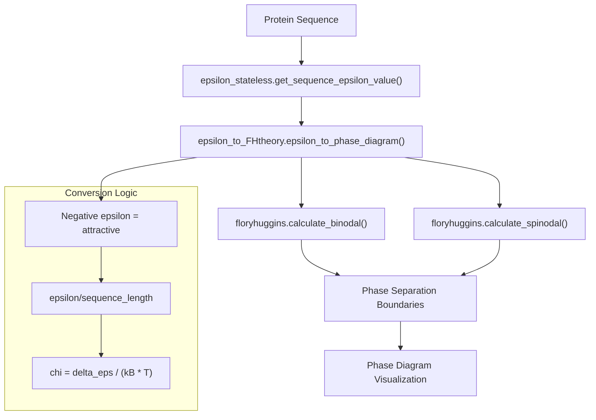
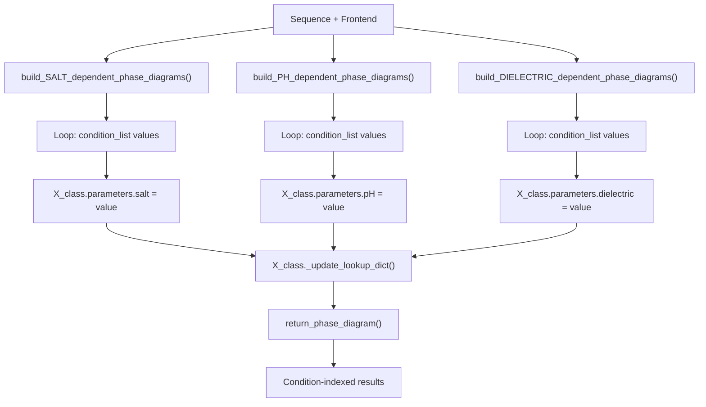
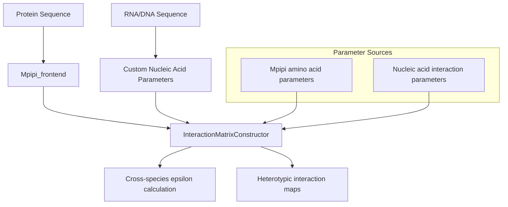
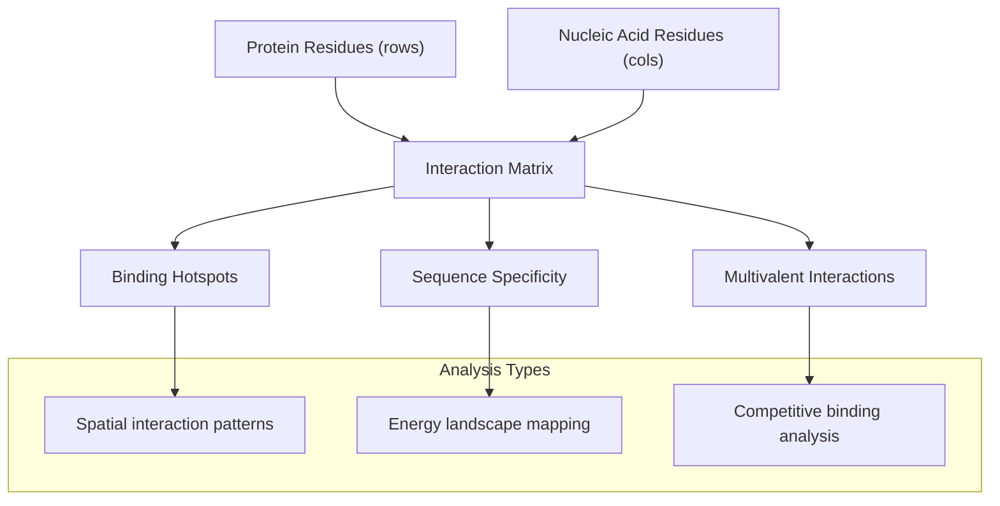
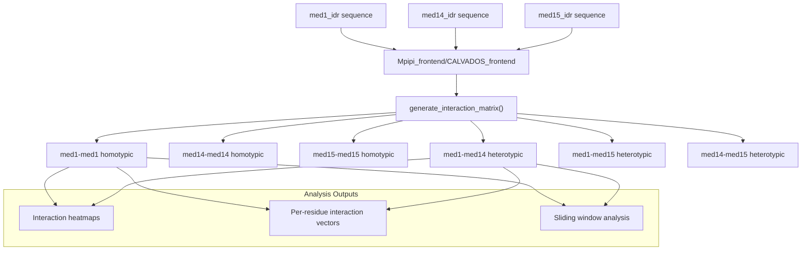
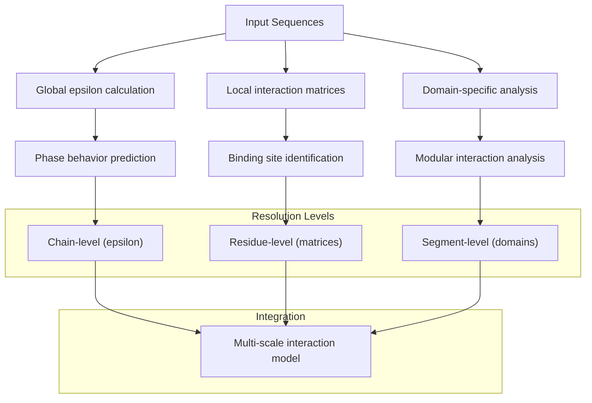
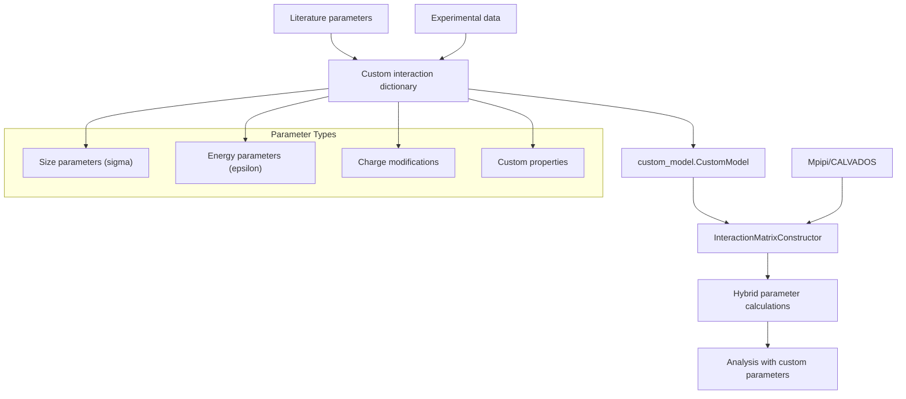
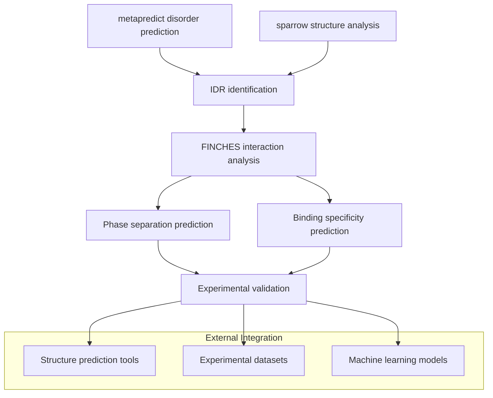

# Advanced Analysis Examples

> **Relevant source files**
> * [demo/nucleic_acid/protein_nucleic_acid_binding.ipynb](https://github.com/idptools/finches/blob/5b52ba40/demo/nucleic_acid/protein_nucleic_acid_binding.ipynb)
> * [demo/phase_diagrams/phase_diagram_demo.ipynb](https://github.com/idptools/finches/blob/5b52ba40/demo/phase_diagrams/phase_diagram_demo.ipynb)
> * [demo/protein_matrix/interaction_matrix_demo.ipynb](https://github.com/idptools/finches/blob/5b52ba40/demo/protein_matrix/interaction_matrix_demo.ipynb)
> * [finches/epsilon_to_FHtheory.py](https://github.com/idptools/finches/blob/5b52ba40/finches/epsilon_to_FHtheory.py)

This page demonstrates complex analytical workflows using FINCHES, including phase diagram generation with Flory-Huggins theory, protein-nucleic acid interaction analysis, and multi-condition parameter sweeps. For basic usage patterns such as simple epsilon calculations and interaction maps, see [Basic Usage Examples](/idptools/finches/6.1-basic-usage-examples).

## Phase Diagram Analysis with Flory-Huggins Theory

FINCHES integrates analytical solutions to the Flory-Huggins model for generating phase diagrams from computed epsilon values. This functionality bridges molecular-level interaction parameters with thermodynamic phase behavior.

### Core Phase Diagram Workflow

The phase diagram calculation involves several key transformations. When epsilon values are positive (repulsive), they are set to a small attractive value (-0.01) to prevent mathematical issues in the Flory-Huggins calculations. The epsilon value is normalized by sequence length since it represents chain-level interactions while the Flory-Huggins model requires per-residue energies.

**Sources:** [finches/epsilon_to_FHtheory.py L356-L448](https://github.com/idptools/finches/blob/5b52ba40/finches/epsilon_to_FHtheory.py#L356-L448)

### Multi-Condition Phase Analysis

FINCHES provides specialized functions for analyzing phase behavior across different environmental conditions:

Each condition sweep function follows the same pattern: iterating through condition values, updating the forcefield parameters, refreshing the lookup tables, and computing phase diagrams for each condition.

**Sources:** [finches/epsilon_to_FHtheory.py L33-L271](https://github.com/idptools/finches/blob/5b52ba40/finches/epsilon_to_FHtheory.py#L33-L271)

## Protein-Nucleic Acid Interaction Analysis

FINCHES supports heterotypic interactions between proteins and nucleic acids, extending beyond traditional protein-protein interactions. This capability is particularly relevant for analyzing RNA-binding proteins and DNA-binding domains.

### Nucleic Acid Parameter Integration

The analysis involves extending the standard amino acid parameter sets to include nucleic acid residues, enabling calculation of protein-nucleic acid interaction energies using the same computational framework.

**Sources:** [demo/nucleic_acid/protein_nucleic_acid_binding.ipynb L1-L200](https://github.com/idptools/finches/blob/5b52ba40/demo/nucleic_acid/protein_nucleic_acid_binding.ipynb#L1-L200)

### Heterotypic Interaction Matrices

When analyzing protein-nucleic acid systems, interaction matrices reveal binding specificity patterns:

**Sources:** [demo/nucleic_acid/protein_nucleic_acid_binding.ipynb L1-L200](https://github.com/idptools/finches/blob/5b52ba40/demo/nucleic_acid/protein_nucleic_acid_binding.ipynb#L1-L200)

## Complex Interaction Matrix Analysis

Advanced interaction matrix analysis goes beyond simple pairwise epsilon calculations to examine spatially-resolved interaction patterns and multi-domain systems.

### IDR-IDR Interaction Networks

The interaction matrix analysis reveals position-specific interaction preferences across different IDR pairs, enabling identification of binding motifs and cooperative interaction regions.

**Sources:** [demo/protein_matrix/interaction_matrix_demo.ipynb L80-L150](https://github.com/idptools/finches/blob/5b52ba40/demo/protein_matrix/interaction_matrix_demo.ipynb#L80-L150)

### Multi-Scale Analysis Pipeline

**Sources:** [demo/protein_matrix/interaction_matrix_demo.ipynb L1-L200](https://github.com/idptools/finches/blob/5b52ba40/demo/protein_matrix/interaction_matrix_demo.ipynb#L1-L200)

 [finches/epsilon_to_FHtheory.py L275-L351](https://github.com/idptools/finches/blob/5b52ba40/finches/epsilon_to_FHtheory.py#L275-L351)

## Custom Forcefield Integration

Advanced users can integrate custom interaction parameters for specialized systems or novel amino acid modifications.

### Custom Parameter Workflow

Custom forcefields enable analysis of non-standard systems including modified amino acids, synthetic polymers, or hybrid protein-polymer systems.

**Sources:** [finches/forcefields/custom_model.py L1-L100](https://github.com/idptools/finches/blob/5b52ba40/finches/forcefields/custom_model.py#L1-L100)

## Integration with External Tools

FINCHES analysis workflows can be integrated with structure prediction and experimental validation tools.

### Analysis Integration Pipeline

**Sources:** [demo/protein_matrix/interaction_matrix_demo.ipynb L55-L65](https://github.com/idptools/finches/blob/5b52ba40/demo/protein_matrix/interaction_matrix_demo.ipynb#L55-L65)

 [demo/nucleic_acid/protein_nucleic_acid_binding.ipynb L55-L65](https://github.com/idptools/finches/blob/5b52ba40/demo/nucleic_acid/protein_nucleic_acid_binding.ipynb#L55-L65)