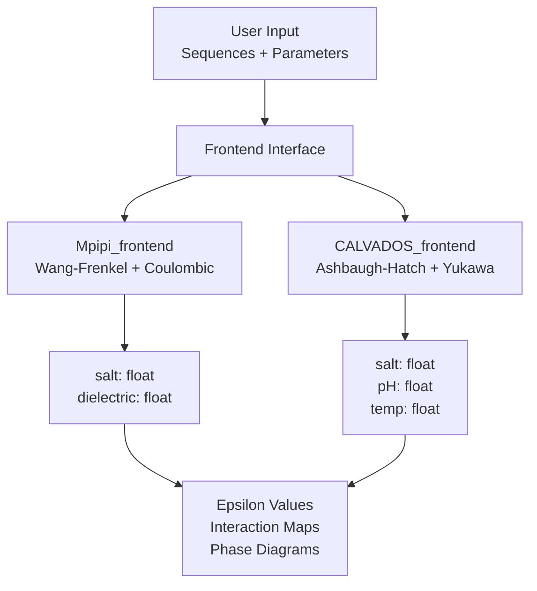
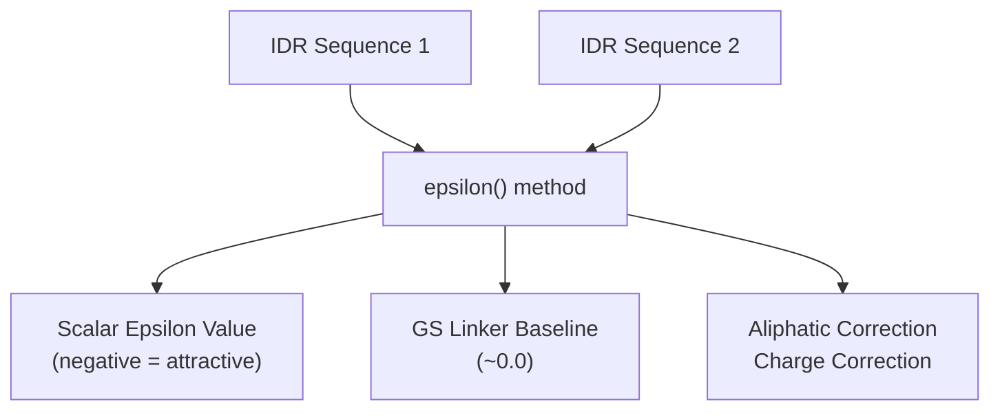
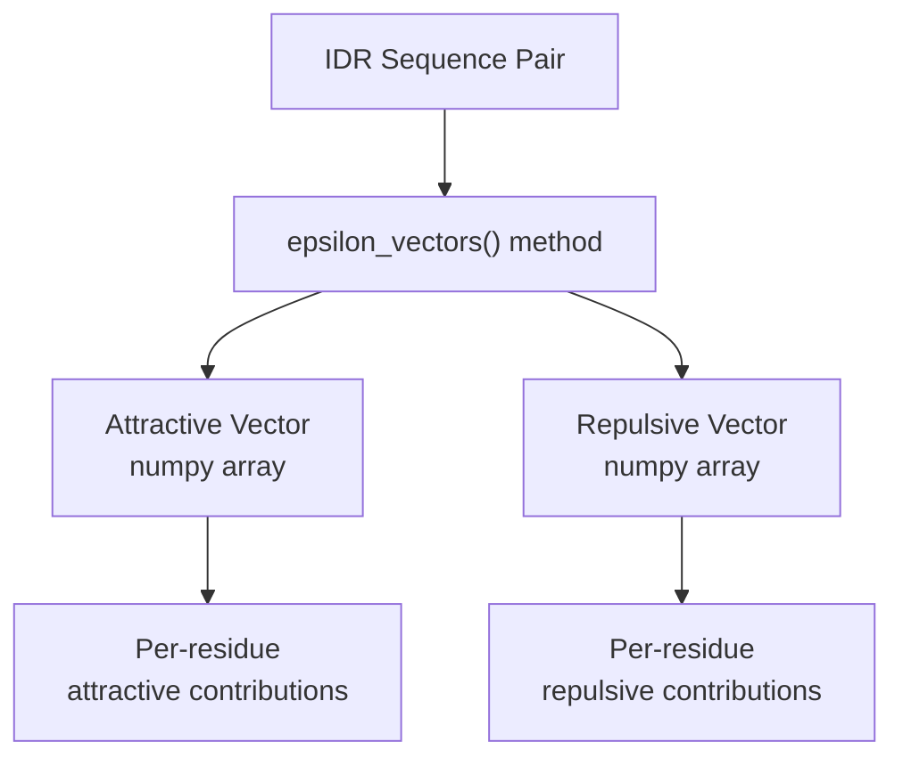
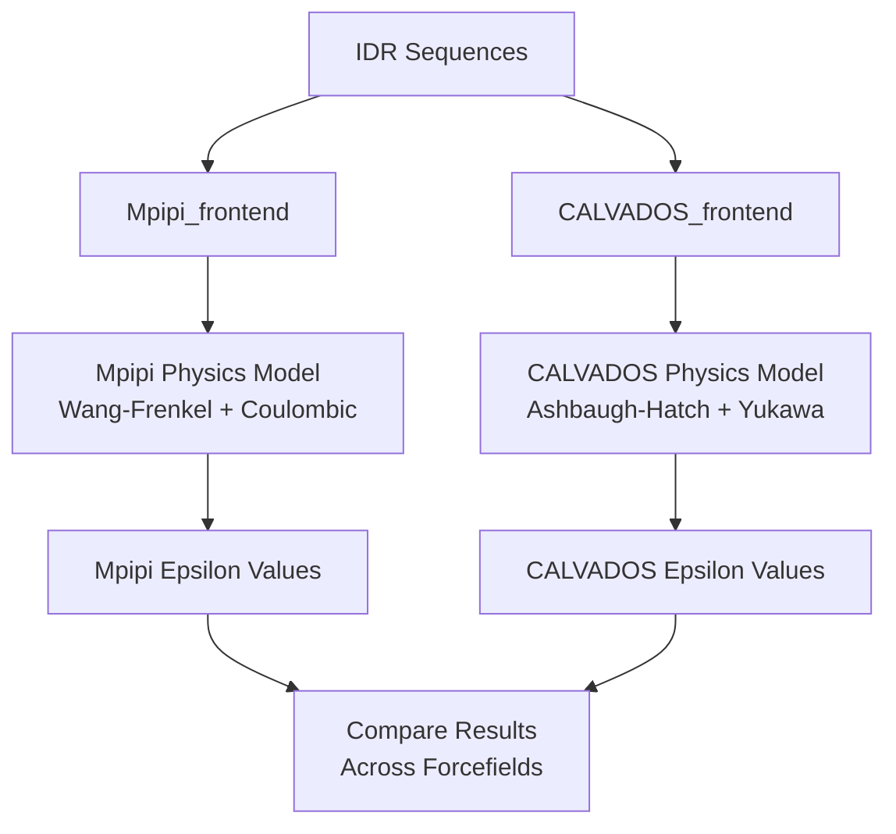
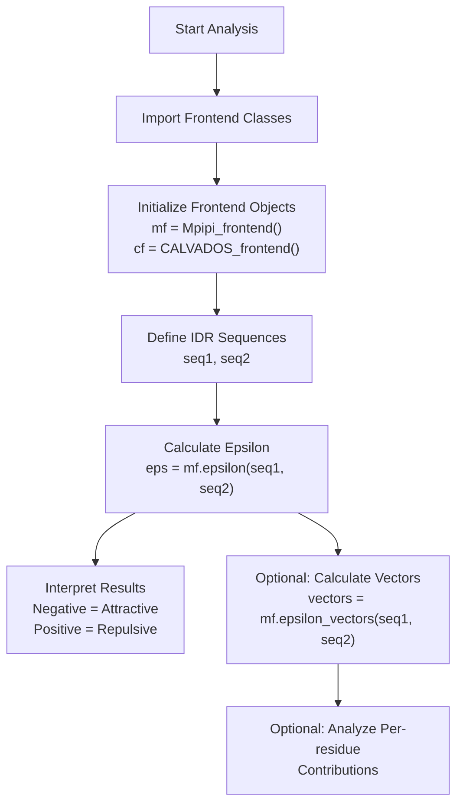

# Basic Usage Examples

> **Relevant source files**
> * [demo/docs_demo/ADBD1.pdb](https://github.com/idptools/finches/blob/5b52ba40/demo/docs_demo/ADBD1.pdb)
> * [demo/docs_demo/epsilon_docs.ipynb](https://github.com/idptools/finches/blob/5b52ba40/demo/docs_demo/epsilon_docs.ipynb)
> * [demo/overview_uses/basic_uses.ipynb](https://github.com/idptools/finches/blob/5b52ba40/demo/overview_uses/basic_uses.ipynb)

This page provides simple, practical examples for the most common FINCHES tasks: calculating epsilon values between IDR sequences and generating basic interaction maps. These examples demonstrate the essential workflows using the frontend interfaces with minimal setup.

For comprehensive API documentation, see [Frontend Classes](/idptools/finches/5.1-frontend-classes). For advanced analysis techniques including phase diagrams and protein-nucleic acid interactions, see [Advanced Analysis Examples](/idptools/finches/6.2-advanced-analysis-examples).

## Setting Up Frontend Interfaces

FINCHES provides two main frontend interfaces that encapsulate different physics models for analyzing IDR interactions. The frontend objects handle all the underlying computational complexity and provide simple methods for common analyses.



### Basic Initialization

The simplest way to get started is to initialize the frontend objects with default parameters:

**Default initialization:**

```javascript
from finches.frontend.mpipi_frontend import Mpipi_frontendfrom finches.frontend.calvados_frontend import CALVADOS_frontend # Use default parametersmf = Mpipi_frontend()cf = CALVADOS_frontend()
```

**Custom parameters for physiological conditions:**

```markdown
# Roughly physiological conditionsmf = Mpipi_frontend(salt=0.150, dielectric=80.0)  # 150 mM saltcf = CALVADOS_frontend(salt=0.150, pH=7.4, temp=288)  # Physiological pH and ~room temp
```

Sources: [demo/overview_uses/basic_uses.ipynb L95-L106](https://github.com/idptools/finches/blob/5b52ba40/demo/overview_uses/basic_uses.ipynb#L95-L106)

 [demo/docs_demo/epsilon_docs.ipynb L26-L32](https://github.com/idptools/finches/blob/5b52ba40/demo/docs_demo/epsilon_docs.ipynb#L26-L32)

## Basic Epsilon Calculations

Epsilon values provide a scalar measure of the overall attractive or repulsive interaction between two IDR sequences. Lower (more negative) values indicate stronger attractive interactions.



### Single Epsilon Calculation

```python
# Define IDR sequencesmed1_idr = 'MESNQSNNGGSGNAALNRGGRYVPPHLRGGDGGAAAAASAGGDDRRGGAGGGGYRRGGGNSGGGGGGGYDRGYNDNRDDRDNRGGSGGYGRDRNYEDRGYNGGGGGGGNRGYNNNRGGGGGGYNRQDRGDGGSSNFSRGGYNNRDEGSDNRGSGRSYNNDRRDNGGD'med14_idr = 'QDARRRSVNEDDNPPSPIGGDMMDSLISQLQPPPQQQPFPKQPGTSGAYPLTSPPTSYHSTVNQSPSMMHTQSPGNLHAASSPSGALRAPSPASFVPTPPPSSHGISIGPGASFASPHGTLDPSSPYTMVSPSGRAGNWPGSPQVSGPSPAARMPGMSPANPSLHSPVPDASHSPRAGTSSQTMPTNMPPPRKLPQRSWAAS' # Calculate epsilon valueepsilon_value = mf.epsilon(med1_idr, med14_idr)print(f"Epsilon value: {epsilon_value}")
```

### Comparing Multiple Interactions

```python
# Compare different IDR pairsmed15_idr = 'KSQASVSDPMNALQSLTGGPAAGAAGIGMPPRGPGQSLGGMGSLGAMGQPMSLSGQPPPGTSGMAPHSMAVVSTATPQTQLQLQQVALQQQQQQQQFQQQQQAALQQQQQQQQQQQFQAQQSAMQQQFQAVVQQQQQLQQQQQQQQHLIKLHHQNQQQIQQQQQQLQRIAQLQLQQQQQQQQQQQQQQQQALQAQPPIQQPPMQQPQPPPSQALPQQLQQMHHTQHHQPPPQPQQPPVAQNQPSQLPPQSQTQPLVSQAQALPGQMLYTQPPLKFVRAPMVVQQPPVQPQVQQQQTAVQTAQAAQMVAPGVQMITEALAQGGMHIRARFPPTTAVSAIPSSSIPLGRQPMAQVSQSSLPMLSSPSPGQQVQTPQSMPPPPQPSPQPGQPSSQPNSNVSSGPAPSPSSFLPSPSPQPSQSPVTARTPQNFSVPSPGPLNTPVNPSSVMSPAGSSQA' # Calculate multiple interactionsinteractions = {    'med1 + med14': mf.epsilon(med1_idr, med14_idr),    'med1 + med15': mf.epsilon(med1_idr, med15_idr)} for pair, epsilon in interactions.items():    print(f"{pair}: {epsilon:.3f}")
```

### Understanding Epsilon Order Dependence

Epsilon calculations are "extrinsic" - the order matters because you're effectively "bathing" the first sequence in the second sequence:

```python
# Order matters for epsilon calculationsepsilon_12 = mf.epsilon(med1_idr, med14_idr)  # med1 bathed in med14epsilon_21 = mf.epsilon(med14_idr, med1_idr)  # med14 bathed in med1 print(f"med1 bathed in med14: {epsilon_12:.3f}")print(f"med14 bathed in med1: {epsilon_21:.3f}") # Convert to intrinsic (order-independent) valuesintrinsic_12 = epsilon_12 / len(med1_idr)intrinsic_21 = epsilon_21 / len(med14_idr)print(f"Intrinsic values are equal: {intrinsic_12:.6f} == {intrinsic_21:.6f}")
```

Sources: [demo/overview_uses/basic_uses.ipynb L163-L174](https://github.com/idptools/finches/blob/5b52ba40/demo/overview_uses/basic_uses.ipynb#L163-L174)

 [demo/overview_uses/basic_uses.ipynb L227-L236](https://github.com/idptools/finches/blob/5b52ba40/demo/overview_uses/basic_uses.ipynb#L227-L236)

 [demo/overview_uses/basic_uses.ipynb L262-L266](https://github.com/idptools/finches/blob/5b52ba40/demo/overview_uses/basic_uses.ipynb#L262-L266)

## Controlling Correction Terms

FINCHES applies built-in corrections for aliphatic and charge clustering effects. These can be disabled if needed:

```python
# Default calculation with all correctionsepsilon_default = mf.epsilon(med1_idr, med14_idr) # Disable specific correctionsepsilon_no_aliphatic = mf.epsilon(med1_idr, med14_idr, use_aliphatic_weighting=False)epsilon_no_charge = mf.epsilon(med1_idr, med14_idr, use_charge_weighting=False)epsilon_no_corrections = mf.epsilon(med1_idr, med14_idr,                                    use_aliphatic_weighting=False,                                    use_charge_weighting=False) print(f"Default: {epsilon_default:.3f}")print(f"No aliphatic correction: {epsilon_no_aliphatic:.3f}")print(f"No charge correction: {epsilon_no_charge:.3f}")print(f"No corrections: {epsilon_no_corrections:.3f}")
```

Sources: [demo/overview_uses/basic_uses.ipynb L295-L309](https://github.com/idptools/finches/blob/5b52ba40/demo/overview_uses/basic_uses.ipynb#L295-L309)

## Epsilon Vector Calculations

While epsilon values provide overall interaction strength, epsilon vectors give residue-level information about attractive and repulsive contributions along the sequence.



### Basic Vector Calculation

```python
# Calculate epsilon vectorsvectors = mf.epsilon_vectors(med1_idr, med14_idr)attractive_vector = vectors[0]  # First element is attractive contributionsrepulsive_vector = vectors[1]   # Second element is repulsive contributions print(f"Attractive vector shape: {attractive_vector.shape}")print(f"First 10 attractive values: {attractive_vector[:10]}")
```

### Analyzing Vector Results

```javascript
import numpy as np # Analyze the vectorstotal_attractive = np.sum(attractive_vector)total_repulsive = np.sum(repulsive_vector)net_interaction = total_attractive + total_repulsive print(f"Total attractive: {total_attractive:.3f}")print(f"Total repulsive: {total_repulsive:.3f}")print(f"Net interaction: {net_interaction:.3f}") # Find most attractive/repulsive positionsmost_attractive_pos = np.argmin(attractive_vector)most_repulsive_pos = np.argmax(repulsive_vector) print(f"Most attractive position: {most_attractive_pos}")print(f"Most repulsive position: {most_repulsive_pos}")
```

Sources: [demo/overview_uses/basic_uses.ipynb L595-L597](https://github.com/idptools/finches/blob/5b52ba40/demo/overview_uses/basic_uses.ipynb#L595-L597)

## Comparing Forcefields

FINCHES supports multiple physics models. You can easily compare results between different forcefields:



### Multi-Forcefield Comparison

```python
# Initialize both frontendsmf = Mpipi_frontend()cf = CALVADOS_frontend() # Example sequences (LAF-1 domains)s1 = 'MESNQSNNGGSGNAALNRGGRYVPPHLRGGDGGAAAAASAGGDDRRGGAGGGGYRRGGGNSGGGGGGGYDRGYNDNRDDRDNRGGSGGYGRDRNYEDRGYNGGGGGGGNRGYNNNRGGGGGGYNRQDRGDGGSSNFSRGGYNNRDEGSDNRGSGRSYNNDRRDNGGD's2 = 'LEGMSGDMRSGGGYRGRGGRGNGQRFGGRDHRYQGGSGNGGGGNGGGGGFGGGGQRSGGGGGFQSGGGGGRQQQQQQRAQPQQDWWS' # Compare forcefield predictionsmpipi_epsilon = mf.epsilon(s1, s2)calvados_epsilon = cf.epsilon(s1, s2) print(f"Mpipi epsilon: {mpipi_epsilon:.3f}")print(f"CALVADOS epsilon: {calvados_epsilon:.3f}")print(f"Difference: {abs(mpipi_epsilon - calvados_epsilon):.3f}")
```

Sources: [demo/docs_demo/epsilon_docs.ipynb L40-L44](https://github.com/idptools/finches/blob/5b52ba40/demo/docs_demo/epsilon_docs.ipynb#L40-L44)

## GS Linker Baseline

FINCHES uses GS linkers as a baseline reference (epsilon ≈ 0). This provides a neutral reference point for interpreting interaction strengths:

```python
# GS linker baselineGS_LINKER = 20 * 'GS'  # 40 residue GS repeat # Check baseline interactiongs_epsilon = mf.epsilon(GS_LINKER, GS_LINKER)print(f"GS linker self-interaction: {gs_epsilon:.6f}")print("This should be close to 0") # Compare IDR to GS baselineidr_vs_gs = mf.epsilon(med1_idr, GS_LINKER)print(f"IDR vs GS linker: {idr_vs_gs:.3f}")
```

Sources: [demo/overview_uses/basic_uses.ipynb L122-L124](https://github.com/idptools/finches/blob/5b52ba40/demo/overview_uses/basic_uses.ipynb#L122-L124)

 [demo/overview_uses/basic_uses.ipynb L199-L201](https://github.com/idptools/finches/blob/5b52ba40/demo/overview_uses/basic_uses.ipynb#L199-L201)

## Summary Workflow

The basic FINCHES workflow for epsilon calculations follows this pattern:



This provides the foundation for all FINCHES analyses. More complex workflows build upon these basic epsilon calculations to generate interaction maps, phase diagrams, and other advanced visualizations.

Sources: [demo/overview_uses/basic_uses.ipynb L95-L174](https://github.com/idptools/finches/blob/5b52ba40/demo/overview_uses/basic_uses.ipynb#L95-L174)

 [demo/docs_demo/epsilon_docs.ipynb L26-L44](https://github.com/idptools/finches/blob/5b52ba40/demo/docs_demo/epsilon_docs.ipynb#L26-L44)