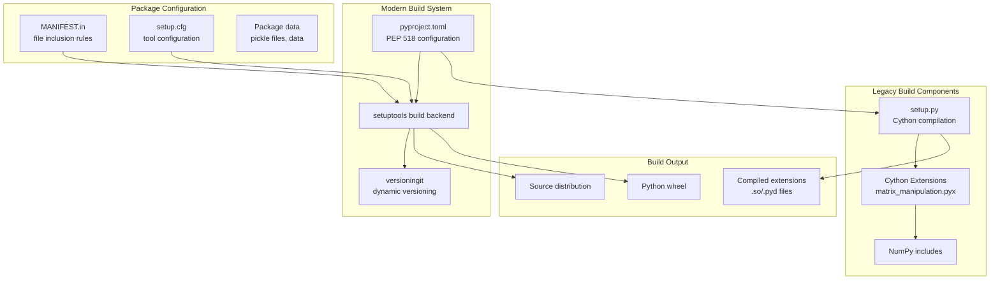
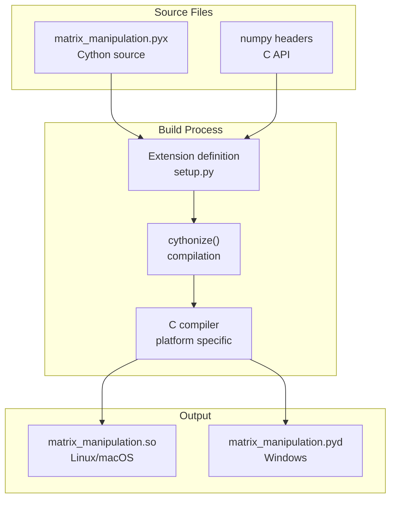
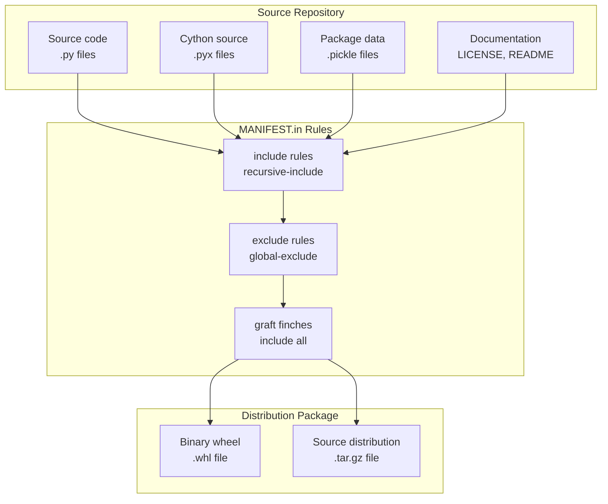
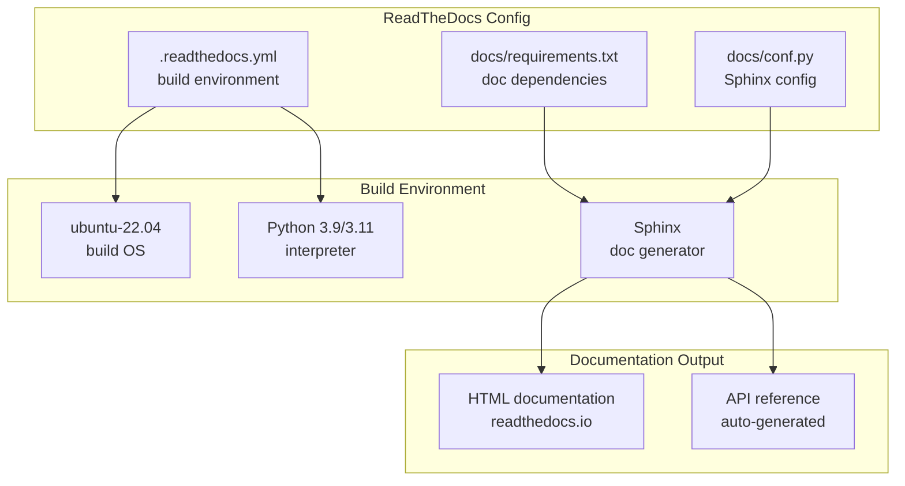

# Build and Packaging

> **Relevant source files**
> * [.readthedocs.yml](https://github.com/idptools/finches/blob/5b52ba40/.readthedocs.yml)
> * [MANIFEST.in](https://github.com/idptools/finches/blob/5b52ba40/MANIFEST.in)
> * [pyproject.toml](https://github.com/idptools/finches/blob/5b52ba40/pyproject.toml)
> * [readthedocs.yml](https://github.com/idptools/finches/blob/5b52ba40/readthedocs.yml)
> * [setup.cfg](https://github.com/idptools/finches/blob/5b52ba40/setup.cfg)
> * [setup.py](https://github.com/idptools/finches/blob/5b52ba40/setup.py)

This document covers the build system, packaging configuration, and distribution mechanisms for FINCHES. It explains how the project is structured for development, built into distributable packages, and deployed to users.

For information about testing and development workflows, see page [7.1](/idptools/finches/7.1-testing-framework). For details about the core computational modules being packaged, see page [4.3](/idptools/finches/4.3-matrix-calculations).

## Build System Architecture

FINCHES uses a hybrid build system that combines modern Python packaging standards with legacy components required for Cython compilation. The system is configured to handle both pure Python modules and compiled Cython extensions.

### Build System Components



**Build System Flow**
The build process starts with `pyproject.toml` defining build requirements and metadata, while `setup.py` handles the specialized Cython compilation step.

Sources: [pyproject.toml L1-L8](https://github.com/idptools/finches/blob/5b52ba40/pyproject.toml#L1-L8)

 [setup.py L6-L30](https://github.com/idptools/finches/blob/5b52ba40/setup.py#L6-L30)

## Modern Python Packaging Configuration

The primary build configuration uses `pyproject.toml` following PEP 518 standards for declarative project metadata and build system specification.

### Project Metadata and Dependencies

| Configuration Section | Purpose | Key Elements |
| --- | --- | --- |
| `[build-system]` | Build tool requirements | setuptools, wheel, versioningit, cython, numpy |
| `[project]` | Package metadata | name, description, authors, license, dependencies |
| `[project.optional-dependencies]` | Optional extras | test dependencies (pytest) |
| `[tool.setuptools]` | Package discovery | include patterns, package data |

The build system requires Cython and NumPy at build time due to the compiled extensions:

```
requires = ["setuptools>=61.0", "wheel", "versioningit~=2.0", "cython", "numpy"]
```

Runtime dependencies include scientific computing libraries and domain-specific tools:

```
dependencies = ["numpy", "afrc>=0.3.4", "scipy", "soursop>=0.2.4", "pandas", "metapredict", "ipython"]
```

Sources: [pyproject.toml L1-L31](https://github.com/idptools/finches/blob/5b52ba40/pyproject.toml#L1-L31)

 [pyproject.toml L38-L42](https://github.com/idptools/finches/blob/5b52ba40/pyproject.toml#L38-L42)

### Package Discovery and Data Inclusion

The package discovery configuration automatically finds all subpackages within the `finches` namespace:

```
[tool.setuptools.packages.find]include = ["finches", "finches.*"]
```

Package data inclusion is configured to include type information:

```
[tool.setuptools.package-data]finches = ["py.typed"]
```

Sources: [pyproject.toml L48-L58](https://github.com/idptools/finches/blob/5b52ba40/pyproject.toml#L48-L58)

## Cython Extension Compilation

FINCHES includes performance-critical code written in Cython that must be compiled during the build process. The `setup.py` file handles this compilation step.

### Extension Module Configuration



**Cython Extension Build Flow**
The Cython source file is compiled into a platform-specific binary extension that provides optimized matrix operations.

The extension is defined in `setup.py` with NumPy includes for array operations:

```
extensions = [    Extension(        "finches.utils.matrix_manipulation",        [cython_file],        include_dirs=[numpy.get_include()],     )]
```

Sources: [setup.py L12-L23](https://github.com/idptools/finches/blob/5b52ba40/setup.py#L12-L23)

 [setup.py L25-L30](https://github.com/idptools/finches/blob/5b52ba40/setup.py#L25-L30)

## Version Management

FINCHES uses `versioningit` for automatic version generation from Git tags and commits. This provides consistent versioning across development and release cycles.

### Version Configuration

The version management system is configured in `pyproject.toml`:

```
[tool.versioningit]default-version = "1+unknown" [tool.versioningit.format]distance = "{base_version}+{distance}.{vcs}{rev}"dirty = "{base_version}+{distance}.{vcs}{rev}.dirty" [tool.versioningit.vcs]method = "git"match = ["*"]default-tag = "1.0.0"
```

The version information is written to `finches/_version.py` at build time, making it available to the package at runtime.

Sources: [pyproject.toml L60-L76](https://github.com/idptools/finches/blob/5b52ba40/pyproject.toml#L60-L76)

## Package Data and Distribution

The build system carefully controls which files are included in the distribution through `MANIFEST.in` and package data configuration.

### File Inclusion Rules



**Package Data Inclusion Flow**
Files are selectively included based on `MANIFEST.in` rules, ensuring only necessary files are distributed.

Key inclusion rules:

* All `.pyx` files are included recursively
* All `.pickle` files containing model parameters are included
* All data under `finches/data/` is included
* Temporary files (`.pyc`, `__pycache__`, `.so`) are excluded

Sources: [MANIFEST.in L6-L16](https://github.com/idptools/finches/blob/5b52ba40/MANIFEST.in#L6-L16)

## Documentation Building

FINCHES documentation is built automatically using ReadTheDocs with Sphinx. The configuration supports the project's scientific computing dependencies.

### ReadTheDocs Configuration



**Documentation Build Pipeline**
ReadTheDocs automatically builds documentation from the repository, handling scientific dependencies and Sphinx configuration.

The build environment is configured for Ubuntu 22.04 with Python 3.9, and documentation dependencies are specified separately from the main package requirements.

Sources: [.readthedocs.yml L1-L18](https://github.com/idptools/finches/blob/5b52ba40/.readthedocs.yml#L1-L18)

 [readthedocs.yml L1-L15](https://github.com/idptools/finches/blob/5b52ba40/readthedocs.yml#L1-L15)

## Development Configuration

Additional build and development tool configuration is provided through `setup.cfg` for consistency across development environments.

### Tool Configuration

The configuration includes settings for:

* **Coverage reporting**: Omits test files and generated version files
* **Code formatting**: YAPF configuration with 119 character line limit
* **Linting**: Flake8 configuration matching the formatting settings
* **Test execution**: Pytest integration with setup.py

Key configuration example:

```
[yapf]COLUMN_LIMIT = 119INDENT_WIDTH = 4USE_TABS = False
```

Sources: [setup.cfg L1-L24](https://github.com/idptools/finches/blob/5b52ba40/setup.cfg#L1-L24)

## Build Commands and Workflow

The build system supports standard Python packaging commands for development and distribution:

| Command | Purpose | Output |
| --- | --- | --- |
| `python -m build` | Create distribution packages | wheel and source distribution |
| `pip install -e .` | Development installation | Editable install with Cython compilation |
| `python setup.py build_ext --inplace` | Compile Cython only | In-place compiled extensions |
| `pip install .` | Standard installation | Compiled package installation |

The development workflow typically involves editable installation for active development, with the build system automatically handling Cython compilation when source files change.

Sources: [pyproject.toml L1-L76](https://github.com/idptools/finches/blob/5b52ba40/pyproject.toml#L1-L76)

 [setup.py L1-L32](https://github.com/idptools/finches/blob/5b52ba40/setup.py#L1-L32)