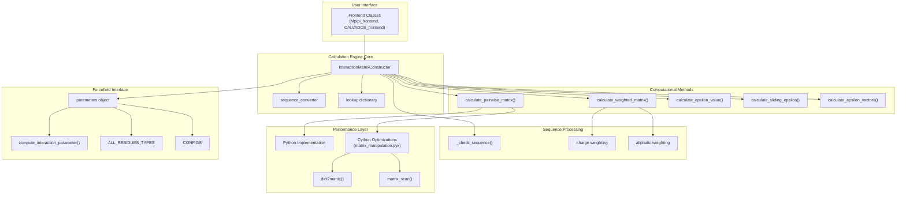
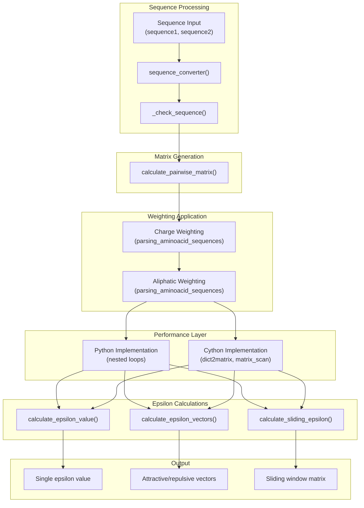

# Calculation Engine

> **Relevant source files**
> * [.gitignore](https://github.com/idptools/finches/blob/5b52ba40/.gitignore)
> * [finches/data/forcefield_dependencies.py](https://github.com/idptools/finches/blob/5b52ba40/finches/data/forcefield_dependencies.py)
> * [finches/epsilon_calculation.py](https://github.com/idptools/finches/blob/5b52ba40/finches/epsilon_calculation.py)
> * [finches/utils/matrix_manipulation.pyx](https://github.com/idptools/finches/blob/5b52ba40/finches/utils/matrix_manipulation.pyx)

This document provides API reference for the core calculation engine of FINCHES, specifically the `InteractionMatrixConstructor` class and its associated computational functions. The calculation engine serves as the computational hub that performs inter-residue interaction calculations, matrix operations, and epsilon value computations using various forcefield models.

For information about the frontend interfaces that provide simplified access to these calculations, see [Frontend Classes](/idptools/finches/5.1-frontend-classes). For details about the forcefield models themselves, see [Core Concepts - Forcefield Models](/idptools/finches/4.1-forcefield-models). For structure analysis utilities, see [Structure Analysis](/idptools/finches/5.3-structure-analysis).

## Core Architecture

The calculation engine implements a modular design pattern where forcefield models are decoupled from the computational logic through a standardized interface.

### Calculation Engine Architecture

**Sources:** [finches/epsilon_calculation.py L18-L165](https://github.com/idptools/finches/blob/5b52ba40/finches/epsilon_calculation.py#L18-L165)

## InteractionMatrixConstructor Class

The `InteractionMatrixConstructor` is the primary class that houses all calculation functionality. It implements an interface design pattern that allows different forcefield models to be used interchangeably.

### Constructor Parameters

| Parameter | Type | Description |
| --- | --- | --- |
| `parameters` | forcefield object | Instance of a forcefield class (e.g., `Mpipi_model`, `calvados_model`) |
| `sequence_converter` | function | Optional function to convert sequences before calculation |
| `charge_prefactor` | float | Scaling factor for charge weighting (0-1) |
| `null_interaction_baseline` | float | Threshold for attractive/repulsive interactions |
| `compute_forcefield_dependencies` | bool | Whether to recompute missing parameters |

**Sources:** [finches/epsilon_calculation.py L20-L132](https://github.com/idptools/finches/blob/5b52ba40/finches/epsilon_calculation.py#L20-L132)

### Required Forcefield Interface

All forcefield objects passed to `InteractionMatrixConstructor` must implement:

* `ALL_RESIDUES_TYPES`: List of valid residue types per sequence type
* `compute_interaction_parameter(r1, r2)`: Function returning interaction parameters for residue pairs
* `CONFIGS`: Dictionary with default `charge_prefactor` and `null_interaction_baseline` values

**Sources:** [finches/epsilon_calculation.py L75-L90](https://github.com/idptools/finches/blob/5b52ba40/finches/epsilon_calculation.py#L75-L90)

## Matrix Calculation Methods

### Basic Matrix Calculations

#### calculate_pairwise_homotypic_matrix(sequence, convert_to_custom=True)

Calculates the raw interaction matrix for a single sequence against itself without weighting factors.

**Parameters:**

* `sequence` (str): Amino acid sequence
* `convert_to_custom` (bool): Whether to apply sequence conversion

**Returns:** `np.array` of shape (n, n) with pairwise interaction values

**Sources:** [finches/epsilon_calculation.py L396-L422](https://github.com/idptools/finches/blob/5b52ba40/finches/epsilon_calculation.py#L396-L422)

#### calculate_pairwise_heterotypic_matrix(sequence1, sequence2, convert_to_custom=True, use_cython=True)

Calculates the raw interaction matrix between two different sequences.

**Parameters:**

* `sequence1`, `sequence2` (str): Amino acid sequences to compare
* `convert_to_custom` (bool): Whether to apply sequence conversion
* `use_cython` (bool): Whether to use Cython optimization (3.5x faster)

**Returns:** `np.array` of shape (len(seq1), len(seq2)) with pairwise interaction values

**Sources:** [finches/epsilon_calculation.py L426-L488](https://github.com/idptools/finches/blob/5b52ba40/finches/epsilon_calculation.py#L426-L488)

#### calculate_weighted_pairwise_matrix(sequence1, sequence2, **kwargs)

Calculates interaction matrix with optional charge and aliphatic weighting applied.

**Key Parameters:**

* `use_charge_weighting` (bool): Apply local charge context weighting
* `use_aliphatic_weighting` (bool): Apply aliphatic residue patch weighting
* `charge_prefactor` (float): Override default charge scaling

**Returns:** `np.array` with weighted interaction values

**Sources:** [finches/epsilon_calculation.py L494-L603](https://github.com/idptools/finches/blob/5b52ba40/finches/epsilon_calculation.py#L494-L603)

## Epsilon Calculation Methods

### Matrix Calculation Pipeline

**Sources:** [finches/epsilon_calculation.py L614-L872](https://github.com/idptools/finches/blob/5b52ba40/finches/epsilon_calculation.py#L614-L872)

 [finches/utils/matrix_manipulation.pyx L14-L150](https://github.com/idptools/finches/blob/5b52ba40/finches/utils/matrix_manipulation.pyx#L14-L150)

### calculate_epsilon_value(sequence1, sequence2, **kwargs)

Calculates the overall epsilon value between two sequences using the stateless implementation.

**Parameters:**

* `sequence1`, `sequence2` (str): Sequences to compare
* `use_charge_weighting` (bool): Apply charge weighting
* `use_aliphatic_weighting` (bool): Apply aliphatic weighting

**Returns:** `float` representing average sequence-sequence interaction strength

**Sources:** [finches/epsilon_calculation.py L660-L701](https://github.com/idptools/finches/blob/5b52ba40/finches/epsilon_calculation.py#L660-L701)

### calculate_epsilon_vectors(sequence1, sequence2, **kwargs)

Returns separate attractive and repulsive interaction vectors for the sequence pair.

**Returns:** `tuple` of two lists (attractive_vector, repulsive_vector)

**Sources:** [finches/epsilon_calculation.py L614-L656](https://github.com/idptools/finches/blob/5b52ba40/finches/epsilon_calculation.py#L614-L656)

### calculate_sliding_epsilon(sequence1, sequence2, window_size=31, **kwargs)

Performs sliding window analysis to generate a 2D interaction map with smoothed epsilon values.

**Parameters:**

* `window_size` (int): Size of sliding window (automatically rounded to odd number)
* Other weighting parameters as above

**Returns:** `tuple` of (epsilon_matrix, seq1_indices, seq2_indices) where indices are in protein space (1-based)

**Important Notes:**

* Edges depend on window size due to no padding
* Cython implementation reduces computation time to ~8% of Python version
* Matrix positions index in protein space (first residue = 1)

**Sources:** [finches/epsilon_calculation.py L705-L872](https://github.com/idptools/finches/blob/5b52ba40/finches/epsilon_calculation.py#L705-L872)

## Performance Optimizations

### Cython Implementation

The calculation engine includes Cython optimizations for computationally intensive operations:

#### dict2matrix(seq1, seq2, lookup)

Converts the residue-residue lookup dictionary into a numpy matrix with significant performance improvement.

**Sources:** [finches/utils/matrix_manipulation.pyx L14-L28](https://github.com/idptools/finches/blob/5b52ba40/finches/utils/matrix_manipulation.pyx#L14-L28)

#### matrix_scan(w_matrix, window_size, null_interaction_baseline)

Performs sliding window epsilon calculation with ~8% of the time required by the Python implementation.

**Features:**

* Pre-allocated matrices to minimize memory allocation
* Manual loop unrolling for attractive/repulsive matrix construction
* Direct C compilation for maximum performance

**Sources:** [finches/utils/matrix_manipulation.pyx L33-L150](https://github.com/idptools/finches/blob/5b52ba40/finches/utils/matrix_manipulation.pyx#L33-L150)

### Performance Selection

Most methods include a `use_cython` parameter that defaults to `True`. The Cython implementations provide substantial performance improvements:

* Matrix generation: ~3.5x faster
* Sliding window calculations: ~12x faster (8% of Python time)

**Sources:** [finches/epsilon_calculation.py L440-L444](https://github.com/idptools/finches/blob/5b52ba40/finches/epsilon_calculation.py#L440-L444)

 [finches/epsilon_calculation.py L831-L833](https://github.com/idptools/finches/blob/5b52ba40/finches/epsilon_calculation.py#L831-L833)

## Internal Validation and Utilities

### Sequence Validation

#### _check_sequence(sequence)

Validates that input sequences contain only residues from a single valid residue group and that all residues are recognized by the forcefield.

**Validation Rules:**

* All residues must belong to one of the `valid_residue_groups`
* A single sequence cannot mix residues from different groups
* All residues must have interaction parameters in the forcefield

**Sources:** [finches/epsilon_calculation.py L302-L351](https://github.com/idptools/finches/blob/5b52ba40/finches/epsilon_calculation.py#L302-L351)

### Parameter Management

#### _update_parameters(new_parameters)

Updates the forcefield parameters and rebuilds the lookup dictionary. Does not update `charge_prefactor`, `sequence_converter`, or `null_interaction_baseline`.

#### _update_lookup_dict(unknown_set_to_zero=False)

Rebuilds the residue-residue interaction lookup table from the current forcefield parameters.

**Sources:** [finches/epsilon_calculation.py L195-L252](https://github.com/idptools/finches/blob/5b52ba40/finches/epsilon_calculation.py#L195-L252)

 [finches/epsilon_calculation.py L257-L296](https://github.com/idptools/finches/blob/5b52ba40/finches/epsilon_calculation.py#L257-L296)

## Forcefield Dependencies

The calculation engine relies on the `forcefield_dependencies` module for parameter calibration:

### get_null_interaction_baseline(X_model, lower_end=-10.0, upper_end=10.0)

Calibrates the null interaction baseline by finding the value that gives epsilon=0 for a GS repeat sequence, which should behave as a Gaussian chain.

**Uses:** `scipy.optimize.root_scalar` to solve for the baseline value

**Sources:** [finches/data/forcefield_dependencies.py L17-L68](https://github.com/idptools/finches/blob/5b52ba40/finches/data/forcefield_dependencies.py#L17-L68)