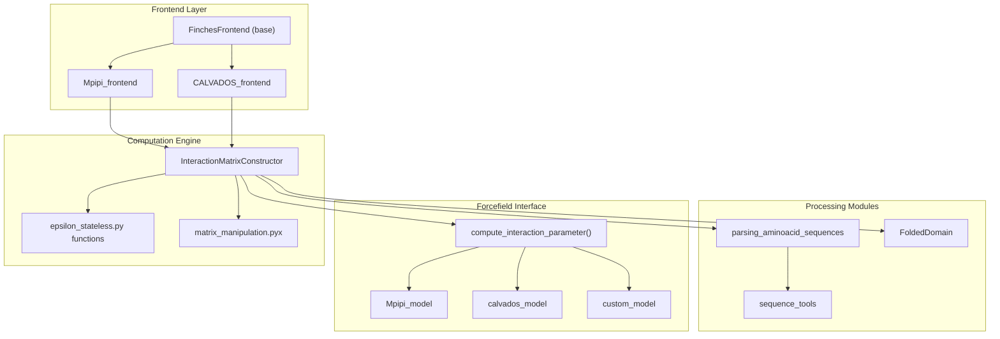
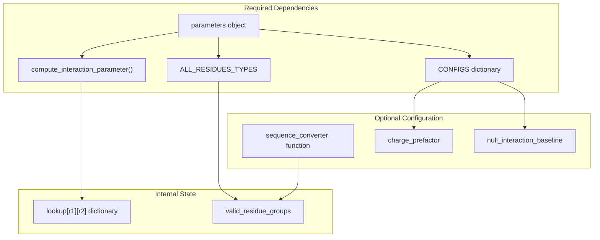
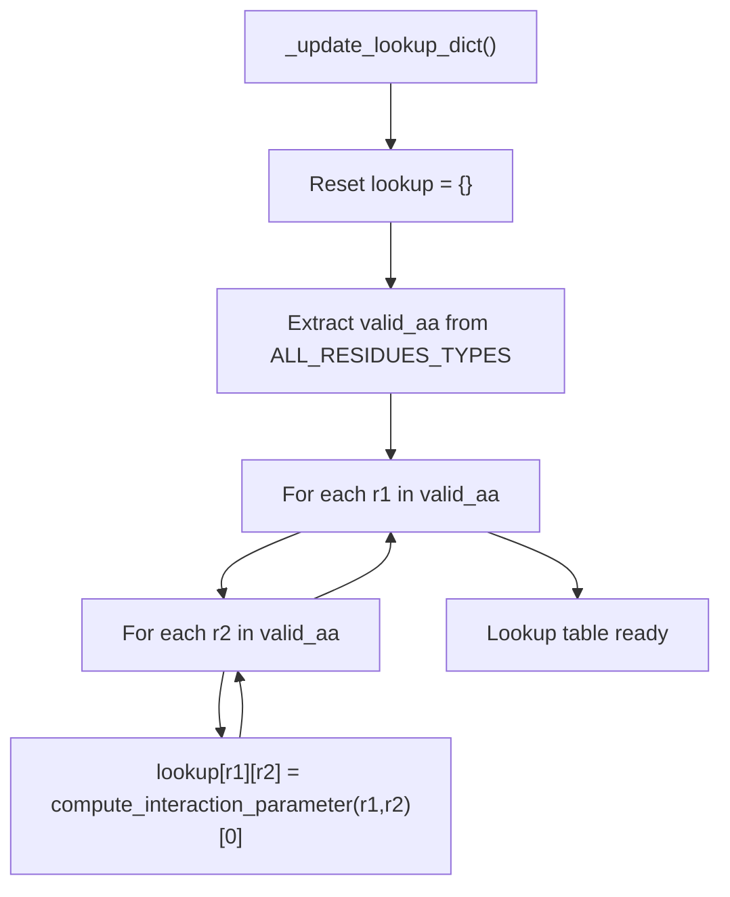
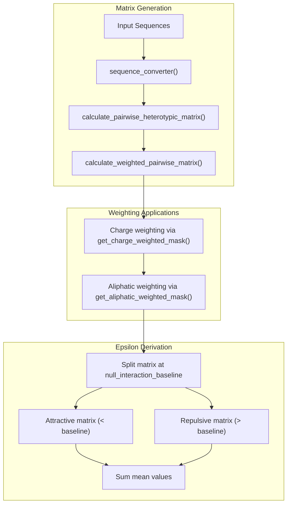
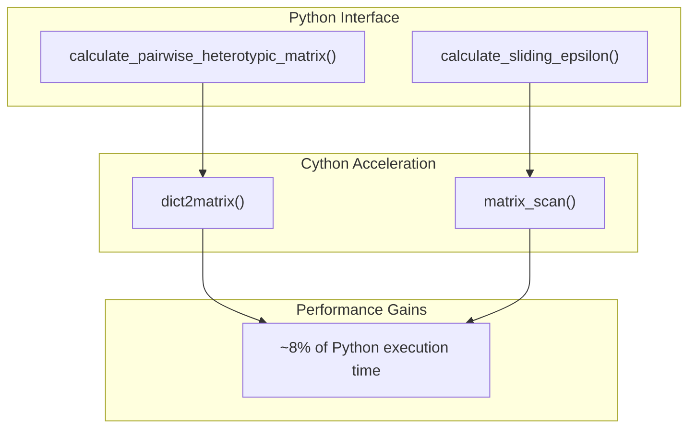

# Core Concepts

> **Relevant source files**
> * [docs/extended_methods.rst](https://github.com/idptools/finches/blob/5b52ba40/docs/extended_methods.rst)
> * [finches/data/forcefield_dependencies.py](https://github.com/idptools/finches/blob/5b52ba40/finches/data/forcefield_dependencies.py)
> * [finches/epsilon_calculation.py](https://github.com/idptools/finches/blob/5b52ba40/finches/epsilon_calculation.py)

This document provides a deep dive into the fundamental concepts and algorithms underlying FINCHES calculations. It covers the core computational architecture, the central role of the `InteractionMatrixConstructor`, the forcefield interface pattern, matrix-based calculations, and sequence weighting mechanisms.

For detailed information about specific forcefield implementations, see [Forcefield Models](/idptools/finches/4.1-forcefield-models). For sequence processing specifics, see [Sequence Processing](/idptools/finches/4.2-sequence-processing). For matrix optimization details, see [Matrix Calculations](/idptools/finches/4.3-matrix-calculations).

## Computational Architecture Overview

FINCHES employs a layered architecture where user-facing frontend classes delegate to a central computational engine, which in turn utilizes pluggable forcefield models and optimized matrix operations.

### Core Architecture Mapping

**Sources:** [finches/epsilon_calculation.py L18-L132](https://github.com/idptools/finches/blob/5b52ba40/finches/epsilon_calculation.py#L18-L132)

 [docs/extended_methods.rst L7-L10](https://github.com/idptools/finches/blob/5b52ba40/docs/extended_methods.rst#L7-L10)

## InteractionMatrixConstructor - The Central Engine

The `InteractionMatrixConstructor` class serves as the primary computational hub, implementing a standardized interface for calculating inter-residue interactions regardless of the underlying forcefield model.

### Core Responsibilities

The `InteractionMatrixConstructor` implements several key computational workflows:

| Method | Purpose | Returns |
| --- | --- | --- |
| `calculate_pairwise_heterotypic_matrix()` | Raw residue-residue interaction matrix | numpy array (len(seq1) × len(seq2)) |
| `calculate_weighted_pairwise_matrix()` | Matrix with charge/aliphatic weighting | numpy array with applied corrections |
| `calculate_epsilon_value()` | Single scalar interaction strength | float (attractive < 0, repulsive > 0) |
| `calculate_sliding_epsilon()` | Local interaction map via sliding windows | tuple (matrix, seq1_indices, seq2_indices) |

**Sources:** [finches/epsilon_calculation.py L396-L873](https://github.com/idptools/finches/blob/5b52ba40/finches/epsilon_calculation.py#L396-L873)

### Initialization and Dependencies

The constructor requires a forcefield parameters object and accepts several configuration options:

**Sources:** [finches/epsilon_calculation.py L20-L191](https://github.com/idptools/finches/blob/5b52ba40/finches/epsilon_calculation.py#L20-L191)

 [finches/epsilon_calculation.py L195-L297](https://github.com/idptools/finches/blob/5b52ba40/finches/epsilon_calculation.py#L195-L297)

## Forcefield Interface Pattern

FINCHES uses an interface design pattern to decouple biophysical models from computational algorithms. This allows the same analysis code to work with different underlying force fields.

### Required Interface Methods

Every forcefield object must implement:

* `ALL_RESIDUES_TYPES`: List of valid residue groups (proteins, DNA, RNA)
* `compute_interaction_parameter(r1, r2)`: Returns interaction strength between residues
* `CONFIGS`: Dictionary containing `charge_prefactor` and `null_interaction_baseline`

**Sources:** [finches/epsilon_calculation.py L75-L90](https://github.com/idptools/finches/blob/5b52ba40/finches/epsilon_calculation.py#L75-L90)

### Lookup Table Construction

The `_update_lookup_dict()` method precomputes all pairwise interactions for performance:

**Sources:** [finches/epsilon_calculation.py L195-L252](https://github.com/idptools/finches/blob/5b52ba40/finches/epsilon_calculation.py#L195-L252)

## Matrix-Based Epsilon Calculations

FINCHES calculates epsilon values through a multi-step matrix-based approach, separating raw interaction calculation from weighting and aggregation.

### Epsilon Calculation Pipeline

**Sources:** [finches/epsilon_calculation.py L494-L603](https://github.com/idptools/finches/blob/5b52ba40/finches/epsilon_calculation.py#L494-L603)

 [docs/extended_methods.rst L13-L16](https://github.com/idptools/finches/blob/5b52ba40/docs/extended_methods.rst#L13-L16)

### Sliding Window Analysis

For interaction maps, FINCHES extracts subsquares from the full matrix and calculates local epsilon values:

* Window size must be odd (automatically corrected if even)
* Each subsquare treated as local `M^{raw-local}` matrix
* Uniform sampling with step size of 1
* Output indices account for window centering

**Sources:** [finches/epsilon_calculation.py L705-L873](https://github.com/idptools/finches/blob/5b52ba40/finches/epsilon_calculation.py#L705-L873)

 [docs/extended_methods.rst L18-L23](https://github.com/idptools/finches/blob/5b52ba40/docs/extended_methods.rst#L18-L23)

## Sequence Weighting Mechanisms

FINCHES applies two types of sequence-context weighting to capture local environmental effects.

### Charge Weighting Implementation

The charge correction downweighs repulsion between like-charged residues:

1. **Fragment Analysis**: For charged residue pairs, extract i±1 neighbors (4-6 residues total)
2. **Metrics Calculation**: Compute FCR (fraction charged) and NCPR (net charge per residue)
3. **Weighting Factor**: `|NCPR/FCR|` where same charges = 1, opposite charges = 0
4. **Scaling**: Apply forcefield-specific `charge_prefactor` (0-1 range)

The implementation reduces repulsive interactions: `w_matrix = matrix - (matrix * repulsive_mask * charge_prefactor)`

**Sources:** [finches/epsilon_calculation.py L546-L577](https://github.com/idptools/finches/blob/5b52ba40/finches/epsilon_calculation.py#L546-L577)

 [docs/extended_methods.rst L30-L38](https://github.com/idptools/finches/blob/5b52ba40/docs/extended_methods.rst#L30-L38)

### Aliphatic Weighting

Applied after charge weighting via `get_aliphatic_weighted_mask()` to enhance hydrophobic clustering effects.

**Sources:** [finches/epsilon_calculation.py L597-L599](https://github.com/idptools/finches/blob/5b52ba40/finches/epsilon_calculation.py#L597-L599)

## Performance Architecture

FINCHES employs strategic optimizations for computationally intensive operations.

### Cython Integration

The `use_cython=True` flag (default) enables optimized implementations in `matrix_manipulation.pyx` for matrix construction and sliding window analysis.

**Sources:** [finches/epsilon_calculation.py L440-L444](https://github.com/idptools/finches/blob/5b52ba40/finches/epsilon_calculation.py#L440-L444)

 [finches/epsilon_calculation.py L476-L477](https://github.com/idptools/finches/blob/5b52ba40/finches/epsilon_calculation.py#L476-L477)

 [finches/epsilon_calculation.py L831-L833](https://github.com/idptools/finches/blob/5b52ba40/finches/epsilon_calculation.py#L831-L833)

### Lookup Table Caching

All pairwise interactions are precomputed once during initialization and stored in `self.lookup[r1][r2]` for O(1) access during matrix construction.

**Sources:** [finches/epsilon_calculation.py L149](https://github.com/idptools/finches/blob/5b52ba40/finches/epsilon_calculation.py#L149-L149)

 [finches/epsilon_calculation.py L219-L237](https://github.com/idptools/finches/blob/5b52ba40/finches/epsilon_calculation.py#L219-L237)