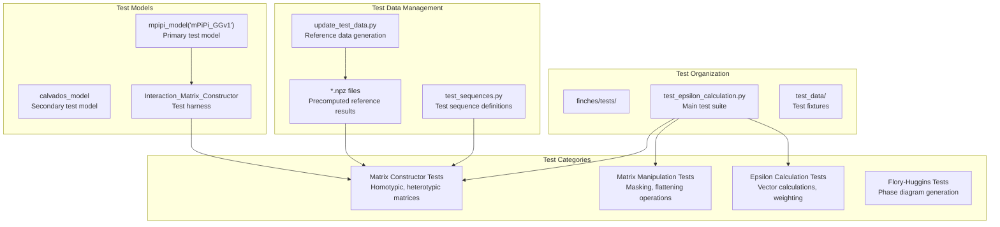
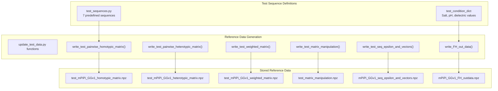

# Development Guide

> **Relevant source files**
> * [MANIFEST.in](https://github.com/idptools/finches/blob/5b52ba40/MANIFEST.in)
> * [finches/tests/test_data/test_sequences.py](https://github.com/idptools/finches/blob/5b52ba40/finches/tests/test_data/test_sequences.py)
> * [finches/tests/test_data/update_test_data.py](https://github.com/idptools/finches/blob/5b52ba40/finches/tests/test_data/update_test_data.py)
> * [finches/tests/test_epsilon_calculation.py](https://github.com/idptools/finches/blob/5b52ba40/finches/tests/test_epsilon_calculation.py)
> * [pyproject.toml](https://github.com/idptools/finches/blob/5b52ba40/pyproject.toml)
> * [setup.cfg](https://github.com/idptools/finches/blob/5b52ba40/setup.cfg)
> * [setup.py](https://github.com/idptools/finches/blob/5b52ba40/setup.py)

This document provides essential information for developers contributing to the FINCHES codebase. It covers the build system, testing framework, packaging configuration, and development workflow. For information about using FINCHES as an end user, see [User Guide](/idptools/finches/3-user-guide). For detailed API documentation, see [API Reference](/idptools/finches/5-api-reference).

## Development Environment Overview

FINCHES uses a modern Python packaging approach with `pyproject.toml` configuration and Cython extensions for performance-critical components. The development workflow centers around pytest for testing and setuptools for building.

### Build System Architecture


The build system follows modern Python packaging standards while accommodating legacy Cython compilation requirements.

**Sources:** [pyproject.toml L1-L76](https://github.com/idptools/finches/blob/5b52ba40/pyproject.toml#L1-L76)

 [setup.py L1-L32](https://github.com/idptools/finches/blob/5b52ba40/setup.py#L1-L32)

 [MANIFEST.in L1-L17](https://github.com/idptools/finches/blob/5b52ba40/MANIFEST.in#L1-L17)

### Package Configuration Details

| Configuration File | Purpose | Key Components |
| --- | --- | --- |
| `pyproject.toml` | Primary package metadata | Dependencies, build backend, version config |
| `setup.py` | Cython extension compilation | Extension definition, numpy integration |
| `MANIFEST.in` | Package file inclusion | Data files, Cython sources, exclusions |
| `setup.cfg` | Tool configurations | Coverage, code formatting, test aliases |

The package uses `versioningit` for automatic version management based on Git tags and commits, writing version information to `finches/_version.py`.

**Sources:** [pyproject.toml L60-L76](https://github.com/idptools/finches/blob/5b52ba40/pyproject.toml#L60-L76)

 [setup.cfg L1-L24](https://github.com/idptools/finches/blob/5b52ba40/setup.cfg#L1-L24)

## Testing Framework Architecture



The testing framework uses regression testing against precomputed reference data stored in NumPy archives.

**Sources:** [finches/tests/test_epsilon_calculation.py L1-L187](https://github.com/idptools/finches/blob/5b52ba40/finches/tests/test_epsilon_calculation.py#L1-L187)

 [finches/tests/test_data/test_sequences.py L1-L21](https://github.com/idptools/finches/blob/5b52ba40/finches/tests/test_data/test_sequences.py#L1-L21)

### Test Data Management

The test suite relies on a sophisticated data management system for regression testing:



**Critical Note:** The `update_test_data.py` functions can overwrite reference data. Use with extreme caution to avoid invalidating the test suite.

**Sources:** [finches/tests/test_data/update_test_data.py L1-L204](https://github.com/idptools/finches/blob/5b52ba40/finches/tests/test_data/update_test_data.py#L1-L204)

 [finches/tests/test_data/test_sequences.py L11-L20](https://github.com/idptools/finches/blob/5b52ba40/finches/tests/test_data/test_sequences.py#L11-L20)

## Core Test Categories

### Matrix Construction Tests

Tests for the `Interaction_Matrix_Constructor` class verify fundamental matrix operations:

* **Homotypic matrices:** Self-interaction calculations using `calculate_pairwise_homotypic_matrix()`
* **Heterotypic matrices:** Cross-interaction calculations using `calculate_pairwise_heterotypic_matrix()`
* **Weighted matrices:** Charge and aliphatic weighting using `calculate_weighted_pairwise_matrix()`

### Matrix Manipulation Tests

Tests for core matrix processing functions in `epsilon_calculation` module:

* **Attractive/repulsive separation:** `get_attractive_repulsive_matrixes()` with threshold `-0.15`
* **Matrix masking:** `mask_matrix()` with binary masks
* **Vector flattening:** `flatten_matrix_to_vector()` with orientation parameters

### Epsilon Calculation Tests

Tests for sequence-level epsilon value calculations:

* **Vector generation:** `get_sequence_epsilon_vectors()` with various weighting options
* **Prefactor handling:** Custom prefactor and baseline parameters
* **Weighting variations:** Charge weighting and aliphatic weighting toggles

**Sources:** [finches/tests/test_epsilon_calculation.py L15-L187](https://github.com/idptools/finches/blob/5b52ba40/finches/tests/test_epsilon_calculation.py#L15-L187)

## Development Workflow

### Setting Up Development Environment

1. **Clone and install in development mode:**

```
git clone https://github.com/idptools/finchescd finchespip install -e ".[test]"
```

1. **Run the test suite:**

```
pytest finches/tests/
```

1. **Build Cython extensions explicitly:**

```
python setup.py build_ext --inplace
```

### Key Development Files

| File Path | Purpose | When to Modify |
| --- | --- | --- |
| `pyproject.toml` | Package metadata, dependencies | Adding dependencies, changing build config |
| `setup.py` | Cython compilation | Modifying Cython extensions |
| `finches/tests/test_epsilon_calculation.py` | Main test suite | Adding new functionality tests |
| `finches/tests/test_data/test_sequences.py` | Test sequences | Adding new test cases |

### Adding New Tests

When adding new functionality:

1. **Add test sequences** to `test_sequences.py` if needed
2. **Generate reference data** using appropriate `update_test_data.py` functions
3. **Write test functions** in `test_epsilon_calculation.py` following existing patterns
4. **Verify** tests pass with `pytest finches/tests/test_your_new_test.py`

### Modifying Cython Code

For changes to `finches/utils/matrix_manipulation.pyx`:

1. **Modify the `.pyx` file**
2. **Recompile:** `python setup.py build_ext --inplace`
3. **Run performance-critical tests** to verify functionality
4. **Update reference data** if computational results change

**Sources:** [setup.py L12-L23](https://github.com/idptools/finches/blob/5b52ba40/setup.py#L12-L23)

 [MANIFEST.in L6-L8](https://github.com/idptools/finches/blob/5b52ba40/MANIFEST.in#L6-L8)

## Package Distribution

The package uses modern Python packaging with backward compatibility for Cython:

* **Build backend:** `setuptools.build_meta`
* **Version management:** Git-based via `versioningit`
* **License:** CC BY-NC 4.0 (non-commercial)
* **Python compatibility:** >=3.7

The `MANIFEST.in` ensures all necessary files are included in distributions, including Cython sources, pickle parameter files, and reference data.

**Sources:** [pyproject.toml L1-L31](https://github.com/idptools/finches/blob/5b52ba40/pyproject.toml#L1-L31)

 [MANIFEST.in L6-L16](https://github.com/idptools/finches/blob/5b52ba40/MANIFEST.in#L6-L16)