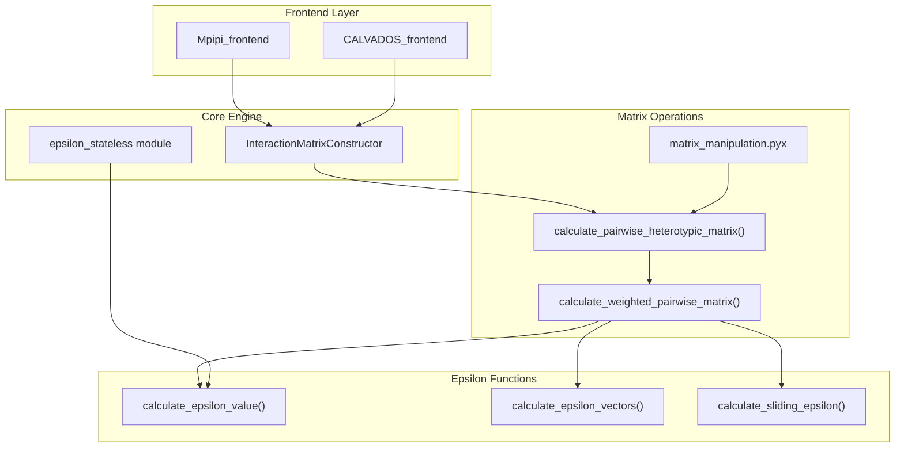
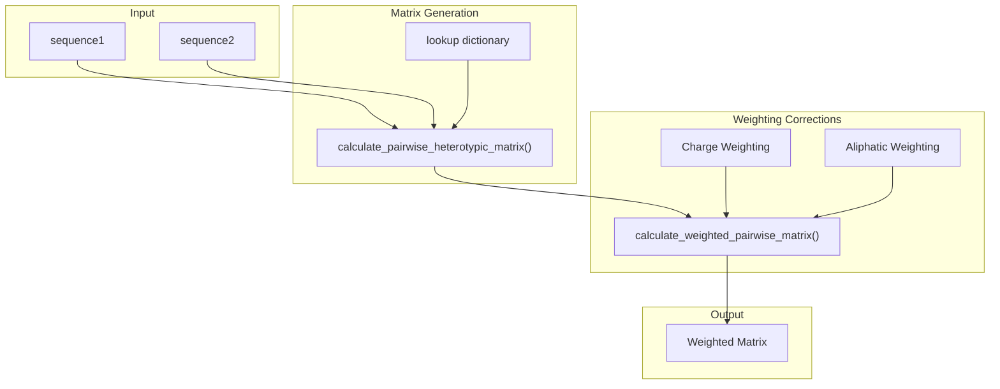
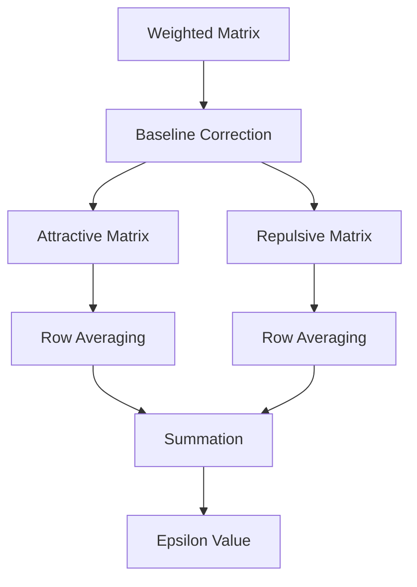
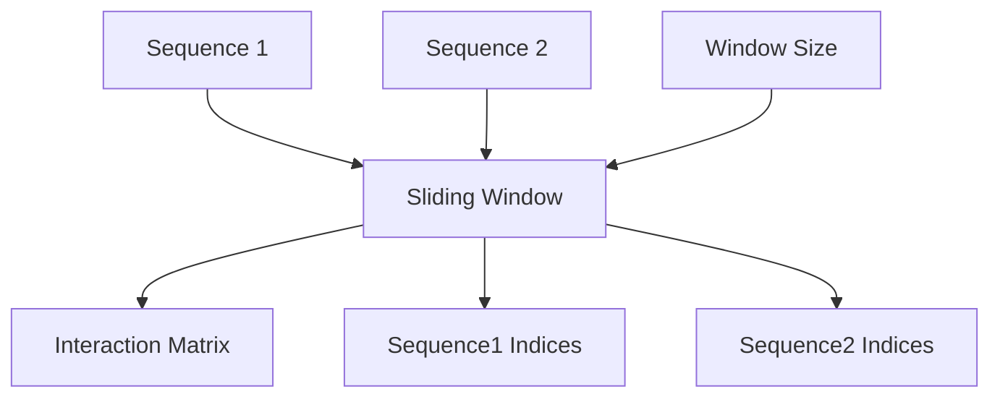

# Epsilon Calculations

> **Relevant source files**
> * [demo/docs_demo/ADBD1.pdb](https://github.com/idptools/finches/blob/5b52ba40/demo/docs_demo/ADBD1.pdb)
> * [demo/docs_demo/epsilon_docs.ipynb](https://github.com/idptools/finches/blob/5b52ba40/demo/docs_demo/epsilon_docs.ipynb)
> * [docs/acknowledgements.rst](https://github.com/idptools/finches/blob/5b52ba40/docs/acknowledgements.rst)
> * [docs/background.rst](https://github.com/idptools/finches/blob/5b52ba40/docs/background.rst)
> * [docs/epsilon.rst](https://github.com/idptools/finches/blob/5b52ba40/docs/epsilon.rst)
> * [docs/general_caveats.rst](https://github.com/idptools/finches/blob/5b52ba40/docs/general_caveats.rst)
> * [finches/data/forcefield_dependencies.py](https://github.com/idptools/finches/blob/5b52ba40/finches/data/forcefield_dependencies.py)
> * [finches/epsilon_calculation.py](https://github.com/idptools/finches/blob/5b52ba40/finches/epsilon_calculation.py)

This document covers the calculation of epsilon values in FINCHES, including the underlying algorithms, core classes, and different types of epsilon calculations available. Epsilon represents a mean-field interaction parameter that describes the average interaction strength between two IDR sequences.

For information about using epsilon values to generate phase diagrams, see [3.5](/idptools/finches/3.5-phase-diagrams). For details about the frontend interfaces that provide simplified access to epsilon calculations, see [3.1](/idptools/finches/3.1-frontend-interfaces).

## What is Epsilon?

Epsilon is a mean-field parameter that describes the average interaction between two intrinsically disordered regions (IDRs). It provides a single scalar value that captures the overall attractive or repulsive nature of the interaction between two sequences. Negative epsilon values indicate attractive interactions, while positive values indicate repulsive interactions.

The epsilon calculation process involves several key steps:

1. Generate a pairwise interaction matrix between all residue pairs
2. Apply sequence-context weighting (charge and aliphatic corrections)
3. Split into attractive and repulsive components using a baseline
4. Calculate mean interactions along matrix rows
5. Sum the attractive and repulsive contributions

Sources: [docs/epsilon.rst L1-L48](https://github.com/idptools/finches/blob/5b52ba40/docs/epsilon.rst#L1-L48)

 [docs/background.rst L26-L39](https://github.com/idptools/finches/blob/5b52ba40/docs/background.rst#L26-L39)

## Core Calculation Architecture

The epsilon calculation system is built around the `InteractionMatrixConstructor` class, which serves as the central hub for all epsilon-related computations. This class coordinates between forcefield models, matrix operations, and the actual epsilon calculations.

Sources: [finches/epsilon_calculation.py L18-L132](https://github.com/idptools/finches/blob/5b52ba40/finches/epsilon_calculation.py#L18-L132)

 [finches/epsilon_stateless.py L1-L20](https://github.com/idptools/finches/blob/5b52ba40/finches/epsilon_stateless.py#L1-L20)

## Matrix Generation and Weighting

The matrix generation process begins with creating a raw pairwise interaction matrix where each element represents the interaction strength between two residues. This matrix is then corrected using two weighting schemes:

* **Charge Weighting**: Reduces repulsion between oppositely charged residues
* **Aliphatic Weighting**: Enhances attraction between clusters of aliphatic residues

Sources: [finches/epsilon_calculation.py L426-L603](https://github.com/idptools/finches/blob/5b52ba40/finches/epsilon_calculation.py#L426-L603)

 [finches/parsing_aminoacid_sequences.py L1-L50](https://github.com/idptools/finches/blob/5b52ba40/finches/parsing_aminoacid_sequences.py#L1-L50)

## Epsilon Value Calculation Process

The core epsilon calculation follows this algorithm:

1. **Matrix Generation**: Create weighted pairwise interaction matrix
2. **Baseline Correction**: Split matrix using `null_interaction_baseline`
3. **Component Separation**: Generate attractive and repulsive matrices
4. **Row Averaging**: Calculate mean interaction for each residue in sequence1
5. **Summation**: Sum all attractive and repulsive contributions

The baseline correction is crucial - it uses the `null_interaction_baseline` parameter to distinguish between attractive (below baseline) and repulsive (above baseline) interactions. This baseline is typically calibrated against a poly-GS sequence expected to have neutral interactions.

Sources: [finches/epsilon_calculation.py L660-L701](https://github.com/idptools/finches/blob/5b52ba40/finches/epsilon_calculation.py#L660-L701)

 [finches/epsilon_stateless.py L60-L120](https://github.com/idptools/finches/blob/5b52ba40/finches/epsilon_stateless.py#L60-L120)

## Types of Epsilon Calculations

### Standard Epsilon Value

The `calculate_epsilon_value()` method returns a single scalar representing the overall interaction strength:

| Method | Input | Output | Use Case |
| --- | --- | --- | --- |
| `calculate_epsilon_value()` | Two sequences | Single float | Overall interaction strength |
| `calculate_epsilon_vectors()` | Two sequences | Tuple of vectors | Per-residue contributions |
| `calculate_sliding_epsilon()` | Two sequences + window | Matrix + indices | Local interaction patterns |

### Epsilon Vectors

Epsilon vectors provide per-residue breakdown of attractive and repulsive contributions. The `calculate_epsilon_vectors()` method returns two vectors of length equal to sequence1, where each element represents that residue's contribution to the total interaction.

### Sliding Window Epsilon

The sliding window approach calculates epsilon values for all possible subsequence pairs within a defined window size. This produces a 2D interaction map showing how local regions interact.

Sources: [finches/epsilon_calculation.py L705-L872](https://github.com/idptools/finches/blob/5b52ba40/finches/epsilon_calculation.py#L705-L872)

 [finches/epsilon_stateless.py L140-L200](https://github.com/idptools/finches/blob/5b52ba40/finches/epsilon_stateless.py#L140-L200)

## Performance Optimization

FINCHES includes several performance optimizations for epsilon calculations:

* **Cython Implementation**: The `matrix_manipulation.pyx` module provides optimized matrix operations
* **Lookup Tables**: Pre-computed interaction parameters stored in dictionaries
* **Efficient Algorithms**: Vectorized operations for matrix computations

The Cython implementation in `matrix_manipulation.pyx` can reduce computation time to approximately 8% of the pure Python implementation for large matrices.

Sources: [finches/utils/matrix_manipulation.pyx L1-L50](https://github.com/idptools/finches/blob/5b52ba40/finches/utils/matrix_manipulation.pyx#L1-L50)

 [finches/epsilon_calculation.py L476-L488](https://github.com/idptools/finches/blob/5b52ba40/finches/epsilon_calculation.py#L476-L488)

## Key Parameters

| Parameter | Purpose | Source |
| --- | --- | --- |
| `null_interaction_baseline` | Splits attractive/repulsive interactions | Forcefield CONFIGS or computed |
| `charge_prefactor` | Scales charge weighting strength | Forcefield CONFIGS |
| `window_size` | Size for sliding window calculations | User-specified |
| `use_charge_weighting` | Enable/disable charge corrections | User flag |
| `use_aliphatic_weighting` | Enable/disable aliphatic corrections | User flag |

These parameters are typically stored in the forcefield model's `CONFIGS` dictionary or can be explicitly provided when initializing the `InteractionMatrixConstructor`.

Sources: [finches/epsilon_calculation.py L88-L189](https://github.com/idptools/finches/blob/5b52ba40/finches/epsilon_calculation.py#L88-L189)

 [finches/data/forcefield_dependencies.py L17-L68](https://github.com/idptools/finches/blob/5b52ba40/finches/data/forcefield_dependencies.py#L17-L68)