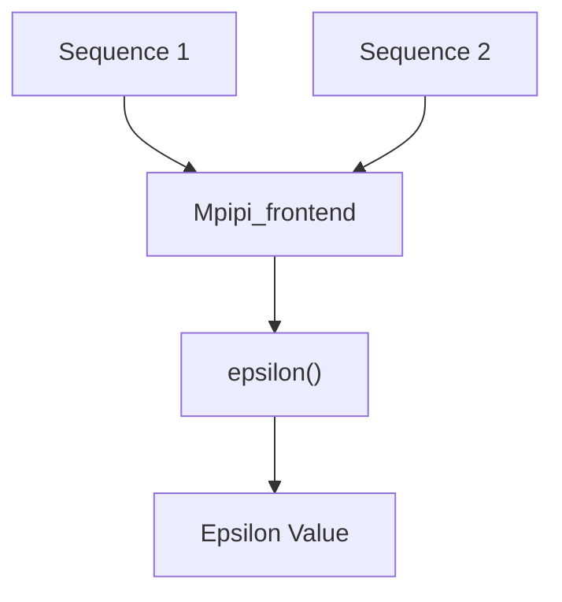
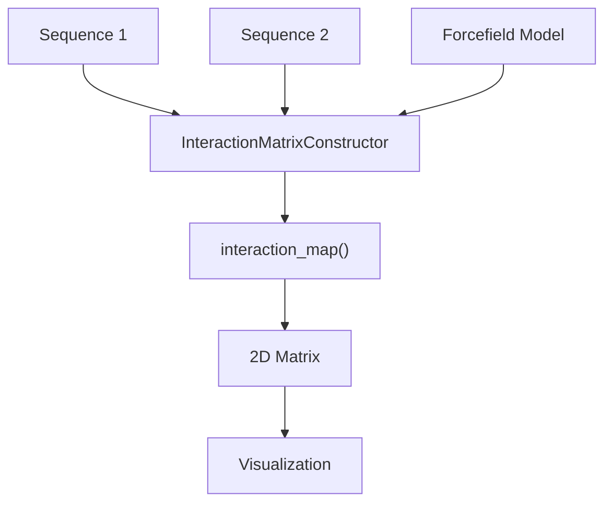
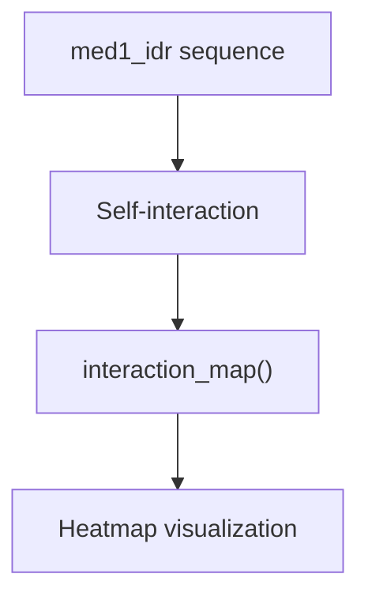
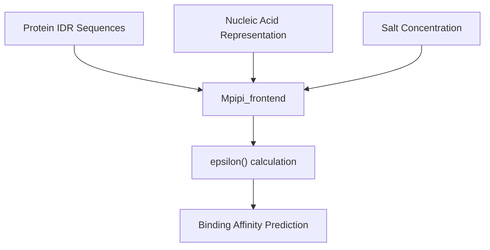
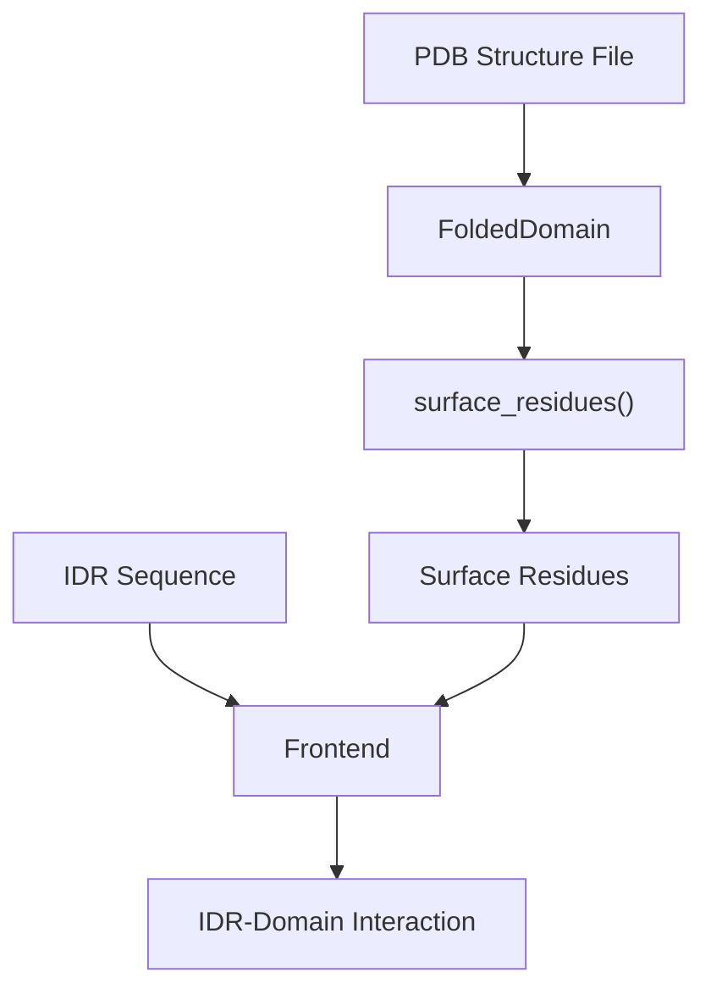
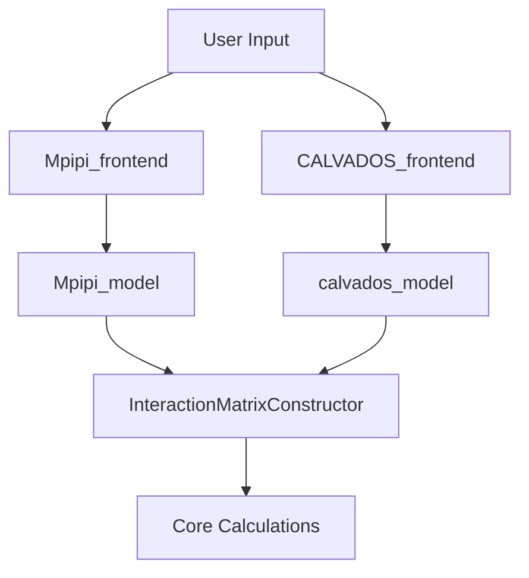
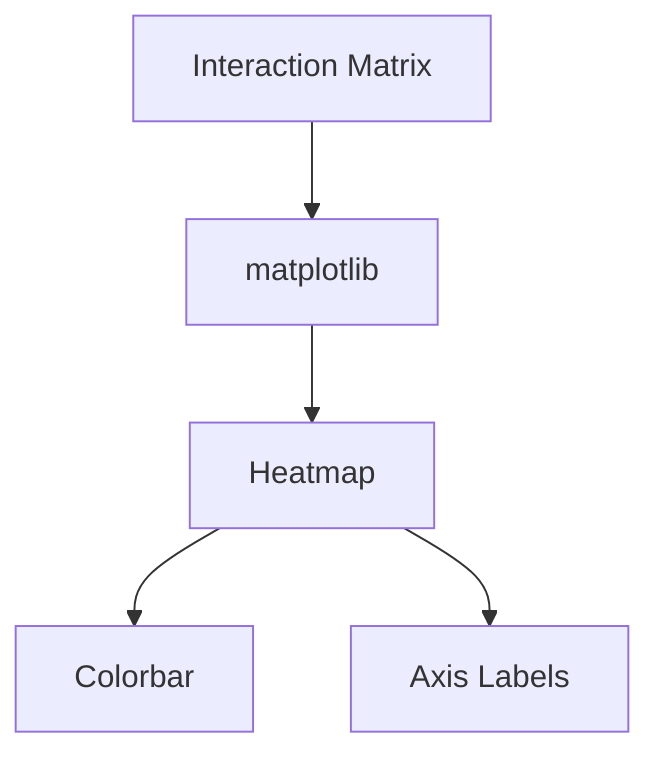
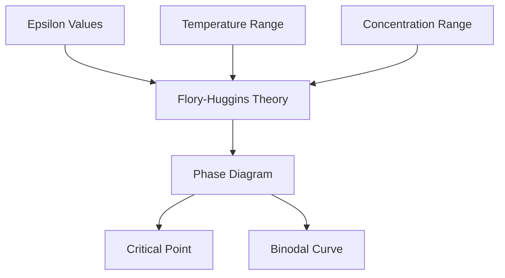
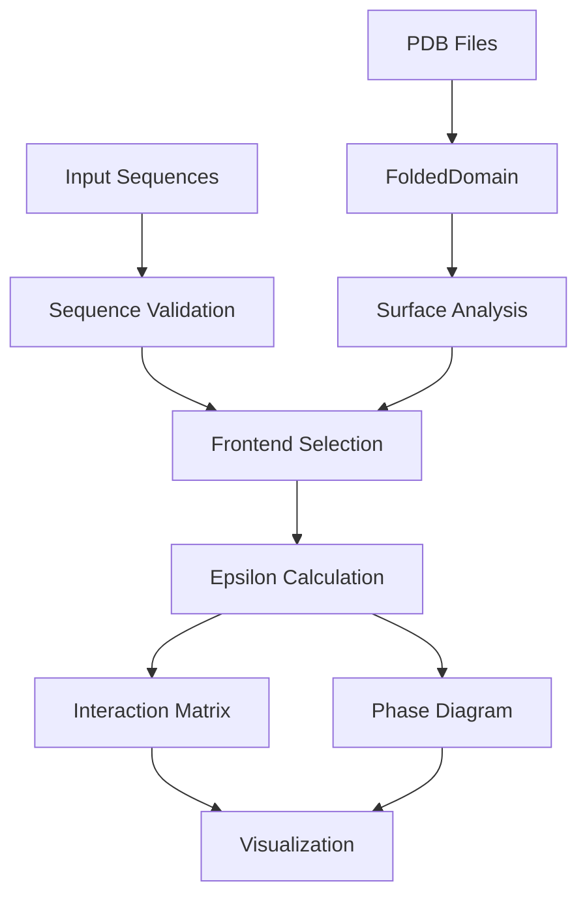

# Examples and Tutorials

> **Relevant source files**
> * [demo/docs_demo/ADBD1.pdb](https://github.com/idptools/finches/blob/5b52ba40/demo/docs_demo/ADBD1.pdb)
> * [demo/docs_demo/epsilon_docs.ipynb](https://github.com/idptools/finches/blob/5b52ba40/demo/docs_demo/epsilon_docs.ipynb)
> * [demo/nucleic_acid/protein_nucleic_acid_binding.ipynb](https://github.com/idptools/finches/blob/5b52ba40/demo/nucleic_acid/protein_nucleic_acid_binding.ipynb)
> * [demo/phase_diagrams/phase_diagram_demo.ipynb](https://github.com/idptools/finches/blob/5b52ba40/demo/phase_diagrams/phase_diagram_demo.ipynb)
> * [demo/protein_matrix/interaction_matrix_demo.ipynb](https://github.com/idptools/finches/blob/5b52ba40/demo/protein_matrix/interaction_matrix_demo.ipynb)

This page provides comprehensive examples and tutorials demonstrating how to use FINCHES for analyzing intrinsically disordered regions (IDRs) and their interactions. The examples progress from basic epsilon calculations to advanced analysis including interaction matrices, protein-nucleic acid binding, and IDR-folded domain interactions.

For detailed API documentation, see [API Reference](/idptools/finches/5-api-reference). For understanding the underlying concepts and algorithms, see [Core Concepts](/idptools/finches/4-core-concepts).

## Basic Usage Examples

### Simple Epsilon Calculation

The most fundamental operation in FINCHES is calculating epsilon values between two protein sequences. This example shows the minimal setup required:



#### Using Mpipi Forcefield

[demo/docs_demo/epsilon_docs.ipynb L26-L42](https://github.com/idptools/finches/blob/5b52ba40/demo/docs_demo/epsilon_docs.ipynb#L26-L42)

 demonstrates the basic workflow:

```javascript
from finches import Mpipi_frontend, CALVADOS_frontend # Initialize frontend objectsmf = Mpipi_frontend()cf = CALVADOS_frontend() # Example sequencess1 = 'MESNQSNNGGSGNAALNRGGRYVPPHLRGGDGGAAAAASAGGDDRRGGAGGGGYRRGGGNSGGGGGGGYDRGYNDNRDDRDNRGGSGGYGRDRNYEDRGYNGGGGGGGNRGYNNNRGGGGGGYNRQDRGDGGSSNFSRGGYNNRDEGSDNRGSGRSYNNDRRDNGGD's2 = 'LEGMSGDMRSGGGYRGRGGRGNGQRFGGRDHRYQGGSGNGGGGNGGGGGFGGGGQRSGGGGGFQSGGGGGRQQQQQQRAQPQQDWWS' # Calculate epsilon using both forcefieldseps_mpipi = mf.epsilon(s1, s2)eps_calvados = cf.epsilon(s1, s2)
```

The epsilon value represents the interaction strength between two IDR sequences, with negative values indicating attractive interactions.

Sources: [demo/docs_demo/epsilon_docs.ipynb L26-L46](https://github.com/idptools/finches/blob/5b52ba40/demo/docs_demo/epsilon_docs.ipynb#L26-L46)

### Interaction Matrix Generation

For detailed spatial analysis of IDR interactions, FINCHES can generate 2D interaction matrices showing per-residue interaction patterns:



[demo/docs_demo/epsilon_docs.ipynb L47-L71](https://github.com/idptools/finches/blob/5b52ba40/demo/docs_demo/epsilon_docs.ipynb#L47-L71)

 shows matrix generation:

```markdown
# Generate interaction matrixfig, im, ax1, ax2, ax3, ax4 = mf.interaction_map(s1, s2)
```

The `interaction_map()` method returns matplotlib figure objects for immediate visualization of the interaction landscape.

Sources: [demo/docs_demo/epsilon_docs.ipynb L47-L71](https://github.com/idptools/finches/blob/5b52ba40/demo/docs_demo/epsilon_docs.ipynb#L47-L71)

## Advanced Analysis Examples

### Homotypic IDR Interactions

[demo/protein_matrix/interaction_matrix_demo.ipynb L105-L120](https://github.com/idptools/finches/blob/5b52ba40/demo/protein_matrix/interaction_matrix_demo.ipynb#L105-L120)

 demonstrates analysis of self-interactions:



This example uses the med1 IDR sequence to analyze homotypic interactions, which are crucial for understanding phase separation behavior.

Sources: [demo/protein_matrix/interaction_matrix_demo.ipynb L81-L120](https://github.com/idptools/finches/blob/5b52ba40/demo/protein_matrix/interaction_matrix_demo.ipynb#L81-L120)

### Protein-Nucleic Acid Binding Analysis

FINCHES can analyze interactions between protein IDRs and nucleic acids. [demo/nucleic_acid/protein_nucleic_acid_binding.ipynb L36-L61](https://github.com/idptools/finches/blob/5b52ba40/demo/nucleic_acid/protein_nucleic_acid_binding.ipynb#L36-L61)

 shows the setup:



The example initializes the frontend with specific salt concentrations relevant for nucleic acid interactions:

```markdown
ms = Mpipi_frontend(salt=0.150)  # 150 mM salt
```

Sources: [demo/nucleic_acid/protein_nucleic_acid_binding.ipynb L58-L61](https://github.com/idptools/finches/blob/5b52ba40/demo/nucleic_acid/protein_nucleic_acid_binding.ipynb#L58-L61)

### IDR-Folded Domain Analysis

For analyzing interactions between IDRs and structured protein domains, FINCHES provides the `FoldedDomain` class:



The workflow involves:

1. Loading a PDB structure using `FoldedDomain`
2. Extracting surface-accessible residues
3. Calculating interactions between the IDR and surface residues

Sources: [demo/docs_demo/ADBD1.pdb L1-L10](https://github.com/idptools/finches/blob/5b52ba40/demo/docs_demo/ADBD1.pdb#L1-L10)

## Frontend Interface Comparison

FINCHES provides multiple forcefield implementations accessible through unified frontend interfaces:



### Mpipi vs CALVADOS Comparison

Both frontends provide identical APIs but use different underlying physics models:

| Method | Mpipi_frontend | CALVADOS_frontend |
| --- | --- | --- |
| `epsilon()` | Wang-Frenkel + Coulombic | Ashbaugh-Hatch + Yukawa |
| `interaction_map()` | Per-residue Mpipi parameters | CALVADOS residue properties |
| `phase_diagram()` | Flory-Huggins with Mpipi | Flory-Huggins with CALVADOS |

[demo/docs_demo/epsilon_docs.ipynb L31-L32](https://github.com/idptools/finches/blob/5b52ba40/demo/docs_demo/epsilon_docs.ipynb#L31-L32)

 shows initialization of both frontends, while [demo/docs_demo/epsilon_docs.ipynb L41-L45](https://github.com/idptools/finches/blob/5b52ba40/demo/docs_demo/epsilon_docs.ipynb#L41-L45)

 demonstrates their use with identical sequences producing different results due to different underlying physics.

Sources: [demo/docs_demo/epsilon_docs.ipynb L31-L45](https://github.com/idptools/finches/blob/5b52ba40/demo/docs_demo/epsilon_docs.ipynb#L31-L45)

## Visualization Examples

### Interaction Matrix Heatmaps

The standard output from `interaction_map()` provides publication-ready visualizations:



[demo/protein_matrix/interaction_matrix_demo.ipynb L107-L120](https://github.com/idptools/finches/blob/5b52ba40/demo/protein_matrix/interaction_matrix_demo.ipynb#L107-L120)

 generates comprehensive interaction visualizations for the med1 IDR sequence.

### Phase Diagram Generation

For understanding phase separation behavior:



The `phase_diagram()` method generates phase boundary predictions based on calculated epsilon values.

Sources: [demo/protein_matrix/interaction_matrix_demo.ipynb L107-L120](https://github.com/idptools/finches/blob/5b52ba40/demo/protein_matrix/interaction_matrix_demo.ipynb#L107-L120)

## Complete Workflow Example

A typical FINCHES analysis workflow combines multiple components:



This workflow demonstrates the integration between sequence analysis, structural data, and thermodynamic modeling that makes FINCHES a comprehensive tool for IDR analysis.

Sources: [demo/docs_demo/epsilon_docs.ipynb L26-L71](https://github.com/idptools/finches/blob/5b52ba40/demo/docs_demo/epsilon_docs.ipynb#L26-L71)

 [demo/protein_matrix/interaction_matrix_demo.ipynb L54-L120](https://github.com/idptools/finches/blob/5b52ba40/demo/protein_matrix/interaction_matrix_demo.ipynb#L54-L120)

 [demo/nucleic_acid/protein_nucleic_acid_binding.ipynb L58-L61](https://github.com/idptools/finches/blob/5b52ba40/demo/nucleic_acid/protein_nucleic_acid_binding.ipynb#L58-L61)