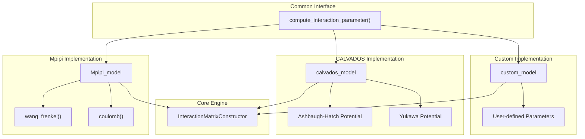
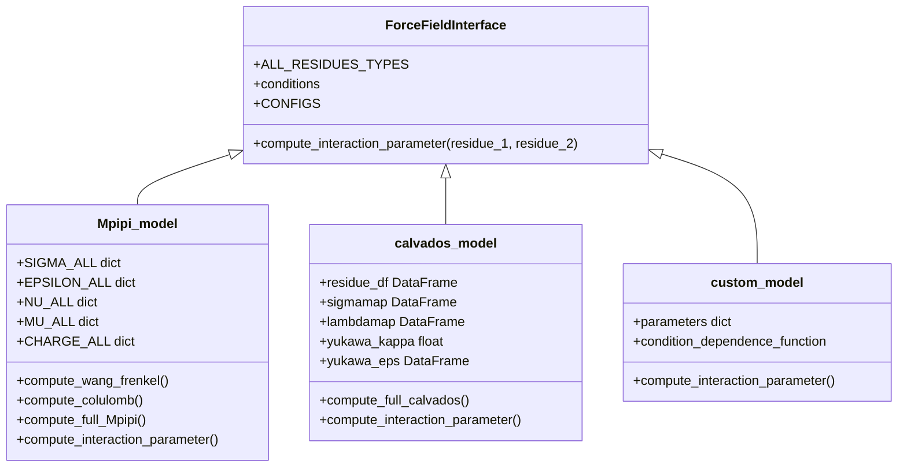
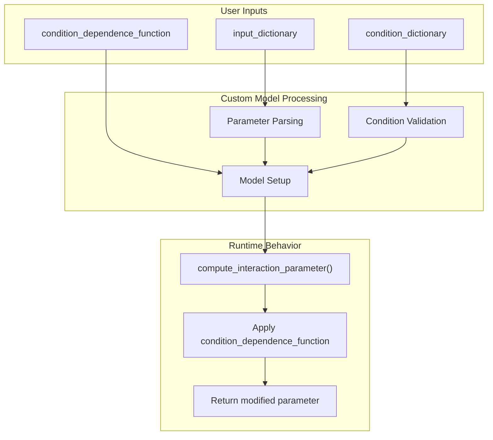

# Forcefield Models

> **Relevant source files**
> * [docs/extended_methods.rst](https://github.com/idptools/finches/blob/5b52ba40/docs/extended_methods.rst)
> * [finches/forcefields/calvados.py](https://github.com/idptools/finches/blob/5b52ba40/finches/forcefields/calvados.py)
> * [finches/forcefields/custom_model.py](https://github.com/idptools/finches/blob/5b52ba40/finches/forcefields/custom_model.py)
> * [finches/forcefields/mpipi.py](https://github.com/idptools/finches/blob/5b52ba40/finches/forcefields/mpipi.py)

This page describes the different physics-based forcefield models available in FINCHES for calculating intermolecular interactions between protein residues. Each model implements different potential energy functions and parameterizations optimized for specific biological contexts.

For information about how these models are used in calculations, see [Matrix Calculations](/idptools/finches/4.3-matrix-calculations). For API details on the model classes, see [API Reference](/idptools/finches/5.2-calculation-engine).

## Model Architecture and Interface

All forcefield models in FINCHES implement a common interface centered around the `compute_interaction_parameter()` method, which allows the core calculation engine to work with any physics model seamlessly.

### Common Forcefield Interface



Sources: [finches/forcefields/mpipi.py L342-L409](https://github.com/idptools/finches/blob/5b52ba40/finches/forcefields/mpipi.py#L342-L409)

 [finches/forcefields/calvados.py L323-L387](https://github.com/idptools/finches/blob/5b52ba40/finches/forcefields/calvados.py#L323-L387)

 [finches/forcefields/custom_model.py L245-L285](https://github.com/idptools/finches/blob/5b52ba40/finches/forcefields/custom_model.py#L245-L285)

### Model Class Hierarchy



Sources: [finches/forcefields/mpipi.py L35-L202](https://github.com/idptools/finches/blob/5b52ba40/finches/forcefields/mpipi.py#L35-L202)

 [finches/forcefields/calvados.py L75-L202](https://github.com/idptools/finches/blob/5b52ba40/finches/forcefields/calvados.py#L75-L202)

 [finches/forcefields/custom_model.py L29-L241](https://github.com/idptools/finches/blob/5b52ba40/finches/forcefields/custom_model.py#L29-L241)

## Mpipi Model

The Mpipi model implements the physics-driven coarse-grained forcefield developed by Joseph et al. (2021), combining Wang-Frenkel and Coulombic potentials for biomolecular phase separation predictions.

### Physics Implementation

The Mpipi model combines two potential energy functions:

| Potential | Function | Parameters |
| --- | --- | --- |
| Wang-Frenkel | Short-range attraction/repulsion | σ (size), ε (energy), μ (width), ν (steepness) |
| Coulombic | Electrostatic interactions with Debye screening | charge, dielectric, salt concentration |

### Available Versions

| Version | Description | Configuration |
| --- | --- | --- |
| `Mpipi_original` | Original Joseph et al. parameters | charge_prefactor: 0.20, baseline: -0.066265 |
| `Mpipi_GGv1` | Updated parameters with improved calibration | charge_prefactor: 0.20, baseline: -0.128533 |

### Key Methods

The `Mpipi_model` class provides several computation methods:

* `compute_wang_frenkel()` - Short-range potential calculation
* `compute_colulomb()` - Electrostatic potential with screening
* `compute_full_Mpipi()` - Combined potential energy
* `compute_interaction_parameter()` - Integrated interaction strength

Sources: [finches/forcefields/mpipi.py L6-L15](https://github.com/idptools/finches/blob/5b52ba40/finches/forcefields/mpipi.py#L6-L15)

 [finches/forcefields/mpipi.py L209-L410](https://github.com/idptools/finches/blob/5b52ba40/finches/forcefields/mpipi.py#L209-L410)

 [finches/forcefields/mpipi.py L19-L33](https://github.com/idptools/finches/blob/5b52ba40/finches/forcefields/mpipi.py#L19-L33)

## CALVADOS Model

The CALVADOS model implements the coarse-grained forcefield from the CALVADOS package, designed for studying intrinsically disordered proteins using Ashbaugh-Hatch and Yukawa potentials.

### Physics Implementation

The CALVADOS model combines:

| Potential | Description | Parameters |
| --- | --- | --- |
| Ashbaugh-Hatch | Modified Lennard-Jones with λ-dependent mixing | σ (size), λ (stickiness), ε (energy scale) |
| Yukawa | Screened electrostatic interactions | charge, κ (inverse Debye length) |

### Temperature and pH Dependencies

Unlike Mpipi, CALVADOS includes explicit temperature and pH dependencies:

* **Temperature**: Affects Yukawa potential strength and dielectric properties
* **pH**: Modulates histidine charge state via Henderson-Hasselbalch equation
* **Salt**: Controls electrostatic screening through Debye-Hückel theory

### Available Versions

| Version | Description | Configuration |
| --- | --- | --- |
| `CALVADOS1` | Original parameter set | Not yet implemented |
| `CALVADOS2` | Updated parameters | charge_prefactor: 0.7, baseline: -0.45 |

### Parameter Generation

The model dynamically computes condition-dependent parameters via the `_genParams()` method, including:

* Yukawa kappa and epsilon matrices based on temperature and ionic strength
* pH-dependent histidine charges
* Temperature-dependent dielectric properties

Sources: [finches/forcefields/calvados.py L1-L51](https://github.com/idptools/finches/blob/5b52ba40/finches/forcefields/calvados.py#L1-L51)

 [finches/forcefields/calvados.py L205-L250](https://github.com/idptools/finches/blob/5b52ba40/finches/forcefields/calvados.py#L205-L250)

 [finches/forcefields/calvados.py L393-L475](https://github.com/idptools/finches/blob/5b52ba40/finches/forcefields/calvados.py#L393-L475)

## Custom Model

The `custom_model` class provides a flexible framework for implementing user-defined forcefields with arbitrary interaction parameters and condition dependencies.

### Parameter Structure

Custom models require interaction parameters in dictionary format:

```css
# Input formatinput_dict = {'A_A': -1.0, 'A_B': 0.5, 'B_B': -2.0} # Converted to nested structureparameters = {    'A': {'A': -1.0, 'B': 0.5},    'B': {'A': 0.5, 'B': -2.0}}
```

### Condition Dependencies

Custom models support dynamic parameter modification through condition functions:



### Residue Group Constraints

The `valid_residue_groups` parameter controls which residue types can coexist in the same sequence, enabling mixed protein-nucleic acid systems:

```markdown
# Example: Separate protein and RNA residuesvalid_residue_groups = [['A','D','E','F'], ['U','A','G','C']]
```

Sources: [finches/forcefields/custom_model.py L29-L135](https://github.com/idptools/finches/blob/5b52ba40/finches/forcefields/custom_model.py#L29-L135)

 [finches/forcefields/custom_model.py L136-L241](https://github.com/idptools/finches/blob/5b52ba40/finches/forcefields/custom_model.py#L136-L241)

 [finches/forcefields/custom_model.py L245-L285](https://github.com/idptools/finches/blob/5b52ba40/finches/forcefields/custom_model.py#L245-L285)

## Parameter Management

### Data Storage and Loading

All models use pickle files for parameter storage, located in the FINCHES data directory:

| Model | Parameter Files | Content |
| --- | --- | --- |
| Mpipi | sigma.pickle, epsilon.pickle, nu.pickle, mu.pickle, charge.pickle | Pairwise interaction parameters |
| CALVADOS | calvados_residues.pickle | Residue properties and version-specific λ values |
| Custom | User-defined | Arbitrary parameter dictionaries |

### Configuration Management

Each model maintains version-specific configurations through the `CONFIGS` system:

```css
# Example configuration structureMPIPI_CONFIGS = {    'Mpipi_GGv1': {        'charge_prefactor': 0.20,        'null_interaction_baseline': -0.128533    }}
```

### Residue Type Validation

All models define `ALL_RESIDUES_TYPES` as nested lists specifying valid residue combinations:

```markdown
# Standard amino acids onlyALL_RESIDUES_TYPES = [['A','D','E','F','G','H','I','K','L','M','N','P','Q','R','S','T','V','W','Y','C']] # Mixed protein-nucleic acidALL_RESIDUES_TYPES = [['A','D','E',...], ['U']]
```

Sources: [finches/forcefields/mpipi.py L107-L135](https://github.com/idptools/finches/blob/5b52ba40/finches/forcefields/mpipi.py#L107-L135)

 [finches/forcefields/calvados.py L130-L145](https://github.com/idptools/finches/blob/5b52ba40/finches/forcefields/calvados.py#L130-L145)

 [finches/forcefields/mpipi.py L199-L202](https://github.com/idptools/finches/blob/5b52ba40/finches/forcefields/mpipi.py#L199-L202)

## Model Selection Guidelines

### When to Use Each Model

| Model | Best For | Strengths | Limitations |
| --- | --- | --- | --- |
| **Mpipi** | Phase separation predictions, IDR-IDR interactions | Quantitative accuracy, extensive validation | Limited to standard amino acids |
| **CALVADOS** | Temperature/pH studies, detailed physical conditions | Explicit environmental dependencies | More complex parameterization |
| **Custom** | Novel residue types, specialized interactions | Complete flexibility | Requires user parameterization |

### Integration with Calculation Engine

All models integrate with `InteractionMatrixConstructor` through the standardized interface, ensuring consistent behavior regardless of the underlying physics implementation.

Sources: [finches/forcefields/mpipi.py L6-L15](https://github.com/idptools/finches/blob/5b52ba40/finches/forcefields/mpipi.py#L6-L15)

 [finches/forcefields/calvados.py L1-L8](https://github.com/idptools/finches/blob/5b52ba40/finches/forcefields/calvados.py#L1-L8)

 [finches/forcefields/custom_model.py L1-L8](https://github.com/idptools/finches/blob/5b52ba40/finches/forcefields/custom_model.py#L1-L8)