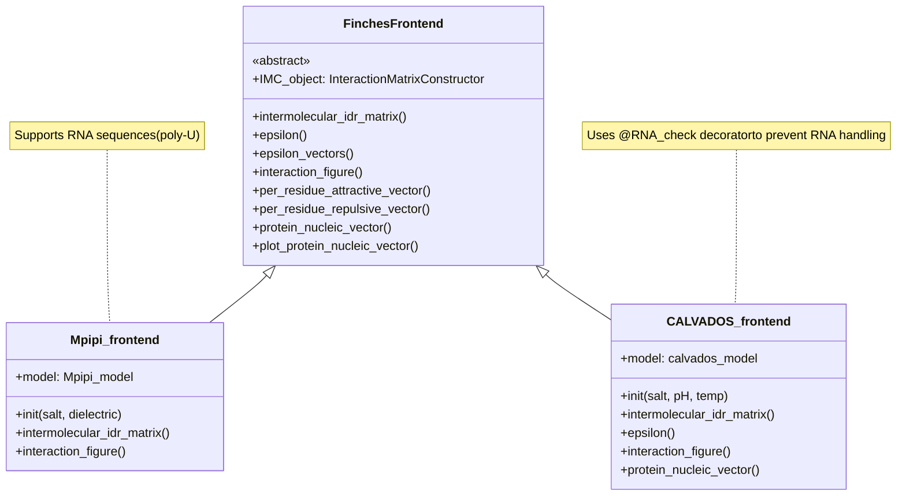
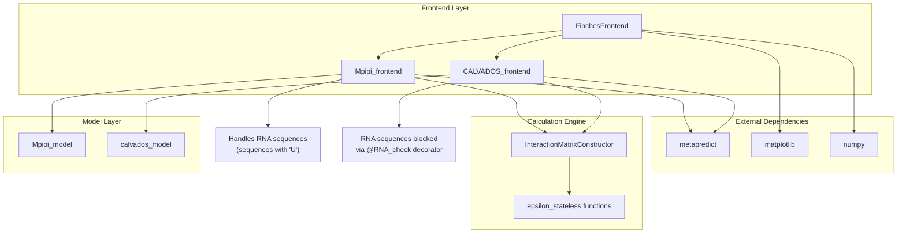
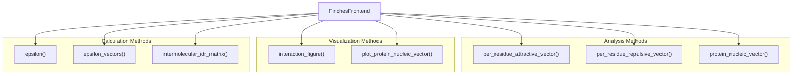
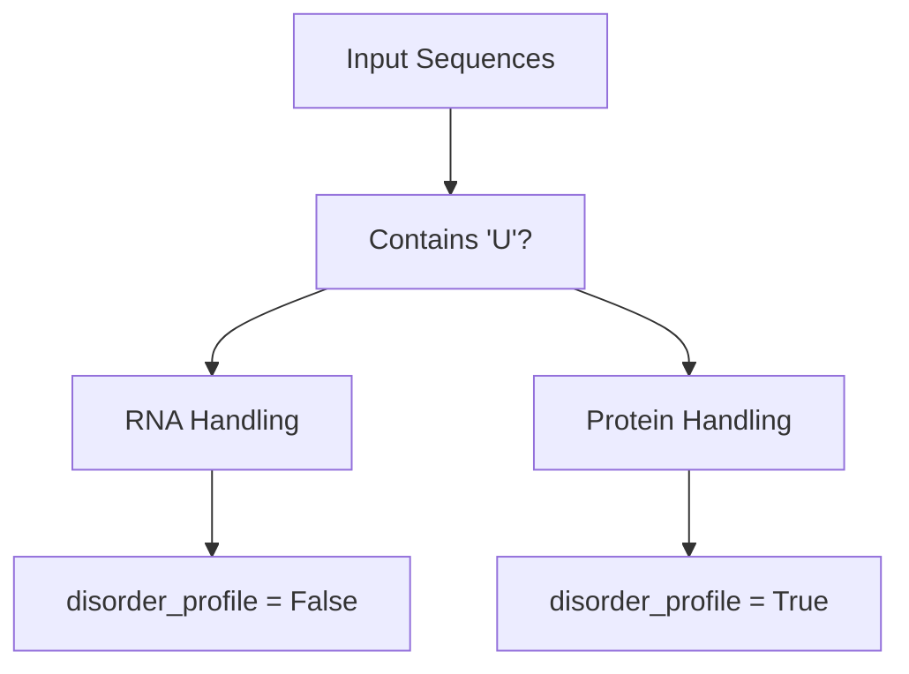
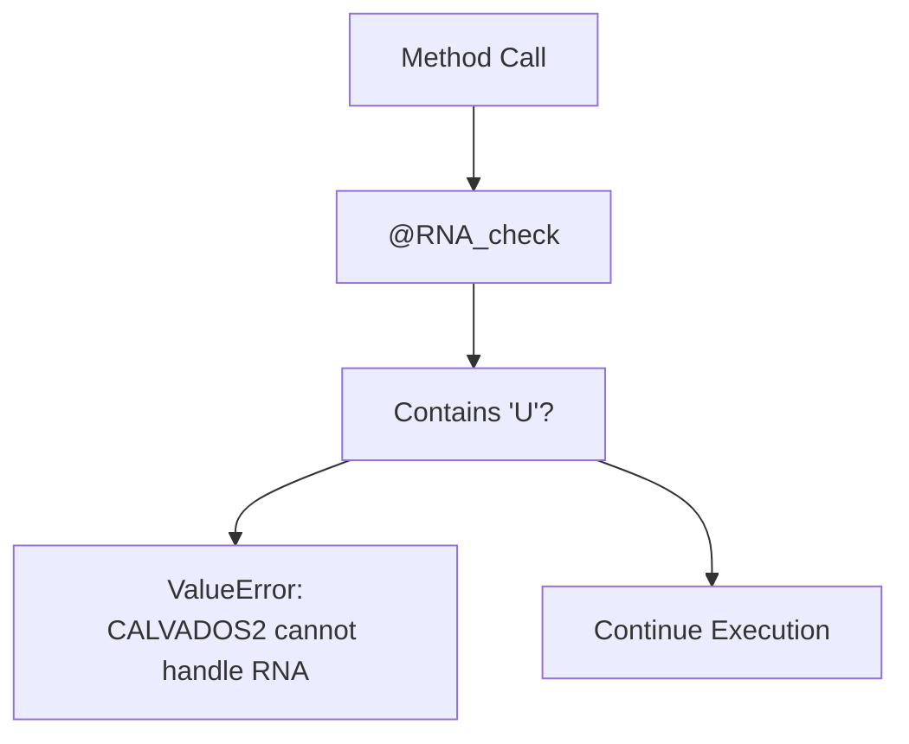

# Frontend Classes

> **Relevant source files**
> * [docs/api.rst](https://github.com/idptools/finches/blob/5b52ba40/docs/api.rst)
> * [docs/conf.py](https://github.com/idptools/finches/blob/5b52ba40/docs/conf.py)
> * [finches/data/fingerprints.py](https://github.com/idptools/finches/blob/5b52ba40/finches/data/fingerprints.py)
> * [finches/epsilon_stateless.py](https://github.com/idptools/finches/blob/5b52ba40/finches/epsilon_stateless.py)
> * [finches/frontend/calvados_frontend.py](https://github.com/idptools/finches/blob/5b52ba40/finches/frontend/calvados_frontend.py)
> * [finches/frontend/frontend_base.py](https://github.com/idptools/finches/blob/5b52ba40/finches/frontend/frontend_base.py)
> * [finches/frontend/mpipi_frontend.py](https://github.com/idptools/finches/blob/5b52ba40/finches/frontend/mpipi_frontend.py)

This page provides detailed API documentation for the frontend classes in FINCHES. These classes serve as the primary user interface for calculating epsilon values, generating interaction matrices, and creating visualization plots. The frontend classes abstract away the complexity of the underlying calculation engine and provide a consistent, easy-to-use interface regardless of which forcefield model is being used.

For information about the underlying calculation engine, see [Calculation Engine](/idptools/finches/5.2-calculation-engine). For examples of using these classes, see [Basic Usage Examples](/idptools/finches/6.1-basic-usage-examples).

## Class Hierarchy and Architecture

The frontend system is built around an inheritance hierarchy with a common base class that ensures consistent interfaces across different forcefield implementations.

### Frontend Class Inheritance



Sources: [finches/frontend/frontend_base.py L20-L41](https://github.com/idptools/finches/blob/5b52ba40/finches/frontend/frontend_base.py#L20-L41)

 [finches/frontend/mpipi_frontend.py L12-L21](https://github.com/idptools/finches/blob/5b52ba40/finches/frontend/mpipi_frontend.py#L12-L21)

 [finches/frontend/calvados_frontend.py L28-L43](https://github.com/idptools/finches/blob/5b52ba40/finches/frontend/calvados_frontend.py#L28-L43)

### Component Integration



Sources: [finches/frontend/frontend_base.py L1-L11](https://github.com/idptools/finches/blob/5b52ba40/finches/frontend/frontend_base.py#L1-L11)

 [finches/frontend/mpipi_frontend.py L4-L21](https://github.com/idptools/finches/blob/5b52ba40/finches/frontend/mpipi_frontend.py#L4-L21)

 [finches/frontend/calvados_frontend.py L1-L43](https://github.com/idptools/finches/blob/5b52ba40/finches/frontend/calvados_frontend.py#L1-L43)

## Base Class: FinchesFrontend

The `FinchesFrontend` class serves as an abstract base class that defines the common interface for all frontend implementations. It cannot be instantiated directly and enforces implementation of required attributes in derived classes.

### Core Attributes

| Attribute | Type | Description |
| --- | --- | --- |
| `IMC_object` | `InteractionMatrixConstructor` | Core calculation engine, must be defined in subclasses |

### Key Methods Overview



Sources: [finches/frontend/frontend_base.py L206-L282](https://github.com/idptools/finches/blob/5b52ba40/finches/frontend/frontend_base.py#L206-L282)

 [finches/frontend/frontend_base.py L288-L565](https://github.com/idptools/finches/blob/5b52ba40/finches/frontend/frontend_base.py#L288-L565)

 [finches/frontend/frontend_base.py L570-L828](https://github.com/idptools/finches/blob/5b52ba40/finches/frontend/frontend_base.py#L570-L828)

### Core Calculation Methods

#### epsilon()

Calculates the overall epsilon value between two sequences.

**Parameters:**

* `seq1` (str): First input sequence
* `seq2` (str): Second input sequence
* `use_aliphatic_weighting` (bool): Enable aliphatic residue weighting (default: True)
* `use_charge_weighting` (bool): Enable charge-based weighting (default: True)

**Returns:** Float epsilon value

#### intermolecular_idr_matrix()

Generates a 2D interaction matrix using sliding window analysis.

**Key Parameters:**

* `window_size` (int): Sliding window size (default: 31)
* `use_cython` (bool): Use optimized Cython implementation (default: True)
* `disorder_1`, `disorder_2` (bool): Generate disorder profiles (default: True)
* `null_shuffle` (bool/int): Apply sequence shuffling for baseline correction

**Returns:** Tuple containing interaction matrix, disorder profile 1, disorder profile 2

#### epsilon_vectors()

Returns attractive and repulsive interaction vectors between sequences.

**Returns:** Tuple of (attractive_vector, repulsive_vector)

Sources: [finches/frontend/frontend_base.py L206-L242](https://github.com/idptools/finches/blob/5b52ba40/finches/frontend/frontend_base.py#L206-L242)

 [finches/frontend/frontend_base.py L46-L199](https://github.com/idptools/finches/blob/5b52ba40/finches/frontend/frontend_base.py#L46-L199)

 [finches/frontend/frontend_base.py L246-L282](https://github.com/idptools/finches/blob/5b52ba40/finches/frontend/frontend_base.py#L246-L282)

### Visualization Methods

#### interaction_figure()

Creates comprehensive interaction matrix plots with disorder profiles.

**Key Parameters:**

* `vmin`, `vmax` (float): Color scale limits (default: -3, 3)
* `cmap` (str): Colormap for visualization (default: 'PRGn')
* `seq1_domains`, `seq2_domains` (list): Domain boundaries for highlighting
* `fname` (str): Output filename (None for display)
* `zero_folded` (bool): Zero out folded regions (default: True)

**Returns:** Tuple of matplotlib figure and axes objects

Sources: [finches/frontend/frontend_base.py L288-L565](https://github.com/idptools/finches/blob/5b52ba40/finches/frontend/frontend_base.py#L288-L565)

## Mpipi_frontend

The `Mpipi_frontend` class implements the Mpipi forcefield model for protein-protein and protein-RNA interactions.

### Constructor Parameters

| Parameter | Type | Default | Description |
| --- | --- | --- | --- |
| `salt` | float | 0.150 | Salt concentration in M |
| `dielectric` | float | 80.0 | Dielectric constant |

### RNA Sequence Support

Mpipi supports RNA sequences containing 'U' nucleotides. The implementation automatically detects RNA sequences and adjusts disorder profile generation accordingly.



Sources: [finches/frontend/mpipi_frontend.py L13-L21](https://github.com/idptools/finches/blob/5b52ba40/finches/frontend/mpipi_frontend.py#L13-L21)

 [finches/frontend/mpipi_frontend.py L105-L126](https://github.com/idptools/finches/blob/5b52ba40/finches/frontend/mpipi_frontend.py#L105-L126)

### Method Overrides

The `Mpipi_frontend` overrides specific methods to handle RNA sequences:

* `intermolecular_idr_matrix()`: Automatically disables disorder profiles for sequences containing 'U'
* `interaction_figure()`: Adjusts disorder profile generation for RNA sequences

Sources: [finches/frontend/mpipi_frontend.py L27-L126](https://github.com/idptools/finches/blob/5b52ba40/finches/frontend/mpipi_frontend.py#L27-L126)

 [finches/frontend/mpipi_frontend.py L128-L291](https://github.com/idptools/finches/blob/5b52ba40/finches/frontend/mpipi_frontend.py#L128-L291)

## CALVADOS_frontend

The `CALVADOS_frontend` class implements the CALVADOS2 forcefield model for protein-protein interactions only.

### Constructor Parameters

| Parameter | Type | Default | Description |
| --- | --- | --- | --- |
| `salt` | float | 0.150 | Salt concentration in M |
| `pH` | float | 7.4 | Solution pH |
| `temp` | float | 288 | Temperature in K |

### RNA Sequence Restrictions

CALVADOS does not support RNA sequences. The implementation uses the `@RNA_check` decorator to prevent RNA handling.



**RNA Check Implementation:**

```python
def RNA_check(func):    @wraps(func)    def wrapper(*args, **kwargs):        if 'U' in args[1] or 'U' in args[2]:            raise ValueError("CALVADOS2 cannot handle RNA ('U')")        return func(*args, **kwargs)    return wrapper
```

Sources: [finches/frontend/calvados_frontend.py L16-L26](https://github.com/idptools/finches/blob/5b52ba40/finches/frontend/calvados_frontend.py#L16-L26)

 [finches/frontend/calvados_frontend.py L34-L43](https://github.com/idptools/finches/blob/5b52ba40/finches/frontend/calvados_frontend.py#L34-L43)

### Decorated Methods

The following methods are protected by the `@RNA_check` decorator:

* `intermolecular_idr_matrix()`
* `epsilon()`
* `interaction_figure()`

The `protein_nucleic_vector()` method is stubbed and raises an exception since CALVADOS cannot handle RNA.

Sources: [finches/frontend/calvados_frontend.py L51-L139](https://github.com/idptools/finches/blob/5b52ba40/finches/frontend/calvados_frontend.py#L51-L139)

 [finches/frontend/calvados_frontend.py L145-L184](https://github.com/idptools/finches/blob/5b52ba40/finches/frontend/calvados_frontend.py#L145-L184)

 [finches/frontend/calvados_frontend.py L344-L349](https://github.com/idptools/finches/blob/5b52ba40/finches/frontend/calvados_frontend.py#L344-L349)

## Method Parameter Patterns

### Common Parameters Across Methods

| Parameter | Type | Default | Purpose |
| --- | --- | --- | --- |
| `seq1`, `seq2` | str | Required | Input amino acid sequences |
| `use_aliphatic_weighting` | bool | True | Weight aliphatic residue clusters |
| `use_charge_weighting` | bool | True | Weight charged residue interactions |
| `use_cython` | bool | True | Use optimized Cython implementation |
| `window_size` | int | 31 | Sliding window size for matrix calculations |

### Visualization-Specific Parameters

| Parameter | Type | Default | Purpose |
| --- | --- | --- | --- |
| `vmin`, `vmax` | float | Model-dependent | Color scale limits |
| `cmap` | str | 'PRGn' | Matplotlib colormap |
| `tic_frequency` | int | 100 | Axis tick spacing |
| `fname` | str | None | Output filename |
| `zero_folded` | bool | True | Zero out predicted folded regions |

Sources: [finches/frontend/frontend_base.py L46-L120](https://github.com/idptools/finches/blob/5b52ba40/finches/frontend/frontend_base.py#L46-L120)

 [finches/frontend/frontend_base.py L317-L396](https://github.com/idptools/finches/blob/5b52ba40/finches/frontend/frontend_base.py#L317-L396)

## Usage Patterns

### Basic Epsilon Calculation

```markdown
# Mpipi modelmf = Mpipi_frontend(salt=0.150, dielectric=80.0)epsilon_value = mf.epsilon(seq1, seq2) # CALVADOS model  cf = CALVADOS_frontend(salt=0.150, pH=7.4, temp=288)epsilon_value = cf.epsilon(seq1, seq2)
```

### Interaction Matrix Generation

```sql
# Generate matrix with disorder profilesmatrix_data = mf.intermolecular_idr_matrix(seq1, seq2, window_size=31)interaction_matrix, disorder1, disorder2 = matrix_data # Create visualizationfig_data = mf.interaction_figure(seq1, seq2, fname="output.png")
```

### Model-Specific Considerations

```python
# Mpipi supports RNArna_seq = "UUUUUUUUUUUUUUUUUUUU"epsilon_rna = mf.epsilon(protein_seq, rna_seq)  # Works # CALVADOS blocks RNAtry:    epsilon_rna = cf.epsilon(protein_seq, rna_seq)  # Raises ValueErrorexcept ValueError as e:    print("CALVADOS cannot handle RNA sequences")
```

Sources: [finches/frontend/mpipi_frontend.py L1-L292](https://github.com/idptools/finches/blob/5b52ba40/finches/frontend/mpipi_frontend.py#L1-L292)

 [finches/frontend/calvados_frontend.py L1-L350](https://github.com/idptools/finches/blob/5b52ba40/finches/frontend/calvados_frontend.py#L1-L350)