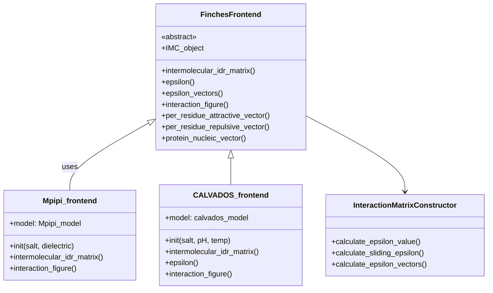
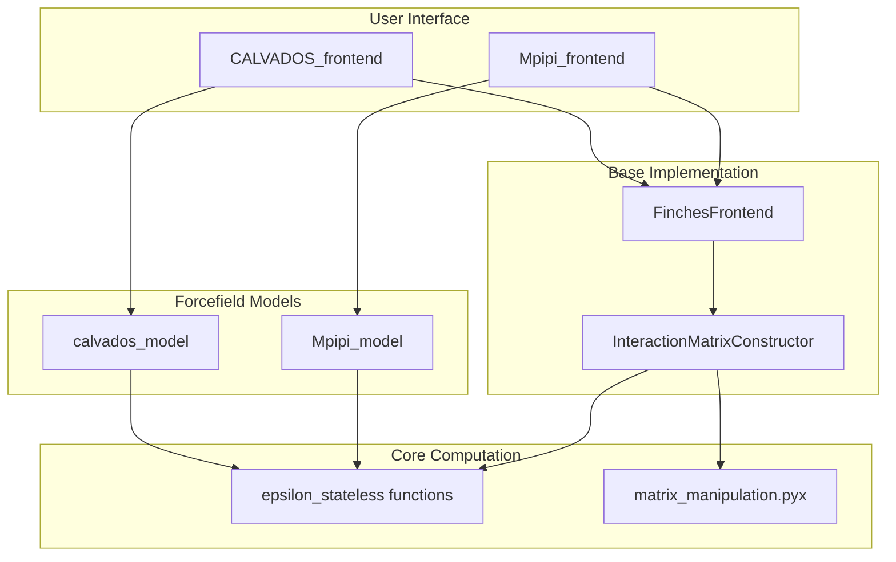
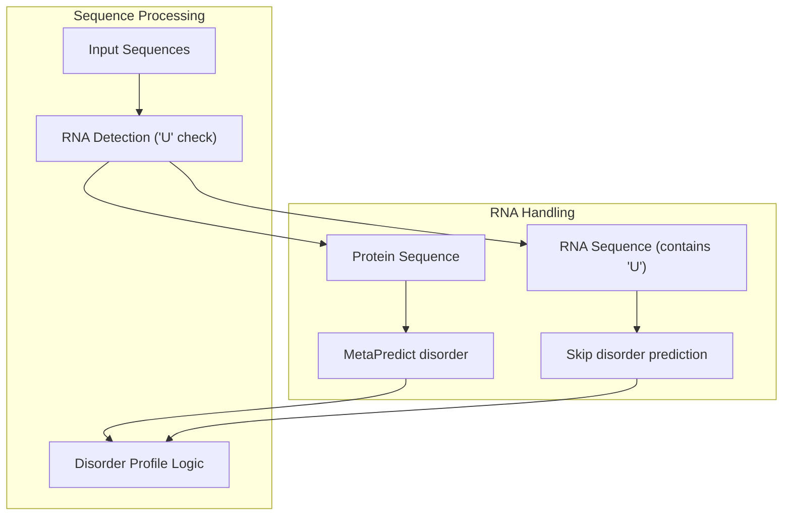
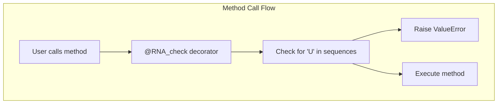
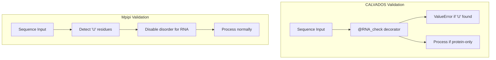

# Frontend Interfaces

> **Relevant source files**
> * [docs/api.rst](https://github.com/idptools/finches/blob/5b52ba40/docs/api.rst)
> * [docs/conf.py](https://github.com/idptools/finches/blob/5b52ba40/docs/conf.py)
> * [finches/data/fingerprints.py](https://github.com/idptools/finches/blob/5b52ba40/finches/data/fingerprints.py)
> * [finches/epsilon_stateless.py](https://github.com/idptools/finches/blob/5b52ba40/finches/epsilon_stateless.py)
> * [finches/frontend/calvados_frontend.py](https://github.com/idptools/finches/blob/5b52ba40/finches/frontend/calvados_frontend.py)
> * [finches/frontend/frontend_base.py](https://github.com/idptools/finches/blob/5b52ba40/finches/frontend/frontend_base.py)
> * [finches/frontend/mpipi_frontend.py](https://github.com/idptools/finches/blob/5b52ba40/finches/frontend/mpipi_frontend.py)

This document provides a detailed explanation of the frontend interface classes that serve as the primary user-facing API for FINCHES. The frontend interfaces abstract away the complexity of the underlying computational engine while providing a consistent, easy-to-use interface for calculating epsilon values, generating interaction matrices, and visualizing protein-protein interactions.

For information about the core computational algorithms, see [Core Concepts](/idptools/finches/4-core-concepts). For complete API reference documentation, see [Frontend Classes](/idptools/finches/5.1-frontend-classes).

## Purpose and Architecture

The frontend interfaces implement a polymorphic design pattern where different forcefield models (Mpipi, CALVADOS) are accessed through a unified interface. This allows users to switch between different physics models without changing their analysis code.

### Frontend Class Hierarchy



Sources: [finches/frontend/frontend_base.py L20-L41](https://github.com/idptools/finches/blob/5b52ba40/finches/frontend/frontend_base.py#L20-L41)

 [finches/frontend/mpipi_frontend.py L12-L21](https://github.com/idptools/finches/blob/5b52ba40/finches/frontend/mpipi_frontend.py#L12-L21)

 [finches/frontend/calvados_frontend.py L28-L43](https://github.com/idptools/finches/blob/5b52ba40/finches/frontend/calvados_frontend.py#L28-L43)

### Backend Integration Pattern



Sources: [finches/frontend/frontend_base.py L21](https://github.com/idptools/finches/blob/5b52ba40/finches/frontend/frontend_base.py#L21-L21)

 [finches/frontend/mpipi_frontend.py L18-L21](https://github.com/idptools/finches/blob/5b52ba40/finches/frontend/mpipi_frontend.py#L18-L21)

 [finches/frontend/calvados_frontend.py L40-L43](https://github.com/idptools/finches/blob/5b52ba40/finches/frontend/calvados_frontend.py#L40-L43)

## Base Class Functionality

The `FinchesFrontend` base class defines the core interface and implements most functionality that is shared between different forcefield models. Key design elements:

| Feature | Implementation | Purpose |
| --- | --- | --- |
| Abstract base | Cannot be instantiated directly | Enforces consistent interface |
| Template methods | Implements complex workflows | Reduces code duplication |
| Polymorphic dispatch | Derived classes override specific methods | Handles model-specific requirements |

### Core Methods Available in All Frontends

#### epsilon()

Calculates the epsilon value between two sequences.

```
epsilon_value = frontend.epsilon(seq1, seq2,                                use_aliphatic_weighting=True,                               use_charge_weighting=True)
```

#### intermolecular_idr_matrix()

Generates sliding window interaction matrices with disorder profiles.

```
matrix_data, disorder1, disorder2 = frontend.intermolecular_idr_matrix(    seq1, seq2, window_size=31, null_shuffle=False)
```

#### interaction_figure()

Creates publication-ready interaction matrix visualizations.

```
fig, im, ax_main, ax_top, ax_right, ax_colorbar = frontend.interaction_figure(    seq1, seq2, vmin=-3, vmax=3, cmap='PRGn')
```

Sources: [finches/frontend/frontend_base.py L206-L241](https://github.com/idptools/finches/blob/5b52ba40/finches/frontend/frontend_base.py#L206-L241)

 [finches/frontend/frontend_base.py L46-L199](https://github.com/idptools/finches/blob/5b52ba40/finches/frontend/frontend_base.py#L46-L199)

 [finches/frontend/frontend_base.py L288-L564](https://github.com/idptools/finches/blob/5b52ba40/finches/frontend/frontend_base.py#L288-L564)

## Mpipi_frontend Implementation

The `Mpipi_frontend` class implements the Mpipi forcefield model with support for protein-RNA interactions.

### Initialization and Configuration

```javascript
from finches import Mpipi_frontendfrontend = Mpipi_frontend(salt=0.150, dielectric=80.0)
```

### RNA Support Features

The Mpipi frontend uniquely supports RNA sequences (containing 'U' residues):



Key implementation details:

* Automatically detects RNA sequences by presence of 'U' residues
* Disables disorder prediction for RNA sequences ([finches/frontend/mpipi_frontend.py L105-L113](https://github.com/idptools/finches/blob/5b52ba40/finches/frontend/mpipi_frontend.py#L105-L113) )
* Maintains compatibility with all protein analysis methods

### Model-Specific Parameters

| Parameter | Default | Range | Purpose |
| --- | --- | --- | --- |
| `salt` | 0.150 M | 0-1.0 M | Ionic strength for electrostatic calculations |
| `dielectric` | 80.0 | 1-100 | Solvent dielectric constant |

Sources: [finches/frontend/mpipi_frontend.py L12-L21](https://github.com/idptools/finches/blob/5b52ba40/finches/frontend/mpipi_frontend.py#L12-L21)

 [finches/frontend/mpipi_frontend.py L105-L126](https://github.com/idptools/finches/blob/5b52ba40/finches/frontend/mpipi_frontend.py#L105-L126)

## CALVADOS_frontend Implementation

The `CALVADOS_frontend` class implements the CALVADOS2 forcefield with strict protein-only support.

### Initialization and Configuration

```javascript
from finches import CALVADOS_frontendfrontend = CALVADOS_frontend(salt=0.150, pH=7.4, temp=288)
```

### RNA Restriction Mechanism

CALVADOS enforces protein-only analysis through a decorator pattern:



The `@RNA_check` decorator ([finches/frontend/calvados_frontend.py L16-L25](https://github.com/idptools/finches/blob/5b52ba40/finches/frontend/calvados_frontend.py#L16-L25)

) automatically validates input sequences and raises `ValueError` if RNA residues are detected.

### Model-Specific Parameters

| Parameter | Default | Range | Purpose |
| --- | --- | --- | --- |
| `salt` | 0.150 M | 0-1.0 M | Ionic strength |
| `pH` | 7.4 | 1-14 | Solution pH for ionization states |
| `temp` | 288 K | 273-373 K | Temperature for thermodynamic calculations |

### Visualization Defaults

CALVADOS uses different default visualization parameters optimized for its interaction strength scale:

```markdown
# CALVADOS default rangesvmin = -7.5  # More sensitive to attractive interactionsvmax = 7.5   # Wider dynamic range
```

Sources: [finches/frontend/calvados_frontend.py L28-L43](https://github.com/idptools/finches/blob/5b52ba40/finches/frontend/calvados_frontend.py#L28-L43)

 [finches/frontend/calvados_frontend.py L51-L61](https://github.com/idptools/finches/blob/5b52ba40/finches/frontend/calvados_frontend.py#L51-L61)

 [finches/frontend/calvados_frontend.py L204-L205](https://github.com/idptools/finches/blob/5b52ba40/finches/frontend/calvados_frontend.py#L204-L205)

## Method Comparison

### Core Analysis Methods

| Method | Mpipi_frontend | CALVADOS_frontend | Key Differences |
| --- | --- | --- | --- |
| `epsilon()` | Inherited from base | Decorated with `@RNA_check` | RNA validation |
| `intermolecular_idr_matrix()` | Custom RNA handling | Decorated with `@RNA_check` | Disorder prediction logic |
| `interaction_figure()` | Custom RNA detection | Decorated validation | Default vmin/vmax ranges |
| `protein_nucleic_vector()` | Inherited from base | Raises Exception | RNA support vs restriction |

### Parameter Validation



Sources: [finches/frontend/mpipi_frontend.py L105-L126](https://github.com/idptools/finches/blob/5b52ba40/finches/frontend/mpipi_frontend.py#L105-L126)

 [finches/frontend/calvados_frontend.py L16-L25](https://github.com/idptools/finches/blob/5b52ba40/finches/frontend/calvados_frontend.py#L16-L25)

## Usage Patterns

### Basic Epsilon Calculation

```markdown
# Both frontends support identical epsilon calculationmpipi = Mpipi_frontend()calvados = CALVADOS_frontend() seq1 = "MADEEKSQNGKRKR"seq2 = "GESGKSKRFGRGE" mpipi_eps = mpipi.epsilon(seq1, seq2)calvados_eps = calvados.epsilon(seq1, seq2)
```

### Protein-RNA Analysis (Mpipi only)

```markdown
# Only Mpipi supports RNA sequencesmpipi = Mpipi_frontend()protein_seq = "GQGKSGKDSHHPARTAHSNKKGQKSGG"rna_seq = "UUUUUUUUUUUUUUUUUUUUUUUUUUUU" # This works with Mpipimatrix_data = mpipi.intermolecular_idr_matrix(protein_seq, rna_seq) # This would raise ValueError with CALVADOS# calvados.intermolecular_idr_matrix(protein_seq, rna_seq)  # Error!
```

### Model-Specific Initialization

```markdown
# Mpipi with custom electrostatic parametersmpipi = Mpipi_frontend(salt=0.100, dielectric=78.0) # CALVADOS with physiological conditionscalvados = CALVADOS_frontend(salt=0.150, pH=7.0, temp=298)
```

Sources: [finches/frontend/frontend_base.py L206-L241](https://github.com/idptools/finches/blob/5b52ba40/finches/frontend/frontend_base.py#L206-L241)

 [finches/frontend/mpipi_frontend.py L27-L126](https://github.com/idptools/finches/blob/5b52ba40/finches/frontend/mpipi_frontend.py#L27-L126)

 [finches/frontend/calvados_frontend.py L51-L139](https://github.com/idptools/finches/blob/5b52ba40/finches/frontend/calvados_frontend.py#L51-L139)