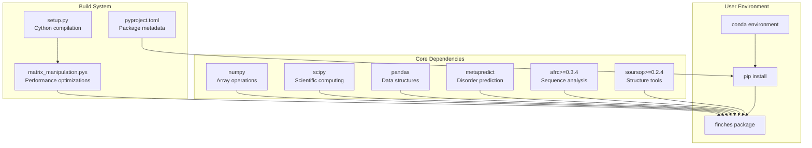
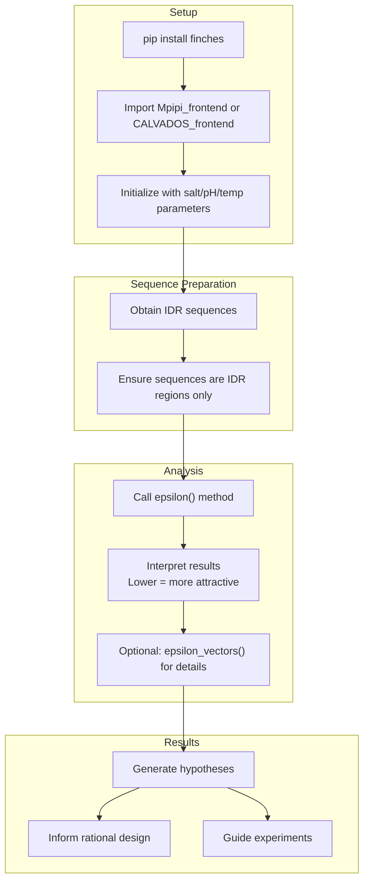

# Getting Started

> **Relevant source files**
> * [MANIFEST.in](https://github.com/idptools/finches/blob/5b52ba40/MANIFEST.in)
> * [demo/overview_uses/basic_uses.ipynb](https://github.com/idptools/finches/blob/5b52ba40/demo/overview_uses/basic_uses.ipynb)
> * [docs/getting_started.rst](https://github.com/idptools/finches/blob/5b52ba40/docs/getting_started.rst)
> * [docs/idr_idr.rst](https://github.com/idptools/finches/blob/5b52ba40/docs/idr_idr.rst)
> * [docs/phase_diagrams.rst](https://github.com/idptools/finches/blob/5b52ba40/docs/phase_diagrams.rst)
> * [pyproject.toml](https://github.com/idptools/finches/blob/5b52ba40/pyproject.toml)
> * [setup.cfg](https://github.com/idptools/finches/blob/5b52ba40/setup.cfg)
> * [setup.py](https://github.com/idptools/finches/blob/5b52ba40/setup.py)

This document provides installation instructions and basic usage patterns for FINCHES, guiding users through their first epsilon calculations and core concepts needed to predict chemical specificity in intrinsically disordered regions (IDRs). For detailed API documentation, see [API Reference](/idptools/finches/5-api-reference). For comprehensive examples and tutorials, see [Examples and Tutorials](/idptools/finches/6-examples-and-tutorials).

## Installation

FINCHES can be installed directly from GitHub using pip. The package includes Cython extensions for performance optimization and handles all dependencies automatically.

```python
# Create a new conda environment (recommended)conda create -n finches python=3.11 -yconda activate finches # Install directly from GitHubpip install git+https://git@github.com/idptools/finches.git
```

To verify the installation:

```javascript
python -c "import finches; print(finches.__version__)"
```

**Note:** The first import takes 60-90 seconds to initialize the environment, but subsequent imports are fast.

### Installation Architecture



Sources: [pyproject.toml L1-L76](https://github.com/idptools/finches/blob/5b52ba40/pyproject.toml#L1-L76)

 [setup.py L1-L32](https://github.com/idptools/finches/blob/5b52ba40/setup.py#L1-L32)

## Core Frontend Classes

FINCHES provides two main frontend classes that implement different forcefield models for predicting IDR interactions. Both classes provide identical APIs but use different underlying physics models.


Sources: [demo/overview_uses/basic_uses.ipynb L64-L68](https://github.com/idptools/finches/blob/5b52ba40/demo/overview_uses/basic_uses.ipynb#L64-L68)

 [demo/overview_uses/basic_uses.ipynb L94-L107](https://github.com/idptools/finches/blob/5b52ba40/demo/overview_uses/basic_uses.ipynb#L94-L107)

## Basic Usage Pattern

### Initialize Frontend Objects

```javascript
from finches.frontend.mpipi_frontend import Mpipi_frontendfrom finches.frontend.calvados_frontend import CALVADOS_frontend # Initialize with default parameters (physiological conditions)mf = Mpipi_frontend(salt=0.150, dielectric=80.0)  # Salt in M, dielectric constantcf = CALVADOS_frontend(salt=0.150, pH=7.4, temp=288)  # Salt in M, pH, temperature in K
```

### First Epsilon Calculation

Epsilon values quantify the overall attractive or repulsive nature of IDR-IDR interactions. Lower values indicate stronger attraction.

```python
# Example IDR sequencesmed1_idr = 'KSQASVSDPMNALQSLTGGPAAGAAGIGMPPRGPGQSLGGMGSLGAMGQPMSLSGQPPPGTSGMAPHSMAVVSTATPQTQLQLQQVALQQQQQQQQFQQQQQAALQQQQQQQQQQQFQAQQSAMQQQFQAVVQQQQQLQQQQQQQQHLIKLHHQNQQQIQQQQQQLQRIAQLQLQQQQQQQQQQQQQQQQALQAQPPIQQPPMQQPQPPPSQALPQQLQQMHHTQHHQPPPQPQQPPVAQNQPSQLPPQSQTQPLVSQAQALPGQMLYTQPPLKFVRAPMVVQQPPVQPQVQQQQTAVQTAQAAQMVAPGVQMITEALAQGGMHIRARFPPTTAVSAIPSSSIPLGRQPMAQVSQSSLPMLSSPSPGQQVQTPQSMPPPPQPSPQPGQPSSQPNSNVSSGPAPSPSSFLPSPSPQPSQSPVTARTPQNFSVPSPGPLNTPVNPSSVMSPAGSSQA'med14_idr = 'QDARRRSVNEDDNPPSPIGGDMMDSLISQLQPPPQQQPFPKQPGTSGAYPLTSPPTSYHSTVNQSPSMMHTQSPGNLHAASSPSGALRAPSPASFVPTPPPSSHGISIGPGASFASPHGTLDPSSPYTMVSPSGRAGNWPGSPQVSGPSPAARMPGMSPANPSLHSPVPDASHSPRAGTSSQTMPTNMPPPRKLPQRSWAAS' # Calculate epsilon valueepsilon_value = mf.epsilon(med1_idr, med14_idr)print(f"Epsilon value: {epsilon_value}")
```

### Understanding Epsilon Properties

#### Order Dependency (Extrinsic Calculation)

Epsilon calculations are order-dependent because they represent "bathing" the first sequence in the second sequence:

```python
# Order mattersepsilon_1_to_2 = mf.epsilon(med1_idr, med14_idr)  # med1 bathed in med14epsilon_2_to_1 = mf.epsilon(med14_idr, med1_idr)  # med14 bathed in med1 # These values will be differentprint(f"med1 in med14: {epsilon_1_to_2}")print(f"med14 in med1: {epsilon_2_to_1}")
```

#### Intrinsic vs Extrinsic Values

To obtain order-independent intrinsic values, divide by the length of the first sequence:

```markdown
intrinsic_1 = epsilon_1_to_2 / len(med1_idr)intrinsic_2 = epsilon_2_to_1 / len(med14_idr)# These values will be identical
```

### Baseline Calibration

Epsilon values are calibrated such that GS linker self-interactions return approximately zero:

```python
gs_linker = 20 * 'GS'  # 40-residue GS linkerbaseline_value = mf.epsilon(gs_linker, gs_linker)print(f"GS baseline: {baseline_value}")  # Should be ~0
```

Sources: [demo/overview_uses/basic_uses.ipynb L122-L202](https://github.com/idptools/finches/blob/5b52ba40/demo/overview_uses/basic_uses.ipynb#L122-L202)

 [demo/overview_uses/basic_uses.ipynb L227-L267](https://github.com/idptools/finches/blob/5b52ba40/demo/overview_uses/basic_uses.ipynb#L227-L267)

## Correction Terms

FINCHES includes correction terms to account for limitations in simple two-body interaction schemes:

### Aliphatic Correction

Accounts for the hydrophobic effect in aliphatic residue clusters:

```markdown
# With corrections (default)with_correction = mf.epsilon(seq1, seq2) # Without aliphatic correctionwithout_aliphatic = mf.epsilon(seq1, seq2, use_aliphatic_weighting=False)
```

### Charge Correction

Accounts for side chain orientation effects in charged residue clusters:

```markdown
# Without charge correctionwithout_charge = mf.epsilon(seq1, seq2, use_charge_weighting=False) # Without both correctionswithout_both = mf.epsilon(seq1, seq2,                          use_aliphatic_weighting=False,                          use_charge_weighting=False)
```

**Recommendation:** Keep both corrections enabled unless you have specific reasons to disable them.

Sources: [demo/overview_uses/basic_uses.ipynb L295-L310](https://github.com/idptools/finches/blob/5b52ba40/demo/overview_uses/basic_uses.ipynb#L295-L310)

## Epsilon Vector Analysis

For residue-level interaction analysis, use `epsilon_vectors()`:

```python
# Returns tuple: (attractive_array, repulsive_array)attractive, repulsive = mf.epsilon_vectors(seq1, seq2) # Each array has length equal to first sequenceprint(f"Attractive interactions shape: {attractive.shape}")print(f"First 10 attractive values: {attractive[:10]}")
```

This provides per-residue interaction strengths for detailed analysis of interaction patterns.

Sources: [demo/overview_uses/basic_uses.ipynb L595-L598](https://github.com/idptools/finches/blob/5b52ba40/demo/overview_uses/basic_uses.ipynb#L595-L598)

## Basic Workflow



Sources: [demo/overview_uses/basic_uses.ipynb L94-L107](https://github.com/idptools/finches/blob/5b52ba40/demo/overview_uses/basic_uses.ipynb#L94-L107)

 [demo/overview_uses/basic_uses.ipynb L163-L175](https://github.com/idptools/finches/blob/5b52ba40/demo/overview_uses/basic_uses.ipynb#L163-L175)

## Key Configuration Parameters

| Frontend Class | Parameters | Description |
| --- | --- | --- |
| `Mpipi_frontend` | `salt` (float) | Salt concentration in Molar |
|  | `dielectric` (float) | Dielectric constant (default: 80.0) |
| `CALVADOS_frontend` | `salt` (float) | Salt concentration in Molar |
|  | `pH` (float) | Solution pH (default: 7.4) |
|  | `temp` (float) | Temperature in Kelvin (default: 288) |

Both classes support identical method calls but use different underlying physics models.

Sources: [demo/overview_uses/basic_uses.ipynb L101-L106](https://github.com/idptools/finches/blob/5b52ba40/demo/overview_uses/basic_uses.ipynb#L101-L106)

## Next Steps

After completing basic epsilon calculations:

1. **Generate Interaction Maps**: Use `interaction_figure()` for 2D interaction visualization - see [Interaction Maps](/idptools/finches/3.3-interaction-maps)
2. **Analyze IDR-Folded Domain Interactions**: Use `FoldedDomain` class for PDB structure analysis - see [IDR-Folded Domain Analysis](/idptools/finches/3.4-idr-folded-domain-analysis)
3. **Create Phase Diagrams**: Use Flory-Huggins theory implementation - see [Phase Diagrams](/idptools/finches/3.5-phase-diagrams)
4. **Explore Advanced Features**: Review comprehensive examples in [Examples and Tutorials](/idptools/finches/6-examples-and-tutorials)

For troubleshooting installation or basic usage issues, consult the [Development Guide](/idptools/finches/7-development-guide) testing framework documentation.

Sources: [docs/getting_started.rst L43-L47](https://github.com/idptools/finches/blob/5b52ba40/docs/getting_started.rst#L43-L47)

 [docs/idr_idr.rst L13-L32](https://github.com/idptools/finches/blob/5b52ba40/docs/idr_idr.rst#L13-L32)