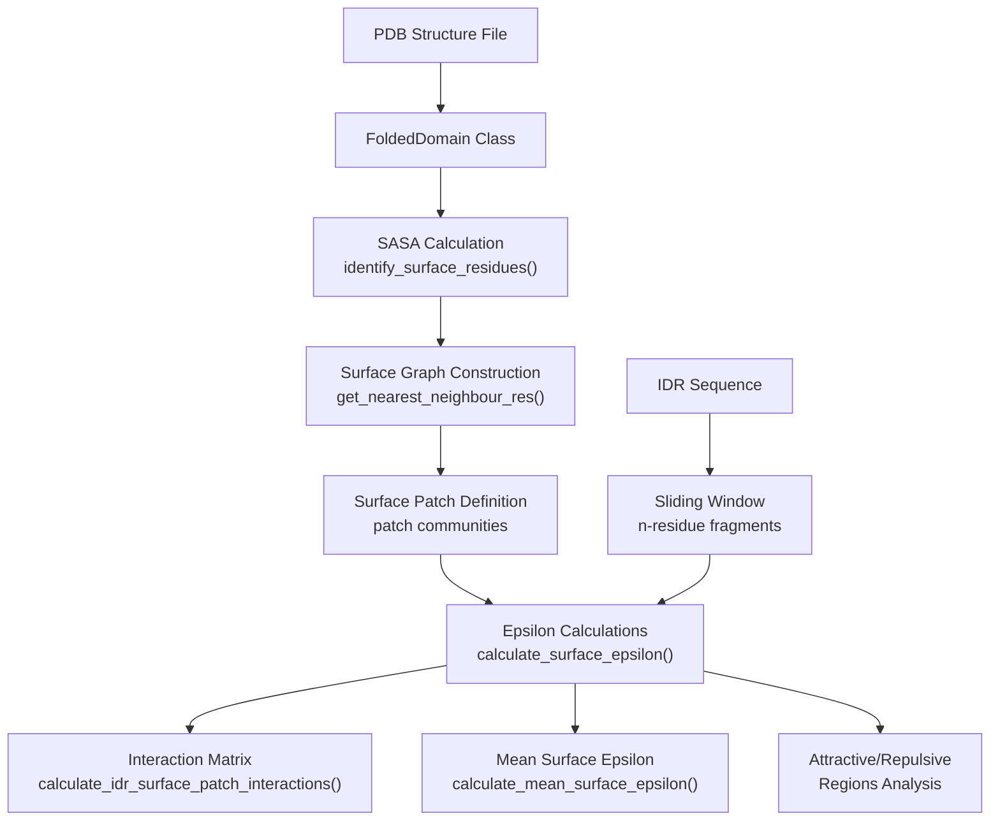
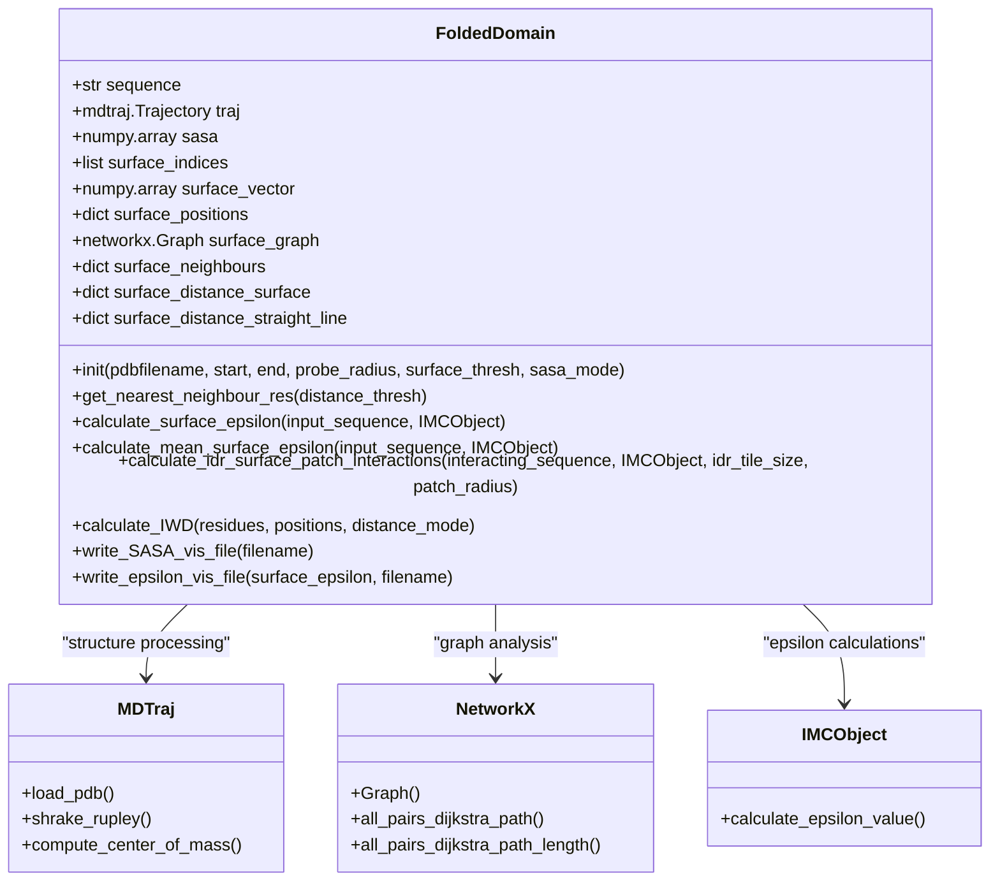
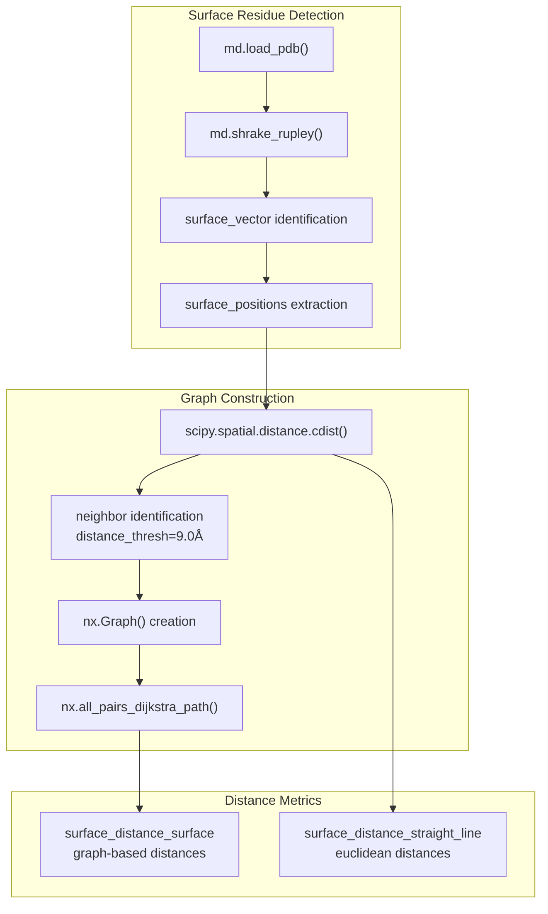
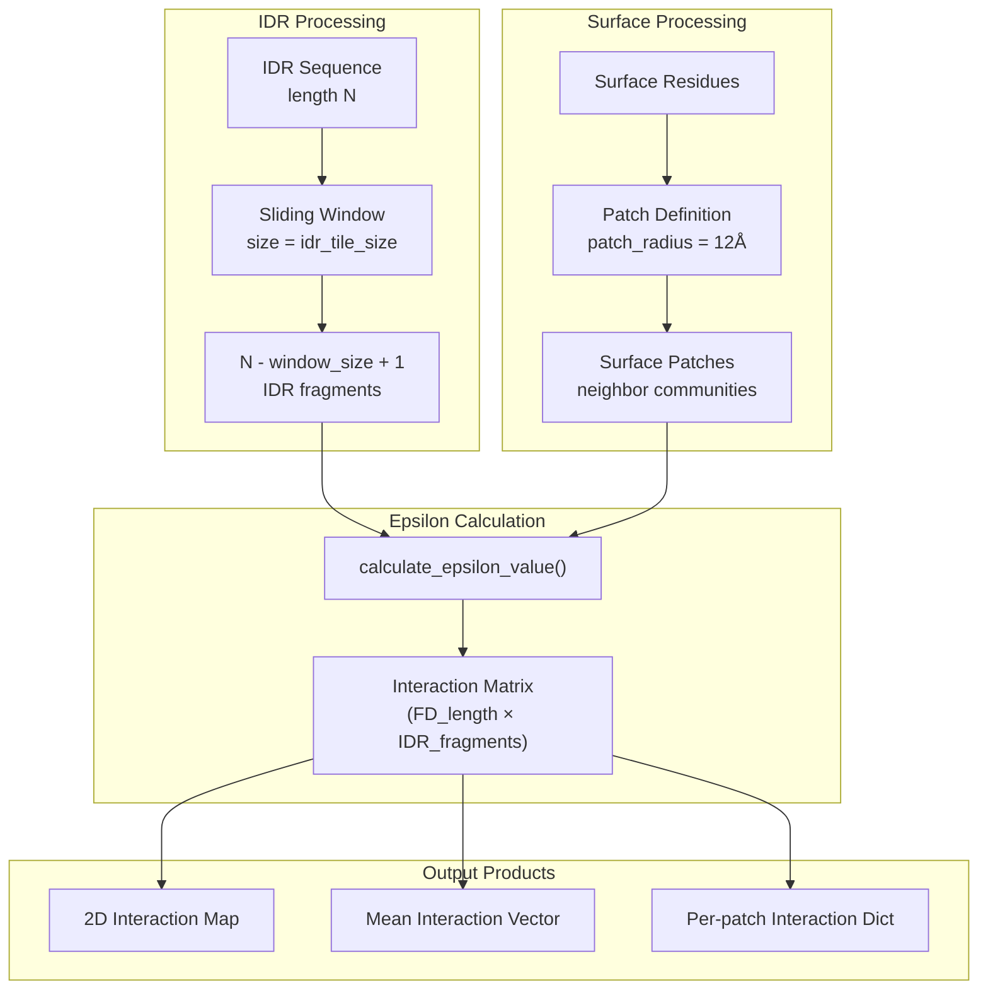

# IDR-Folded Domain Analysis

> **Relevant source files**
> * [Makefile](https://github.com/idptools/finches/blob/5b52ba40/Makefile)
> * [docs/idr_fd.rst](https://github.com/idptools/finches/blob/5b52ba40/docs/idr_fd.rst)
> * [docs/requirements.txt](https://github.com/idptools/finches/blob/5b52ba40/docs/requirements.txt)
> * [finches/PDB_structure_tools.py](https://github.com/idptools/finches/blob/5b52ba40/finches/PDB_structure_tools.py)
> * [finches/data/reference_sequence_info.py](https://github.com/idptools/finches/blob/5b52ba40/finches/data/reference_sequence_info.py)
> * [finches/multicomponent_evolution_at_sequence.py](https://github.com/idptools/finches/blob/5b52ba40/finches/multicomponent_evolution_at_sequence.py)
> * [finches/utils/folded_domain_utils.py](https://github.com/idptools/finches/blob/5b52ba40/finches/utils/folded_domain_utils.py)

This page covers FINCHES capabilities for analyzing interactions between intrinsically disordered regions (IDRs) and folded protein domains using PDB structure files. This analysis enables quantification of binding specificity between IDRs and specific surface patches on folded domains.

For general epsilon calculations between sequences, see [Epsilon Calculations](/idptools/finches/3.2-epsilon-calculations). For generating 2D interaction maps between IDR sequences, see [Interaction Maps](/idptools/finches/3.3-interaction-maps).

## Overview

IDR-folded domain analysis in FINCHES involves:

1. **Structure Processing**: Loading PDB files and identifying surface-exposed residues using SASA calculations
2. **Surface Characterization**: Building graphs of surface residues and defining local patches
3. **Epsilon Calculations**: Computing interaction strengths between IDR sequences and surface patches
4. **Interaction Mapping**: Generating 2D matrices showing IDR position vs. folded domain position interactions

The core workflow uses the `FoldedDomain` class to process PDB structures and integrate with FINCHES epsilon calculation engines.

**IDR-Folded Domain Analysis Workflow**



Sources: [finches/utils/folded_domain_utils.py L66-L984](https://github.com/idptools/finches/blob/5b52ba40/finches/utils/folded_domain_utils.py#L66-L984)

 [docs/idr_fd.rst L1-L87](https://github.com/idptools/finches/blob/5b52ba40/docs/idr_fd.rst#L1-L87)

## FoldedDomain Class Architecture

The `FoldedDomain` class serves as the primary interface for structure-based analysis. It integrates MDTraj for structure processing, NetworkX for graph analysis, and SciPy for distance calculations.

**FoldedDomain Class Structure**



Sources: [finches/utils/folded_domain_utils.py L66-L248](https://github.com/idptools/finches/blob/5b52ba40/finches/utils/folded_domain_utils.py#L66-L248)

 [finches/utils/folded_domain_utils.py L256-L306](https://github.com/idptools/finches/blob/5b52ba40/finches/utils/folded_domain_utils.py#L256-L306)

## Initialization and Surface Identification

### Basic Initialization

The `FoldedDomain` class initializes with a PDB file and automatically performs SASA calculations to identify surface residues:

```javascript
from finches.utils import folded_domain_utils # Initialize with PDB filefd = folded_domain_utils.FoldedDomain('protein.pdb') # Access computed propertiesprint(f"Sequence length: {len(fd.sequence)}")print(f"Surface fraction: {fd.surface_fraction}")print(f"Surface residue indices: {fd.surface_indices}")
```

### SASA-Based Surface Detection

Surface residues are identified using the Shrake-Rupley algorithm with configurable parameters:

| Parameter | Default | Description |
| --- | --- | --- |
| `probe_radius` | 1.4 Å | Probe radius for SASA calculation |
| `surface_thresh` | 0.10 | Threshold fraction of max SASA for surface classification |
| `sasa_mode` | 'v1' | SASA comparison mode ('v1' or 'v2') |

The `sasa_mode` parameter controls surface residue identification:

* **v1**: Compares residue SASA to sidechain-only max SASA
* **v2**: Compares residue SASA to combined sidechain + backbone max SASA (more stringent)

Sources: [finches/utils/folded_domain_utils.py L70-L196](https://github.com/idptools/finches/blob/5b52ba40/finches/utils/folded_domain_utils.py#L70-L196)

 [finches/utils/folded_domain_utils.py L17-L36](https://github.com/idptools/finches/blob/5b52ba40/finches/utils/folded_domain_utils.py#L17-L36)

## Surface Graph Construction and Neighbor Analysis

### Neighbor Detection

The `get_nearest_neighbour_res()` method builds a spatial graph of surface residues within a distance threshold:

```python
# Build surface graph with 9.0 Å distance thresholdfd.get_nearest_neighbour_res(distance_thresh=9.0) # Access neighbor informationfor residue_idx in fd.surface_indices:    neighbors = fd.surface_neighbours[residue_idx]    print(f"Residue {residue_idx}: {len(neighbors)} neighbors")
```

### Distance Calculations

The class maintains two distance metrics between surface residues:

* **`surface_distance_straight_line`**: Euclidean distances between residue positions
* **`surface_distance_surface`**: Graph-based distances following surface connectivity

**Surface Graph and Distance Analysis**



Sources: [finches/utils/folded_domain_utils.py L324-L440](https://github.com/idptools/finches/blob/5b52ba40/finches/utils/folded_domain_utils.py#L324-L440)

 [finches/utils/folded_domain_utils.py L360-L431](https://github.com/idptools/finches/blob/5b52ba40/finches/utils/folded_domain_utils.py#L360-L431)

## Epsilon Calculations

### Surface Epsilon Analysis

The `calculate_surface_epsilon()` method computes interaction strengths between an input IDR sequence and each surface residue's local environment:

```python
# Calculate surface epsilon valuessurface_eps = fd.calculate_surface_epsilon(idr_sequence, IMC_object) # surface_eps is a dictionary mapping residue_index -> [center_residue, neighbor_sequence, epsilon_value]for idx, (center_res, neighbor_seq, eps_val) in surface_eps.items():    print(f"Residue {idx} ({center_res}): ε = {eps_val:.3f}")
```

### Local Environment Reordering

The method implements chemical environment-aware reordering of neighbor residues:

| Center Residue Type | Reordering Strategy |
| --- | --- |
| Hydrophobic (I,V,L,A,M) | Place hydrophobic neighbors first |
| Negative (D,E) | Place negative neighbors first |
| Positive (K,R) | Place positive neighbors first |
| Other | No reordering |

This ensures that epsilon calculations reflect the local chemical context around each surface residue.

### Aggregate Metrics

```markdown
# Mean surface epsilonmean_eps = fd.calculate_mean_surface_epsilon(idr_sequence, IMC_object) # Attractive surface residues (ε < 0)attractive_eps = fd.calculate_attractive_surface_epsilon(idr_sequence, IMC_object) # Repulsive surface residues (ε > 0)  repulsive_eps = fd.calculate_repulsive_surface_epsilon(idr_sequence, IMC_object)
```

Sources: [finches/utils/folded_domain_utils.py L486-L584](https://github.com/idptools/finches/blob/5b52ba40/finches/utils/folded_domain_utils.py#L486-L584)

 [finches/utils/folded_domain_utils.py L543-L575](https://github.com/idptools/finches/blob/5b52ba40/finches/utils/folded_domain_utils.py#L543-L575)

## IDR-Surface Interaction Mapping

### Patch-Based Interaction Analysis

The `calculate_idr_surface_patch_interactions()` method generates comprehensive interaction matrices between IDR sequences and folded domain surface patches:

```markdown
# Generate IDR-surface interaction matrixinteraction_data = fd.calculate_idr_surface_patch_interactions(    interacting_sequence=idr_sequence,    IMCObject=IMC_object,    idr_tile_size=31,      # Sliding window size for IDR    patch_radius=12        # Surface patch radius in Å) # Returns: [interaction_dict, epsilon_matrix, mean_vector]interaction_dict, eps_matrix, mean_vector = interaction_data
```

### Interaction Matrix Structure

The output epsilon matrix has dimensions `(folded_domain_length, idr_length - window_size + 1)`:

* **Rows**: Folded domain residue positions (surface residues have values, buried residues are NaN)
* **Columns**: IDR sliding window positions
* **Values**: Epsilon interactions between IDR fragments and surface patches

**IDR-Surface Interaction Mapping Pipeline**



Sources: [finches/utils/folded_domain_utils.py L891-L984](https://github.com/idptools/finches/blob/5b52ba40/finches/utils/folded_domain_utils.py#L891-L984)

 [docs/idr_fd.rst L8-L48](https://github.com/idptools/finches/blob/5b52ba40/docs/idr_fd.rst#L8-L48)

## Advanced Analysis Methods

### Inverse Weighted Distance (IWD)

The `calculate_IWD()` method quantifies spatial clustering of specific residue types on the protein surface:

```markdown
# Calculate IWD for positively charged residuesiwd_result = fd.calculate_IWD(    residues=['K', 'R'],           # Target residue types    distance_mode='surface',       # 'surface' or 'straight_line'    calculate_null=True,           # Generate null distribution    number_null_iterations=100) iwd_value, num_residues, null_distribution = iwd_result
```

### Visualization Output

The class provides methods for generating visualization files compatible with molecular graphics software:

```markdown
# Binary surface/buried visualizationfd.write_SASA_vis_file('surface_residues.txt') # Epsilon value coloringsurface_eps = fd.calculate_surface_epsilon(idr_sequence, IMC_object)fd.write_epsilon_vis_file(surface_eps, 'epsilon_values.txt')
```

### Integration with Computational Engines

The analysis integrates with FINCHES frontend objects through the `IMCObject`:

| Frontend Class | IMC Object Access | Usage |
| --- | --- | --- |
| `Mpipi_frontend` | `mf.IMC_object` | Mpipi forcefield calculations |
| `CALVADOS_frontend` | `cf.IMC_object` | CALVADOS forcefield calculations |

Sources: [finches/utils/folded_domain_utils.py L703-L821](https://github.com/idptools/finches/blob/5b52ba40/finches/utils/folded_domain_utils.py#L703-L821)

 [finches/utils/folded_domain_utils.py L827-L889](https://github.com/idptools/finches/blob/5b52ba40/finches/utils/folded_domain_utils.py#L827-L889)

## Data Structures and Properties

### Key Object Properties

| Property | Type | Description |
| --- | --- | --- |
| `sequence` | str | Full amino acid sequence |
| `sasa` | numpy.array | Per-residue SASA values |
| `surface_vector` | list | Binary surface classification (0/1) |
| `surface_indices` | list | Indices of surface residues |
| `surface_positions` | dict | 3D coordinates of surface residues |
| `surface_graph` | networkx.Graph | Graph connecting surface residues |
| `surface_neighbours` | dict | Neighbor lists with distances |

### Lazy Property Evaluation

Several computationally expensive properties use lazy evaluation through the `@property` decorator:

* `all_shortest_paths`: Computed on first access via NetworkX
* `surface_graph`: Built during first neighbor analysis
* `surface_distance_surface`: Generated with graph construction
* `surface_distance_straight_line`: Calculated with distance matrix

This design pattern ensures efficient memory usage and computation only when needed.

Sources: [finches/utils/folded_domain_utils.py L86-L102](https://github.com/idptools/finches/blob/5b52ba40/finches/utils/folded_domain_utils.py#L86-L102)

 [finches/utils/folded_domain_utils.py L256-L306](https://github.com/idptools/finches/blob/5b52ba40/finches/utils/folded_domain_utils.py#L256-L306)