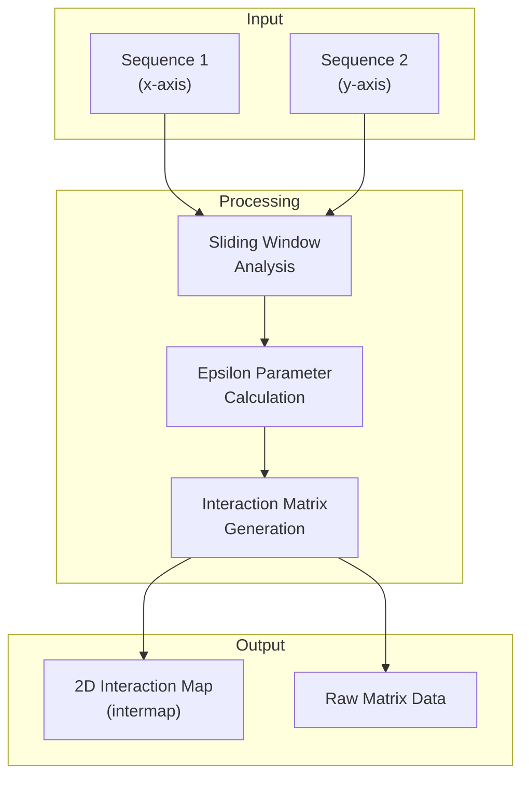
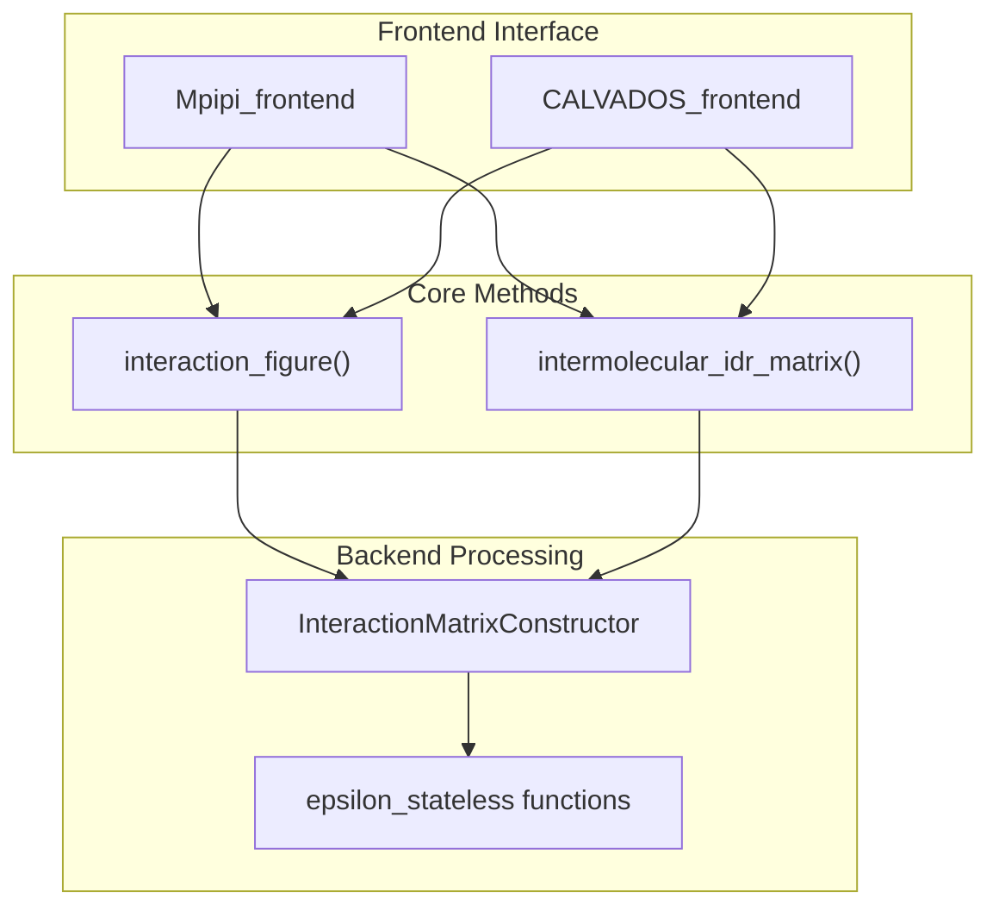
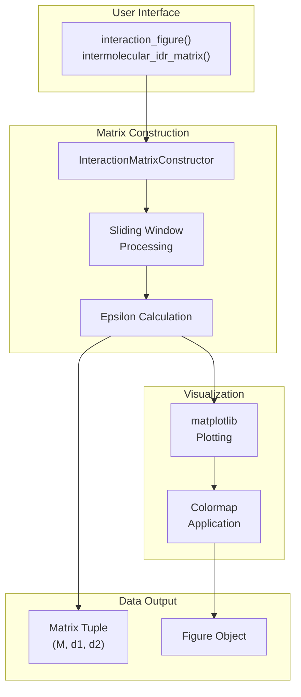
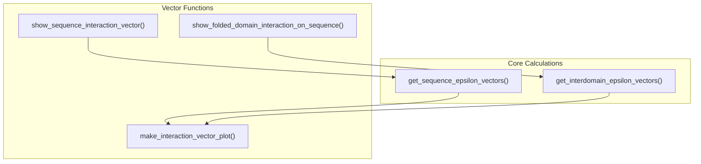

# Interaction Maps

> **Relevant source files**
> * [demo/nucleic_acid/protein_nucleic_acid_binding.ipynb](https://github.com/idptools/finches/blob/5b52ba40/demo/nucleic_acid/protein_nucleic_acid_binding.ipynb)
> * [demo/phase_diagrams/phase_diagram_demo.ipynb](https://github.com/idptools/finches/blob/5b52ba40/demo/phase_diagrams/phase_diagram_demo.ipynb)
> * [demo/protein_matrix/interaction_matrix_demo.ipynb](https://github.com/idptools/finches/blob/5b52ba40/demo/protein_matrix/interaction_matrix_demo.ipynb)
> * [docs/getting_started.rst](https://github.com/idptools/finches/blob/5b52ba40/docs/getting_started.rst)
> * [docs/idr_idr.rst](https://github.com/idptools/finches/blob/5b52ba40/docs/idr_idr.rst)
> * [docs/phase_diagrams.rst](https://github.com/idptools/finches/blob/5b52ba40/docs/phase_diagrams.rst)
> * [finches/interaction_vector.py](https://github.com/idptools/finches/blob/5b52ba40/finches/interaction_vector.py)

This section covers the generation and interpretation of 2D interaction maps (intermaps) between protein sequences, particularly intrinsically disordered regions (IDRs). Interaction maps provide a visual representation of predicted intermolecular interactions between two sequences, showing how residues from each sequence are likely to interact with one another.

For information about calculating single epsilon values between sequences, see [Epsilon Calculations](/idptools/finches/3.2-epsilon-calculations). For analysis of IDR interactions with folded domains, see [IDR-Folded Domain Analysis](/idptools/finches/3.4-idr-folded-domain-analysis).

## What are Interaction Maps

Interaction maps (intermaps) are 2D visualizations where each pixel represents the predicted interaction strength between residues from two different sequences. The x-axis corresponds to one sequence, the y-axis to the other sequence, and the color intensity indicates the strength of attraction (typically purple) or repulsion (typically green) between residue pairs.



*Sources: [docs/idr_idr.rst L5-L8](https://github.com/idptools/finches/blob/5b52ba40/docs/idr_idr.rst#L5-L8)

 [demo/protein_matrix/interaction_matrix_demo.ipynb L99-L101](https://github.com/idptools/finches/blob/5b52ba40/demo/protein_matrix/interaction_matrix_demo.ipynb#L99-L101)*

## Basic Usage

### Generating Interaction Maps

The primary interface for generating interaction maps is through the frontend classes using the `interaction_figure()` method:

```javascript
from finches import Mpipi_frontend, CALVADOS_frontend # Initialize frontend objectsmf = Mpipi_frontend()cf = CALVADOS_frontend() # Generate interaction mapmf.interaction_figure(sequence1, sequence2)
```

The `interaction_figure()` method creates a visual plot showing the predicted interactions between two sequences.



*Sources: [docs/idr_idr.rst L13-L32](https://github.com/idptools/finches/blob/5b52ba40/docs/idr_idr.rst#L13-L32)

 [finches/frontend/](https://github.com/idptools/finches/blob/5b52ba40/finches/frontend/)

 [demo/protein_matrix/interaction_matrix_demo.ipynb L54-L62](https://github.com/idptools/finches/blob/5b52ba40/demo/protein_matrix/interaction_matrix_demo.ipynb#L54-L62)*

### Accessing Raw Matrix Data

For numerical analysis, use `intermolecular_idr_matrix()` to obtain the underlying data:

```markdown
# Get raw matrix data(M, d1, d2) = mf.intermolecular_idr_matrix(sequence1, sequence2)
```

Where:

* `M`: Interaction matrix tuple containing sliding epsilon values and position indices
* `d1`: Disorder profile for sequence 1
* `d2`: Disorder profile for sequence 2

*Sources: [docs/idr_idr.rst L40-L51](https://github.com/idptools/finches/blob/5b52ba40/docs/idr_idr.rst#L40-L51)*

## Customization Parameters

### Window Size

The `window_size` parameter controls the sliding window used for calculation:

| Parameter | Default | Description |
| --- | --- | --- |
| `window_size` | 31 | Number of amino acids in sliding window |
| `tic_frequency` | varies | Spacing of axis tick marks |
| `vmin`/`vmax` | model-dependent | Color scale limits |

```markdown
# Smaller window for shorter sequencesmf.interaction_figure(seq1, seq2, window_size=13, tic_frequency=15)
```

*Sources: [docs/idr_idr.rst L57-L62](https://github.com/idptools/finches/blob/5b52ba40/docs/idr_idr.rst#L57-L62)*

### Color Scale Adjustment

Interaction maps use clipped color scales with model-specific ranges. Values exceeding the min/max thresholds appear at the extreme colors, which can mask relative differences between strongly interacting regions.

```markdown
# Custom color scalemf.interaction_figure(seq1, seq2, vmin=-2, vmax=2)
```

*Sources: [docs/idr_idr.rst L54-L56](https://github.com/idptools/finches/blob/5b52ba40/docs/idr_idr.rst#L54-L56)*

## Implementation Architecture



*Sources: [finches/epsilon_calculation.py](https://github.com/idptools/finches/blob/5b52ba40/finches/epsilon_calculation.py)

 [finches/interaction_vector.py](https://github.com/idptools/finches/blob/5b52ba40/finches/interaction_vector.py)

 High-level system architecture diagram*

## Advanced Features

### Disorder Filtering

Frontend objects can apply disorder filtering to focus analysis on truly disordered regions:

```markdown
# Enable disorder filteringmf = Mpipi_frontend(disorder_1=True, disorder_2=True)result = mf.intermolecular_idr_matrix(seq1, seq2)
```

When enabled, the disorder profiles `d1` and `d2` contain predicted disorder scores rather than all 1s.

### Interaction Vectors

For one-dimensional analysis, use functions from the `interaction_vector` module:



*Sources: [finches/interaction_vector.py L100-L144](https://github.com/idptools/finches/blob/5b52ba40/finches/interaction_vector.py#L100-L144)

 [finches/interaction_vector.py L19-L95](https://github.com/idptools/finches/blob/5b52ba40/finches/interaction_vector.py#L19-L95)*

## Output Interpretation

### Matrix Structure

The interaction matrix output `M` is a tuple containing:

1. Matrix of sliding epsilon values
2. Sequence 1 position indices mapping to matrix coordinates
3. Sequence 2 position indices mapping to matrix coordinates

### Color Coding

* **Purple/Attractive**: Negative epsilon values indicating favorable interactions
* **Green/Repulsive**: Positive epsilon values indicating unfavorable interactions
* **Intensity**: Magnitude of interaction strength within the color scale limits

### Spatial Resolution

Each pixel represents interactions centered on specific residue pairs, smoothed over the sliding window. The effective resolution depends on the window size parameter.

*Sources: [docs/idr_idr.rst L47-L51](https://github.com/idptools/finches/blob/5b52ba40/docs/idr_idr.rst#L47-L51)

 [docs/idr_idr.rst L5-L8](https://github.com/idptools/finches/blob/5b52ba40/docs/idr_idr.rst#L5-L8)*