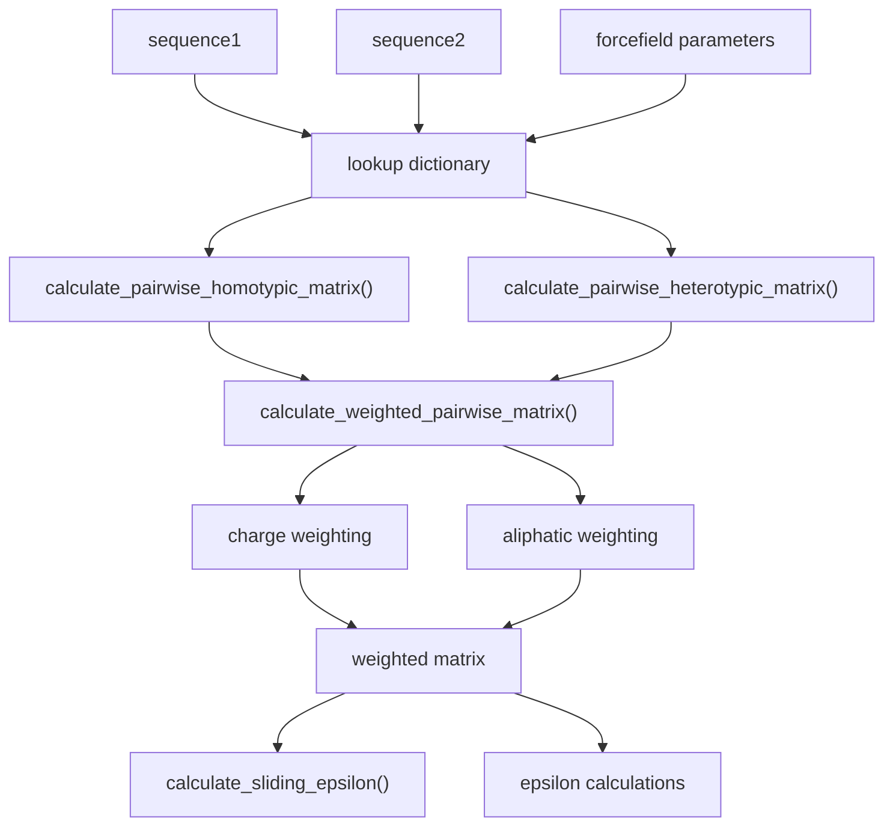
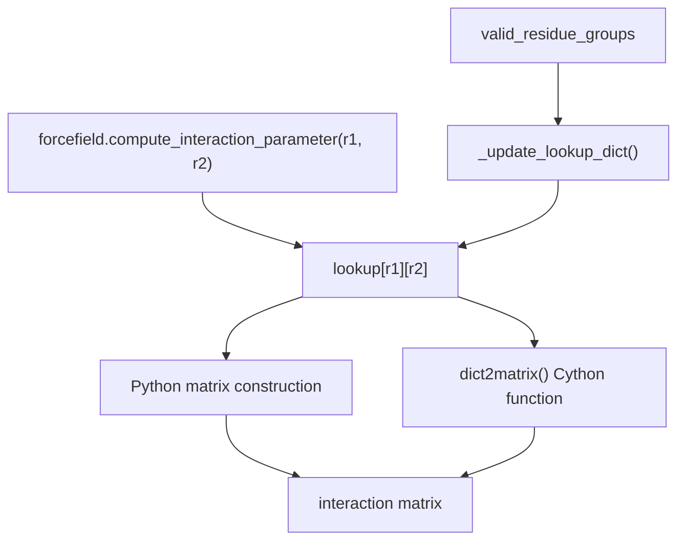
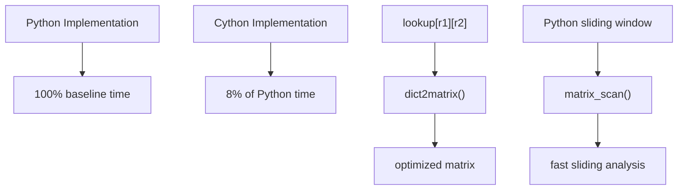
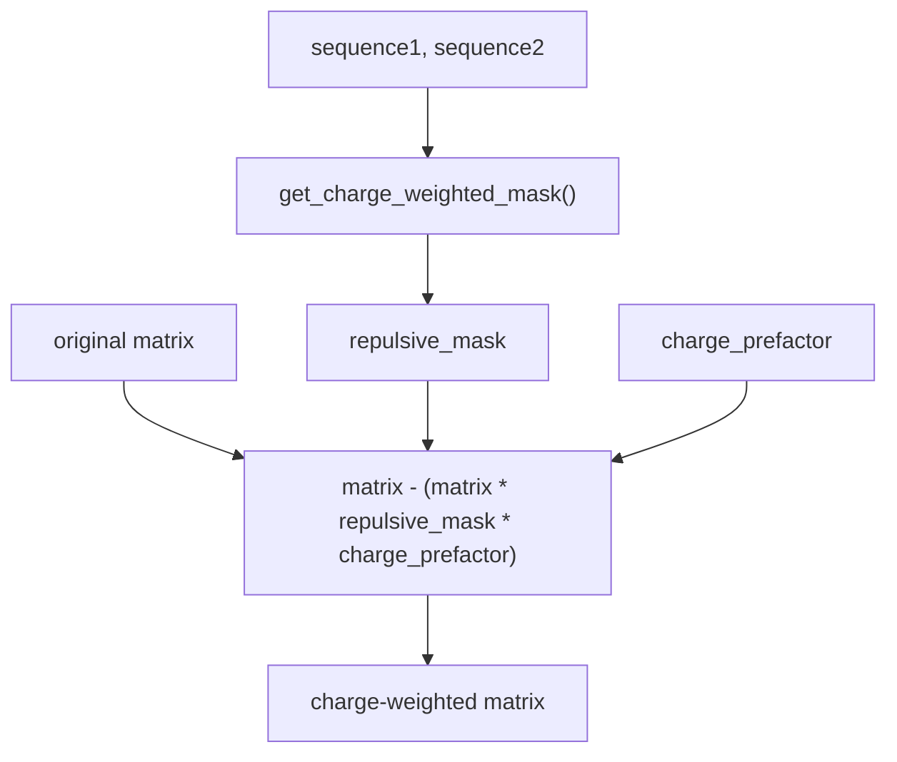
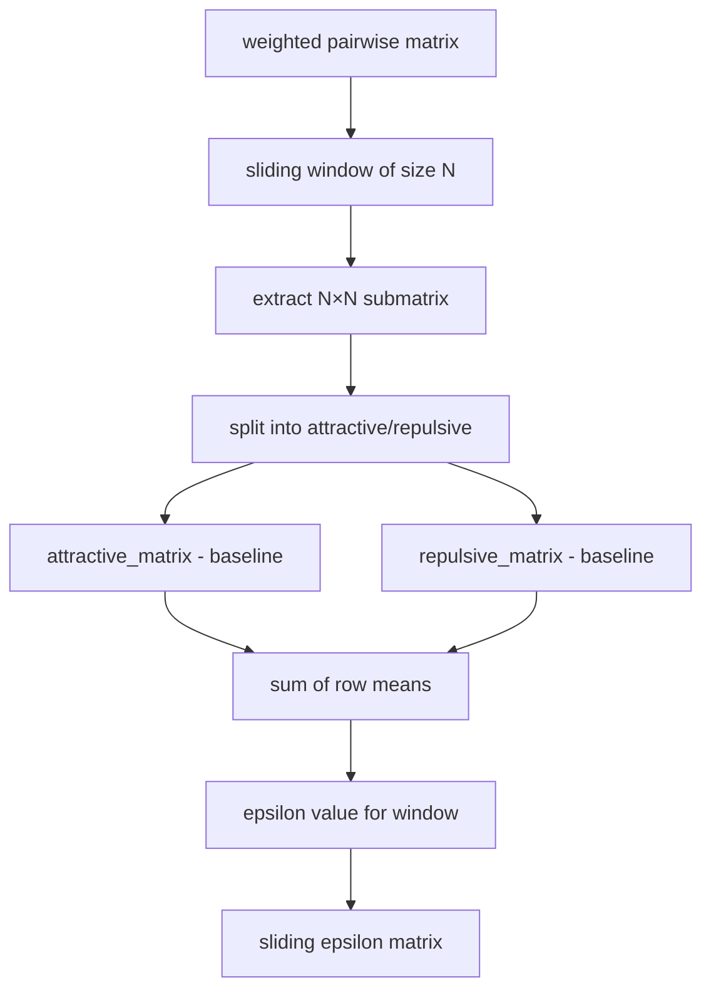

# Matrix Calculations

> **Relevant source files**
> * [.gitignore](https://github.com/idptools/finches/blob/5b52ba40/.gitignore)
> * [finches/data/forcefield_dependencies.py](https://github.com/idptools/finches/blob/5b52ba40/finches/data/forcefield_dependencies.py)
> * [finches/epsilon_calculation.py](https://github.com/idptools/finches/blob/5b52ba40/finches/epsilon_calculation.py)
> * [finches/utils/matrix_manipulation.pyx](https://github.com/idptools/finches/blob/5b52ba40/finches/utils/matrix_manipulation.pyx)

This page explains the core matrix operations that power FINCHES calculations, including how interaction matrices are constructed, optimized, and processed. For information about the forcefield models that provide interaction parameters, see [Forcefield Models](/idptools/finches/4.1-forcefield-models). For details about how epsilon values are derived from these matrices, see [Epsilon Calculations](/idptools/finches/3.2-epsilon-calculations).

## Overview

Matrix calculations form the computational backbone of FINCHES. The system converts amino acid sequences into numerical interaction matrices, applies various weighting schemes, and performs sliding window analysis to generate epsilon values and interaction maps. The core matrix operations are implemented in the `InteractionMatrixConstructor` class with performance-critical operations optimized using Cython.

## Matrix Types and Construction

FINCHES generates several types of interaction matrices depending on the analysis being performed:

Sources: [finches/epsilon_calculation.py L396-L603](https://github.com/idptools/finches/blob/5b52ba40/finches/epsilon_calculation.py#L396-L603)

### Pairwise Matrix Construction

The fundamental matrix operation converts two amino acid sequences into a 2D interaction matrix where each element represents the interaction strength between residue pairs.

**Homotypic Matrix**: Generated when analyzing a sequence against itself using `calculate_pairwise_homotypic_matrix()`. This simply calls the heterotypic function with identical sequences.

**Heterotypic Matrix**: Created by `calculate_pairwise_heterotypic_matrix()` for comparing two different sequences. The matrix dimensions are `len(sequence1) × len(sequence2)`.

The core algorithm uses a pre-computed lookup dictionary where `lookup[r1][r2]` contains the interaction parameter for residues `r1` and `r2`. The lookup table is populated by calling the forcefield's `compute_interaction_parameter()` method for all valid residue pairs.

Sources: [finches/epsilon_calculation.py L396-L422](https://github.com/idptools/finches/blob/5b52ba40/finches/epsilon_calculation.py#L396-L422)

 [finches/epsilon_calculation.py L426-L488](https://github.com/idptools/finches/blob/5b52ba40/finches/epsilon_calculation.py#L426-L488)

 [finches/epsilon_calculation.py L195-L252](https://github.com/idptools/finches/blob/5b52ba40/finches/epsilon_calculation.py#L195-L252)

### Lookup Dictionary Architecture

Sources: [finches/epsilon_calculation.py L195-L252](https://github.com/idptools/finches/blob/5b52ba40/finches/epsilon_calculation.py#L195-L252)

 [finches/utils/matrix_manipulation.pyx L14-L28](https://github.com/idptools/finches/blob/5b52ba40/finches/utils/matrix_manipulation.pyx#L14-L28)

## Performance Optimizations

Matrix construction is computationally intensive, especially for large sequences. FINCHES implements several performance optimizations:

### Cython Implementation

The most significant optimization uses Cython for matrix-heavy operations. The `matrix_manipulation.pyx` module provides optimized functions that reduce computation time to approximately 8% of the pure Python implementation.

**Key Cython Functions**:

* `dict2matrix()`: Converts lookup dictionary to matrix format
* `matrix_scan()`: Performs sliding window epsilon calculations

Sources: [finches/utils/matrix_manipulation.pyx L14-L28](https://github.com/idptools/finches/blob/5b52ba40/finches/utils/matrix_manipulation.pyx#L14-L28)

 [finches/utils/matrix_manipulation.pyx L33-L150](https://github.com/idptools/finches/blob/5b52ba40/finches/utils/matrix_manipulation.pyx#L33-L150)

 [finches/epsilon_calculation.py L440-L456](https://github.com/idptools/finches/blob/5b52ba40/finches/epsilon_calculation.py#L440-L456)

### Memory Management

The Cython implementation pre-allocates arrays and uses typed memory views for efficient matrix operations:

| Component | Type | Purpose |
| --- | --- | --- |
| `matrix` | `cnp.ndarray[cnp.float_t, ndim=2]` | Main interaction matrix |
| `attractive_matrix` | `cnp.ndarray[double, ndim=2]` | Attractive interactions only |
| `repulsive_matrix` | `cnp.ndarray[double, ndim=2]` | Repulsive interactions only |

Sources: [finches/utils/matrix_manipulation.pyx L22](https://github.com/idptools/finches/blob/5b52ba40/finches/utils/matrix_manipulation.pyx#L22-L22)

 [finches/utils/matrix_manipulation.pyx L86-L88](https://github.com/idptools/finches/blob/5b52ba40/finches/utils/matrix_manipulation.pyx#L86-L88)

## Matrix Weighting Mechanisms

Raw interaction matrices are modified by weighting factors that account for sequence context effects:

### Charge Weighting

Charge weighting reduces repulsive interactions between oppositely charged residues, mimicking the ability of charged sidechains to reorient to minimize unfavorable interactions.

The weighting formula: `weighted_matrix = matrix - (matrix * repulsive_mask * charge_prefactor)`

Where:

* `repulsive_mask`: Binary matrix identifying oppositely charged residue pairs
* `charge_prefactor`: Model-specific scaling factor (0 < value < 1)

Sources: [finches/epsilon_calculation.py L546-L576](https://github.com/idptools/finches/blob/5b52ba40/finches/epsilon_calculation.py#L546-L576)

 [finches/epsilon_calculation.py L552-L553](https://github.com/idptools/finches/blob/5b52ba40/finches/epsilon_calculation.py#L552-L553)

### Aliphatic Weighting

Aliphatic weighting enhances interactions between regions rich in hydrophobic residues by multiplying the matrix by an aliphatic weight mask.

`weighted_matrix = weighted_matrix * aliphatic_mask`

Sources: [finches/epsilon_calculation.py L597-L599](https://github.com/idptools/finches/blob/5b52ba40/finches/epsilon_calculation.py#L597-L599)

## Sliding Window Analysis

The `calculate_sliding_epsilon()` function generates interaction maps by computing epsilon values over sliding windows across the matrix.

### Algorithm Overview

1. Generate weighted pairwise matrix
2. Define sliding window of specified size (must be odd)
3. For each window position, extract submatrix
4. Calculate epsilon value for submatrix
5. Return epsilon matrix with corresponding sequence indices

Sources: [finches/epsilon_calculation.py L705-L872](https://github.com/idptools/finches/blob/5b52ba40/finches/epsilon_calculation.py#L705-L872)

 [finches/epsilon_calculation.py L795-L816](https://github.com/idptools/finches/blob/5b52ba40/finches/epsilon_calculation.py#L795-L816)

### Index Mapping

The sliding window analysis returns protein-space indices (starting from 1) rather than Python array indices (starting from 0). The mapping accounts for window size:

* Start index: `int((window_size-1)/2) + 1`
* End index: `(sequence_length - start_index) + 1`

This ensures that matrix positions correspond to the central residue of each sliding window.

Sources: [finches/epsilon_calculation.py L857-L865](https://github.com/idptools/finches/blob/5b52ba40/finches/epsilon_calculation.py#L857-L865)

 [finches/utils/matrix_manipulation.pyx L136-L144](https://github.com/idptools/finches/blob/5b52ba40/finches/utils/matrix_manipulation.pyx#L136-L144)

## Null Interaction Baseline

The null interaction baseline serves as a threshold to distinguish attractive from repulsive interactions. This value is calibrated against poly(GS) sequences, which are expected to behave as Gaussian chains with epsilon ≈ 0.

The baseline is determined by solving: `epsilon(GS_sequence) = 0`

This calibration ensures that the forcefield correctly reproduces reference behavior for neutral sequences.

Sources: [finches/data/forcefield_dependencies.py L17-L68](https://github.com/idptools/finches/blob/5b52ba40/finches/data/forcefield_dependencies.py#L17-L68)

 [finches/epsilon_calculation.py L168-L180](https://github.com/idptools/finches/blob/5b52ba40/finches/epsilon_calculation.py#L168-L180)