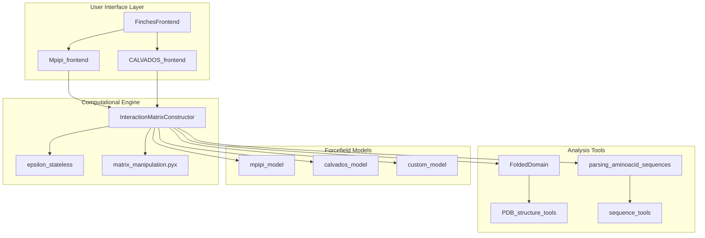
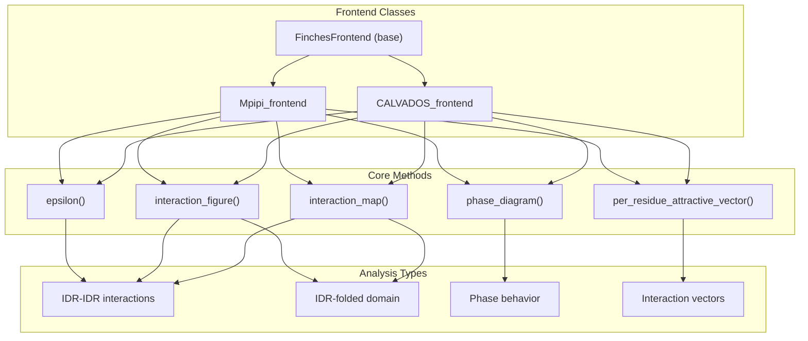
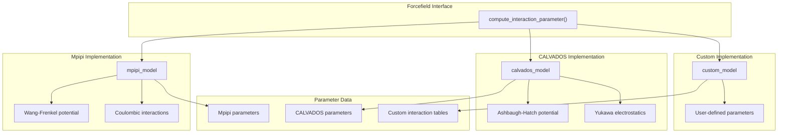
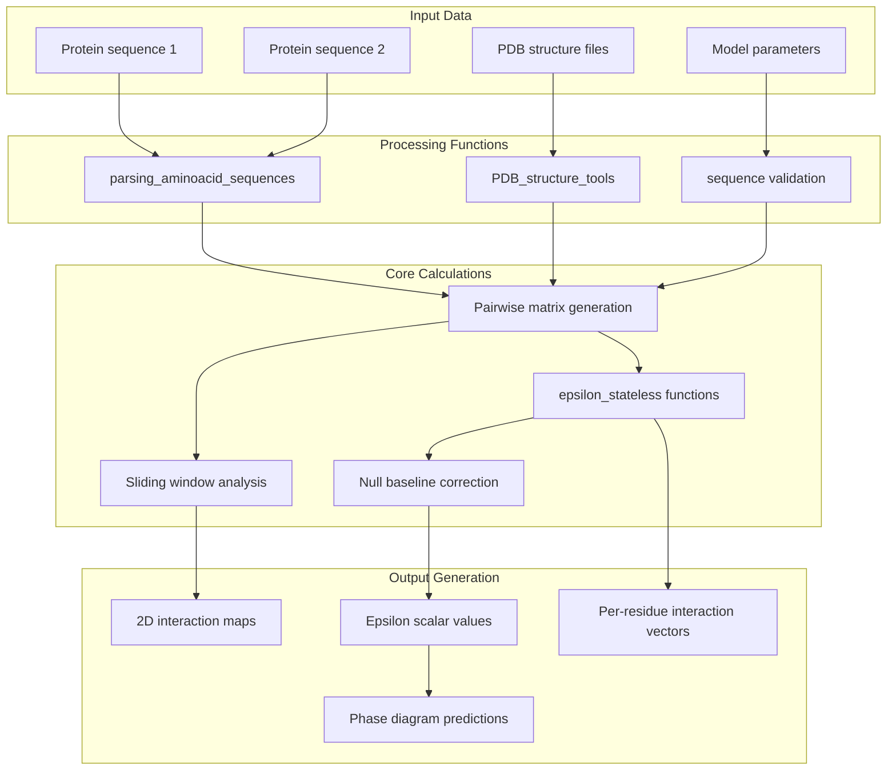
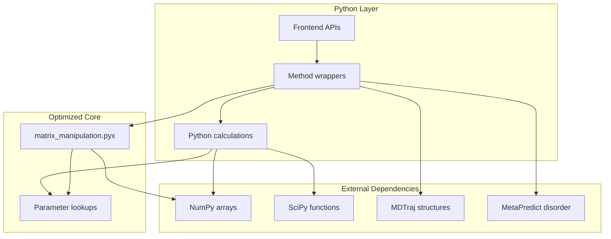

# Overview

> **Relevant source files**
> * [README.md](https://github.com/idptools/finches/blob/5b52ba40/README.md?plain=1)
> * [changelog.md](https://github.com/idptools/finches/blob/5b52ba40/changelog.md?plain=1)
> * [docs/index.rst](https://github.com/idptools/finches/blob/5b52ba40/docs/index.rst)
> * [finches/__init__.py](https://github.com/idptools/finches/blob/5b52ba40/finches/__init__.py)

## Purpose and Scope

This document provides a high-level introduction to the FINCHES software system, its core architecture, and primary capabilities. FINCHES (**F**irst-principle **I**nteractions via **CHE**mical **S**pecificity) is a Python package for predicting intermolecular interactions driven by intrinsically disordered regions (IDRs) in proteins using chemical physics principles extracted from coarse-grained force fields.

For detailed installation and setup instructions, see [Getting Started](/idptools/finches/2-getting-started). For comprehensive usage examples, see [User Guide](/idptools/finches/3-user-guide). For complete API documentation, see [API Reference](/idptools/finches/5-api-reference).

## What is FINCHES

FINCHES enables computational prediction of IDR-mediated interactions through sequence-based analysis. The system transforms amino acid sequences into quantitative interaction predictions using established forcefield parameters, supporting multiple analysis modes including pairwise interaction maps, mean-field interaction parameters (epsilon values), and phase behavior predictions.

**Sources:** [README.md L7-L8](https://github.com/idptools/finches/blob/5b52ba40/README.md?plain=1#L7-L8)

 [docs/index.rst L9-L23](https://github.com/idptools/finches/blob/5b52ba40/docs/index.rst#L9-L23)

## System Architecture

The FINCHES system follows a layered architecture with distinct separation between user interfaces, computational engines, and underlying forcefield models:

**Sources:** [finches/__init__.py L16-L17](https://github.com/idptools/finches/blob/5b52ba40/finches/__init__.py#L16-L17)

 [README.md L25-L34](https://github.com/idptools/finches/blob/5b52ba40/README.md?plain=1#L25-L34)

## User Interface Layer

FINCHES provides two primary frontend classes that implement identical interfaces for different forcefield models:

**Sources:** [finches/__init__.py L16-L17](https://github.com/idptools/finches/blob/5b52ba40/finches/__init__.py#L16-L17)

 [README.md L36-L43](https://github.com/idptools/finches/blob/5b52ba40/README.md?plain=1#L36-L43)

## Core Capabilities

FINCHES provides four primary analysis capabilities, each accessible through the frontend interfaces:

| Capability | Output | Use Case |
| --- | --- | --- |
| **Epsilon Calculation** | Scalar interaction parameter | Quantifying overall interaction strength between sequence pairs |
| **Interaction Maps** | 2D heatmap matrices | Visualizing residue-specific interaction patterns |
| **IDR-Folded Domain Analysis** | Surface interaction profiles | Analyzing IDR interactions with structured protein domains |
| **Phase Diagrams** | Concentration-temperature plots | Predicting liquid-liquid phase separation behavior |

**Sources:** [docs/index.rst L13-L22](https://github.com/idptools/finches/blob/5b52ba40/docs/index.rst#L13-L22)

## Computational Models

FINCHES implements multiple forcefield models through a unified interface, enabling comparative analysis using different physical frameworks:

**Sources:** [README.md L62-L71](https://github.com/idptools/finches/blob/5b52ba40/README.md?plain=1#L62-L71)

 [changelog.md L26-L30](https://github.com/idptools/finches/blob/5b52ba40/changelog.md?plain=1#L26-L30)

## Data Processing Pipeline

The system processes biological sequence and structural data through a standardized pipeline that transforms input data into quantitative interaction predictions:

**Sources:** [docs/index.rst L14-L21](https://github.com/idptools/finches/blob/5b52ba40/docs/index.rst#L14-L21)

 [README.md L36-L43](https://github.com/idptools/finches/blob/5b52ba40/README.md?plain=1#L36-L43)

## Performance Architecture

FINCHES employs strategic performance optimizations through Cython compilation for computationally intensive matrix operations:

**Sources:** [README.md L94-L108](https://github.com/idptools/finches/blob/5b52ba40/README.md?plain=1#L94-L108)

 [changelog.md L145](https://github.com/idptools/finches/blob/5b52ba40/changelog.md?plain=1#L145-L145)

## Current Status and Availability

FINCHES is available in multiple deployment formats to accommodate different user preferences and computational environments:

| Deployment | Access Method | Target Users |
| --- | --- | --- |
| **Python Package** | `pip install` from GitHub | Developers, power users |
| **Google Colab** | Pre-configured notebooks | Educational, quick analysis |
| **Web Interface** | [https://finches-online.com](https://finches-online.com) | General users, demonstrations |

The software is currently in public beta status, with active development focused on performance improvements and feature additions.

**Sources:** [README.md L12-L17](https://github.com/idptools/finches/blob/5b52ba40/README.md?plain=1#L12-L17)

 [README.md L16-L17](https://github.com/idptools/finches/blob/5b52ba40/README.md?plain=1#L16-L17)

 [changelog.md L4-L6](https://github.com/idptools/finches/blob/5b52ba40/changelog.md?plain=1#L4-L6)