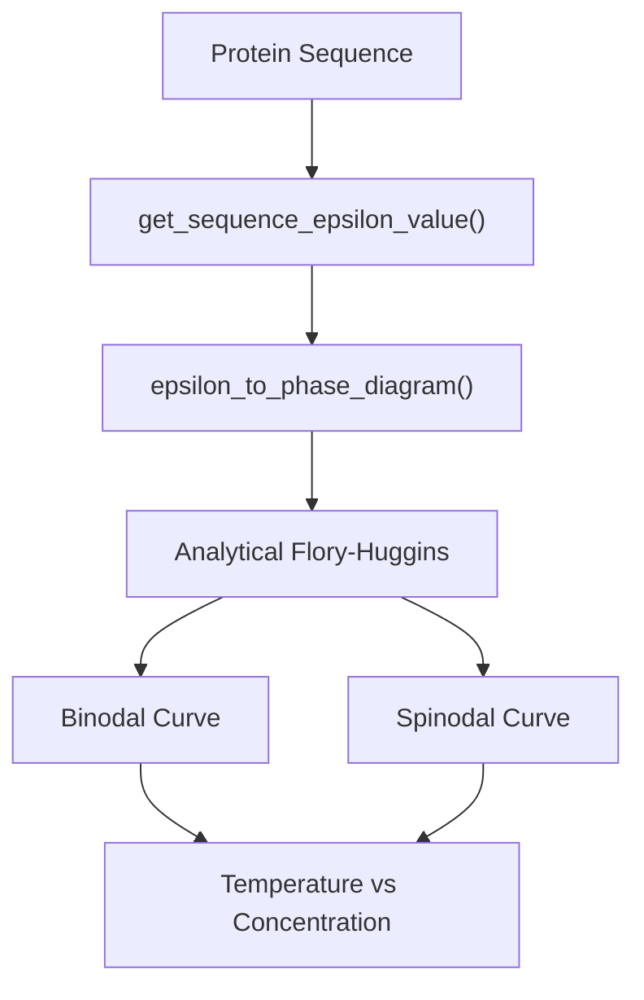
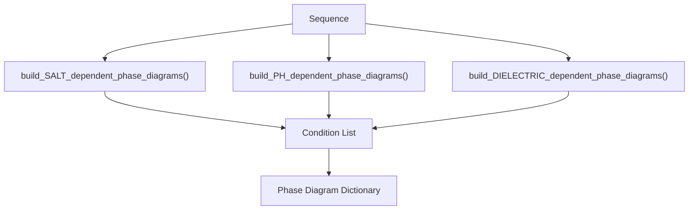
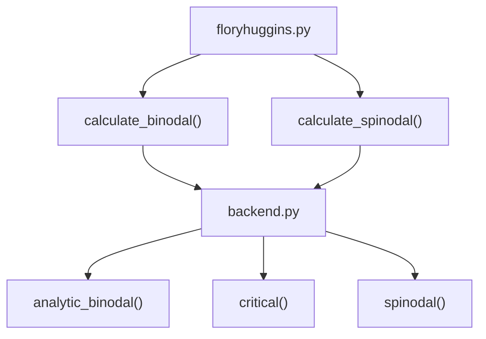
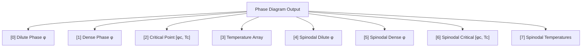

# Phase Diagrams

> **Relevant source files**
> * [demo/nucleic_acid/protein_nucleic_acid_binding.ipynb](https://github.com/idptools/finches/blob/5b52ba40/demo/nucleic_acid/protein_nucleic_acid_binding.ipynb)
> * [demo/phase_diagrams/phase_diagram_demo.ipynb](https://github.com/idptools/finches/blob/5b52ba40/demo/phase_diagrams/phase_diagram_demo.ipynb)
> * [demo/protein_matrix/interaction_matrix_demo.ipynb](https://github.com/idptools/finches/blob/5b52ba40/demo/protein_matrix/interaction_matrix_demo.ipynb)
> * [finches/analytical_fh/LICENSE](https://github.com/idptools/finches/blob/5b52ba40/finches/analytical_fh/LICENSE)
> * [finches/analytical_fh/README.md](https://github.com/idptools/finches/blob/5b52ba40/finches/analytical_fh/README.md?plain=1)
> * [finches/analytical_fh/__init__.py](https://github.com/idptools/finches/blob/5b52ba40/finches/analytical_fh/__init__.py)
> * [finches/analytical_fh/backend.py](https://github.com/idptools/finches/blob/5b52ba40/finches/analytical_fh/backend.py)
> * [finches/analytical_fh/floryhuggins.py](https://github.com/idptools/finches/blob/5b52ba40/finches/analytical_fh/floryhuggins.py)
> * [finches/data/calvados/calvados_residues.pickle](https://github.com/idptools/finches/blob/5b52ba40/finches/data/calvados/calvados_residues.pickle)
> * [finches/epsilon_to_FHtheory.py](https://github.com/idptools/finches/blob/5b52ba40/finches/epsilon_to_FHtheory.py)

This page covers the generation and interpretation of phase diagrams using Flory-Huggins theory in FINCHES. Phase diagrams predict liquid-liquid phase separation (LLPS) behavior by converting mean-field interaction parameters (epsilon values) into temperature-concentration phase space.

For information about calculating epsilon values, see [Epsilon Calculations](/idptools/finches/3.2-epsilon-calculations). For interaction maps, see [Interaction Maps](/idptools/finches/3.3-interaction-maps).

## Overview

FINCHES generates phase diagrams by combining computed epsilon values with analytical Flory-Huggins theory. The system converts dimensionless interaction parameters into physically meaningful temperature-concentration phase diagrams that predict condensate formation conditions.



**Core Phase Diagram Generation Flow**

Sources: [finches/epsilon_to_FHtheory.py L275-L351](https://github.com/idptools/finches/blob/5b52ba40/finches/epsilon_to_FHtheory.py#L275-L351)

## Phase Diagram Generation

### Basic Phase Diagram Calculation

The primary function `return_phase_diagram()` generates phase diagrams for individual sequences:

| Function | Purpose | Input | Output |
| --- | --- | --- | --- |
| `return_phase_diagram()` | Generate phase diagram for sequence | sequence, InteractionMatrixConstructor | [dilute, dense, critical_point, temperatures, spinodal_data] |
| `epsilon_to_phase_diagram()` | Convert epsilon to phase diagram | sequence, epsilon value | Phase diagram data arrays |

The process follows these steps:

1. **Epsilon Calculation**: Compute mean-field interaction parameter using `get_sequence_epsilon_value()`
2. **Energy Conversion**: Convert epsilon to site-specific contact energy: `delta_eps = -epsilon/len(seq)`
3. **Flory-Huggins Analysis**: Use analytical solutions to compute binodal and spinodal curves
4. **Temperature Mapping**: Convert chi values to temperatures: `T = delta_eps/chi`

Sources: [finches/epsilon_to_FHtheory.py L356-L447](https://github.com/idptools/finches/blob/5b52ba40/finches/epsilon_to_FHtheory.py#L356-L447)

### Condition-Dependent Phase Diagrams

FINCHES provides specialized functions for generating phase diagrams across different solution conditions:



**Condition-Dependent Phase Diagram Generation**

| Function | Variable Parameter | Use Case |
| --- | --- | --- |
| `build_SALT_dependent_phase_diagrams()` | Salt concentration | Ionic strength effects |
| `build_PH_dependent_phase_diagrams()` | pH value | Charge state variations |
| `build_DIELECTRIC_dependent_phase_diagrams()` | Dielectric constant | Solvent property effects |

Each function returns a list containing:

* `[0]`: List of condition values
* `[1]`: Dictionary of phase diagrams keyed by condition
* `[2]`: Dictionary of epsilon values keyed by condition

Sources: [finches/epsilon_to_FHtheory.py L33-L271](https://github.com/idptools/finches/blob/5b52ba40/finches/epsilon_to_FHtheory.py#L33-L271)

## Analytical Flory-Huggins Implementation

### Core Functions

The analytical Flory-Huggins calculations are handled by the `analytical_fh` module:



**Analytical Flory-Huggins Module Structure**

| Function | Purpose | Implementation |
| --- | --- | --- |
| `calculate_binodal()` | Compute coexistence curve | Wrapper around backend functions |
| `calculate_spinodal()` | Compute instability curve | Analytical spinodal calculation |
| `critical()` | Critical point calculation | `phi_c = 1/(1+√n)`, `chi_c = 0.5(1+1/√n)²` |

### Binodal Calculation Modes

The `calculate_binodal()` function supports multiple calculation modes:

| Mode | Description | Stability | Use Case |
| --- | --- | --- | --- |
| `'analytic_binodal'` | Analytical solution (recommended) | High | General use |
| `'binodal'` | Self-consistent iterative | Medium | Comparison |
| `'GL_binodal'` | Ginzburg-Landau approximation | Low | Near-critical region |

Sources: [finches/analytical_fh/floryhuggins.py L6-L124](https://github.com/idptools/finches/blob/5b52ba40/finches/analytical_fh/floryhuggins.py#L6-L124)

 [finches/analytical_fh/backend.py L249-L316](https://github.com/idptools/finches/blob/5b52ba40/finches/analytical_fh/backend.py#L249-L316)

## Phase Diagram Data Structure

### Return Format

Phase diagram functions return structured data arrays:



**Phase Diagram Data Structure**

### Critical Point and Phase Boundaries

For a polymer of length `n`, the critical point is calculated as:

* Critical volume fraction: `φc = 1/(1 + √n)`
* Critical chi parameter: `χc = 0.5(1 + 1/√n)²`

The binodal represents the coexistence curve where two phases can stably coexist, while the spinodal represents the limit of metastability.

Sources: [finches/epsilon_to_FHtheory.py L384-L392](https://github.com/idptools/finches/blob/5b52ba40/finches/epsilon_to_FHtheory.py#L384-L392)

 [finches/analytical_fh/backend.py L27-L53](https://github.com/idptools/finches/blob/5b52ba40/finches/analytical_fh/backend.py#L27-L53)

## Epsilon to Temperature Conversion

### Energy Scale Mapping

The conversion from FINCHES epsilon values to physical temperatures requires careful handling of energy scales:

1. **Sign Convention**: Negative epsilon values (attractive interactions) become positive `delta_eps`
2. **Length Normalization**: `delta_eps = -epsilon/len(seq)` converts chain-level to residue-level energy
3. **Temperature Conversion**: `T = delta_eps/chi` where chi is the Flory-Huggins parameter

### Handling Repulsive Interactions

For positive epsilon values (repulsive interactions), the system sets `epsilon = -0.01` to maintain mathematical validity while representing very weak attraction:

```
if epsilon > 0:    epsilon = -0.01
```

This prevents division-by-zero errors and ensures physically meaningful phase diagrams.

Sources: [finches/epsilon_to_FHtheory.py L397-L413](https://github.com/idptools/finches/blob/5b52ba40/finches/epsilon_to_FHtheory.py#L397-L413)

## Integration with FINCHES Framework

### Frontend Integration

Phase diagrams integrate with FINCHES frontend classes through the `InteractionMatrixConstructor`:


**Frontend Integration Architecture**

The phase diagram functions access force field parameters and baseline corrections through the constructor object, ensuring consistency with epsilon calculations.

Sources: [finches/epsilon_to_FHtheory.py L336-L347](https://github.com/idptools/finches/blob/5b52ba40/finches/epsilon_to_FHtheory.py#L336-L347)

 [demo/phase_diagrams/phase_diagram_demo.ipynb L36-L62](https://github.com/idptools/finches/blob/5b52ba40/demo/phase_diagrams/phase_diagram_demo.ipynb#L36-L62)