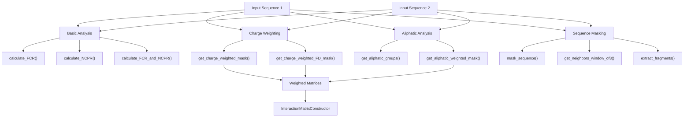
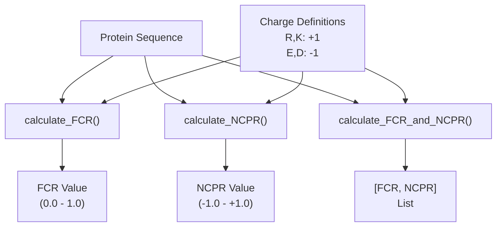
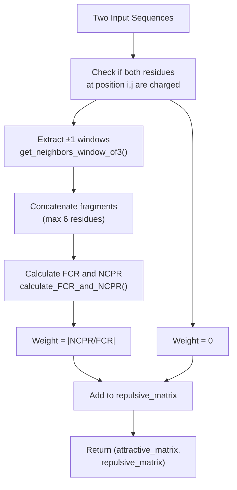
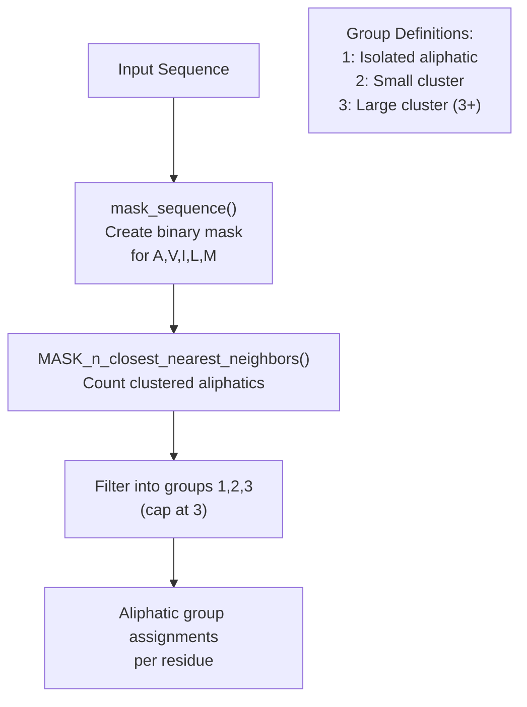
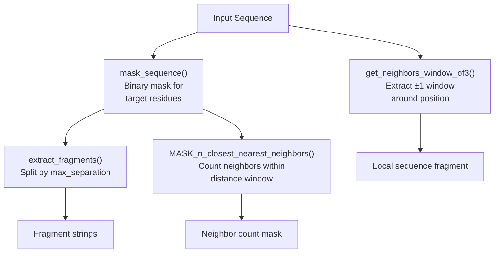
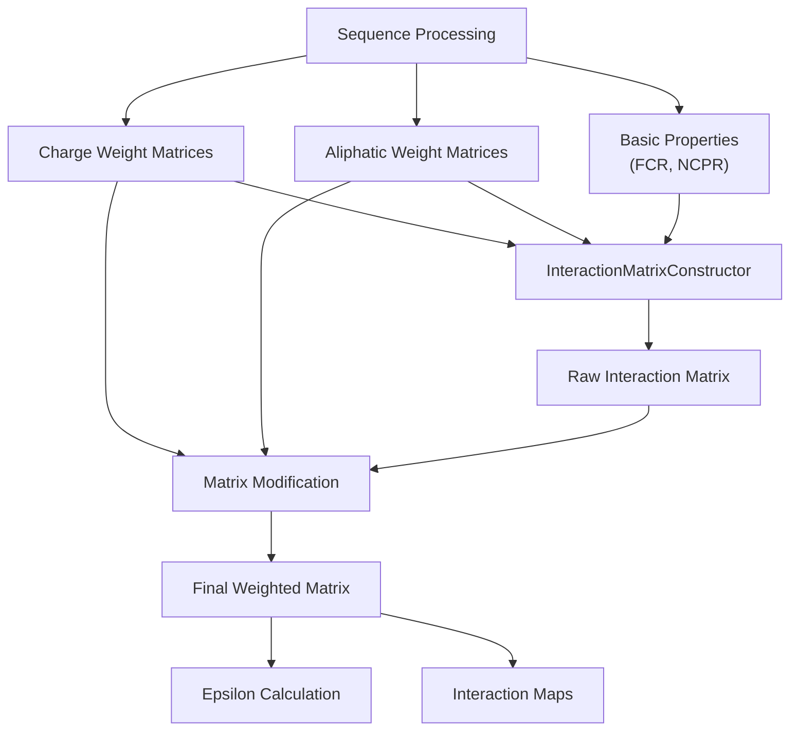

# Sequence Processing

> **Relevant source files**
> * [docs/extended_methods.rst](https://github.com/idptools/finches/blob/5b52ba40/docs/extended_methods.rst)
> * [finches/parsing_aminoacid_sequences.py](https://github.com/idptools/finches/blob/5b52ba40/finches/parsing_aminoacid_sequences.py)
> * [finches/sequence_tools.py](https://github.com/idptools/finches/blob/5b52ba40/finches/sequence_tools.py)

This document covers how FINCHES processes amino acid sequences to generate the weighted interaction matrices used in epsilon calculations and interaction maps. The sequence processing system handles charge weighting, aliphatic grouping, and various sequence analysis functions that capture local context effects in protein sequences.

For information about how these processed sequences are used in matrix calculations, see [Matrix Calculations](/idptools/finches/4.3-matrix-calculations). For details on the forcefield models that utilize these processed sequences, see [Forcefield Models](/idptools/finches/4.1-forcefield-models).

## Overview of Sequence Processing Pipeline

The sequence processing system transforms raw amino acid sequences into weighted interaction parameters through several key operations:

**Sequence Processing Pipeline in FINCHES**

Sources: [finches/parsing_aminoacid_sequences.py L1-L388](https://github.com/idptools/finches/blob/5b52ba40/finches/parsing_aminoacid_sequences.py#L1-L388)

 [finches/sequence_tools.py L1-L456](https://github.com/idptools/finches/blob/5b52ba40/finches/sequence_tools.py#L1-L456)

## Basic Sequence Analysis

FINCHES provides fundamental sequence analysis functions that calculate key biophysical properties of protein sequences:

| Function | Purpose | Output Range |
| --- | --- | --- |
| `calculate_FCR` | Fraction of Charged Residues | 0.0 to 1.0 |
| `calculate_NCPR` | Net Charge Per Residue | -1.0 to +1.0 |
| `calculate_FCR_and_NCPR` | Both FCR and NCPR | [FCR, NCPR] |

These functions use hardcoded charge assignments: R and K (+1), E and D (-1). The `calculate_FCR_and_NCPR` function is optimized for performance when both values are needed simultaneously.

**Basic Sequence Analysis Functions**

Sources: [finches/sequence_tools.py L12-L114](https://github.com/idptools/finches/blob/5b52ba40/finches/sequence_tools.py#L12-L114)

## Charge Weighting System

The charge weighting system captures local electrostatic context effects by modulating interactions between charged residues based on their local environment. This addresses the limitation that isolated charged residues may behave differently than charged residues in clusters.

### Core Charge Weighting Algorithm

The `get_charge_weighted_mask` function implements the primary charge weighting algorithm:

1. **Residue Pair Identification**: Only charged-charged residue pairs are processed
2. **Local Context Extraction**: Uses `get_neighbors_window_of3` to extract ±1 residue windows around each charged residue
3. **Fragment Analysis**: Concatenates the two 3-residue fragments and calculates FCR and NCPR
4. **Weight Calculation**: Computes `|NCPR/FCR|` as the charge weight

**Charge Weighting Algorithm Flow**

The algorithm produces two matrices:

* **Attractive matrix**: Currently unused (all zeros)
* **Repulsive matrix**: Contains charge weights for downweighting like-charge repulsion

Sources: [finches/parsing_aminoacid_sequences.py L25-L194](https://github.com/idptools/finches/blob/5b52ba40/finches/parsing_aminoacid_sequences.py#L25-L194)

### Folded Domain Charge Weighting

The `get_charge_weighted_FD_mask` function provides a specialized version for folded domain analysis where sequence1 represents surface-accessible folded domain residues:

* Treats sequence1 residues in isolation (no neighbor extraction)
* Concatenates single FD residue with 3-residue IDR window
* Used specifically for IDR-folded domain interaction analysis

Sources: [finches/parsing_aminoacid_sequences.py L200-L246](https://github.com/idptools/finches/blob/5b52ba40/finches/parsing_aminoacid_sequences.py#L200-L246)

## Aliphatic Grouping System

The aliphatic grouping system captures cooperative hydrophobic effects by weighting interactions between clusters of aliphatic residues more strongly than isolated aliphatic-aliphatic contacts.

### Aliphatic Residue Classification

FINCHES recognizes five aliphatic residues: A, V, I, L, M. These are grouped based on local clustering using the `get_aliphatic_groups` function:

**Aliphatic Grouping Process**

### Aliphatic Weighting Matrix

The `get_aliphatic_weighted_mask` function creates a weighting matrix that enhances interactions between aliphatic clusters:

| Group 1 vs Group 1 | Group 1 vs Group 2 | Group 1 vs Group 3 | Group 2 vs Group 2 | Group 2 vs Group 3 | Group 3 vs Group 3 |
| --- | --- | --- | --- | --- | --- |
| 1.0 | 1.0 | 1.0 | 1.5 | 1.5 | 3.0 |

This multiplicative weighting scheme enhances attractive interactions between larger aliphatic clusters, reflecting the cooperative nature of hydrophobic interactions.

Sources: [finches/parsing_aminoacid_sequences.py L252-L341](https://github.com/idptools/finches/blob/5b52ba40/finches/parsing_aminoacid_sequences.py#L252-L341)

## Sequence Masking and Fragment Analysis

The sequence processing system includes several utilities for sequence masking and fragment extraction:

### Core Masking Functions

**Sequence Masking and Fragment Analysis Functions**

### Key Masking Operations

| Function | Purpose | Parameters |
| --- | --- | --- |
| `mask_sequence` | Create binary mask for target residues | `sequence`, `target_residues` |
| `extract_fragments` | Split mask into fragments by gaps | `mask`, `max_separation` |
| `MASK_n_closest_nearest_neighbors` | Count clustered neighbors | `mask`, `max_separation`, `max_distance` |
| `get_neighbors_window_of3` | Extract ±1 residue window | `i`, `sequence` |

These functions support the charge weighting and aliphatic grouping algorithms by providing flexible sequence analysis capabilities.

Sources: [finches/sequence_tools.py L122-L318](https://github.com/idptools/finches/blob/5b52ba40/finches/sequence_tools.py#L122-L318)

## Integration with Matrix Calculations

The sequence processing outputs are consumed by the core matrix calculation engine:

**Integration with Core Calculation Engine**

The charge weighting matrices are used to reduce repulsive interactions between like-charged clusters, while aliphatic weighting matrices enhance attractive interactions between hydrophobic clusters. These modifications are applied to the raw forcefield-generated interaction matrices to capture local context effects that improve predictive accuracy.

Sources: [finches/parsing_aminoacid_sequences.py L1-L388](https://github.com/idptools/finches/blob/5b52ba40/finches/parsing_aminoacid_sequences.py#L1-L388)

 [finches/sequence_tools.py L1-L456](https://github.com/idptools/finches/blob/5b52ba40/finches/sequence_tools.py#L1-L456)