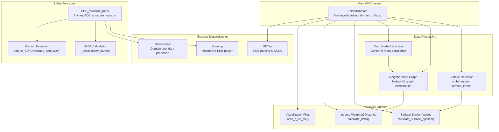
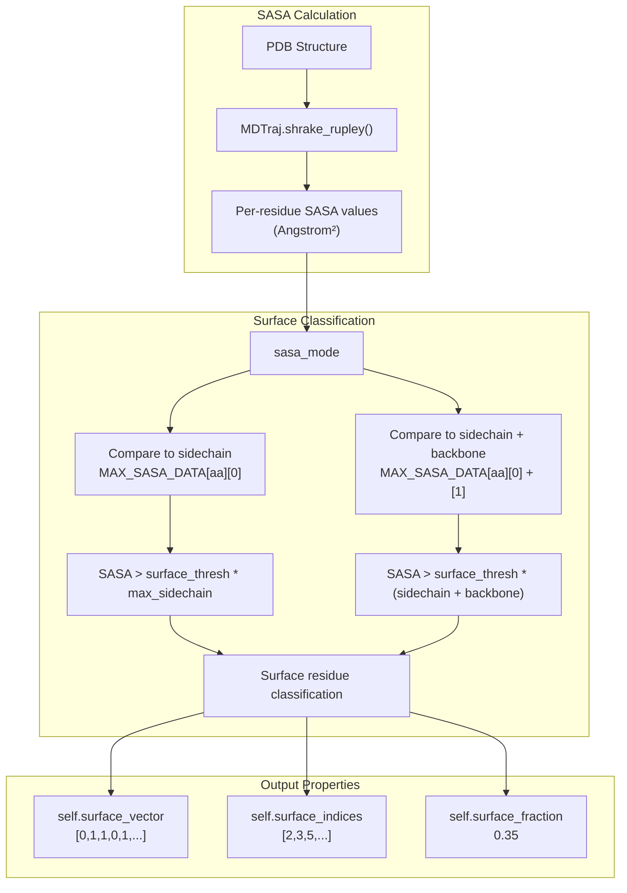
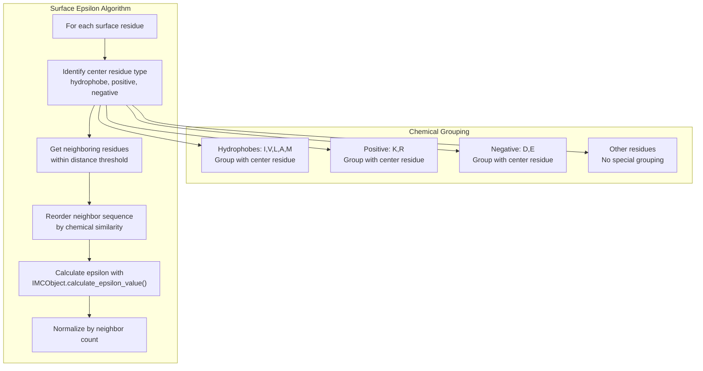
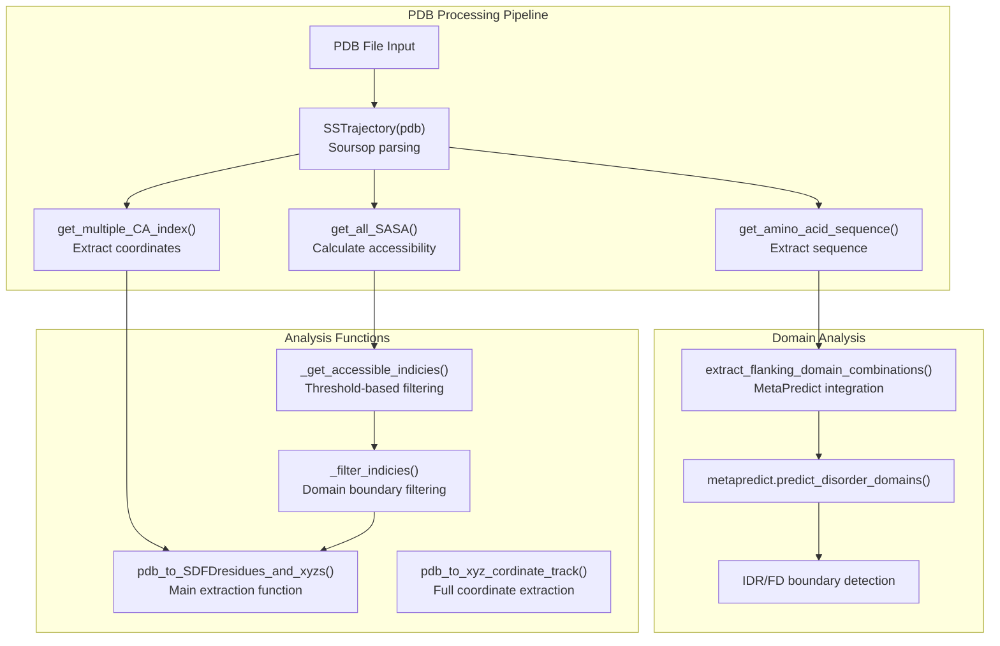
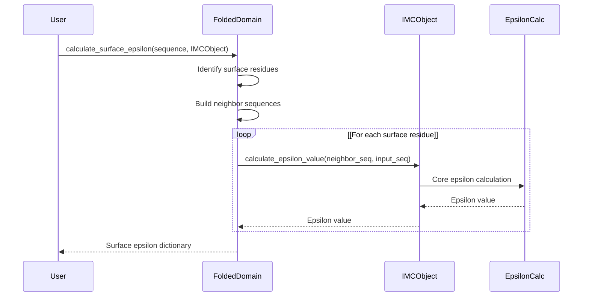

# Structure Analysis

> **Relevant source files**
> * [Makefile](https://github.com/idptools/finches/blob/5b52ba40/Makefile)
> * [docs/requirements.txt](https://github.com/idptools/finches/blob/5b52ba40/docs/requirements.txt)
> * [finches/PDB_structure_tools.py](https://github.com/idptools/finches/blob/5b52ba40/finches/PDB_structure_tools.py)
> * [finches/data/reference_sequence_info.py](https://github.com/idptools/finches/blob/5b52ba40/finches/data/reference_sequence_info.py)
> * [finches/multicomponent_evolution_at_sequence.py](https://github.com/idptools/finches/blob/5b52ba40/finches/multicomponent_evolution_at_sequence.py)
> * [finches/utils/folded_domain_utils.py](https://github.com/idptools/finches/blob/5b52ba40/finches/utils/folded_domain_utils.py)

This page provides API documentation for FINCHES structure analysis components, which enable the analysis of interactions between intrinsically disordered regions (IDRs) and folded protein domains using PDB structure files. The structure analysis system processes PDB files to identify surface-accessible residues, calculate solvent accessible surface areas (SASA), and compute epsilon values for IDR-folded domain interactions.

For general usage guidance on IDR-folded domain analysis, see [IDR-Folded Domain Analysis](/idptools/finches/3.4-idr-folded-domain-analysis). For core epsilon calculation concepts, see [Matrix Calculations](/idptools/finches/4.3-matrix-calculations).

## System Architecture

The structure analysis system consists of two main components: the `FoldedDomain` class for comprehensive structural analysis and a collection of utility functions for PDB processing.

### Structure Analysis Component Overview



Sources: [finches/utils/folded_domain_utils.py L1-L1000](https://github.com/idptools/finches/blob/5b52ba40/finches/utils/folded_domain_utils.py#L1-L1000)

 [finches/PDB_structure_tools.py L1-L630](https://github.com/idptools/finches/blob/5b52ba40/finches/PDB_structure_tools.py#L1-L630)

## FoldedDomain Class

The `FoldedDomain` class is the primary interface for folded domain structural analysis, providing comprehensive functionality for surface residue identification, epsilon calculations, and structural characterization.

### Class Initialization and Core Properties

```mermaid
flowchart TD

GRAPH["self.surface_graph<br>@property NetworkX graph"]
NEIGHBORS["self.surface_neighbours<br>@property Distance-based neighbors"]
PATHS["self.all_shortest_paths<br>@property Graph shortest paths"]
INIT["FoldedDomain.init()<br>pdbfilename, start, end<br>probe_radius, surface_thresh"]
SEQ["self.sequence<br>Full AA sequence"]
TRAJ["self.traj<br>MDTraj trajectory"]
SASA_PROP["self.sasa<br>Per-residue SASA values"]
SURF_VEC["self.surface_vector<br>Binary surface indicators"]
SURF_IDX["self.surface_indices<br>Surface residue indices"]
SURF_POS["self.surface_positions<br>3D coordinates dict"]

INIT --> SEQ
INIT --> TRAJ
INIT --> SASA_PROP
INIT --> SURF_VEC
INIT --> SURF_IDX
INIT --> SURF_POS

subgraph subGraph1 ["Core Properties"]
    SEQ
    TRAJ
    SASA_PROP
    SURF_VEC
    SURF_IDX
    SURF_POS
end

subgraph FoldedDomain.__init__() ["FoldedDomain.init()"]
    INIT
end

subgraph subGraph2 ["Lazy Properties"]
    GRAPH
    NEIGHBORS
    PATHS
    GRAPH --> NEIGHBORS
    NEIGHBORS --> PATHS
end
```

The `FoldedDomain` constructor accepts several key parameters:

| Parameter | Type | Default | Description |
| --- | --- | --- | --- |
| `pdbfilename` | str | Required | Path to PDB file |
| `start` | int | None | Start residue index (0-based) |
| `end` | int | None | End residue index (0-based) |
| `probe_radius` | float | 1.4 | Probe radius for SASA calculation (Angstroms) |
| `surface_thresh` | float | 0.10 | Threshold for surface residue classification |
| `sasa_mode` | str | 'v1' | SASA comparison mode ('v1' or 'v2') |
| `residue_overide_mapping` | dict | {} | Non-standard residue name mapping |
| `ignore_warnings` | bool | False | Suppress start/end warnings |
| `SASA_ONLY` | bool | False | Calculate only SASA, skip other analysis |

Sources: [finches/utils/folded_domain_utils.py L66-L196](https://github.com/idptools/finches/blob/5b52ba40/finches/utils/folded_domain_utils.py#L66-L196)

### Surface Residue Detection

The surface detection algorithm uses solvent accessible surface area (SASA) calculations to identify residues exposed to solvent. The system supports two SASA comparison modes:



The `MAX_SASA_DATA` dictionary contains reference SASA values for each amino acid type, calculated from GXG tripeptide simulations with excluded volume interactions.

Sources: [finches/utils/folded_domain_utils.py L14-L36](https://github.com/idptools/finches/blob/5b52ba40/finches/utils/folded_domain_utils.py#L14-L36)

 [finches/utils/folded_domain_utils.py L197-L237](https://github.com/idptools/finches/blob/5b52ba40/finches/utils/folded_domain_utils.py#L197-L237)

### Neighborhood Analysis and Graph Construction

The `FoldedDomain` class builds spatial relationship graphs of surface residues for distance-based analysis:

```mermaid
flowchart TD

POSITIONS["Surface residue positions<br>Center of mass coordinates"]
DISTANCE_MATRIX["Euclidean distance matrix<br>scipy.spatial.distance.cdist()"]
THRESHOLD["Distance threshold filter<br>default: 9.0 Angstroms"]
NEIGHBORS["Neighbor identification<br>residues within threshold"]
NETWORKX["NetworkX graph creation<br>Weighted by distances"]
DIJKSTRA["Shortest path calculation<br>nx.all_pairs_dijkstra_path()"]
SURF_GRAPH["self.surface_graph<br>NetworkX.Graph object"]
SURF_NEIGHBORS["self.surface_neighbours<br>Dict[int, List[Tuple]]"]
SURFACE_DIST["self.surface_distance_surface<br>Over-surface distances"]
STRAIGHT_DIST["self.surface_distance_straight_line<br>Euclidean distances"]

THRESHOLD --> NEIGHBORS
NETWORKX --> SURF_GRAPH
NEIGHBORS --> SURF_NEIGHBORS
DIJKSTRA --> SURFACE_DIST
DISTANCE_MATRIX --> STRAIGHT_DIST

subgraph subGraph2 ["Output Properties"]
    SURF_GRAPH
    SURF_NEIGHBORS
    SURFACE_DIST
    STRAIGHT_DIST
end

subgraph subGraph1 ["Graph Construction"]
    NEIGHBORS
    NETWORKX
    DIJKSTRA
    NEIGHBORS --> NETWORKX
    NETWORKX --> DIJKSTRA
end

subgraph get_nearest_neighbour_res() ["get_nearest_neighbour_res()"]
    POSITIONS
    DISTANCE_MATRIX
    THRESHOLD
    POSITIONS --> DISTANCE_MATRIX
    DISTANCE_MATRIX --> THRESHOLD
end
```

Sources: [finches/utils/folded_domain_utils.py L324-L440](https://github.com/idptools/finches/blob/5b52ba40/finches/utils/folded_domain_utils.py#L324-L440)

### Epsilon Calculation Methods

The `FoldedDomain` class provides several methods for calculating epsilon values between surface residues and input sequences:

| Method | Return Type | Description |
| --- | --- | --- |
| `calculate_surface_epsilon()` | Dict[int, List] | Per-residue epsilon values with local context |
| `calculate_mean_surface_epsilon()` | float | Mean epsilon across all surface residues |
| `calculate_attractive_surface_epsilon()` | List[float] | Epsilon values below threshold (attractive) |
| `calculate_repulsive_surface_epsilon()` | List[float] | Epsilon values above threshold (repulsive) |

The surface epsilon calculation algorithm considers local chemical environment:



Sources: [finches/utils/folded_domain_utils.py L486-L696](https://github.com/idptools/finches/blob/5b52ba40/finches/utils/folded_domain_utils.py#L486-L696)

### Structural Analysis Methods

The class provides specialized structural analysis methods:

#### Inverse Weighted Distance (IWD) Calculation

The `calculate_IWD()` method computes clustering measures for specific residue types:

```python
def calculate_IWD(self, residues, positions=None,                   distance_mode='surface', calculate_null=False,                   number_null_iterations=100)
```

**Parameters:**

* `residues`: List of amino acid types to analyze
* `positions`: Specific residue positions (alternative to residue types)
* `distance_mode`: 'surface' or 'straight_line' distance calculation
* `calculate_null`: Whether to compute null distribution
* `number_null_iterations`: Number of random samplings for null

**Returns:** `[iwd_value, residue_count, null_distribution]`

Sources: [finches/utils/folded_domain_utils.py L703-L821](https://github.com/idptools/finches/blob/5b52ba40/finches/utils/folded_domain_utils.py#L703-L821)

#### Patch-Based IDR Interaction Analysis

The `calculate_idr_surface_patch_interactions()` method performs sliding window analysis:

```python
def calculate_idr_surface_patch_interactions(self, interacting_sequence,                                            IMCObject, idr_tile_size=31,                                            patch_radius=12)
```

This method:

1. Defines surface patches around each surface residue
2. Slides a window along the IDR sequence
3. Calculates epsilon values between patches and IDR windows
4. Returns interaction matrices for visualization

Sources: [finches/utils/folded_domain_utils.py L891-L985](https://github.com/idptools/finches/blob/5b52ba40/finches/utils/folded_domain_utils.py#L891-L985)

### Visualization Output Methods

The class provides methods to generate files for molecular visualization software:

| Method | Output Format | Description |
| --- | --- | --- |
| `write_SASA_vis_file()` | Text | Binary surface/buried assignment |
| `write_epsilon_vis_file()` | Text | Per-residue epsilon values |

The output format follows the pattern: `<residue_index> A <value>`

Sources: [finches/utils/folded_domain_utils.py L827-L889](https://github.com/idptools/finches/blob/5b52ba40/finches/utils/folded_domain_utils.py#L827-L889)

## PDB Structure Tools

The `PDB_structure_tools` module provides utility functions for PDB file processing and domain analysis using the soursop library.

### Core PDB Processing Functions



### Key Function Specifications

#### pdb_to_SDFDresidues_and_xyzs()

Primary function for extracting surface-accessible folded domain residues:

```python
def pdb_to_SDFDresidues_and_xyzs(pdb, FD_start, FD_end,                                  issolate_domain=False)
```

**Parameters:**

* `pdb`: Path to PDB file
* `FD_start`: Domain start residue index
* `FD_end`: Domain end residue index
* `issolate_domain`: Whether to isolate domain for SASA calculation

**Returns:**

* `SAFD_seq`: Surface-accessible folded domain sequence
* `SAFD_idxs`: Indices of surface residues
* `SAFD_cords`: 3D coordinates of surface residues

Sources: [finches/PDB_structure_tools.py L249-L340](https://github.com/idptools/finches/blob/5b52ba40/finches/PDB_structure_tools.py#L249-L340)

#### extract_flanking_domain_combinations()

Automated domain boundary detection using MetaPredict:

```python
def extract_flanking_domain_combinations(pdb, return_domain_lists=False)
```

This function:

1. Parses PDB sequence with soursop
2. Predicts disorder with MetaPredict
3. Identifies adjacent IDR-folded domain pairs
4. Returns boundary combinations for analysis

Sources: [finches/PDB_structure_tools.py L572-L628](https://github.com/idptools/finches/blob/5b52ba40/finches/PDB_structure_tools.py#L572-L628)

### Utility Functions

| Function | Purpose | Key Parameters |
| --- | --- | --- |
| `_accessibility_parse()` | Extract SASA from soursop | `PO`: Protein object |
| `_get_accessible_indicies()` | Filter by accessibility threshold | `threshold=10` |
| `calculate_distance()` | 3D Euclidean distance | `coord1`, `coord2` |
| `map_SAFD_vector_to_full_folded_domain()` | Map partial to full vectors | `partial_vector`, `SAFD_idxs` |

Sources: [finches/PDB_structure_tools.py L22-L568](https://github.com/idptools/finches/blob/5b52ba40/finches/PDB_structure_tools.py#L22-L568)

## Integration with Computation Engine

The structure analysis components integrate with FINCHES computation engine through the `IMCObject` parameter:



The `IMCObject` is typically obtained from frontend classes:

```markdown
# From Mpipi_frontend or CALVADOS_frontendimc_object = frontend.IMC_objectsurface_eps = folded_domain.calculate_surface_epsilon(sequence, imc_object)
```

Sources: [finches/utils/folded_domain_utils.py L524-L528](https://github.com/idptools/finches/blob/5b52ba40/finches/utils/folded_domain_utils.py#L524-L528)

 [finches/utils/folded_domain_utils.py L636-L638](https://github.com/idptools/finches/blob/5b52ba40/finches/utils/folded_domain_utils.py#L636-L638)

## Common Usage Patterns

### Basic Folded Domain Analysis

```markdown
# Initialize folded domainfd = FoldedDomain('protein.pdb', probe_radius=1.4, surface_thresh=0.10) # Analyze surface properties  surface_fraction = fd.surface_fractionsurface_residues = fd.surface_indices # Calculate epsilon with IDR sequencesurface_eps = fd.calculate_surface_epsilon('DEDEDEDE', imc_object)mean_eps = fd.calculate_mean_surface_epsilon('DEDEDEDE', imc_object)
```

### Domain Boundary Detection

```markdown
# Automatic domain detectioncombinations = extract_flanking_domain_combinations('protein.pdb')for idr_bounds, fd_bounds in combinations:    idr_start, idr_end = idr_bounds    fd_start, fd_end = fd_bounds    # Process each IDR-FD pair
```

### Patch-Based Analysis

```markdown
# Sliding window analysisinteraction_dict, matrix, mean_vector = fd.calculate_idr_surface_patch_interactions(    'KEKEKEKE' * 10, imc_object, idr_tile_size=31, patch_radius=12)
```

Sources: [finches/utils/folded_domain_utils.py L66-L196](https://github.com/idptools/finches/blob/5b52ba40/finches/utils/folded_domain_utils.py#L66-L196)

 [finches/PDB_structure_tools.py L572-L628](https://github.com/idptools/finches/blob/5b52ba40/finches/PDB_structure_tools.py#L572-L628)