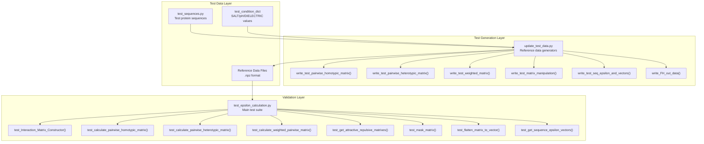
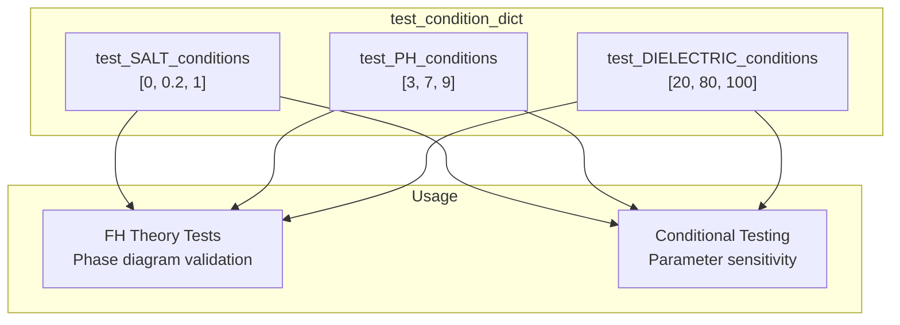
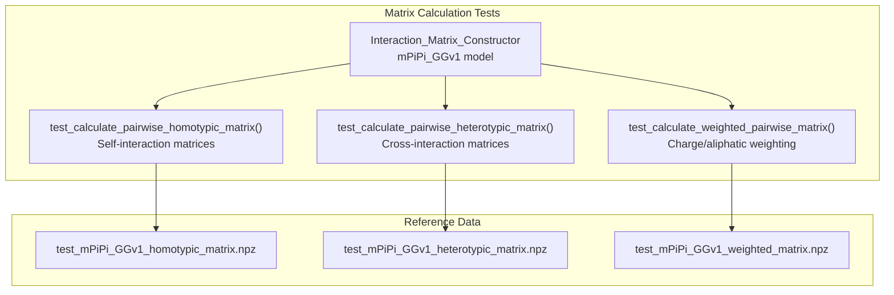
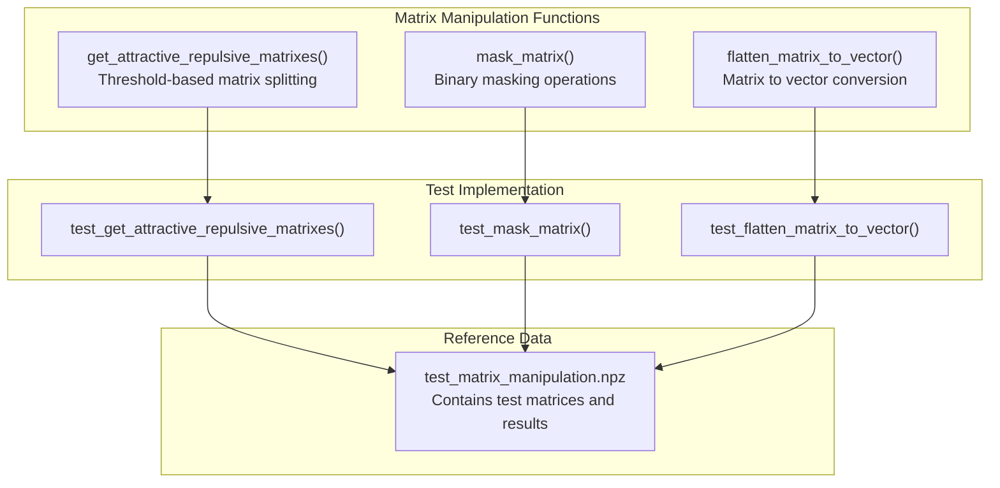
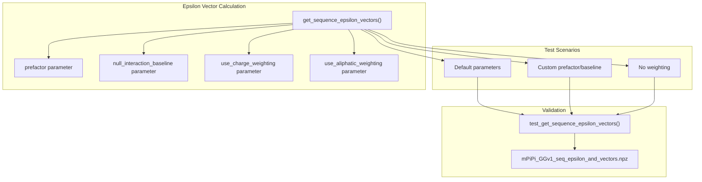

# Testing Framework

> **Relevant source files**
> * [finches/tests/test_data/test_sequences.py](https://github.com/idptools/finches/blob/5b52ba40/finches/tests/test_data/test_sequences.py)
> * [finches/tests/test_data/update_test_data.py](https://github.com/idptools/finches/blob/5b52ba40/finches/tests/test_data/update_test_data.py)
> * [finches/tests/test_epsilon_calculation.py](https://github.com/idptools/finches/blob/5b52ba40/finches/tests/test_epsilon_calculation.py)

The FINCHES testing framework provides comprehensive validation of core computational functions, ensuring accuracy and reliability of epsilon calculations, matrix operations, and forcefield implementations. The framework uses pytest for test execution and NumPy reference data files for validation against known-good outputs.

For information about build and packaging processes, see [Build and Packaging](/idptools/finches/7.2-build-and-packaging). For API documentation of the tested functions, see [API Reference](/idptools/finches/5-api-reference).

## Test Architecture Overview

The testing framework is organized into three main components: test data generation, reference data storage, and validation tests that compare computed results against stored reference values.



Sources: [finches/tests/test_data/test_sequences.py L1-L21](https://github.com/idptools/finches/blob/5b52ba40/finches/tests/test_data/test_sequences.py#L1-L21)

 [finches/tests/test_data/update_test_data.py L1-L204](https://github.com/idptools/finches/blob/5b52ba40/finches/tests/test_data/update_test_data.py#L1-L204)

 [finches/tests/test_epsilon_calculation.py L1-L187](https://github.com/idptools/finches/blob/5b52ba40/finches/tests/test_epsilon_calculation.py#L1-L187)

## Test Data Management

The framework uses a comprehensive set of test sequences and environmental conditions to validate calculations across different scenarios.

### Test Sequences

The test data includes seven carefully designed protein sequences that cover various amino acid compositions and structural properties:

| Sequence | Name | Description |
| --- | --- | --- |
| `test0` | Basic repeat | Simple glycine-serine repeat pattern |
| `test1` | Complex sequence | Mixed charged, polar, and hydrophobic residues |
| `test2` | Extended sequence | Doubled version of `test1` for length testing |
| `test3` | Hydrophobic-rich | Contains leucine/isoleucine repeats |
| `test4` | Polar-rich | Contains glutamine repeats |
| `test5` | Tyrosine-rich | Aromatic residue testing |
| `test6` | Mixed aromatic | Balanced aromatic/polar composition |

Additionally, `t0` serves as a reference sequence for heterotypic interaction testing.

### Environmental Conditions

The framework tests calculations under varying environmental conditions:



Sources: [finches/tests/test_data/test_sequences.py L14-L20](https://github.com/idptools/finches/blob/5b52ba40/finches/tests/test_data/test_sequences.py#L14-L20)

## Core Test Categories

### Matrix Calculation Tests

The framework validates the core matrix calculation functionality of the `Interaction_Matrix_Constructor` class:



Each test iterates through all test sequences and validates results using `np.allclose()` for numerical precision handling.

Sources: [finches/tests/test_epsilon_calculation.py L37-L77](https://github.com/idptools/finches/blob/5b52ba40/finches/tests/test_epsilon_calculation.py#L37-L77)

### Matrix Manipulation Tests

The framework validates matrix processing and transformation functions:



The mask matrix test includes error handling validation for improperly sized masks using pytest exception matching.

Sources: [finches/tests/test_epsilon_calculation.py L90-L138](https://github.com/idptools/finches/blob/5b52ba40/finches/tests/test_epsilon_calculation.py#L90-L138)

### Epsilon Calculation Tests

The framework validates high-level epsilon calculation functions that combine matrix operations with weighting schemes:



Sources: [finches/tests/test_epsilon_calculation.py L150-L186](https://github.com/idptools/finches/blob/5b52ba40/finches/tests/test_epsilon_calculation.py#L150-L186)

## Test Verification Approach

### Numerical Precision Handling

All test comparisons use `np.allclose()` rather than exact equality, accounting for floating-point precision limitations in scientific computing:

```
assert np.allclose(test_array, TRUE_matrixes['arr_0'][i])
```

### Exception Testing

The framework includes pytest-based exception testing for error conditions:

```
with pytest.raises(Exception, match='column_mask and matrix are not the same shape'):    epsilon_calculation.masked_matrix(test_matrix, np.array([0,0,0,0]))
```

### Parameterized Testing

Tests iterate through multiple test sequences and parameter combinations to ensure robustness across different input scenarios.

Sources: [finches/tests/test_epsilon_calculation.py L44](https://github.com/idptools/finches/blob/5b52ba40/finches/tests/test_epsilon_calculation.py#L44-L44)

 [finches/tests/test_epsilon_calculation.py L119-L120](https://github.com/idptools/finches/blob/5b52ba40/finches/tests/test_epsilon_calculation.py#L119-L120)

## Reference Data Generation

The `update_test_data.py` module provides functions to regenerate reference data files when core algorithms are updated:

### Data Generation Functions

| Function | Purpose | Output File |
| --- | --- | --- |
| `write_test_pairwise_homotypic_matrix()` | Generate homotypic matrix reference data | `test_{model_name}_homotypic_matrix.npz` |
| `write_test_pairwise_heterotypic_matrix()` | Generate heterotypic matrix reference data | `test_{model_name}_heterotypic_matrix.npz` |
| `write_test_weighted_matrix()` | Generate weighted matrix reference data | `test_{model_name}_weighted_matrix.npz` |
| `write_test_matrix_manipulation()` | Generate matrix manipulation reference data | `test_matrix_manipulation.npz` |
| `write_test_seq_epsilon_and_vectors()` | Generate epsilon vector reference data | `{model_name}_seq_epsilon_and_vectors.npz` |
| `write_FH_out_data()` | Generate Flory-Huggins theory reference data | `{model_name}_FH_outdata.npz` |

**Warning**: Running these functions overwrites existing reference data files. Only execute when updating accepted truth values.

Sources: [finches/tests/test_data/update_test_data.py L5-L9](https://github.com/idptools/finches/blob/5b52ba40/finches/tests/test_data/update_test_data.py#L5-L9)

 [finches/tests/test_data/update_test_data.py L19-L204](https://github.com/idptools/finches/blob/5b52ba40/finches/tests/test_data/update_test_data.py#L19-L204)

## Running Tests

The testing framework integrates with standard Python testing workflows:

### Basic Test Execution

```markdown
# Run all testspytest finches/tests/ # Run specific test filepytest finches/tests/test_epsilon_calculation.py # Run with verbose outputpytest -v finches/tests/test_epsilon_calculation.py
```

### Test Dependencies

The tests require the following dependencies:

* `pytest` for test execution
* `numpy` for numerical array operations and reference data loading
* `finches` package with all forcefield models
* Test data files in `.npz` format

Sources: [finches/tests/test_epsilon_calculation.py L1-L16](https://github.com/idptools/finches/blob/5b52ba40/finches/tests/test_epsilon_calculation.py#L1-L16)