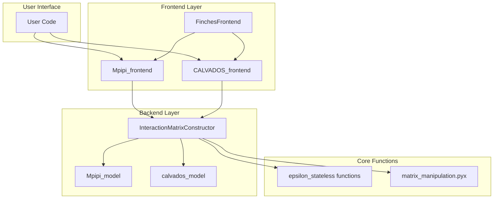
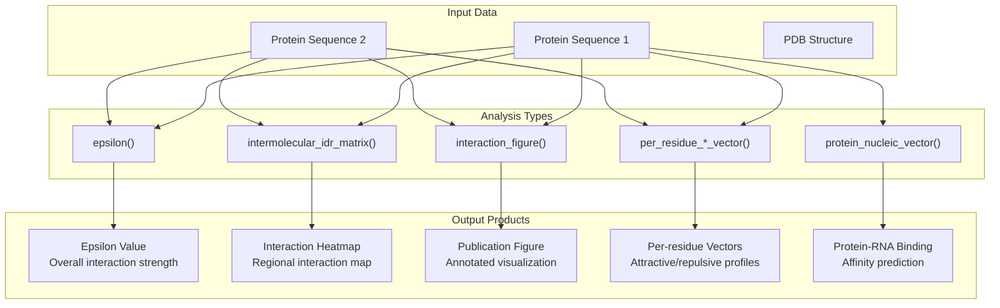

# User Guide

> **Relevant source files**
> * [docs/acknowledgements.rst](https://github.com/idptools/finches/blob/5b52ba40/docs/acknowledgements.rst)
> * [docs/background.rst](https://github.com/idptools/finches/blob/5b52ba40/docs/background.rst)
> * [docs/epsilon.rst](https://github.com/idptools/finches/blob/5b52ba40/docs/epsilon.rst)
> * [docs/general_caveats.rst](https://github.com/idptools/finches/blob/5b52ba40/docs/general_caveats.rst)
> * [finches/data/fingerprints.py](https://github.com/idptools/finches/blob/5b52ba40/finches/data/fingerprints.py)
> * [finches/epsilon_stateless.py](https://github.com/idptools/finches/blob/5b52ba40/finches/epsilon_stateless.py)
> * [finches/frontend/calvados_frontend.py](https://github.com/idptools/finches/blob/5b52ba40/finches/frontend/calvados_frontend.py)
> * [finches/frontend/frontend_base.py](https://github.com/idptools/finches/blob/5b52ba40/finches/frontend/frontend_base.py)
> * [finches/frontend/mpipi_frontend.py](https://github.com/idptools/finches/blob/5b52ba40/finches/frontend/mpipi_frontend.py)

This page provides a comprehensive guide to using FINCHES for analyzing interactions between intrinsically disordered regions (IDRs). It covers the main frontend interfaces, core analysis workflows, and practical examples for different types of calculations.

For detailed API documentation of specific classes and methods, see [API Reference](/idptools/finches/5-api-reference). For step-by-step tutorials and examples, see [Examples and Tutorials](/idptools/finches/6-examples-and-tutorials).

## Quick Start

FINCHES provides two main frontend interfaces for different coarse-grained force fields:

```javascript
from finches import Mpipi_frontend, CALVADOS_frontend # Initialize frontend objectsmf = Mpipi_frontend(salt=0.150)           # Mpipi modelcf = CALVADOS_frontend(salt=0.150, pH=7.4) # CALVADOS model # Basic epsilon calculationseq1 = "MESNQSNNGGSGNAALNRGGRYVPPHL"seq2 = "LEGMSGDMRSGGGYRGRGGRGNGQRFG"epsilon_value = mf.epsilon(seq1, seq2)
```

## Frontend Architecture

The FINCHES user interface is built around two main frontend classes that provide access to different physics models:



**Frontend Interface Architecture**

Sources: [finches/frontend/frontend_base.py L20-L41](https://github.com/idptools/finches/blob/5b52ba40/finches/frontend/frontend_base.py#L20-L41)

 [finches/frontend/mpipi_frontend.py L12-L21](https://github.com/idptools/finches/blob/5b52ba40/finches/frontend/mpipi_frontend.py#L12-L21)

 [finches/frontend/calvados_frontend.py L28-L43](https://github.com/idptools/finches/blob/5b52ba40/finches/frontend/calvados_frontend.py#L28-L43)

| Frontend Class | Physics Model | Key Features |
| --- | --- | --- |
| `Mpipi_frontend` | Mpipi coarse-grained model | Supports protein-protein and protein-RNA interactions |
| `CALVADOS_frontend` | CALVADOS2 model | Protein-only interactions, pH-dependent |

Both frontend classes inherit from `FinchesFrontend` and provide the same core methods with model-specific implementations.

## Core Analysis Workflows

FINCHES supports several types of analysis, each addressing different scientific questions:



**FINCHES Analysis Workflow Overview**

Sources: [finches/frontend/frontend_base.py L206-L242](https://github.com/idptools/finches/blob/5b52ba40/finches/frontend/frontend_base.py#L206-L242)

 [finches/frontend/frontend_base.py L46-L199](https://github.com/idptools/finches/blob/5b52ba40/finches/frontend/frontend_base.py#L46-L199)

 [finches/frontend/frontend_base.py L288-L564](https://github.com/idptools/finches/blob/5b52ba40/finches/frontend/frontend_base.py#L288-L564)

### 1. Epsilon Calculations

Epsilon values quantify the overall interaction strength between two sequences:

```markdown
# Basic epsilon calculationepsilon = mf.epsilon(seq1, seq2) # With custom weighting optionsepsilon = mf.epsilon(seq1, seq2,                     use_aliphatic_weighting=True,                    use_charge_weighting=True)
```

Key considerations:

* **Order matters**: `epsilon(seq1, seq2)` ≠ `epsilon(seq2, seq1)`
* **Extensive property**: Scales with length of first sequence
* **Model-dependent**: Absolute values differ between Mpipi and CALVADOS

### 2. Interaction Maps

Generate 2D interaction maps showing regional preferences:

```sql
# Calculate interaction matrixmatrix_data, disorder1, disorder2 = mf.intermolecular_idr_matrix(    seq1, seq2,     window_size=31,    null_shuffle=False) # Create publication-ready figurefig, im, ax_main, ax_top, ax_right, ax_colorbar = mf.interaction_figure(    seq1, seq2,    window_size=31,    vmin=-3, vmax=3,    fname="interaction_map.png")
```

### 3. Per-Residue Analysis

Analyze attractive and repulsive contributions at single-residue resolution:

```markdown
# Attractive interactions per residueindices, attractive_values = mf.per_residue_attractive_vector(    seq1, seq2,    window_size=31,    smoothing_window=20) # Repulsive interactions per residue  indices, repulsive_values = mf.per_residue_repulsive_vector(    seq1, seq2,    window_size=31,    smoothing_window=20)
```

### 4. Protein-Nucleic Acid Interactions

Predict protein-RNA binding regions (Mpipi model only):

```markdown
# Only available with Mpipi_frontendindices, rna_affinity = mf.protein_nucleic_vector(    protein_seq,    fragsize=21,    smoothing_window=30)
```

Sources: [finches/frontend/frontend_base.py L834-L912](https://github.com/idptools/finches/blob/5b52ba40/finches/frontend/frontend_base.py#L834-L912)

 [finches/frontend/mpipi_frontend.py L27-L126](https://github.com/idptools/finches/blob/5b52ba40/finches/frontend/mpipi_frontend.py#L27-L126)

## Key Parameters and Options

### Model Initialization Parameters

| Parameter | Mpipi_frontend | CALVADOS_frontend | Description |
| --- | --- | --- | --- |
| `salt` | ✓ (default: 0.150) | ✓ (default: 0.150) | Salt concentration (M) |
| `dielectric` | ✓ (default: 80.0) | ✗ | Dielectric constant |
| `pH` | ✗ | ✓ (default: 7.4) | Solution pH |
| `temp` | ✗ | ✓ (default: 288) | Temperature (K) |

### Calculation Parameters

| Parameter | Description | Default | Notes |
| --- | --- | --- | --- |
| `use_aliphatic_weighting` | Weight local aliphatic clusters | `True` | Enhances hydrophobic interactions |
| `use_charge_weighting` | Weight local charge clusters | `True` | Modulates electrostatic interactions |
| `window_size` | Sliding window size for maps | `31` | Must be odd number |
| `use_cython` | Use optimized Cython implementation | `True` | ~8x performance improvement |
| `null_shuffle` | Subtract shuffled sequence baseline | `False` | Use integer for number of shuffles |

### Visualization Parameters

| Parameter | Description | Default | CALVADOS Default |
| --- | --- | --- | --- |
| `vmin`, `vmax` | Color scale limits | -3, 3 | -7.5, 7.5 |
| `cmap` | Matplotlib colormap | `'PRGn'` | `'PRGn'` |
| `tic_frequency` | Axis tick spacing | 100 | 100 |
| `zero_folded` | Mask folded regions | `True` | `True` |

Sources: [finches/frontend/mpipi_frontend.py L13](https://github.com/idptools/finches/blob/5b52ba40/finches/frontend/mpipi_frontend.py#L13-L13)

 [finches/frontend/calvados_frontend.py L34](https://github.com/idptools/finches/blob/5b52ba40/finches/frontend/calvados_frontend.py#L34-L34)

 [finches/frontend/frontend_base.py L46-L105](https://github.com/idptools/finches/blob/5b52ba40/finches/frontend/frontend_base.py#L46-L105)

## Model-Specific Considerations

### Mpipi Model Features

* Supports protein-RNA interactions (using 'U' for uracil)
* Automatic disorder profile detection for RNA sequences
* Optimized for biomolecular condensate studies

### CALVADOS Model Features

* Protein-only interactions (RNA not supported)
* pH and temperature dependent parameters
* Enhanced accuracy for protein conformational properties

### Error Handling

```python
# CALVADOS will raise error for RNA sequencestry:    cf.epsilon("PROTEIN", "UURNA")  # Contains 'U'except ValueError as e:    print("CALVADOS2 cannot handle RNA ('U')")
```

Sources: [finches/frontend/calvados_frontend.py L16-L25](https://github.com/idptools/finches/blob/5b52ba40/finches/frontend/calvados_frontend.py#L16-L25)

 [finches/frontend/mpipi_frontend.py L105-L113](https://github.com/idptools/finches/blob/5b52ba40/finches/frontend/mpipi_frontend.py#L105-L113)

This user guide provides the foundation for understanding FINCHES workflows. For detailed method documentation, see [Frontend Interfaces](/idptools/finches/3.1-frontend-interfaces), [Epsilon Calculations](/idptools/finches/3.2-epsilon-calculations), [Interaction Maps](/idptools/finches/3.3-interaction-maps), [IDR-Folded Domain Analysis](/idptools/finches/3.4-idr-folded-domain-analysis), and [Phase Diagrams](/idptools/finches/3.5-phase-diagrams).