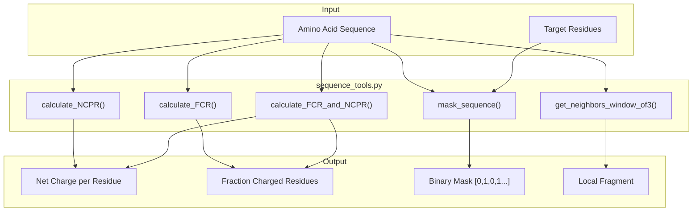
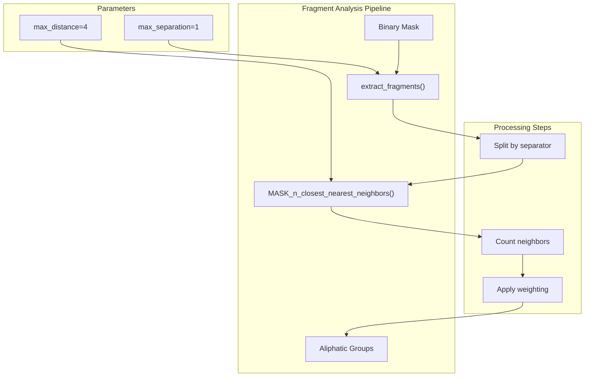
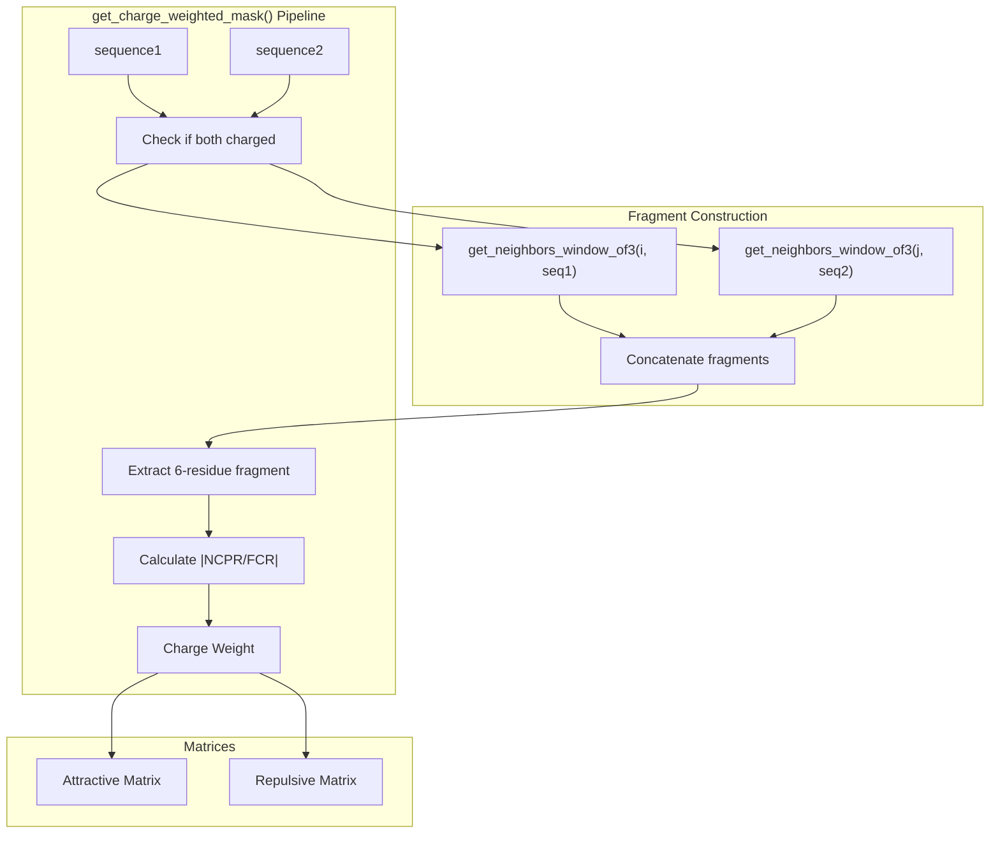
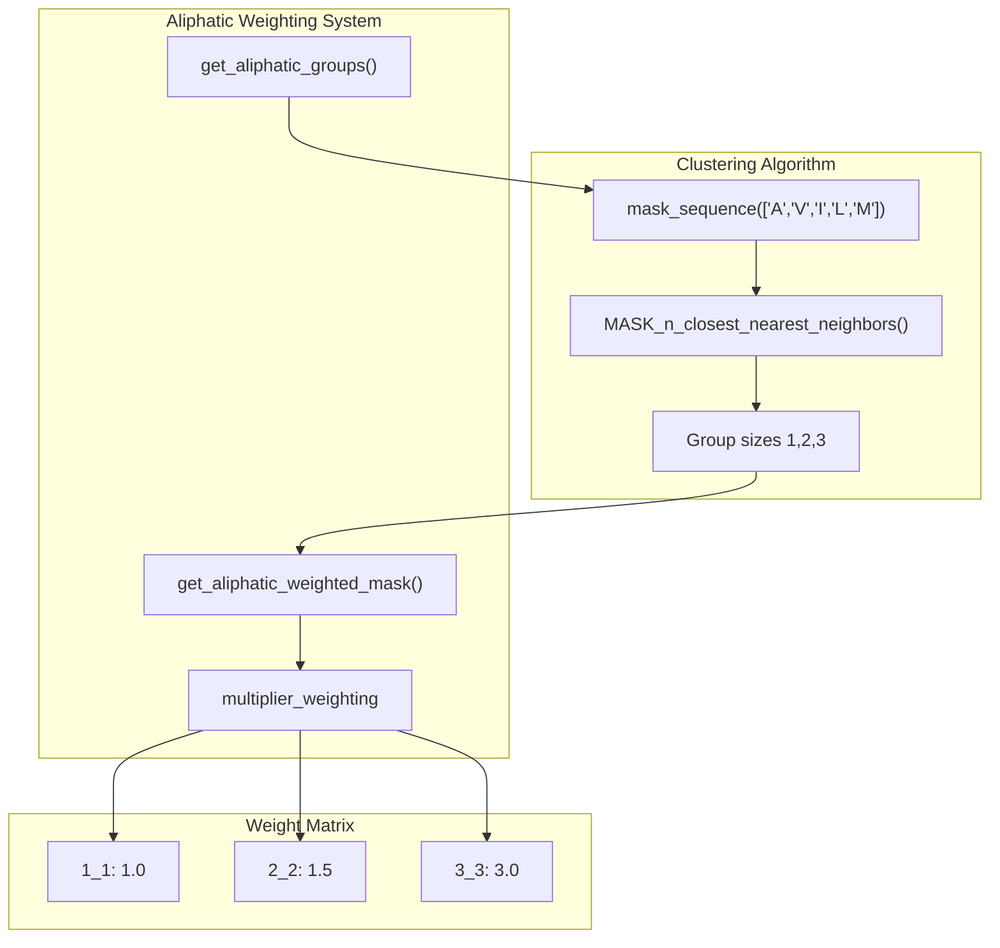
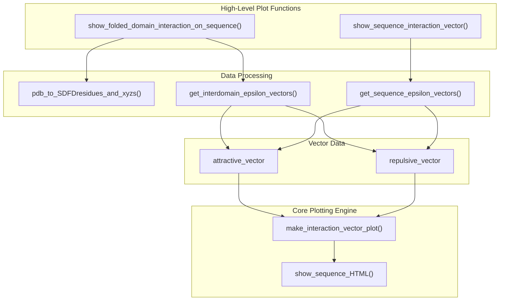
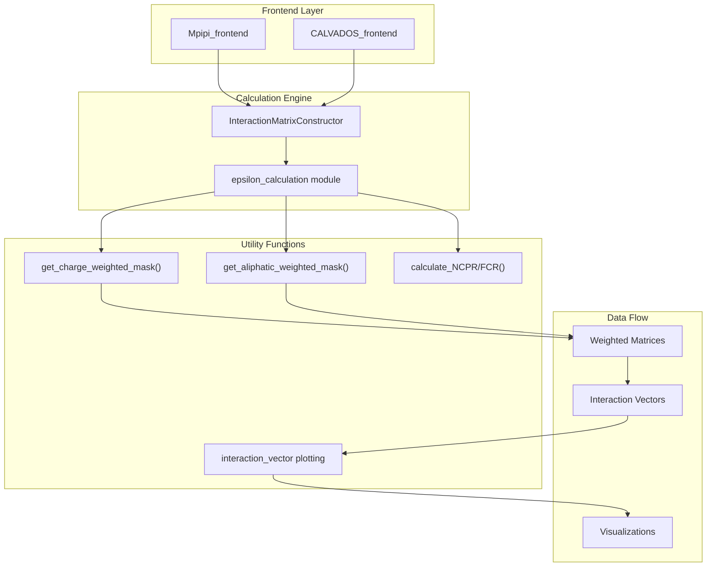

# Utility Functions

> **Relevant source files**
> * [finches/interaction_vector.py](https://github.com/idptools/finches/blob/5b52ba40/finches/interaction_vector.py)
> * [finches/parsing_aminoacid_sequences.py](https://github.com/idptools/finches/blob/5b52ba40/finches/parsing_aminoacid_sequences.py)
> * [finches/sequence_tools.py](https://github.com/idptools/finches/blob/5b52ba40/finches/sequence_tools.py)

This page documents the supporting utilities and helper functions that provide foundational functionality for sequence analysis, weighting calculations, and visualization across the FINCHES package. These utilities are primarily used internally by the core calculation engine and frontend interfaces.

For complete API documentation of the main calculation classes, see [Calculation Engine](/idptools/finches/5.2-calculation-engine). For structure analysis utilities, see [Structure Analysis](/idptools/finches/5.3-structure-analysis).

## Overview

The utility functions in FINCHES are organized into three main categories:

1. **Sequence Analysis Utilities** - Basic sequence property calculations and manipulations
2. **Weighting and Masking Functions** - Advanced weighting schemes for charge and aliphatic clustering effects
3. **Visualization and Plotting Utilities** - Tools for creating interaction vector plots and sequence visualizations

## Sequence Analysis Utilities

### Core Sequence Properties

The fundamental sequence analysis functions calculate basic biophysical properties of protein sequences.

**Sources:** [finches/sequence_tools.py L12-L114](https://github.com/idptools/finches/blob/5b52ba40/finches/sequence_tools.py#L12-L114)

| Function | Purpose | Return Type |
| --- | --- | --- |
| `calculate_NCPR()` | Net charge per residue (positive - negative)/length | float |
| `calculate_FCR()` | Fraction of charged residues | float |
| `calculate_FCR_and_NCPR()` | Both calculations in one call | list[float, float] |
| `mask_sequence()` | Binary mask for target residues | list[int] |
| `get_neighbors_window_of3()` | Extract 3-residue window around position | str |

### Advanced Sequence Masking

More sophisticated masking operations support clustering analysis and fragment extraction.

**Sources:** [finches/sequence_tools.py L201-L317](https://github.com/idptools/finches/blob/5b52ba40/finches/sequence_tools.py#L201-L317)

The `extract_fragments()` function splits binary masks into fragments based on gap tolerance, while `MASK_n_closest_nearest_neighbors()` counts local clustering density for each position.

## Weighting and Masking Functions

### Charge Weighting System

The charge weighting system implements context-dependent charge effects by analyzing local charge environments around interacting residue pairs.

**Sources:** [finches/parsing_aminoacid_sequences.py L25-L194](https://github.com/idptools/finches/blob/5b52ba40/finches/parsing_aminoacid_sequences.py#L25-L194)

The charge weighting algorithm:

1. Identifies charged residue pairs between sequences
2. Extracts 3-residue windows around each charged residue
3. Concatenates fragments and calculates `|NCPR/FCR|`
4. Uses this as a weighting factor for like-charge cluster effects

### Aliphatic Clustering Weighting

Aliphatic weighting accounts for cooperative hydrophobic effects when aliphatic residues cluster together.

**Sources:** [finches/parsing_aminoacid_sequences.py L252-L341](https://github.com/idptools/finches/blob/5b52ba40/finches/parsing_aminoacid_sequences.py#L252-L341)

The aliphatic weighting scheme assigns higher interaction strengths to clusters of aliphatic residues, with weights ranging from 1.0 (isolated) to 3.0 (highly clustered).

### Folded Domain Specific Weighting

The `get_charge_weighted_FD_mask()` function provides specialized charge weighting for folded domain-IDR interactions.

**Sources:** [finches/parsing_aminoacid_sequences.py L200-L246](https://github.com/idptools/finches/blob/5b52ba40/finches/parsing_aminoacid_sequences.py#L200-L246)

Key difference from standard charge weighting:

* Treats folded domain residues individually (no clustering with neighbors)
* Combines single FD residue with 3-residue IDR window
* Used specifically for surface-accessible folded domain (SAFD) calculations

## Visualization and Plotting Utilities

### Interaction Vector Plotting

The interaction vector module provides comprehensive plotting capabilities for visualizing epsilon-based interactions.

**Sources:** [finches/interaction_vector.py L18-L314](https://github.com/idptools/finches/blob/5b52ba40/finches/interaction_vector.py#L18-L314)

### Sequence HTML Visualization

The `show_sequence_HTML()` function creates rich HTML representations of protein sequences with customizable coloring and formatting.

**Sources:** [finches/sequence_tools.py L321-L455](https://github.com/idptools/finches/blob/5b52ba40/finches/sequence_tools.py#L321-L455)

Key features:

* Amino acid specific color coding using `AA_COLOR` dictionary
* Customizable block sizes and line wrapping
* Bold highlighting for specific positions or residue types
* Opacity effects for de-emphasized regions

| Parameter | Purpose | Default |
| --- | --- | --- |
| `blocksize` | Residues per block | 10 |
| `newline` | Residues per line | 50 |
| `fontsize` | Font size in pixels | 14 |
| `bold_positions` | Positions to bold | [] |
| `colors` | Custom color overrides | {} |

### Advanced Vector Analysis

The `make_interaction_vector_for_folded_domain()` function generates full-length domain interaction vectors by mapping surface-accessible residue data back to complete domain sequences.

**Sources:** [finches/interaction_vector.py L258-L315](https://github.com/idptools/finches/blob/5b52ba40/finches/interaction_vector.py#L258-L315)

This function:

1. Extracts SAFD sequence and coordinates from PDB
2. Calculates interaction vectors for SAFD-IDR pairs
3. Maps vectors back to full folded domain using `map_SAFD_vector_to_full_folded_domain()`
4. Returns vectors with length equal to complete folded domain

## Integration with Core Systems

These utility functions integrate with the main FINCHES calculation pipeline:

**Sources:** [finches/parsing_aminoacid_sequences.py L1-L388](https://github.com/idptools/finches/blob/5b52ba40/finches/parsing_aminoacid_sequences.py#L1-L388)

 [finches/sequence_tools.py L1-L456](https://github.com/idptools/finches/blob/5b52ba40/finches/sequence_tools.py#L1-L456)

 [finches/interaction_vector.py L1-L318](https://github.com/idptools/finches/blob/5b52ba40/finches/interaction_vector.py#L1-L318)

The utilities serve as the computational foundation for advanced weighting schemes and visualization capabilities that distinguish FINCHES from simpler mean-field approaches.