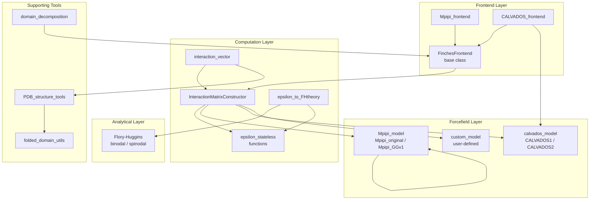

---
slug:1-overview
blog_type:normal
---


**FINCHES**（**F**irst-principle **I**nteractions via **CHE**mical **S**pecificity，基于化学特异性的第一性原理相互作用）是一个 Python 包，用于预测由本质无序区（IDR）驱动的分子间相互作用。FINCHES 并不依赖自上而下的经验拟合，而是采用自下而上的方式：它使用基于物理的粗粒化力场，直接从氨基酸序列计算残基与片段的相互作用能，随后将这些能量聚合为关于结合特异性和相行为的定量预测。该包已发表于 *Science*（2025），并作为独立的 Python 库、一组 Google Colab 笔记本以及网页服务器提供使用，网址为 [finches-online.com](https://www.finches-online.com/)。

来源: [README.md](/README.md#L1-L30), [docs/index.rst](/docs/index.rst#L1-L48)

## FINCHES 的预测内容

FINCHES 回答了关于无序区相互作用的四个核心问题。**首先**，它生成**相互作用图**（intermaps）——即二维热图，其中每个像素代表一条序列的滑动窗口片段与另一条序列片段之间的预测相互作用强度，从而揭示哪些区域驱动了异型或同型结合。**其次**，它计算**逐残基相互作用向量**，将整体相互作用分解为每个位置上的吸引与排斥贡献，从而能够精确定位“粘性”残基。**第三**，它计算单一的**平均场 epsilon (ε) 值**，用于量化两条序列间的净相互作用强度——该标量是进行更高层级热力学推理的关键输入。**第四**，它将该 epsilon 值桥接到 **Flory-Huggins 相图**中，预测序列是否会发生液-液相分离，以及相边界如何随盐浓度或 pH 值等条件发生偏移。这四种分析共享相同的底层力场引擎，因此结果在不同尺度间保持内部一致性。

来源: [docs/index.rst](/docs/index.rst#L14-L40), [finches/frontend/frontend_base.py](/finches/frontend/frontend_base.py#L1-L50)

## 架构概览

代码库围绕**物理模型**（力场）、**计算引擎**（epsilon 与矩阵构造器）以及**用户界面**（前端）的清晰分离进行组织。这种三层架构意味着你可以在不更改分析代码的情况下替换力场，或者根据需求在不同抽象层级上访问相同的计算逻辑。



**前端层** — `Mpipi_frontend` 和 `CALVADOS_frontend` 类继承自共享的 `FinchesFrontend` 基类。它们将力场模型与 `InteractionMatrixConstructor` 捆绑在一起，通过单一对象暴露诸如 `epsilon()`、`interaction_figure()` 和 `intermolecular_idr_matrix()` 等高级方法。大多数用户应从此处入手。

**计算层** — `InteractionMatrixConstructor` 是将力场转化为可执行计算的引擎。它从模型的 `compute_interaction_parameter()` 函数构建成对查找表，随后提供用于全序列 epsilon、滑动窗口矩阵和加权成对相互作用的方法。`epsilon_stateless` 中的无状态辅助函数负责处理矩阵分解（吸引与排斥）及向量构建，且无需维护状态。

**力场层** — 每个力场类都封装了物理逻辑：`Mpipi_model` 加载 Mpipi-GG 参数（σ, ε, ν, μ, 电荷字典）并计算修正的 Mpipi 相互作用势；`calvados_model` 根据 CALVADOS2 粘性参数构建 Ashbaugh-Hatch + Yukawa 势；`custom_model` 允许你定义任意的成对字典及可选的依赖条件的调节。这三者均暴露相同的接口（`ALL_RESIDUES_TYPES`、`compute_interaction_parameter()`、`CONFIGS`），因此 `InteractionMatrixConstructor` 可以统一对待它们。

来源: [finches/__init__.py](/finches/__init__.py#L1-L24), [finches/frontend/frontend_base.py](/finches/frontend/frontend_base.py#L14-L50), [finches/epsilon_calculation.py](/finches/epsilon_calculation.py#L17-L100), [finches/forcefields/mpipi.py](/finches/forcefields/mpipi.py#L1-L40), [finches/forcefields/calvados.py](/finches/forcefields/calvados.py#L1-L50)

## 项目结构

```
finches/
├── __init__.py                    # 包入口：导出 Mpipi_frontend, CALVADOS_frontend
├── frontend/
│   ├── frontend_base.py           # FinchesFrontend 基类（共享逻辑）
│   ├── mpipi_frontend.py          # Mpipi_frontend（支持蛋白质 + RNA）
│   ├── calvados_frontend.py       # CALVADOS_frontend（仅支持蛋白质，含 RNA 守卫）
│   └── interlogo.py               # 相互作用标志生成
├── epsilon_calculation.py         # InteractionMatrixConstructor（核心引擎）
├── epsilon_stateless.py           # 纯函数：矩阵操作，epsilon 向量
├── epsilon_to_FHtheory.py         # 从 epsilon 桥接至 Flory-Huggins 相图
├── interaction_vector.py          # 逐残基相互作用向量图
├── forcefields/
│   ├── mpipi.py                   # Mpipi_model (Mpipi_original, Mpipi_GGv1)
│   ├── calvados.py                # calvados_model (CALVADOS1, CALVADOS2)
│   ├── custom_model.py            # custom_model（用户自定义成对交互）
│   └── calibration/               # 力场校准脚本
├── analytical_fh/
│   ├── floryhuggins.py            # 双节面/旋节线封装
│   └── backend.py                 # 解析 FH 求解器 (Qian et al. 2022)
├── PDB_structure_tools.py         # PDB → 表面可及残基提取
├── domain_decomposition/          # 从相互作用图中识别相互作用区域
├── data/                          # 预计算的力场参数
├── utils/
│   ├── folded_domain_utils.py     # FoldedDomain 类（SASA，表面掩码）
│   └── matrix_manipulation.pyx    # Cython 加速的矩阵计算
└── tests/                         # pytest 测试套件
```

来源: [finches/__init__.py](/finches/__init__.py#L1-L24), [finches/epsilon_calculation.py](/finches/epsilon_calculation.py#L17-L50), [finches/forcefields/custom_model.py](/finches/forcefields/custom_model.py#L1-L30)

## 力场对比

FINCHES 附带了两个经过验证的力场。在两者之间进行选择将决定底层物理逻辑、支持的残基类型以及可用的依赖条件参数。

| 特性 | **Mpipi-GG** (`Mpipi_frontend`) | **CALVADOS2** (`CALVADOS_frontend`) |
|---|---|---|
| **底层势函数** | 修正的 Mpipi (σ, ε, ν, μ + 电荷) | Ashbaugh-Hatch LJ + Yukawa DH |
| **来源文献** | Joseph et al. 2021; Lotthammer et al. 2024 | Tesei et al. 2021 |
| **蛋白质支持** | 20 种标准氨基酸 | 20 种标准氨基酸 |
| **RNA 支持** | 是（残基 `U`） | 否（遇到 `U` 会抛出 `ValueError`） |
| **可调条件** | `salt`，`dielectric` | `salt`，`pH`，`temp` |
| **默认 charge_prefactor** | 0.20 | 0.70 |
| **默认 null_interaction_baseline** | −0.128533 | −0.45 |
| **推荐适用场景** | 蛋白质-蛋白质与蛋白质-RNA 的 IDR | 仅涉及蛋白质的 IDR 以及 pH/温度研究 |

<CgxTip>`null_interaction_baseline` 是区分吸引与排斥成对相互作用的阈值。它针对每个力场进行校准，以重现 poly(GS) 参考序列的行为（该序列预期表现为非相互作用的高斯链）。这意味着你**不能**跨力场比较原始的 epsilon 值——只有单一力场内序列的排序才有意义。</CgxTip>

来源: [finches/forcefields/mpipi.py](/finches/forcefields/mpipi.py#L17-L35), [finches/forcefields/calvados.py](/finches/forcefields/calvados.py#L26-L50), [finches/frontend/calvados_frontend.py](/finches/frontend/calvados_frontend.py#L18-L28)

## 快速使用示例

使用 FINCHES 最简单的方式是通过前端对象。安装完成后，导入一个前端，将其实例化，并以字符串形式传入氨基酸序列：

```python
from finches import Mpipi_frontend, CALVADOS_frontend

# 使用默认条件实例化前端
mf = Mpipi_frontend()          # salt=0.150, dielectric=80.0
cf = CALVADOS_frontend()       # salt=0.150, pH=7.4, temp=288

# 定义序列（DDX4 N 端结构域）
ddx4_ntd = 'MGDEDWEAEINPHMSSYVPIFEKDRYSGENGDNFNRTPASSSEMDDGPSRRDHFMKSGFASGRNFGNRDAGECNKRDNTSTMGGFGVGKSFGNRGFSNSRFEDGDSSGFWRESSNDCEDNPTRNRGFSKRGGYRDGNNSEASGPYRRGGRGSFRGCRGGFGLGSPNNDLDPDECMQRTGGLFGSRRPVLSGTGNGDTSQSRSGSGSERGGYKGLNEEVITGSGKNSWKSEAEGGES'

# 计算同型 epsilon（标量相互作用强度）
print(mf.epsilon(ddx4_ntd, ddx4_ntd))

# 生成相互作用图
mf.interaction_figure(ddx4_ntd, ddx4_ntd)

# 计算滑动窗口相互作用矩阵
matrix, disorder1, disorder2 = mf.intermolecular_idr_matrix(ddx4_ntd, ddx4_ntd)
```

`epsilon()` 方法返回一个总结净相互作用的单浮点数；`interaction_figure()` 生成带有平行无序轨迹的 matplotlib 热图；`intermolecular_idr_matrix()` 返回原始矩阵及各序列的无序分布，以便进行自定义分析。

来源: [README.md](/README.md#L40-L75), [finches/__init__.py](/finches/__init__.py#L20-L24), [finches/frontend/mpipi_frontend.py](/finches/frontend/mpipi_frontend.py#L11-L30)

## 三种界面，同一目标

FINCHES 可通过三种互补的界面访问，每种均适用于不同的工作流：

| 界面 | 最适合 | 位置 |
|---|---|---|
| **Python 包** | 编程式分析、批量计算、集成至流水线 | `pip install git+https://git@github.com/idptools/finches.git` |
| **Google Colab** | 零安装探索、教学、一次性分析 | [finches-colab](https://github.com/idptools/finches-colab) |
| **网页服务器** | 无需任何设置的快速查询、与非编程人员分享结果 | [finches-online.com](https://www.finches-online.com/) |

Python 包提供对每个参数（窗口大小、加权方案、空洗牌、自定义力场）的完全控制。Colab 笔记本提供引导式演练。网页服务器则通过浏览器 UI 暴露最常用的操作。

来源: [README.md](/README.md#L8-L15)

## 核心概念

在深入详细文档之前，有四个概念支柱支撑着每一次 FINCHES 计算：

**Epsilon (ε)** 是平均场相互作用参数。其计算方式为：在两条序列间构建成对相互作用矩阵，使用 `null_interaction_baseline` 将吸引贡献与排斥贡献分离，应用可选的电荷与脂肪族加权方案，最后求平均。ε 值越负，表示净吸引力越强。这是推导所有其他预测的基础量。

**相互作用图** 通过滑动窗口方法计算：每条序列被分解为可配置窗口大小（默认为 31 个残基）的重叠片段，随后计算每对片段的 epsilon。生成的二维矩阵揭示了空间分辨的相互作用模式——例如，一条 IDR 上特定的带电斑块驱动与另一条 IDR 上的芳香斑块结合。

**加权方案** 对原始成对矩阵进行细化。*电荷加权* 降低了同种电荷对的排斥贡献，反映出带电侧链在无序链中可以彼此重定向远离的事实。*脂肪族加权* 增强了被其他脂肪族残基包围的脂肪族残基的贡献，捕捉疏水斑块的协同效应。两者默认启用，并由特定于各力场的 `charge_prefactor` 参数控制。

**相图** 通过 Flory-Huggins 理论将 epsilon 与宏观行为联系起来。epsilon 值映射到 Flory-Huggins χ 参数，而 Qian 等人 (2022) 提出的解析双节面/旋节线曲线可预测共存浓度。这一桥梁使得序列层面的突变能够直接联系到相边界的偏移。

<CgxTip>FINCHES 的预测对于**比较性**分析最为可靠——例如，“突变 X 相较于野生型是增加还是降低了相分离倾向？”——而不是对临界浓度的绝对定量预测。平均场框架必然简化了链连接性、溶剂化及多体效应。文档的注意事项部分详细讨论了这些局限性。</CgxTip>

来源: [finches/epsilon_stateless.py](/finches/epsilon_stateless.py#L85-L160), [finches/epsilon_calculation.py](/finches/epsilon_calculation.py#L17-L100), [finches/analytical_fh/floryhuggins.py](/finches/analytical_fh/floryhuggins.py#L1-L60), [finches/epsilon_to_FHtheory.py](/finches/epsilon_to_FHtheory.py#L1-L30)

## 接下来去哪

本文档的结构旨在带你从安装入门深入到技术细节。对于初学者，我们推荐以下阅读顺序：

1. **[快速开始](2-quick-start)** — 运行 FINCHES 并计算你的第一个 epsilon 和相互作用图
2. **[安装指南](3-installation-guide)** — conda、pip 及开发安装的详细设置
3. **[架构概览](4-architecture-overview)** — 前端 → 计算 → 力场层如何连接
4. **[Mpipi 与 CALVADOS 前端](5-mpipi-and-calvados-frontends)** — 两个主要用户面向类的完整 API 参考
5. **[相互作用图与图形](6-interaction-maps-and-figures)** — 生成与解读二维相互作用热图
6. **[Epsilon 计算与加权](9-epsilon-calculation-and-weighting)** — 理解 epsilon 的计算方式及加权方案如何影响结果

如果你有特定的用例，可以直接跳转至相关的深入页面——目录结构的设计使得每一页均自成一体，同时交叉引用了前置知识。