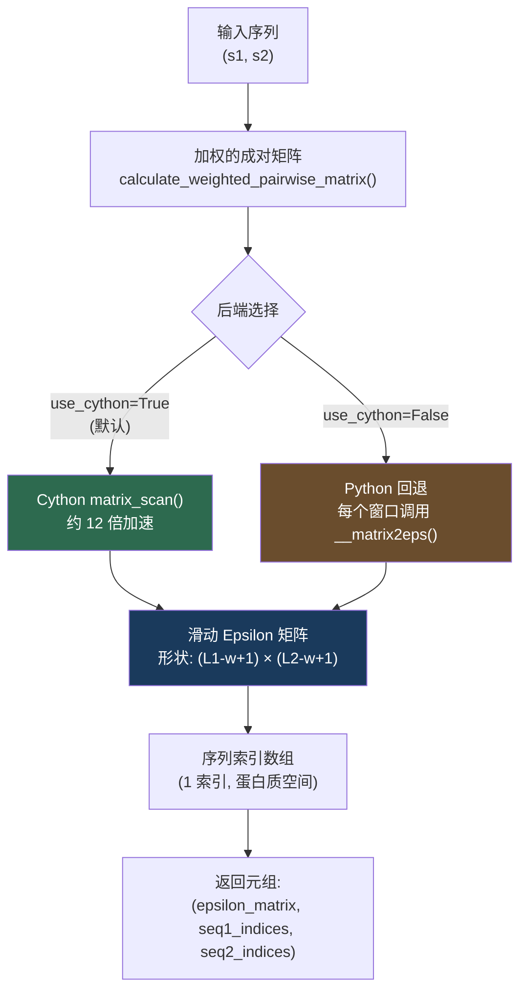

---
slug:10-sliding-window-matrix-computation
blog_type:normal
---


滑动窗口矩阵计算将原始的成对交互矩阵转换为**空间平滑的 epsilon 景观**，揭示了两个序列之间的接触面上局部交互强度是如何变化的。滑动窗口方法没有将整个序列对折叠为单个标量 epsilon，而是系统地提取每个可能的固定大小连续子区域，计算每个子区域的 epsilon，并将结果组装成二维图谱。这是 finches 交互热图和区域交互分析的核心分析原语。

## 算法基础

滑动窗口计算在**预加权的成对交互矩阵**上操作——一个形状为 `(len(s1), len(s2))` 的二维数组，其中每个单元保存残基 `s1[i]` 和 `s2[j]` 之间的交互参数，已经过电荷和脂肪族加权调整。一个大小为 `w × w`（其中 `w` 为 `window_size` 参数）的方形窗口沿两个轴以单位增量在此矩阵上滑动。在每个位置，窗口包围的子矩阵使用 `null_interaction_baseline` 作为分割阈值，被分解为**吸引**和**排斥**分量，每个分量经过基线相减、行平均和求和——为该窗口位置生成单个 epsilon 值。

生成的输出矩阵形状为 `((len(s1) - w + 1), (len(s2) - w + 1))`，其中每个单元代表以对应序列位置为中心的残基邻域之间的平均局部交互特征。该函数还返回**蛋白质空间索引数组**（从 1 开始索引），将矩阵坐标映射回序列残基编号，每个索引指向其窗口的中心残基。



来源: [epsilon_calculation.py](/finches/epsilon_calculation.py#L705-L872), [matrix_manipulation.pyx](/finches/utils/matrix_manipulation.pyx#L33-L150)

## `calculate_sliding_epsilon` 方法

这是面向用户的主要入口，作为 [`InteractionMatrixConstructor`](8-interactionmatrixconstructor) 对象的方法暴露。它编排整个流程：矩阵构建 → 加权 → 窗口扫描 → 索引生成。

```python
from finches.forcefields.mpipi import Mpipi_model
from finches.epsilon_calculation import InteractionMatrixConstructor

# 初始化模型和构造器
params = Mpipi_model(version='Mpipi_GGv1')
IMC = InteractionMatrixConstructor(parameters=params)

# 计算滑动窗口 epsilon
s1 = "MDVFLKNRKRVTSRQRNELSLKEEFQSLKQ"
s2 = "SGDDDVETLPGAEPEPSGKRRRGQNQQ"

result = IMC.calculate_sliding_epsilon(
    s1, s2,
    window_size=31,                  # 必须为奇数；若为偶数则自动校正
    use_charge_weighting=True,       # 应用电荷排斥阻尼
    use_aliphatic_weighting=True,    # 应用脂肪族斑块增强
    use_cython=True                  # 使用 Cython 后端（默认）
)

epsilon_matrix = result[0]    # 滑动 epsilon 值的二维数组
seq1_indices  = result[1]    # 沿序列 1 的从 1 开始的索引位置
seq2_indices  = result[2]    # 沿序列 2 的从 1 开始的索引位置
```

### 参数参考

| 参数 | 类型 | 默认值 | 描述 |
|-----------|------|---------|-------------|
| `sequence1` | `str` | *必需* | 第一个氨基酸序列 |
| `sequence2` | `str` | *必需* | 第二个氨基酸序列 |
| `window_size` | `int` | `31` | 滑动窗口的大小。必须为奇数；偶数值会自动校正为下一个奇数并发出警告 |
| `use_charge_weighting` | `bool` | `True` | 在扫描前对成对矩阵应用基于电荷的排斥阻尼 |
| `use_aliphatic_weighting` | `bool` | `True` | 在扫描前对成对矩阵应用脂肪族斑块增强加权 |
| `use_cython` | `bool` | `True` | 使用 Cython 加速的 `matrix_scan()` 后端；`False` 回退到纯 Python |

### 返回值

该方法返回一个 **3 元组** `(epsilon_matrix, seq1_indices, seq2_indices)`：

| 元素 | 形状 | 含义 |
|---------|-------|---------|
| `epsilon_matrix` | `(L1 - w + 1, L2 - w + 1)` | 局部 epsilon 值的二维矩阵。负值 = 净吸引，正值 = 净排斥 |
| `seq1_indices` | `(L1 - w + 1,)` | 沿序列 1 的从 1 开始索引的残基位置（每个窗口的中心） |
| `seq2_indices` | `(L2 - w + 1,)` | 沿序列 2 的从 1 开始索引的残基位置（每个窗口的中心） |

其中 `L1 = len(sequence1)`，`L2 = len(sequence2)`，且 `w = window_size`。

来源: [epsilon_calculation.py](/finches/epsilon_calculation.py#L705-L790)

## 逐窗口 Epsilon 计算

每个窗口子矩阵经历与全序列计算相同的 epsilon 分解，但是局部应用。内部逻辑如下：

1. **分割** `w × w` 子矩阵为吸引和排斥分量，使用 `null_interaction_baseline` 阈值：低于基线的值为吸引；高于基线的值为排斥。
2. **基线相减** 两个矩阵，使零代表零交互参考（等效于 poly(GS) 高斯链基线）。
3. **行平均** 沿列轴（axis 1）对每个矩阵进行操作，产生每行的吸引和排斥贡献。
4. **求和** 将吸引和排斥的行平均值相加，为该窗口位置生成单个标量 epsilon。

在 **Python 回退** 路径中，这通过嵌套的 `__matrix2eps()` 辅助函数实现，该函数调用 `epsilon_stateless.get_attractive_repulsive_matrices()`，随后进行基线相减和先平均后求和的聚合。在 **Cython 路径** 中，这整个流程在 `matrix_scan()` 内作为原始 C 循环内联，完全消除了 Python 开销。

来源: [epsilon_calculation.py](/finches/epsilon_calculation.py#L795-L816), [epsilon_stateless.py](/finches/epsilon_stateless.py#L16-L49)

## Cython 加速：`matrix_scan()`

`finches/utils/matrix_manipulation.pyx` 中的 `matrix_manipulation.matrix_scan()` 函数是性能关键实现。它接收预加权矩阵作为类型化内存视图（`double[:, :]`），并在启用了 Cython 编译器指令 `@cython.boundscheck(False)` 和 `@cython.cdivision(True)` 的情况下，完全在 C 级循环中操作，这些指令分别禁用了运行时边界检查和除零检查。

该函数预分配四个 C 类型的 NumPy 数组——输出 `everything` 矩阵，以及工作缓冲区 `attractive_matrix`、`repulsive_matrix` 和 `sub`（大小均为 `window_size × window_size`）。对于每个窗口位置 `(i, j)`，它：

1. 使用原始索引循环将窗口区域从内存视图复制到 `sub` 中
2. 通过将每个元素与 `null_interaction_baseline` 比较并使用条件赋值，构造 `attractive_matrix` 和 `repulsive_matrix`——全在纯 C 中执行，无 Python 分支
3. 通过嵌套累加循环计算先求行平均再求和的聚合
4. 将结果存储在 `everything[i, j]` 中

扫描完成后，它使用公式 `start = int((window_size - 1) / 2) + 1` 计算蛋白质空间索引数组，并通过断言验证索引数组长度与输出矩阵维度匹配。

<CgxTip>Cython 实现避免了在热循环内创建所有 Python 对象——甚至吸引/排斥的分割也是通过对单个数组元素的 C 级 `if/else` 执行的，而不是 NumPy 布尔索引。这就是它比 Python 回退快约 12 倍的原因，因为 Python 回退必须为每个窗口位置构造中间 NumPy 数组。</CgxTip>

来源: [matrix_manipulation.pyx](/finches/utils/matrix_manipulation.pyx#L33-L150)

## Python 回退实现

当 `use_cython=False` 时，该方法回退到纯 Python 实现，该实现遍历所有窗口位置并将每个子矩阵委托给 `__matrix2eps()` 闭包。此路径在功能上等效于 Cython 版本，但由于每窗口的 NumPy 数组切片以及为每个位置调用 `epsilon_stateless.get_attractive_repulsive_matrices()` 的开销，速度明显较慢。

Python 路径还包含一个显式守卫，如果 `window_size` 超过任一序列长度则抛出异常，而 Cython 路径在 `matrix_scan()` 顶部执行相同的检查。

来源: [epsilon_calculation.py](/finches/epsilon_calculation.py#L836-L872), [matrix_manipulation.pyx](/finches/utils/matrix_manipulation.pyx#L80-L81)

## 索引映射与蛋白质空间约定

一个关键的设计细节：返回的索引数组使用**从 1 开始索引的蛋白质空间编号**，而不是 Python 的从 0 开始索引的约定。对于长度为 `L` 的序列上大小为 `w` 的窗口，第一个索引是 `ceil(w/2)`，最后一个是 `L - ceil(w/2) + 1`。这意味着每个索引指向其对应窗口的**中心残基**，使得输出在 PDB 文件或序列注释的残基编号上下文中可直接解释。

索引映射公式，以代码表示：

```python
start = int((window_size - 1) / 2) + 1   # 第一个有效中心位置（1 索引）
end   = (sequence_length - start) + 1      # 最后一个有效中心位置（1 索引）
indices = np.arange(start, end + 1)        # 包含两端的范围
```

对于长度为 100 且 `window_size=31` 的序列，这生成索引 16 到 85，意味着第一个窗口跨越残基 1–31（以 16 为中心），最后一个跨越残基 70–100（以 85 为中心）。

来源: [epsilon_calculation.py](/finches/epsilon_calculation.py#L856-L865), [matrix_manipulation.pyx](/finches/utils/matrix_manipulation.pyx#L136-L148)

## 可视化

`calculate_sliding_epsilon` 的文档字符串包含一个使用 `matplotlib` 的推荐绘图模式：

```python
import matplotlib.pyplot as plt

result = IMC.calculate_sliding_epsilon(s1, s2, window_size=31)

fig, ax = plt.subplots(figsize=(10, 10))
plt.imshow(
    result[0],
    extent=[result[1][0], result[1][-1], result[2][0], result[2][-1]],
    aspect='auto',
    vmax=4, vmin=-4,
    cmap='seismic',
    origin='lower'
)
plt.colorbar(label='ε')
plt.xlabel('序列 1 位置')
plt.ylabel('序列 2 位置')
plt.show()
```

关键渲染注意事项：`aspect='auto'` 防止序列长度不同时产生失真；`origin='lower'` 确保残基位置 (1,1) 位于左下角；`extent` 参数将像素坐标映射到蛋白质空间残基编号；`vmax/vmin` 应根据力场进行调整（对于 Mpipi_GGv1，±4 效果良好）。

来源: [epsilon_calculation.py](/finches/epsilon_calculation.py#L727-L748)

## 计算复杂度

滑动窗口扫描的时间复杂度为 **O((L₁ - w + 1) × (L₂ - w + 1) × w²)**，其中 `w²` 因子来自逐窗口的 epsilon 分解。对于长度为 `N` 的两个序列，在典型窗口大小为 31 的情况下，这意味着大约 `(N - 30)² × 961` 次浮点运算。Cython 实现通过避免中间数组分配和 Python 解释器开销，显著降低了常数因子。

| 场景 | L₁ = L₂ = 200, w = 31 | L₁ = L₂ = 500, w = 31 | L₁ = L₂ = 1000, w = 31 |
|----------|------------------------|------------------------|-------------------------|
| 输出矩阵单元 | 170 × 170 = 28,900 | 470 × 470 = 220,900 | 970 × 970 = 940,900 |
| 每单元运算量 | 961 | 961 | 961 |
| 总浮点运算量 | ~27.8M | ~212M | ~904M |

来源: [matrix_manipulation.pyx](/finches/utils/matrix_manipulation.pyx#L70-L132)

## 与其他计算模式的关系

滑动窗口计算是通过 `InteractionMatrixConstructor` 提供的三种 epsilon 计算模式之一。了解何时使用每种模式至关重要：

| 模式 | 方法 | 输出 | 用例 |
|------|--------|--------|----------|
| **全矩阵** | `calculate_weighted_pairwise_matrix()` | 原始 `L₁ × L₂` 矩阵 | 可视化逐残基交互参数 |
| **标量 epsilon** | `calculate_epsilon_value()` | 单个 `float` | 比较序列对GPT对之间的整体交互强度 |
| **滑动窗口** | `calculate_sliding_epsilon()` | 平滑矩阵 + 索引 | 识别空间局部化的交互热点 |

当你需要**空间分辨率**（交互集中在序列中的哪个位置？）而不仅仅是整体倾向时，滑动窗口模式是自然的选择。它可以被理解为原始成对矩阵的平滑版本，其中输出中的每个像素代表局部邻域上的平均交互特征，而不是单个残基对。

<CgxTip>滑动窗口 epsilon 不是原始矩阵的简单卷积（移动平均）。每个窗口位置在平均之前都涉及带有基线相减的完整吸引/排斥分解，这意味着非线性分割操作是逐窗口应用的，而不是全局应用。这保留了每个)每个局部区域内吸引和排斥贡献的物理意义分离。</CgxTip>

来源: [epsilon_calculation.py](/finches/epsilon_calculation.py#L606-L872)

## 后续步骤

- 关于向滑动窗口提供数据的底层矩阵构建，参见 [InteractionMatrixConstructor](8-interactionmatrixconstructor)
- 关于 Cython 加速内部机制，参见 [Cython Matrix Acceleration](20-cython-matrix-acceleration)
- 关于 epsilon 向量（逐残基特征）与滑动窗口方法的关系，参见 [Per-Residue Interaction Vectors](7-per-residue-interaction-vectors)
- 关于在窗口扫描前应用的加权方案，参见 [Sequence Context!Context Weighting Schemes](19-sequence-context-weighting-schemes)