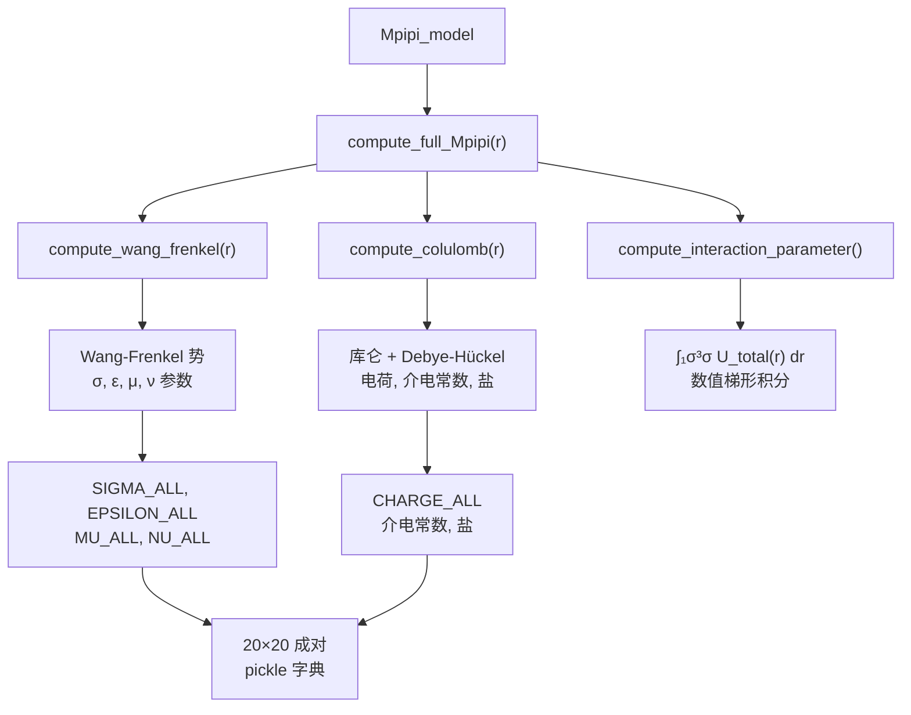
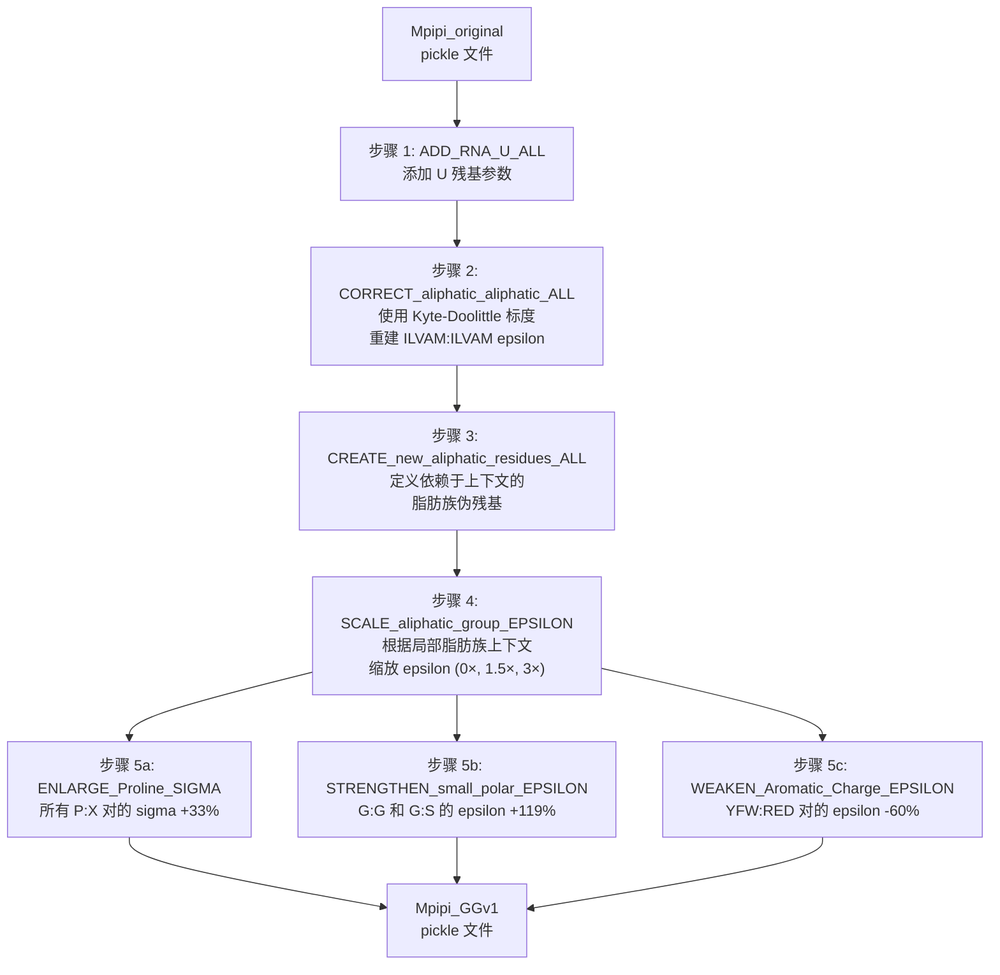
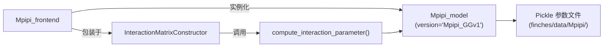

---
slug:11-mpipi-forcefield-parameters
blog_type:normal
---


**Mpipi 力场**是一个用于生物分子相分离的物理驱动粗粒化模型，在本质无序蛋白（IDR）相互作用方面实现了接近定量的准确性。它以 `Mpipi_model` 类的形式实现，定义了一整套成对残基参数和势能函数，这些参数和函数构成了 finches 中每个相互作用计算的基础。该模型结合了 **Wang-Frenkel** 短程势和 **Debye-Hückel 屏蔽库仑** 静电势，并根据实验相分离数据进行了校准。finches 附带了两个参数版本——`Mpipi_original`（源自 Joseph 等人 2021 年的基础论文）和 `Mpipi_GGv1`（一个改进的变体，修正了脂肪族相互作用，增加了 RNA 支持以及针对性的 epsilon/sigma 调整）。

来源: [mpipi.py](finches/forcefields/mpipi.py#L1-L20), [mpipi.py](finches/forcefields/mpipi.py#L35-L102)

## 势能架构

在 Mpipi 模型中，两个残基之间的总成对相互作用能是两个独立势能的总和：

$$U_{\text{total}}(r) = U_{\text{Wang-Frenkel}}(r) + U_{\text{Coulomb}}(r)$$

这种分解将**非特异性短程相互作用**（π-π、阳离子-π、疏水）与**静电相互作用**分离开来，每种相互作用由不同的参数集控制。该架构反映在类方法 `compute_full_Mpipi()` 中，该方法委托给 `compute_wang_frenkel()` 和 `compute_colulomb()` 并对它们的结果求和。



来源: [mpipi.py](finches/forcefields/mpipi.py#L289-L335), [mpipi.py](finches/forcefields/mpipi.py#L342-L415)

## Wang-Frenkel 势

Wang-Frenkel (WF) 势是一种可调的有限范围相互作用模型，它取代了早期粗粒化框架中使用的 Lennard-Jones 势。每对残基由**四个成对参数**控制：

| 参数 | 符号 | 字典 | 量纲 | 物理意义 |
|-----------|--------|------------|------------|------------------|
| 尺寸 | σᵢⱼ | `SIGMA_ALL` | Å | 截断距离；WF 势过零点的位置 |
| 势阱深度 | εᵢⱼ | `EPSILON_ALL` | kJ/mol | 相互作用势阱的最小能量 |
| 宽度控制 | μᵢⱼ | `MU_ALL` | 无量纲 | 控制势阱宽度和陡度 |
| 宽度控制 | νᵢⱼ | `NU_ALL` | 无量纲 | 第二个宽度/陡度参数 |

势能计算如下：

1. 定义相互作用范围：`R_ij = 3 × σ_ij`
2. 根据 σ、μ、ν 和 R 计算归一化常数 αᵢⱼ
3. 求值：`U_WF(r) = ε × α × [(σ/r)^(2μ) - 1] × [(R/r)^(2μ) - 1]^(2ν)`

该势能在 `r = σ` 和 `r = R = 3σ` 处趋于零，势阱最小值出现在这些边界之间。这种有限范围的设计对于粗粒化模拟至关重要，因为它避免了 Lennard-Jones 势的长程尾迹伪影。

来源: [mpipi.py](finches/forcefields/mpipi.py#L553-L608)

## 具 Debye-Hückel 屏蔽的库仑势

静电分量使用标准的库仑势，并通过 **Debye-Hückel 屏蔽** 进行增强，以模拟依赖于盐浓度的衰减：

$$U_{\text{Coulomb}}(r_{ij}) = \frac{C^2 \cdot N_A \cdot q_i \cdot q_j}{4\pi \varepsilon_0 \cdot \varepsilon_r \cdot r_{ij}} \times e^{-\kappa \cdot r_{ij}}$$

其中：
- **qᵢ, qⱼ** 是来自 `CHARGE_ALL` 的残基电荷（以基本电荷单位计）
- **ε_r** 是溶剂介电常数（默认值：水的 80.0）
- **κ = √(salt) / 3.06** 是反 Debye 屏蔽长度，盐浓度单位为摩尔浓度
- 指数项提供依赖于距离的屏蔽；在盐浓度为 0 时，屏蔽被禁用（κ = 0）

该函数接受对 `dielectric` 和 `salt` 的逐次调用覆盖，使得无需重新实例化模型对象即可进行依赖于条件的探索。

来源: [mpipi.py](finches/forcefields/mpipi.py#L481-L546)

## 谐键势

标准的谐势用于约束相邻珠子之间的主链键长：

$$U_{\text{harmonic}}(r) = \frac{1}{2} k \cdot (100 \cdot (r - r_{\text{ref}}))^2 / 1000$$

乘以 100 的因子将 Å 转换为 pm，除以 `/1000` 将 J 转换为 kJ。由模式定义了两种理想键长：

| 模式 | r_ref (Å) | k (J·mol⁻¹·pm⁻²) | 应用 |
|------|-----------|---------------------|-------------|
| `protein` | 3.81 | 8.03 (默认) | 多肽主链 |
| `nucleic` | 5.00 | 8.03 (默认) | RNA 主链 |

来源: [mpipi.py](finches/forcefields/mpipi.py#L426-L476)

## 相互作用参数计算

`compute_interaction_parameter()` 方法通过在 1σ 到 3σ 之间对组合势能进行数值积分，将完整的距离依赖势能转换为**单一标量相互作用参数**：

```python
interaction_param = np.trapezoid(combo[s1:s3], x=r[s1:s3])
```

该积分捕获了在 WF 势的物理意义范围内净相互作用强度。该方法返回一个元组：`(interaction_param, full_potential_profile, idx_1σ, idx_3σ, distance_array)`，同时提供了汇总标量和用于可视化或进一步分析的原始数据。

来源: [mpipi.py](finches/forcefields/mpipi.py#L342-L415)

## 参数版本与配置

`Mpipi_model` 类支持两个主要版本，每个版本都有独特的参数文件和校准常数：

| 版本 | 参数文件 | charge_prefactor | null_interaction_baseline | 描述 |
|---------|----------------|------------------|--------------------------|-------------|
| `Mpipi_original` | `sigma.pickle`, `epsilon.pickle` 等 | 0.20 | -0.066265 | Joseph 等人 2021 年的原始参数 |
| `Mpipi_GGv1` | `sigma_ggv1.pickle`, `epsilon_ggv1.pickle` 等 | 0.20 | -0.128533 | 经过脂肪族修正、RNA 支持及针对性微调的改进版 |
| `OLD_Mpipi_GGv1` | `old_sigma_ggv1.pickle` 等 | 0.20 | -0.128533 | 旧版快照；与 `Mpipi_GGv1` 几乎相同 |

**`charge_prefactor`**（两个版本均为 0.20）缩放电荷权重——这是一种减少带相反电荷残基之间排斥的机制，以反映侧链取向自由度和 pKa 偏移。**`null_interaction_baseline`** 定义了吸引/排斥阈值，经过校准使得 poly(GS) 重复序列产生 ε ≈ 0（即表现为高斯链）。

来源: [mpipi.py](finches/forcefields/mpipi.py#L19-L34), [mpipi.py](finches/forcefields/mpipi.py#L115-L187)

## 模型实例化

`Mpipi_model` 构造函数加载预计算的 pickle 字典并配置环境：

```python
from finches.forcefields.mpipi import Mpipi_model

# 默认: 生理条件下的 Mpipi_GGv1
model = Mpipi_model(version='Mpipi_GGv1', dielectric=80.0, salt=0.150)

# 原始 Joseph 等人的参数
model_original = Mpipi_model(version='Mpipi_original')

# 自定义参数目录（必须包含五个必需的 pickle 文件）
model_custom = Mpipi_model(version='Mpipi_original', input_directory='/path/to/params')
```

对于自定义目录，需要五个 pickle 文件：`sigma.pickle`、`epsilon.pickle`、`nu.pickle`、`mu.pickle` 和 `charge.pickle`。每个文件都包含一个嵌套字典，以 `[residue_1][residue_2]`（或电荷的 `[residue]`）作为索引，涵盖所有 20 种标准氨基酸。`Mpipi_GGv1` 版本期望文件带有 `_ggv1` 后缀。

来源: [mpipi.py](finches/forcefields/mpipi.py#L35-L102), [mpipi.py](finches/forcefields/mpipi.py#L107-L112)

## 支持的残基类型

该模型通过 `ALL_RESIDUES_TYPES` 定义了两个残基组：

- **蛋白质残基** (20): `M, G, K, T, Y, A, D, E, V, L, Q, W, R, F, S, H, N, P, C, I`
- **RNA 残基** (1): `U`

`Mpipi_GGv1` 版本额外定义了**依赖于上下文的脂肪族伪残基**（小写 `a, l, m, i, v, b, o, x, y, z`），它们代表不同局部序列上下文中的脂肪族残基。这些由脂肪族加权方案在内部使用，并不在输入序列中直接指定。

来源: [mpipi.py](finches/forcefields/mpipi.py#L16-L17), [mpipi.py](finches/forcefields/mpipi.py#L199-L199)

## Mpipi_GGv1 参数推导流程

`Mpipi_GGv1` 参数是通过一系列确定性的修改函数从 `Mpipi_original` 派生而来的，这些函数在构建笔记本中执行。流程顺序至关重要，因为后续步骤依赖于早期步骤创建的参数：



来源: [build_MpipiGG_v1.ipynb](finches/data/Mpipi/build_MpipiGG_v1.ipynb#L1-L376), [mPiPi_GGv1_modification_fxns.py](finches/data/Mpipi/mPiPi_GGv1_modification_fxns.py#L1-L12)

### 逐步修改详情

**步骤 1 — RNA 添加** (`ADD_RNA_U_ALL`)：为所有 20 个氨基酸:U 对注入尿嘧啶 (U) 参数，源自 `defined_RNA_params.py`。这必须首先执行，因为后续步骤假设参数字典中已存在 U。U 的电荷为 −0.75，并具有独特的逐对 sigma/epsilon 值。

**步骤 2 — 脂肪族:脂肪族修正** (`CORRECT_aliphatic_aliphatic_ALL`)：将原始的 ILVAM:ILVAM epsilon 值替换为从 **Kyte-Doolittle 疏水性标度** 派生的值。原始 Mpipi 表现出违反直觉的现象，即 epsilon 随疏水性增加而减小；此修正反转了这种依赖关系：`NEW_ε = |slope| × (KD₁ + KD₂) + intercept/α`，其中斜率 = 0.00839，截距 = 0.07555，α = 4.3。同时将 I:I 和 I:V 的 MU 修正为 2.0。

**步骤 3 — 依赖上下文的脂肪族残基** (`CREATE_new_aliphatic_residues_ALL`)：创建 10 个新的伪残基代码（"group 1" 的 a,l,m,i,v 和 "group 2" 的 b,o,x,y,z），它们镜像 A,L,M,I,V，但允许基于局部脂肪族邻居数量具有不同的相互作用强度。每个伪残基从其父氨基酸继承所有成对参数。

**步骤 4 — 脂肪族组 Epsilon 缩放** (`SCALE_aliphatic_group_EPSILON`)：对三个脂肪族组应用依赖于上下文的缩放：

| 组 | 残基 | 上下文 | Epsilon 缩放因子 | 有效乘数 |
|-------|----------|---------|---------------|---------------------|
| grp0 | A, L, M, I, V | 无脂肪族邻居 | 0 | 1.0× (不变) |
| grp1 | a, l, m, i, v | 一个脂肪族邻居 | 0.5 | 1.5× |
| grp2 | b, o, x, y, z | 两个脂肪族邻居 | 2.0 | 3.0× |

**步骤 5a — 脯氨酸 Sigma 放大** (`ENLARGE_Proline_SIGMA`)：将所有 P:X 对的 σ 增加 33%，反映了脯氨酸的结构刚性和更大的有效排除体积。

**步骤 5b — 小极性强化** (`STRENGTHEN_small_polar_EPSILON`)：将 G:G 和 G:S 的 epsilon 增加 119%，反映了原始参数化中甘氨酸和丝氨酸小极性相互作用的低估。

**步骤 5c — 芳香族:电荷减弱** (`WEAKEN_Aromatic_Charge_EPSILON`)：将 YFW:RED 对的 epsilon 减少 60%，修正了高估的芳香族-带电残基阳离子-π 相互作用。

来源: [mPiPi_GGv1_modification_fxns.py](finches/data/Mpipi/mPiPi_GGv1_modification_fxns.py#L17-L89), [mPiPi_GGv1_modification_fxns.py](finches/data/Mpipi/mPiPi_GGv1_modification_fxns.py#L95-L193), [mPiPi_GGv1_modification_fxns.py](finches/data/Mpipi/mPiPi_GGv1_modification_fxns.py#L199-L373), [mPiPi_GGv1_modification_fxns.py](finches/data/Mpipi/mPiPi_GGv1_modification_fxns.py#L376-L467), [defined_RNA_params.py](finches/data/Mpipi/defined_RNA_params.py#L1-L28)

## RNA (尿嘧啶) 参数

`Mpipi_GGv1` 版本包含了 RNA 尿嘧啶 (U) 残基与所有 20 种氨基酸相互作用的参数，源自 LAMMPS 输入文件 (`lammps_Mpipi_v5_NEWPARAMS.in`)。主要特征：

- **电荷**：U = −0.75（核苷酸碱基上的部分负电荷）
- **U:U 自相互作用**：ε = 0.305，σ = 8.17 Å，ν = 1.0，μ = 3.0
- **AA:U 相互作用**：Epsilon 范围从 0.097 (K:U，最弱) 到 0.428 (W:U，最强)，反映了芳香族残基与 RNA 碱基之间 π-π 堆积的主导地位
- **Sigma 值**：范围从 6.43 Å (G:U) 到 8.17 Å (U:U)，所有 AA:U 对的 ν = 1.0 且 μ = 3.0

来源: [defined_RNA_params.py](finches/data/Mpipi/defined_RNA_params.py#L1-L28)

## 参数数据文件

所有参数都作为序列化的 Python pickle 字典存储在 `finches/data/Mpipi/` 中：

| 文件 | 版本 | 结构 | 内容 |
|------|---------|-----------|----------|
| `sigma.pickle` | original | `dict[R1][R2] → float` | 20×20 成对尺寸参数 (Å) |
| `epsilon.pickle` | original | `dict[R1][R2] → float` | 20×20 成对势阱深度 (kJ/mol) |
| `nu.pickle` | original | `dict[R1][R2] → float` | 20×20 ν 宽度参数 |
| `mu.pickle` | original | `dict[R1][R2] → float` | 20×20 μ 宽度参数 |
| `charge.pickle` | original | `dict[R] → float` | 20 个单残基电荷 |
| `*_ggv1.pickle` | GGv1 | 相同结构，已扩展 | 包含 U 和脂肪族伪残基 |
| `old_*_ggv1.pickle` | legacy | 与 GGv1 相同 | 动态计算的 GGv1 值的快照 |

<CgxTip>`Mpipi_GGv1` pickle 文件包含**超过 20 个残基**——它们包括 U（尿嘧啶）和 10 个小写脂肪族伪残基。如果你直接加载这些文件，预计字典将由 31 个残基代码作为键，而不是 20 个。</CgxTip>

来源: [mpipi.py](finches/forcefields/mpipi.py#L115-L184), [build_MpipiGG_v1.ipynb](finches/data/Mpipi/build_MpipiGG_v1.ipynb#L337-L350)

## 与前端和 IMC 的连接

`Mpipi_model` 对象作为两个上游组件的参数后端：

1. **`InteractionMatrixConstructor`** — 接受 `Mpipi_model` 实例，并通过 `compute_interaction_parameter()` 构建成对相互作用参数的查找表，然后提供带有电荷和脂肪族加权方案的滑动窗口 epsilon 计算。

2. **`Mpipi_frontend`** — 最高级别的用户界面，自动实例化 `Mpipi_model("Mpipi_GGv1")` 并将其包装在 `InteractionMatrixConstructor` 中，暴露出 `epsilon()`、`intermolecular_idr_matrix()` 和 `interaction_figure()` 方法。



<CgxTip>使用前端时，你永远不需要直接实例化 `Mpipi_model`——它会在内部以 `Mpipi_GGv1` 创建。如果你需要 `Mpipi_original` 或自定义条件，请自行实例化 `Mpipi_model` 和 `InteractionMatrixConstructor` 以获得完全控制。</CgxTip>

来源: [mpipi_frontend.py](finches/frontend/mpipi_frontend.py#L7-L21), [epsilon_calculation.py](finches/epsilon_calculation.py#L18-L165)

## 核心 API 参考

| 方法 | 签名 | 返回值 | 描述 |
|--------|-----------|---------|-------------|
| `compute_wang_frenkel` | `(residue_1, residue_2, r)` | float 或 np.array | 距离 r 处的 WF 势 |
| `compute_colulomb` | `(residue_1, residue_2, r, dielectric, salt)` | float 或 np.array | 距离 r 处的屏蔽库仑势 |
| `compute_full_Mpipi` | `(residue_1, residue_2, r, dielectric, salt)` | float 或 np.array | 总势能 = WF + 库仑 (J/mol) |
| `compute_interaction_parameter` | `(residue_1, residue_2, r, dielectric, salt)` | tuple | (积分, 轮廓, idx_1σ, idx_3σ, r_array) |

来源: [mpipi.py](finches/forcefields/mpipi.py#L209-L238), [mpipi.py](finches/forcefields/mpipi.py#L243-L283), [mpipi.py](finches/forcefields/mpipi.py#L289-L335), [mpipi.py](finches/forcefields/mpipi.py#L342-L415)

## 延伸阅读

- 对于使用这些参数的已校准前端：[Mpipi 与 CALVADOS 前端](5-mpipi-and-calvados-frontends)
- 对于相互作用参数如何输入到矩阵构建中：[InteractionMatrixConstructor](8-interactionmatrixconstructor)
- 对于替代的 CALVADOS 参数化：[CALVADOS 力场参数](12-calvados-forcefield-parameters)
- 对于定义你自己的力场：[自定义力场定义](13-custom-forcefield-definition)