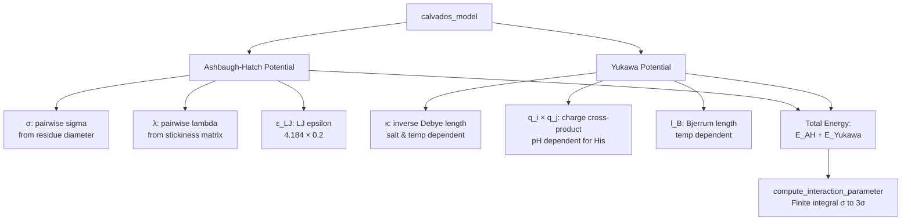

---
slug:12-calvados-forcefield-parameters
blog_type:normal
---


**CALVADOS**（CoArse-grained LAttice model for Variable DesOrdered Sequences，可变无序序列粗粒化晶格模型）力场为本质无序蛋白质相互作用提供了一种基于物理的粗粒化模型。在 finches 中，CALVADOS 被实现为一种对势，它结合了 **Ashbaugh-Hatch Lennard-Jones** 势（用于捕获空间位阻与粘性相互作用）与 **Debye-Hückel Yukawa** 势（用于捕获屏蔽静电相互作用）。该模型依赖于条件——盐浓度、pH 值和温度均会调节最终的相互作用参数，这使得 CALVADOS 在探索溶液条件如何重塑相行为方面具有独特的优势。

来源：[calvados.py](finches/forcefields/calvados.py#L1-L51)

## 模型架构

CALVADOS 将两个粗粒化残基之间的对相互作用能分解为两种物理上独立的贡献。**Ashbaugh-Hatch (AH) 势**是一种修正的 Lennard-Jones 势，它引入了逐残基的“粘性”参数 (λ)，使得吸引势阱的深度可以随氨基酸类型变化，同时保持排斥核心不变。**Yukawa 势**实现了 Debye-Hückel 静电学，其指数衰减由反 Debye 长度 (κ) 控制，而 κ 本身取决于盐浓度和温度。这两个势独立计算并求和，得出总对势能。



其核心架构洞察在于，CALVADOS 参数**并非静态查找表**——每当使用新条件实例化模型时，Yukawa 预因子都会被重新计算，这意味着同一个 `calvados_model` 对象在不同的盐浓度、pH 值或温度条件下会产生不同的对势能。

来源：[calvados.py](finches/forcefields/calvados.py#L75-L201), [calvados.py](finches/forcefields/calvados.py#L402-L483)

## 版本配置

CALVADOS 提供了两组参数集，它们在校准的粘性值 (λ) 和经验校正常数上有所不同：

| 属性 | CALVADOS1 | CALVADOS2 |
|---|---|---|
| **charge_prefactor** | `nan`（未预计算） | `0.7` |
| **null_interaction_baseline** | `nan`（未预计算） | `-0.45` |
| **状态** | 遗留 / 未校准 | **推荐** |
| **RNA 支持** | 否 | 否 |

**`charge_prefactor`** 用于缩放在计算 epsilon 时应用局部电荷上下文权重的强度。**`null_interaction_baseline`** 定义了相互作用阈值，低于该阈值的对项将被归类为“吸引”——该校准使得 poly(GS) 重复序列产生 ε ≈ 0，代表非相互作用的高斯链参考态。对于 CALVADOS2，该基线设定为 −0.45（从原始值 −0.478 略微调，以改善经验吻合度）。

<CgxTip>CALVADOS1 缺少预计算的 `charge_prefactor` 和 `null_interaction_baseline` 值。如果你需要这些值，请在构造 `InteractionMatrixConstructor` 时设置 `compute_forcefield_dependencies=True`，或者使用自带经验证默认值的 CALVADOS2。</CgxTip>

来源：[calvados.py](finches/forcefields/calvados.py#L63-L71)

## 依赖条件的参数

`_genParams` 方法在模型初始化时会重新计算静电参数，这使得 CALVADOS 对溶液条件具有独特的响应能力。该方法推导出三个物理量：

**Bjerrum 长度 (l_B)**——两个单位电荷之间的静电能等于热能 (k_BT) 时的距离。利用经验公式 `ε_w(T) = 5321/T + 233.76 − 0.9297T + 0.001417T² − 0.8292×10⁻⁶T³`，根据水的温度依赖介电常数计算得出，随后计算 `l_B = e²/(4πε₀ε_w) × N_A × 1000 / (RT)`。

**反 Debye 长度 (κ)**——设定 Yukawa 势的屏蔽衰减长度。计算公式为 `κ = √(8π × l_B × I × N_A/10)`，其中 `I` 为离子强度（以 M 为单位的盐浓度）。盐浓度越高 → κ 越大 → 静电作用范围越短。

**组氨酸电荷**——His 通过 `q_His = 1/(1 + 10^(pH−6))` 接收一个依赖于 pH 的分数电荷，反映了其 pKa ≈ 6。在生理 pH (7.4) 下，His 带有 ≈ 0.038 个电荷；在 pH 6 时，带有 0.5 个电荷。

| 条件 | 默认值 | 物理效应 |
|---|---|---|
| `salt` | 0.150 M | 屏蔽静电相互作用；盐浓度越高，Yukawa 衰减越快 |
| `pH` | 7.4 | 调节 His 电荷；对其他残基影响极小 |
| `temp` | 288 K | 缩放热能、Bjerrum 长度和 Debye 屏蔽 |

来源：[calvados.py](finches/forcefields/calvados.py#L205-L254)

## 逐残基参数表

CALVADOS 模型从序列化的 pickle 文件 (`calvados_residues.pickle`) 中加载逐残基参数，该文件同时以三字母和单字母氨基酸代码进行索引。每个残基条目包含：

| 参数 | 符号 | 描述 |
|---|---|---|
| **sigma** | σ | 范德华直径——设定 LJ 接触距离 |
| **lambda** | λ | 粘性参数——缩放 LJ 吸引势阱深度（特定于版本） |
| **charge** | q | 参考 pH 下的残基净电荷 |

**对 sigma 映射**和**对 lambda 映射**使用 Lorentz 组合规则（算术平均值）构建：`σ_ij = (σ_i + σ_j)/2` 和 `λ_ij = (λ_i + λ_j)/2`。这些 20×20 的对称矩阵作为 `self.sigmamap` 和 `self.lambdamap` 存储在模型对象上。

支持 20 种标准氨基酸：M, G, K, T, Y, A, D, E, V, L, Q, W, R, F, S, H, N, P, C, I。**不支持 RNA 残基 (U)**——如果输入序列中出现尿嘧啶，前端的专用 `RNA_check` 装饰器将抛出 `ValueError`。

来源：[calvados.py](finches/forcefields/calvados.py#L186-L200), [calvados_frontend.py](finches/frontend/calvados_frontend.py#L16-L25), [fingerprints.py](finches/data/fingerprints.py#L39-L74)

## Ashbaugh-Hatch 势

Ashbaugh-Hatch 势是一种移位的 Lennard-Jones 势，带有逐对粘性参数 λ，它在不改变排斥核心的情况下调节吸引势阱。这使得不同的氨基酸对在共享共同排除体积直径的同时，可以具有不同的相互作用强度：

**对于 r < 2^(1/6) × σ**（LJ 极小值内部）：
```
E_AH = 4ε[(σ/r)¹² − (σ/r)⁶ − λ·shift] + ε(1−λ)
```

**对于 r ≥ 2^(1/6) × σ**（LJ 极小值外部）：
```
E_AH = 4ελ[(σ/r)¹² − (σ/r)⁶ − shift]
```

其中 `shift = (σ/r_c)¹² − (σ/r_c)⁶` 确保势能在截断处趋于零，`ε_LJ = 4.184 × 0.2 = 0.8368 kJ/mol`（LJ 能量标度）。默认的 LJ 截断为 `r_c = 2.0 nm`。请注意，Ashbaugh-Hatch 势**不依赖于温度**——只有 Yukawa 项会随温度变化而改变。

来源：[calvados.py](finches/forcefields/calvados.py#L449-L474)

## Yukawa (Debye-Hückel) 势

Yukawa 势实现了带有指数衰减的屏蔽库仑静电学：

```
E_Yukawa = q_ij × [exp(−κr)/r − shift]
```

其中 `q_ij = q_i × q_j × l_B × RT` 为对电荷预因子（由残基电荷的交叉乘积构建的 20×20 矩阵），`shift = exp(−κ × r_cut)/r_cut` 确保势能在 Yukawa 截断处（默认 `r_cut = 4.0 nm`）消失。任意距离处的**总能量**即为二者之和：`E_total = E_AH + E_Yukawa`。

<CgxTip>`compute_calvados_energy` 函数期望距离单位为**纳米**（与 CALVADOS 原生单位一致），而 `compute_full_calvados` 接受的距离单位为**埃**并在内部执行转换。这一单位边界是常见的混淆源——务必向模型方法传递埃，而仅向独立能量函数传递纳米。</CgxTip>

来源：[calvados.py](finches/forcefields/calvados.py#L476-L483)

## 相互作用参数计算

`compute_interaction_parameter` 方法将完整的依赖于距离的势能转换为单个标量相互作用强度。它通过使用梯形法则在 **σ 到 3σ** 之间对组合的 AH + Yukawa 势进行数值积分来实现这一点：

```python
interaction_param = np.trapezoid(combo[s1:s3], x=r_angstroms[s1:s3])
```
该有限积分捕获了势能中与热相关的区域——在 σ 内部，能量由排除体积主导；而在 3σ 之外，相互作用可忽略不计。返回的元组包含：

| 索引 | 类型 | 内容 |
|---|---|---|
| `[0]` | float | 相互作用参数（从 σ 到 3σ 的积分） |
| `[1]` | np.array | 完整的对势能与距离关系曲线 |
| `[2]` | int | 距离数组中 σ 的索引 (Å) |
| `[3]` | int | 距离数组中 3σ 的索引 (Å) |
| `[4]` | np.array | 距离数组 (Å) |

这些相互作用参数填充了由 `InteractionMatrixConstructor` 使用的查找表，用于所有下游的 epsilon 计算、滑动窗口矩阵和相图计算。

来源：[calvados.py](finches/forcefields/calvados.py#L327-L396)

## 实例化与使用

`calvados_model` 类是 CALVADOS 参数的直接接口。它通过版本字符串和可选的条件参数进行构造：

```python
from finches.forcefields.calvados import calvados_model

# 生理条件下的默认 CALVADOS2
model = calvados_model('CALVADOS2', salt=0.150, pH=7.4, temp=288)

# 高盐条件——静电屏蔽更强
model_high_salt = calvados_model('CALVADOS2', salt=0.500, pH=7.4, temp=310)

# 计算精氨酸和天冬氨酸之间的对相互作用
result = model.compute_interaction_parameter('R', 'D')
print(f"Interaction parameter: {result[0]:.4f}")

# 计算特定距离下的完整势能（单位为埃）
distances = [3.0, 5.0, 8.0, 12.0]
energies = model.compute_full_calvados('R', 'D', distances)
```

随后，该模型对象被传递给 `InteractionMatrixConstructor` 以进行更高层级的计算。对于大多数用户，`CALVADOS_frontend` 提供了更便捷的接口——它会自动实例化一个 CALVADOS2 模型并封装 `InteractionMatrixConstructor`：

```python
from finches.frontend.calvados_frontend import CALVADOS_frontend

calvados = CALVADOS_frontend(salt=0.150, pH=7.4, temp=288)

# 标量 epsilon 值
eps = calvados.epsilon('RGGGGGGGGG', 'DDDDDDDDDD')

# 滑动窗口相互作用矩阵
matrix_result = calvados.intermolecular_idr_matrix(seq1, seq2, window_size=31)
```

来源：[calvados.py](finches/forcefields/calvados.py#L75-L125), [calvados_frontend.py](finches/frontend/calvados_frontend.py#L28-L44)

## 内置参数常数

在 `calvados_model` 构造函数中硬编码了几个常数，反映了原始 CALVADOS 模拟参数：

| 常数 | 值 | 来源 |
|---|---|---|
| `eps_factor` | 0.2 | LJ 能量缩放因子 |
| `lj_eps` | 0.8368 kJ/mol | `4.184 × eps_factor` |
| `cutoff` | 2.0 nm | AH 势截断距离 |
| `yukawa_r_cut` | 4.0 nm | Yukawa 势截断距离 |

这些数值源自 CALVADOS 源码：`eps_factor` 和 `lj_eps` 来自 `single_chain/simulate.py` 的第 65 行，`cutoff` 来自 `direct_coexistence/submit.py` 的第 29 行，`yukawa_r_cut` 来自模拟脚本的第 104–105 行。

来源：[calvados.py](finches/forcefields/calvados.py#L164-L176)

## CALVADOS 与 Mpipi 对比

CALVADOS 和 Mpipi 代表了 IDP 相互作用的两种截然不同的粗粒化哲学：

| 特性 | CALVADOS | Mpipi |
|---|---|---|
| **势能形式** | Ashbaugh-Hatch + Yukawa | 修正 Mie + Debye-Hückel |
| **粘性** | 逐残基 λ 参数 | 逐对 ε 参数 |
| **条件依赖性** | 盐浓度、pH、温度均调节参数 | 盐浓度调节；温度/pH 暴露较少 |
| **RNA 支持** | ❌ 不支持 | ✅ 支持 |
| **版本** | CALVADOS1, CALVADOS2 | Mpipi_original, Mpipi_GGv1 |
| **null_interaction_baseline** | −0.45 (CALVADOS2) | −0.1285 (Mpipi_GGv1) |
| **charge_prefactor** | 0.7 (CALVADOS2) | 0.20 (Mpipi_GGv1) |

CALVADOS2 中较高的 `charge_prefactor`（0.7 对比 0.2）意味着电荷上下文权重在 CALVADOS 的 epsilon 计算中发挥着大得多的作用。相反，CALVADOS2 中更负的 `null_interaction_baseline`（−0.45 对比 −0.13）移动了吸引/排斥的阈值，反映了两种力场不同的能量标度。

来源：[calvados.py](finches/forcefields/calvados.py#L63-L71), [mpipi.py](finches/forcefields/mpipi.py#L19-L33)

## 自定义参数目录

默认情况下，`calvados_model` 从内置的 `finches/data/calvados/` 目录加载参数。你可以指向一个包含 `calvados_residues.pickle` 文件的自定义目录，以替换替代的逐残基参数（例如，修改后的粘性值或非标准残基类型）：

```python
model = calvados_model('CALVADOS2', input_directory='/path/to/custom/params')
```

该 pickle 文件必须是一个 DataFrame，包含残基属性列（三字母代码、单字母代码、sigma、电荷以及特定版本的 lambda 列）。如果指定的版本列在 pickle 中不存在，将抛出异常并提示检查可用版本。

来源：[calvados.py](finches/forcefields/calvados.py#L130-L153)

## 相关页面

- 关于封装此模型的高层前端 API，请参阅 [Mpipi 和 CALVADOS 前端](5-mpipi-and-calvados-frontends)
- 关于使用这些参数的 `InteractionMatrixConstructor`，请参阅 [InteractionMatrixConstructor](8-interactionmatrixconstructor)
- 关于 Mpipi 力场的对应部分，请参阅 [Mpipi 力场参数](11-mpipi-forcefield-parameters)
- 关于定义完全自定义力场，请参阅 [自定义力场定义](13-custom-forcefield-definition)
- 关于这些参数如何输入相行为分析，请参阅 [Flory-Huggins 相图](14-flory-huggins-phase-diagrams)