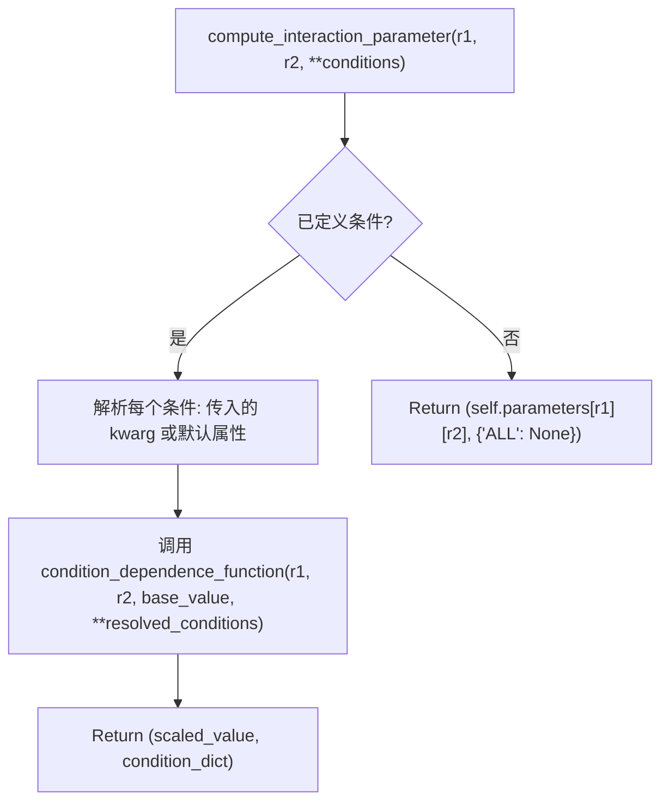
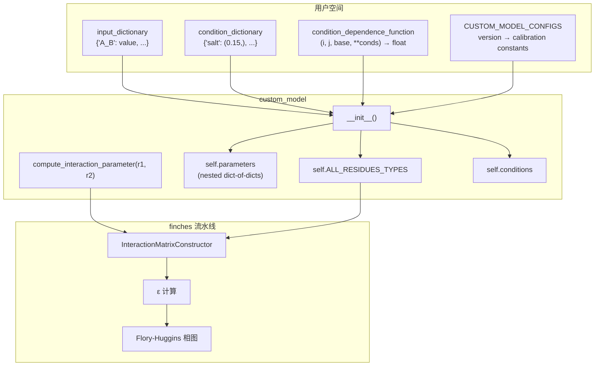

---
slug:13-custom-forcefield-definition
blog_type:normal
---


finches 中的 `custom_model` 类提供了一个**用户自定义力场接口**，允许你在任意残基类型集合之间定义任意的成对相互作用参数，然后在整个 finches 分析流水线中无缝使用这些参数——从 [InteractionMatrixConstructor](8-interactionmatrixconstructor) 一直到 [Flory-Huggins 相图](14-flory-huggins-phase-diagrams)。返回的对象在架构上与内置的 `Mpipi_model` 和 `calvados_model` 对象完全一致，实现了 finches 其余部分所期望的相同 `compute_interaction_parameter` 契约。这意味着你可以在任何接受内置力场的地方替换为自定义力场，而无需修改下游代码。

来源: [custom_model.py](finches/forcefields/custom_model.py#L1-L8), [epsilon_calculation.py](finches/epsilon_calculation.py#L17-L70)

## 力场接口契约

finches 中的每个力场对象——无论是内置还是自定义——都必须暴露 `InteractionMatrixConstructor` 所依赖的三个属性。这种**接口模式**使得系统具有可扩展性：

| 必需属性 | 类型 | 用途 |
|---|---|---|
| `compute_interaction_parameter(r1, r2, **conditions)` | 方法 | 返回残基对的 `(interaction_value, condition_dict)` |
| `ALL_RESIDUES_TYPES` | 列表的列表 | 定义哪些残基可以在同一序列中共存 |
| `CONFIGS` | 字典 | 包含 `'charge_prefactor'` 和 `'null_interaction_baseline'` |

`InteractionMatrixConstructor` 调用 `parameters.compute_interaction_parameter(r1, r2)[0]` 来构建其内部查找表，并读取 `ALL_RESIDUE_TYPES` 来验证序列组成。`CONFIGS` 字典提供了电荷加权和吸引/排斥基线的默认校准值。

来源: [epsilon_calculation.py](finches/epsilon_calculation.py#L72-L89), [epsilon_calculation.py](finches/epsilon_calculation.py#L227-L251)

## 类签名与参数

```python
from finches.forcefields.custom_model import custom_model

my_model = custom_model(
    version,
    input_dictionary,
    valid_residue_groups=[],
    condition_dictionary={},
    condition_dependence_function=None
)
```

来源: [custom_model.py](finches/forcefields/custom_model.py#L29-L135)

### `version` : str

映射到模块顶部 `CUSTOM_MODEL_CONFIGS` 字典中某个键的字符串标识符。该字典存储特定版本的校准常数——具体为 `charge_prefactor` 和 `null_interaction_baseline`。如果你的版本字符串在 `CUSTOM_MODEL_CONFIGS` 中不存在，初始化时将引发 `KeyError`。

**要添加新版本**，你必须在实例化之前扩展 `CUSTOM_MODEL_CONFIGS` 字典：

```python
from finches.forcefields.custom_model import CUSTOM_MODEL_CONFIGS

CUSTOM_MODEL_CONFIGS['MY_VERSION'] = {}
CUSTOM_MODEL_CONFIGS['MY_VERSION']['charge_prefactor'] = 0.25
CUSTOM_MODEL_CONFIGS['MY_VERSION']['null_interaction_baseline'] = -0.12
```

来源: [custom_model.py](finches/forcefields/custom_model.py#L17-L26), [custom_model.py](finches/forcefields/custom_model.py#L236-L239)

### `input_dictionary` : dict

定义所有成对相互作用参数的核心数据结构。键是**以下划线分隔的残基对**，其中每个残基是单个字符；值是相互作用强度（float 或 int）。**每种成对组合必须且只能定义一次。** 该类会自动将输入对称化——如果你定义了 `'A_B': 1.0`，则反向对 `B_A` 会被隐式设置为相同的值。

```python
my_dict = {
    'A_A': -1, 'A_B':  1, 'A_C': -2.4,
    'B_B': -2, 'B_C':  1,
    'C_C':  2
}
```

这个扁平字典在内部被转换为**嵌套的字典的字典**，存储为 `self.parameters`，从而实现 `O(1)` 查找：

```python
self.parameters = {
    'A': {'A': -1,   'B':  1,   'C': -2.4},
    'B': {'A':  1,   'B': -2,   'C':  1},
    'C': {'A': -2.4, 'B':  1,   'C':  2}
}
```

在初始化时强制执行的**验证规则**：
- 每个键的长度必须正好是 3 个字符（例如 `X_Y`）
- 键必须只包含一个下划线分隔符
- 重复的对定义会引发异常
- 缺少对会在计算时导致 `KeyError`

来源: [custom_model.py](finches/forcefields/custom_model.py#L137-L164)

### `valid_residue_groups` : 列表的列表

定义允许在同一序列链中共存的残基类型。每个内部列表是一个**共存组**——来自不同组的残基不能出现在同一序列中。

```python
# 所有残基都允许在同一链中（默认行为）
valid_residue_groups = []

# 蛋白质残基和 RNA 残基分为不同的组
valid_residue_groups = [['A', 'B', 'C'], ['U']]
```

当 `valid_residue_groups` 为空（默认）时，`input_dictionary` 中的所有残基将被放置在单个组中：`self.ALL_RESIDUES_TYPES = [list(self.parameters.keys())]`。当显式提供时，所有组的并集**必须完全匹配** `input_dictionary` 中的残基——任何不匹配都会引发异常。

这对于**蛋白质-核酸系统**尤其重要，因为 RNA 珠子（例如 `'U'`）不应出现在氨基酸序列中，反之亦然。

来源: [custom_model.py](finches/forcefields/custom_model.py#L71-L92), [custom_model.py](finches/forcefields/custom_model.py#L218-L233)

### `condition_dictionary` : dict

定义可以在计算时调节相互作用参数的**环境条件**（例如盐浓度、pH 值、温度）。每个键及其对应的值都会被设置为返回对象的属性：

```python
condition_dict = {'pH': 7.5, 'salt': 0.2}
# 结果为: self.pH = 7.5, self.salt = 0.2
```

值应作为**元组**提供——第一个元素通过 `setattr(self, key, value[0])` 成为默认值。条件键存储在 `self.conditions` 中用于运行时查找。

**不能用作条件键的保留名称：**

| 保留名称 | 原因 |
|---|---|
| `ALL_RESIDUES_TYPES` | 残基组定义的核心属性 |
| `conditions` | 条件名称的内部列表 |
| `compute_interaction_parameter` | 核心接口方法 |
| `condition_dependence_function` | 内部函数引用 |
| `valid_residue_groups` | 残基组定义的核心属性 |
| `version` | 版本标识的核心属性 |

如果 `condition_dictionary` 非空，则**必须**同时提供 `condition_dependence_function`。

来源: [custom_model.py](finches/forcefields/custom_model.py#L94-L116), [custom_model.py](finches/forcefields/custom_model.py#L170-L214)

### `condition_dependence_function` : 可调用对象

一个用户定义的函数，作为环境条件的函数**重新计算相互作用参数**。每当指定条件时，`compute_interaction_parameter` 就会调用它。函数签名必须是：

```python
def my_condition_function(i, j, base_value, **conditions):
    """
    Parameters
    ----------
    i : str
        第一个残基类型
    j : str
        第二个残基类型
    base_value : float
        来自 self.parameters[i][j] 的值
    **conditions : keyword arguments
        condition_dictionary 中定义的所有条件

    Returns
    -------
    float
        更新后的相互作用参数值
    """
    ...
```

**示例**——静电相互作用的盐依赖性缩放：

```python
def salt_scale(i, j, base_value, salt=None, pH=None):
    # 通过德拜屏蔽缩放静电对
    if i in ['D', 'E', 'K', 'R'] or j in ['D', 'E', 'K', 'R']:
        return base_value * (0.15 / salt)  # 随离子强度缩放
    return base_value
```

该函数在初始化时会被验证：它必须是可调用的，并且必须接受 `condition_dictionary` 中定义的所有条件名称作为关键字参数。

来源: [custom_model.py](finches/forcefields/custom_model.py#L117-L128), [custom_model.py](finches/forcefields/custom_model.py#L196-L210)

## `compute_interaction_parameter` 的工作原理

这是 `InteractionMatrixConstructor` 调用以填充其查找表的方法。其行为根据是否定义了条件进行分支：



当条件处于活动状态时，通过检查每个条件是否作为关键字参数传递给了 `compute_interaction_parameter` 来解析它；如果不是，则使用默认值（在 `__init__` 期间设置）。然后，`condition_dependence_function` 接收基础参数值和所有已解析的条件，返回调整后的相互作用强度。

来源: [custom_model.py](finches/forcefields/custom_model.py#L246-L285)

## 完整工作示例

以下示例演示了构建具有盐依赖性条件的自定义 3 珠子模型，并将其与 `InteractionMatrixConstructor` 集成：

```python
from finches.forcefields.custom_model import custom_model, CUSTOM_MODEL_CONFIGS
from finches.epsilon_calculation import InteractionMatrixConstructor

# 步骤 1: 定义版本配置
CUSTOM_MODEL_CONFIGS['my_model_v1'] = {
    'charge_prefactor': 0.2,
    'null_interaction_baseline': -0.1
}

# 步骤 2: 定义成对相互作用字典
#   'P' = pi-pi 珠子, 'C' = 带电珠子, 'H' = 疏水珠子
input_dict = {
    'P_P': -3.0, 'P_C': -1.0, 'P_H': -2.0,
    'C_C':  2.0, 'C_H':  0.5,
    'H_H': -2.5
}

# 步骤 3: 定义条件依赖函数
def salt_dependent(i, j, base_value, salt=None):
    """通过离子强度缩放带电相互作用。"""
    charged = {'C'}
    if i in charged and j in charged:
        return base_value * (0.15 / salt)
    return base_value

# 步骤 4: 实例化自定义模型
my_model = custom_model(
    version='my_model_v1',
    input_dictionary=input_dict,
    valid_residue_groups=[['P', 'C', 'H']],
    condition_dictionary={'salt': (0.15,)},   # 默认 0.15 M
    condition_dependence_function=salt_dependent
)

# 步骤 5: 与 InteractionMatrixConstructor 一起使用
IMC = InteractionMatrixConstructor(my_model)
```

来源: [custom_model.py](finches/forcefields/custom_model.py#L29-L135), [epsilon_calculation.py](finches/epsilon_calculation.py#L18-L25)

## 真实示例：21 残基自定义力场

finches 测试套件在 `example_forcefield.py` 中包含了一个完整的 21 残基自定义力场（20 种标准氨基酸加上一个 `'X'` 占位符）。这演示了生产级的 `input_dictionary`，具有覆盖所有对称对的 231 个成对条目：

```python
from finches.tests.test_data.example_forcefield import input_dictionary
# input_dictionary 包含类似 'M_W': -2, 'G_W': -6, 'W_W': -19 等键
```

此示例中的显著模式：
- **π–π 相互作用**最强（例如 `'W_W': -19`，`'Y_Y': -16`，`'F_F': -13`）
- **电荷-电荷排斥**呈强正值（例如 `'D_D': 29`，`'K_K': 24`，`'R_R': 21`）
- **电荷-电荷吸引**呈强负值（例如 `'E_K': -27`，`'D_R': -27`）
- **`'X'` 占位符**与所有残基的相互作用为零（`'X_X': 0`，`'A_X': 0` 等）

来源: [example_forcefield.py](finches/tests/test_data/example_forcefield.py#L1-L30)

## 与内置力场的比较

自定义模型与内置的 Mpipi 和 CALVADOS 模型的根本区别在于相互作用参数的推导方式：

| 方面 | `custom_model` | `Mpipi_model` | `calvados_model` |
|---|---|---|---|
| 参数来源 | 用户提供的 `input_dictionary` | 预计算的 pickle 文件 (σ, ε, ν, μ, charge) | 预计算的 pickle 文件 (σ, λ, charge) |
| 相互作用计算 | 直接字典查找 | Wang-Frenkel + 库仑势的有限积分 | Ashbaugh-Hatch + Yukawa 势的有限积分 |
| 条件处理 | 用户定义的 `condition_dependence_function` | 内置盐/介电调制 | 内置盐/pH/温度调制 |
| 参数物理意义 | 任意（用户自定义） | π–π + 静电 (Joseph et al. 2021) | 粘附性 + Debye-Hückel (CALVADOS) |
| 残基类型 | 任意单字符符号 | 20 种氨基酸 + `'U'` (RNA) | 20 种氨基酸 |
| `compute_interaction_parameter` 返回 | `(float, dict)` | `(float, np.array, int, int, np.array)` | `(float, np.array, int, int, np.array)` |

<CgxTip>`InteractionMatrixConstructor` 只使用 `compute_interaction_parameter` 返回元组的索引 `[0]`——即标量相互作用值。Mpipi 和 CALVADOS 返回的附加数组数据（能量分布、sigma 索引、距离数组）可用于直接的模型检查，但不会被 IMC 流水线消耗。这意味着你的自定义模型只需返回一个 2 元组 `(float, dict)` 即可完全兼容。</CgxTip>

来源: [custom_model.py](finches/forcefields/custom_model.py#L246-L285), [mpipi.py](finches/forcefields/mpipi.py#L342-L381), [calvados.py](finches/forcefields/calvados.py#L327-L396)

## 校准：设置 `null_interaction_baseline`

`null_interaction_baseline` 是在相互作用矩阵中区分**吸引**和**排斥**相互作用的阈值。对于内置模型，这是根据 poly(GS) 重复序列校准的，该序列被假设为表现得像 ε ≈ 0 的高斯链。

对于自定义模型，你有两种选择：

**选项 1 — 预计算并添加到 CONFIGS：**

```python
from finches.data.forcefield_dependencies import get_null_interaction_baseline
from finches.epsilon_calculation import InteractionMatrixConstructor

# 首先构建 IMC（基线将显示警告）
IMC = InteractionMatrixConstructor(my_model, compute_forcefield_dependencies=True)
baseline = IMC.null_interaction_baseline

# 然后添加到 CONFIGS 以供将来使用
CUSTOM_MODEL_CONFIGS['my_model_v1']['null_interaction_baseline'] = baseline
```

**选项 2 — 在 IMC 构造时显式传递：**

```python
IMC = InteractionMatrixConstructor(
    my_model,
    null_interaction_baseline=-0.1  # 你的校准值
)
```

`get_null_interaction_baseline` 函数使用 `scipy.optimize.root_scalar` 来寻找使 poly(GS) 序列产生 ε = 0 的基线值，默认在 `[-10.0, 10.0]` 区间内搜索。

<CgxTip>如果既未设置预计算的基线，也未设置 `compute_forcefield_dependencies=True`，`InteractionMatrixConstructor` 将打印警告但继续运行。然而，任何依赖于吸引/排斥分解的下游分析（例如 epsilon 向量、相图）在没有适当基线的情况下都会产生不正确的结果。在依赖有符号相互作用分解之前，务必校准你的自定义模型。</CgxTip>

来源: [forcefield_dependencies.py](finches/data/forcefield_dependencies.py#L17-L68), [epsilon_calculation.py](finches/epsilon_calculation.py#L167-L180)

## 架构：力场流水线中的自定义模型



自定义模型在流水线中与 [Mpipi 力场参数](11-mpipi-forcefield-parameters) 或 [CALVADOS 力场参数](12-calvados-forcefield-parameters) 处于相同的位置。一旦实例化并传递给 `InteractionMatrixConstructor`，无论计算背后是哪种力场，所有下游功能——滑动窗口矩阵、每残基向量、epsilon 值和相图——的工作方式都完全相同。

来源: [custom_model.py](finches/forcefields/custom_model.py#L29-L135), [epsilon_calculation.py](finches/epsilon_calculation.py#L18-L131)

## 下一步

定义好自定义力场后，你可以继续进行：
- 使用 [InteractionMatrixConstructor](8-interactionmatrixconstructor) 与你的自定义模型**计算相互作用矩阵**
- 通过 [每残基相互作用向量](7-per-residue-interaction-vectors) **计算每残基相互作用向量**
- 使用 [Flory-Huggins 相图](14-flory-huggins-phase-diagrams) 与你的自定义能量学**生成相图**
- 通过 [条件依赖的相行为](15-condition-dependent-phase-behavior) 改变你的自定义条件来**探索条件依赖行为**