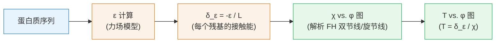

---
slug:14-flory-huggins-phase-diagrams
blog_type:normal
---


Finches 通过将**平均场相互作用参数** (ε) 与 **Flory-Huggins 理论的解析解**相联系，预测同型液-液相分离 (LLPS) 相图。该流程将蛋白质序列转化为温度-浓度 (T vs. φ) 相图，并同时生成双节线和旋节线，从而无需模拟即可快速实现序列解析的相行为预测。

## 理论基础

相图引擎构建于 Qian, Michaels 与 Knowles (2022) 推导的双组分 Flory-Huggins 模型的解析解之上，该解析解提供了**双节线和旋节线的解析表达式**，而以往这需要通过数值求根才能实现。在 Flory-Huggins 理论中，核心相互作用参数为 χ (chi)，其定义为：

> **χ = ε / (k_B × T)**

其中 ε 为位点间接触能，k_B 为玻尔兹曼常数，T 为温度。更大的正 χ 值对应于更强的吸引相互作用，从而产生更大的相分离驱动力。**临界点**——低于该热力学边界时无论浓度如何均不发生相分离——的解析表达式为：

| 量 | 表达式 |
|---|---|
| 临界体积分数 (φ_c) | 1 / (1 + √n) |
| 临界 chi (χ_c) | 0.5 × (1 + 1/√n)² |

其中 n 为聚合物链长。当 n = 1（对称溶质-溶剂体系）时，可还原为经典结果 χ_c = 2, φ_c = 0.5。

来源: [backend.py](finches/analytical_fh/backend.py#L31-L48), [floryhuggins.py](finches/analytical_fh/floryhuggins.py#L1-L30)

## 架构：从序列到相图

从蛋白质序列到相图的转换通过一个定义明确的计算流程进行。Finches 首先使用力场模型根据序列计算平均场相互作用参数 ε，随后将 ε 转换为每个残基的接触能 (δ_ε)，利用解析 FH 解构建 χ vs. φ 图，最后通过 T = δ_ε / χ 将 χ 重新映射为温度。



**符号约定**至关重要：finches 将负 ε 定义为吸引作用（促进相分离）。在转换为 Flory-Huggins 的 χ 时，符号会反转，因为 χ 为正值时表示吸引相互作用。除以每个残基的长度 (`-ε / len(seq)`) 是必要的，因为 ε 是链级别的量，而 FH 解已通过 n 考虑了聚合物长度，因此只有每个残基的平均贡献才应代入 χ 中。

来源: [epsilon_to_FHtheory.py](finches/epsilon_to_FHtheory.py#L399-L448), [floryhuggins.py](finches/analytical_fh/floryhuggins.py#L72-L130)

## 三种双节线计算模式

解析 FH 后端提供了三种计算双节线的模式，它们均共享相同的输入签名 `(chi, n)`：

| 模式 | 函数 | 描述 | 适用场景 |
|---|---|---|---|
| `analytic_binodal` | `backend.analytic_binodal()` | 来自 Qian 等人论文的封闭解析解 | 所有情况下的**默认且推荐**选项 |
| `binodal` | `backend.binodal()` | 自洽迭代解（默认 5 次迭代），可选改进的牛顿映射 | 用于验证或与解析结果进行对比 |
| `GL_binodal` | `backend.GL_binodal()` | 临界点附近的 Ginzburg-Landau 展开 | 仅在 χ_c 附近有效；为完整性而提供 |

`analytic_binodal` 模式对 n = 1（对称混合物，使用基于 `tanh` 的表达式）和 n > 1（不对称，使用基于 `coth` 的表达式及无量纲距离参数 D = (χ - χ_c) / χ_c）采用不同的函数形式。对于 n > 1，该解涉及辅助变量 `a = n^(1/4)`、双曲余切项以及指数映射，以恢复浓相和稀相的体积分数。

<CgxTip>如果 ε 为正（净排斥），finches 会将其覆盖为 -0.01——一个可忽略的吸引值——因为排斥性的 ε 会使 χ 到 T 的转换反转，从而产生非物理的“逆”相图。这是一种务实的权宜之计；具有排斥性 ε 的序列根本不会发生相分离。</CgxTip>

来源: [backend.py](finches/analytical_fh/backend.py#L200-L316), [floryhuggins.py](finches/analytical_fh/floryhuggins.py#L55-L97)

## API 参考

### 底层：`analytical_fh` 模块

这些函数直接在 χ–φ 空间中操作，需要你显式指定 χ 值。

**`floryhuggins.calculate_binodal(L, mode, chi_min, chi_max, n_points)`** —— 在 `chi_min` 到 `chi_max` 范围内以 `n_points` 个等距值扫描 χ，并在每个点计算双节线。返回包含 5 个元素的元组：`(chi_values, dilute_φ, dense_φ, critical_φ, critical_χ)`。

**`floryhuggins.calculate_spinodal(L, chi_min, chi_max, n_points)`** —— 对旋节线采用相同的扫描结构。返回相同的 5 元素元组格式。

**`backend.critical(n)`** —— 返回聚合物长度为 n 时的 `[φ_c, χ_c]`。

**`backend.spinodal(chi, n)`** / **`backend.binodal(chi, n)`** / **`backend.analytic_binodal(chi, n)`** / **`backend.GL_binodal(chi, n)`** —— 计算各自曲线上的一点。每个函数均返回 `[dense_φ, dilute_φ]`（若 χ < χ_c 则抛出 `ValueError`）。

来源: [floryhuggins.py](finches/analytical_fh/floryhuggins.py#L8-L197), [backend.py](finches/analytical_fh/backend.py#L31-L316)

### 中层：`epsilon_to_FHtheory` 模块

这些函数将序列级别的 ε 计算与 FH 后端衔接，生成 T–φ 相图。

**`return_phase_diagram(seq, X_class)`** —— 使用提供的 `InteractionMatrixConstructor` 根据序列计算 ε，然后委派给 `epsilon_to_phase_diagram`。这是单序列相图最常用的入口点。

**`epsilon_to_phase_diagram(seq, epsilon)`** —— 给定预计算的 ε 值和序列（仅用于获取长度），构建完整的 T–φ 相图。返回包含 8 个元素的列表：

| 索引 | 内容 |
|---|---|
| `[0]` | 稀相 φ (双节线) |
| `[1]` | 浓相 φ (双节线) |
| `[2]` | `[critical_φ, critical_T]` (双节线) |
| `[3]` | 温度数组 (双节线) |
| `[4]` | 稀相 φ (旋节线) |
| `[5]` | 浓相 φ (旋节线) |
| `[6]` | `[critical_φ, critical_T]` (旋节线) |
| `[7]` | 温度数组 (旋节线) |

来源: [epsilon_to_FHtheory.py](finches/epsilon_to_FHtheory.py#L241-L399)

### 高层：前端方法

前端对象（`Mpipi_frontend`, `CALVADOS_frontend`）提供了最便捷的 API。

**`frontend.build_phase_diagram(seq)`** —— 通过 `self.epsilon(seq, seq)` 在内部计算 ε，并调用 `epsilon_to_phase_diagram`。返回与上述相同的 8 元素列表。

**`frontend.plot_phase_diagram(seq, ...)`** —— 在单次调用中构建并渲染相图。接受 `line_color`, `line_width`, `xlim`, `ylim`, `xlog`, `width`, `height` 和 `filename` 用于自定义。返回 `[phase_data, fig, ax]`。

**`frontend.plot_multiple_phase_diagrams(seqdict, tc_ref, ...)`** —— 将多个相图叠加在同一图上。`seqdict` 将序列名称映射为 `[sequence_string, color]`，`tc_ref` 指定使用哪个序列的临界温度来归一化 y 轴 (T/T_c)。

```python
from finches.frontend.mpipi_frontend import Mpipi_frontend

mf = Mpipi_frontend()
seq = 'MASNDYTQQATQSYGAYPTQPGQGYSQQSSQPYGQQSYSGYSQSTDTSGYGQSSYSSYGQSQNTGYGTQSTPQGYGSTGGYGSSQSSQSSYGQQSSYPGYGQQPAPSSTSGSYGSSSQSSSYGQPQSGSYSQQPSYGGQQQSYGQQQSYNPPQGYGQQNQYNS'

# 单次调用内构建并绘图
result = mf.plot_phase_diagram(seq, ylim=[0.7, 1.05])

# 或者分别构建数据以便自定义绘图
B = mf.build_phase_diagram(seq)
plt.plot(B[0], B[3], 'blue', label='Binodal (dilute arm)')
plt.plot(B[1], B[3], 'blue', label='Binodal (dense arm)')
plt.plot(B[4], B[7], 'blue', ls='--', label='Spinodal (dilute)')
plt.plot(B[5], B[7], 'blue', ls='--', label='Spinodal (dense)')
plt.plot(B[2][0], B[2][1], 'ko', ms=4, label='Critical point')
```

来源: [frontend_base.py](finches/frontend/frontend_base.py#L1000-L1199), [epsilon_to_FHtheory.py](finches/epsilon_to_FHtheory.py#L241-L330)

## 依赖条件的相图

Finches 提供了三个构建器函数，用于遍历环境条件，并在每一步重新初始化力场，以捕捉相边界随溶液化学性质的变化。每个函数均返回 `[condition_list, diagrams_dict, epsilons_dict]`。

| 函数 | 条件参数 | 对相行为的影响 |
|---|---|---|
| `build_SALT_dependent_phase_diagrams(seq, X_class, condition_list)` | `X_class.parameters.salt` | 盐浓度越高，静电排斥被屏蔽得越强，通常会扩大两相区 |
| `build_PH_dependent_phase_diagrams(seq, X_class, condition_list, ...)` | `X_class.parameters.pH` | 改变残基的电荷状态（尤其是 His, Asp, Glu），重塑静电贡献 |
| `build_DIELECTRIC_dependent_phase_diagrams(seq, X_class, condition_list, ...)` | `X_class.parameters.dielectric` | 改变溶剂的介电常数，调节所有静电项 |

每个函数都会验证力场模型上是否存在所请求的条件参数，遍历条件列表并在每一步更新查找字典，计算相图和 ε 值，并在完成后**恢复原始参数**。对于依赖盐浓度的相图，`build_SALT_dependent_phase_diagrams` 还会从 `X_class` 中读取并保留 `charge_prefactor` 和 `null_interaction_baseline`。

```python
from finches import epsilon_to_FHtheory
from finches.frontend.mpipi_frontend import Mpipi_frontend

mf = Mpipi_frontend()
salts = [0.01, 0.05, 0.1, 0.15, 0.2, 0.3]

result = epsilon_to_FHtheory.build_SALT_dependent_phase_diagrams(
    seq, mf.IMC_object, salts
)

# result[0] = 盐浓度值
# result[1] = 盐浓度 -> 相图数据的字典映射
# result[2] = 盐浓度 -> epsilon 值的字典映射
```

有关相图如何响应环境条件的更深入探讨，请参阅 [依赖条件的相行为](15-condition-dependent-phase-behavior)。

来源: [epsilon_to_FHtheory.py](finches/epsilon_to_FHtheory.py#L44-L237)

## 重要注意事项

**排斥性 ε 的处理**：当 ε > 0（净排斥）时，代码在计算相图前会将 ε 设置为 -0.01。这避免了 χ 到 T 转换中的除以零错误，并防止了非物理的逆相图。生成的相图将显示一个极其狭窄的两相区，这实际上标志着“不发生相分离”。如果你需要区分真正边缘相分离的序列与不分离的序列，请在调用相图构建器之前检查原始 ε 值。

**χ 范围默认值**：`epsilon_to_phase_diagram` 函数对双节线使用 `chi_max=0.8` 及 `n_points=50000`，对旋节线使用 `n_points=10000`。对于极长的聚合物 (n > 1000)，临界 χ 从上方趋近于 0.5，因此默认的 `chi_min=0.5` 是合适的。然而，对于短聚合物或极强相互作用，你可能需要直接调用 `floryhuggins.calculate_binodal` 来增加 `chi_max`。

**平均场近似**：这些相图源自平均场晶格模型 (Flory-Huggins)，无法捕捉浓度涨落、有限尺寸效应或多组分相互作用。最好将其定性解释为相分离的*趋势*和*近似边界*的预测。

来源: [epsilon_to_FHtheory.py](finches/epsilon_to_FHtheory.py#L399-L448)

## 建议阅读路径

- 关于输入到相图中的 ε 计算：[Epsilon 计算与权重](9-epsilon-calculation-and-weighting)
- 关于环境条件如何重塑相边界：[依赖条件的相行为](15-condition-dependent-phase-behavior)
- 关于封装这些函数的前端 API：[Mpipi 和 CALVADOS 前端](5-mpipi-and-calvados-frontends)
- 关于力场参数详情：[Mpipi 力场参数](11-mpipi-forcefield-parameters)