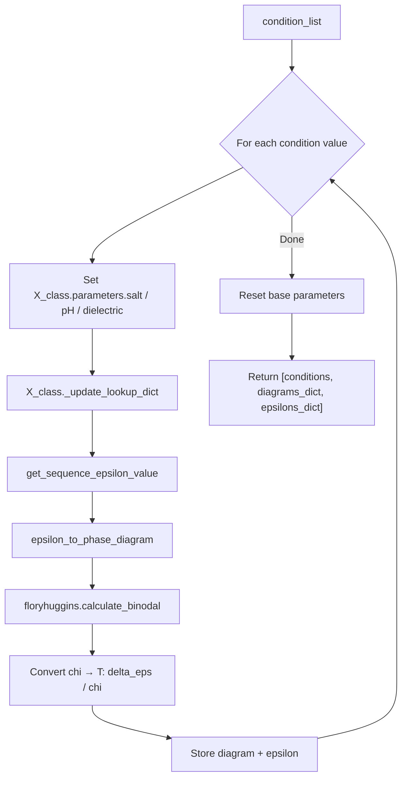

---
slug:15-condition-dependent-phase-behavior
blog_type:normal
---


Finches 提供了专用基础设施，用于探索**环境条件**（盐浓度、pH 和介电常数）如何重塑内在无序蛋白质的相边界。与其计算单一的静态相图，`epsilon_to_FHtheory` 模块迭代地重新参数化力场，重新计算平均场相互作用参数 (ε)，并在每个条件值下重建 Flory-Huggins 双节线，从而生成一系列相图，揭示溶液化学如何调制液-液相分离。

## 架构概述

依赖条件的相图流程链由三个计算阶段组成：**参数重新初始化**、**ε 重计算**和 **χ→T 转换**。在每一步中，`InteractionMatrixConstructor` 都会通过 `_update_lookup_dict()` 进行原地修改，确保在执行任何下游计算之前，残基间的相互作用查找表能够反映新的静电环境。



关键的洞察在于，改变盐浓度、pH 或介电常数并不会改变序列——它通过内置于每个力场模型中的德拜屏蔽长度和电荷状态计算，改变了 ε 的**静电贡献**。这意味着同一序列在不同的缓冲条件下会表现出截然不同的相行为。

来源: [epsilon_to_FHtheory.py](finches/epsilon_to_FHtheory.py#L1-L23), [epsilon_to_FHtheory.py](finches/epsilon_to_FHtheory.py#L194-L270)

## 特定条件的构建函数

三个并行函数提供了依赖条件的相图构建，每个函数针对一个不同的环境变量。它们都共享相同的返回结构：包含 `[condition_list, out_diagrams, out_epsilons]` 的三元素列表，其中 `out_diagrams` 和 `out_epsilons` 是以条件值为键的字典。

| 函数 | 修改的参数 | 验证检查 | 重置行为 |
|---|---|---|---|
| `build_SALT_dependent_phase_diagrams` | `X_class.parameters.salt` | 确认 `parameters.salt` 存在 | `X_class.parameters.salt = base_value` + `_update_lookup_dict()` |
| `build_PH_dependent_phase_diagrams` | `X_class.parameters.pH` | 确认 `parameters.pH` 存在 | `X_class.parameters.salt = base_value` + `_update_parameters(base_params)` |
| `build_DIELECTRIC_dependent_phase_diagrams` | `X_class.parameters.dielectric` | 确认 `parameters.dielectric` 存在 | `X_class.parameters.salt = base_value` + `_update_parameters(base_params)` |

<CgxTip>依赖盐浓度的构建器使用了更健壮的重置策略——直接调用 `_update_lookup_dict()`——而 pH 和介电常数构建器则通过 `_update_parameters(base_params)` 进行恢复。这种不对称性反映出盐浓度变化仅修改查找表，而 pH/介电常数的变化会改变单个残基的电荷状态，因此需要完整的参数重新初始化。</CgxTip>

### 依赖盐浓度的相图

`build_SALT_dependent_phase_diagrams` 函数是最常用的变体，因为盐浓度直接控制着德拜屏蔽长度，进而控制静电相互作用的范围和强度。`condition_list` 中的每个盐浓度值都会被设置到 `X_class.parameters.salt` 上，查找字典会被刷新，并同时计算相图和 ε 值：

```python
from finches.frontend.mpipi_frontend import Mpipi_frontend
from finches.epsilon_to_FHtheory import build_SALT_dependent_phase_diagrams

mf = Mpipi_frontend(salt=0.150)  # 初始盐浓度 = 150 mM
seq = "MGDEDWEAEINPHMSSYVPIFEKDRYSGENGDNFNRTPASSSEMDDGPSRRDHFMKSGFASGRNFGNRDAGECNKRDNTSTMGGFGVGKSFGNRGFSNSRFEDGDSSGFWRESSNDCEDNPTRNRGFSKRGGYRDGNNSEASGPYRRGGRGSFRGCRGGFGLGSPNNDLDPDECMQRTGGLFGSRRPVLSGTGNGDTSQSRSGSGSERGGYKGLNEEVITGSGKNSWKSEAEGGES"

salt_values = [0.100, 0.200, 0.300, 0.400, 0.500]
results = build_SALT_dependent_phase_diagrams(seq, mf.IMC_object, salt_values)

# results[0] → [0.100, 0.200, 0.300, 0.400, 0.500]
# results[1] → {0.100: phase_diagram, 0.200: phase_diagram, ...}
# results[2] → {0.100: epsilon_value, 0.200: epsilon_value, ...}
```

迭代完成后，该函数会在 `InteractionMatrixConstructor` 上**恢复原始的盐浓度值**，确保没有副作用泄漏到后续计算中。

来源: [epsilon_to_FHtheory.py](finches/epsilon_to_FHtheory.py#L194-L270)

### 依赖 pH 的相图

`build_PH_dependent_phase_diagrams` 函数遍历 pH 值，这会改变力场模型中可电离残基（His、Asp、Glu、Lys 等）的**质子化状态**。这改变了每个残基的净电荷，进而改变了整个静电图景。其用法与盐浓度变体类似：

```python
from finches.epsilon_to_FHtheory import build_PH_dependent_phase_diagrams

ph_values = [6.0, 7.0, 7.4, 8.0]
results = build_PH_dependent_phase_diagrams(seq, mf.IMC_object, ph_values,
                                            prefactor=None,
                                            null_interaction_baseline=None)
```

依赖 pH 的行为对于具有高组氨酸含量的序列，或者在局部 pH 变化显著的细胞区室化建模（例如，溶酶体 pH 约为 5，而细胞质 pH 约为 7.4）中尤为相关。

来源: [epsilon_to_FHtheory.py](finches/epsilon_to_FHtheory.py#L113-L189)

### 依赖介电常数的相图

`build_DIELECTRIC_dependent_phase_diagrams` 函数修改介电常数，该常数均匀地缩放所有静电相互作用。较低的介电常数值会增强电荷-电荷相互作用（模拟极性较弱的溶剂环境），而较高的值则会减弱它们：

```python
from finches.epsilon_to_FHtheory import build_DIELECTRIC_dependent_phase_diagrams

dielectric_values = [40.0, 60.0, 80.0, 100.0]
results = build_DIELECTRIC_dependent_phase_diagrams(seq, mf.IMC_object, dielectric_values)
```

默认的水相介电常数约为 80.0。探索较低的值可以近似模拟由拥挤效应引起的有效介电常数变化，或者膜附近的环境。

来源: [epsilon_to_FHtheory.py](finches/epsilon_to_FHtheory.py#L33-L109)

## Epsilon 到相图的转换

核心转换逻辑位于 `epsilon_to_phase_diagram(seq, epsilon)` 中，它桥接了计算出的平均场 ε 和 Flory-Huggins 双节线。此函数执行四个关键转换：

1. **排斥性 epsilon 守卫**: 如果 ε > 0（排斥性），则将其设置为 −0.01。在转换 χ→T 时，正的 ε 会产生数学上无效的“反向”相图，因为该转换假设 δ_ε 代表净吸引的位点特异性能量。

2. **残基级缩放**: 链级别的 ε 除以序列长度得到 δ_ε（每个残基的接触能），因为 `calculate_binodal` 已经通过 Flory-Huggins 聚合度参数考虑了聚合物长度。

3. **双节线计算**: `floryhuggins.calculate_binodal(len(seq), 'analytic_binodal', n_points=50000, chi_max=0.8)` 使用 Qian, Michaels & Knowles (2022) 的解析解计算 χ 与 φ 的双节线。

4. **χ→T 转换**: 温度通过 `T = δ_ε / χ` 恢复，利用了 Flory-Huggins 关系式 χ = δ_ε / (k_B T)。当 k_B = 1 时，这给出了以 δ_ε 为单位的 T。

该函数还使用 `calculate_spinodal` 计算出**旋节线**，并应用相同的 χ→T 转换，在单个 8 元素列表中返回两条曲线：

| 索引 | 内容 | 空间 |
|---|---|---|
| 0 | 稀相浓度 (双节线) | φ |
| 1 | 密相浓度 (双节线) | φ |
| 2 | 临界点 `[φ_c, T_c]` (双节线) | φ, T |
| 3 | 温度数组 (双节线) | T |
| 4 | 稀相浓度 (旋节线) | φ |
| 5 | 密相浓度 (旋节线) | φ |
| 6 | 临界点 `[φ_c, T_c]` (旋节线) | φ, T |
| 7 | 温度数组 (旋节线) | T |

来源: [epsilon_to_FHtheory.py](finches/epsilon_to_FHtheory.py#L356-L448)

## 通过前端重新初始化进行手动条件变化

构建函数的一种替代方法是在每个条件值处**重新实例化前端**。这是 DDX4 盐浓度依赖性演示中使用的方法，当你需要完全控制模型构建或希望同时改变多个条件时，这种方法有时更可取：

```python
from finches.frontend.mpipi_frontend import Mpipi_frontend
from finches.epsilon_to_FHtheory import return_phase_diagram

DDX4_WT = "MGDEDWEAEINPHMSSYVPIFEKDRYSGENGDNFNRTPASSSEMD..."

# 通过构建具有不同盐参数的新前端，计算不同盐浓度下的相图
B_100mM = return_phase_diagram(DDX4_WT, Mpipi_frontend(salt=0.100).IMC_object)
B_200mM = return_phase_diagram(DDX4_WT, Mpipi_frontend(salt=0.200).IMC_object)
B_300mM = return_phase_diagram(DDX4_WT, Mpipi_frontend(salt=0.300).IMC_object)

# 根据参考临界温度归一化温度
T_ref = max(B_200mM[3])  # 200 mM 下的参考 T_c

import matplotlib.pyplot as plt
plt.plot(B_100mM[0], B_100mM[3] / T_ref, label='100 mM NaCl')
plt.plot(B_100mM[1], B_100mM[3] / T_ref)
plt.plot(B_300mM[0], B_300mM[3] / T_ref, label='300 mM NaCl')
plt.plot(B_300mM[1], B_300mM[3] / T_ref)
plt.xlabel(r'$\phi$')
plt.ylabel(r'$T / T_{c,ref}$')
```

这种方法为每个条件创建一个新的 `Mpipi_model` 和 `InteractionMatrixConstructor`，避免了构建函数使用的原地修改模式。当条件稀疏时，这种方法更简洁，但在大规模条件扫描时效率较低，因为每次实例化都会从头重建完整的相互作用查找表。

来源: [phase_diagram_demo.ipynb](demo/phase_diagrams/phase_diagram_demo.ipynb#L443-L484)

## 参数重置与副作用安全

所有三个构建函数在迭代完成后都实现了**重置协议**，以确保 `InteractionMatrixConstructor` 恢复到其原始状态。这一点至关重要，因为构造器在循环期间会被原地修改——如果不重置，后续使用同一构造器对象的调用将在最后一次迭代的条件下运行，而不是用户预期的基线条件。

各函数的重置协议略有不同：

- **盐浓度构建器**: 直接恢复 `X_class.parameters.salt = base_value` 并调用 `X_class._update_lookup_dict()`。这就足够了，因为盐浓度只影响德拜长度，不影响残基电荷状态。

- **pH / 介电常数构建器**: 通过 `X_class.parameters.salt = base_value` 恢复，随后调用 `X_class._update_parameters(base_params)`。完整参数更新是必要的，因为 pH 和介电常数的变化会改变残基级别的电荷计算，其影响会传播到查找字典之外。

<CgxTip>pH 和介电常数构建器中存在一个细微的不一致：两者都重置 `X_class.parameters.salt = base_value`，而不是重置它们各自的参数（pH 或介电常数）。随后的 `_update_parameters(base_params)` 调用确实恢复了完整的参数集，使得盐浓度的重置显得冗余但无害。如果你在构建器调用后依赖该构造器，请验证参数是否处于预期状态。</CgxTip>

来源: [epsilon_to_FHtheory.py](finches/epsilon_to_FHtheory.py#L103-L108), [epsilon_to_FHtheory.py](finches/epsilon_to_FHtheory.py#L183-L188)

## 解读依赖条件的相图

在可视化一系列依赖条件的相图时，通常有两种约定：

1. **温度归一化**: 将所有温度数组除以一个参考临界温度（通常是最低盐浓度或野生型的 T_c）。这会将所有曲线放在共享的 `T/T_c` 轴上，便于观察**饱和浓度**（给定温度下双节线的稀相分支）如何随条件变化而移动。

2. **对数刻度浓度**: 在 φ 轴上使用 `plt.xscale('log')`。稀相浓度跨越多个数量级（尤其是对于强相分离序列），对数刻度可防止密相分支在视觉上主导图表。

对于依赖盐浓度的相图，预期的物理趋势是**增加盐浓度会缩小两相区**：更高的离子强度会屏蔽静电相互作用，减少净吸引 ε，降低 T_c，并提高饱和浓度。其相分离主要由 π-π 和阳离子-π 相互作用（而非静电作用）驱动的序列，将表现出较弱的盐敏感性。

来源: [phase_diagram_demo.ipynb](demo/phase_diagrams/phase_diagram_demo.ipynb#L443-L484), [epsilon_to_FHtheory.py](finches/epsilon_to_FHtheory.py#L275-L334)

## API 摘要

| 函数 | 签名 | 返回值 |
|---|---|---|
| `build_SALT_dependent_phase_diagrams` | `(seq, X_class, condition_list)` | `[conditions, {salt: diagram}, {salt: epsilon}]` |
| `build_PH_dependent_phase_diagrams` | `(seq, X_class, condition_list, prefactor, null_interaction_baseline)` | `[conditions, {pH: diagram}, {pH: epsilon}]` |
| `build_DIELECTRIC_dependent_phase_diagrams` | `(seq, X_class, condition_list, prefactor, null_interaction_baseline)` | `[conditions, {ε_r: diagram}, {ε_r: epsilon}]` |
| `return_phase_diagram` | `(seq, X_class)` | 8 元素的双节线+旋节线列表 |
| `epsilon_to_phase_diagram` | `(seq, epsilon)` | 8 元素的双节线+旋节线列表 |

关于底层的 Flory-Huggins 计算引擎，请参阅 [Flory-Huggins Phase Diagrams](14-flory-huggins-phase-diagrams)。关于输入到这些相图中的 epsilon 计算，请参阅 [Epsilon Calculation and Weighting](9-epsilon-calculation-and-weighting)。要了解力场参数如何响应条件变化，请参阅 [Mpipi Forcefield Parameters](11-mpipi-forcefield-parameters) 和 [CALVADOS Forcefield Parameters](12-calvados-forcefield-parameters)。