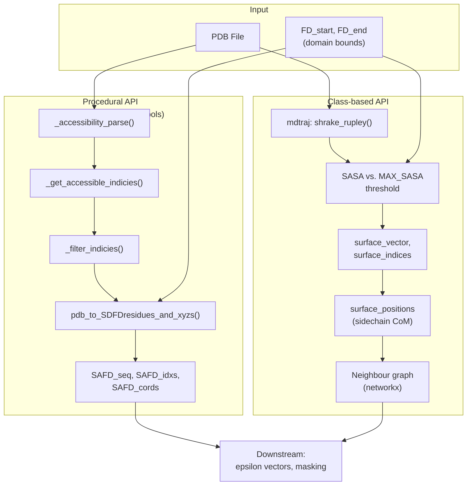

---
slug:16-pdb-surface-residue-extraction
blog_type:normal
---


Finches 提供了两个互补的系统，用于从折叠结构域的 PDB 结构中提取溶剂可及的表面残基——一个基于 `soursop` 构建的**过程式函数 API**，以及一个基于 `mdtraj` 构建的**基于类的 API**。两者共享相同的概念流程：解析 PDB → 计算每个残基的溶剂可及表面积 (SASA) → 根据阈值将残基划分为表面残基与埋藏残基 → 返回序列、索引和三维坐标，用于下游的交互计算。

## 架构概述

表面残基提取子系统的存在，是为了将**静态结构数据**（PDB 文件）与**基于序列的交互模型**连接起来。折叠结构域将残基包埋在内部；只有暴露在表面的残基才能参与与侧翼固有无序区 (IDR) 的结构域间相互作用。因此，正确提取这些残基是计算 IDR 与折叠结构域之间任何具有物理意义的 epsilon 值的先决条件。



**过程式 API** (`PDB_structure_tools`) 是早期的实现，提供了可组合的细粒度函数，适用于自定义工作流。**基于类的 API** (`FoldedDomain`) 是较新且功能更丰富的系统，它将表面识别与空间图构建、邻居分析以及表面斑块上的直接 epsilon 计算捆绑在一起。

来源: [PDB_structure_tools.py](/finches/PDB_structure_tools.py#L1-L11), [folded_domain_utils.py](/finches/utils/folded_domain_utils.py#L1-L66)

## FoldedDomain 类

`finches.utils.folded_domain_utils` 中的 `FoldedDomain` 类是提取表面残基的主要推荐接口。它封装了完整的生命周期：PDB 加载、SASA 计算、表面分类、空间坐标提取，以及派生属性（邻居图、距离矩阵、epsilon 值）的惰性求值。

### 初始化与核心属性

在构造时，`FoldedDomain` 对象会计算并暴露以下属性：

| 属性 | 类型 | 描述 |
|---|---|---|
| `self.sequence` | `str` | 折叠结构域的完整氨基酸序列 |
| `self.traj` | `mdtraj.Trajectory` | PDB 的 mdtraj 轨迹对象 |
| `self.sasa` | `np.ndarray` | 每个残基的 SASA，单位为 Ų（由 nm² 转换而来） |
| `self.surface_vector` | `list[int]` | 二值向量：1 = 表面，0 = 埋藏 |
| `self.surface_indices` | `list[int]` | 被划分为表面的残基索引 |
| `self.surface_positions` | `dict[int→np.ndarray]` | 每个表面残基的侧链质心 XYZ 坐标 |
| `self.surface_fraction` | `float` | 被划分为表面暴露的残基比例 |

这些属性在 `__init__` 期间立即计算。其他一些开销较大的属性则通过 `@property` 描述符在首次访问时进行惰性求值。

来源: [folded_domain_utils.py](/finches/utils/folded_domain_utils.py#L66-L149)

### 构造函数参数

```python
from finches.utils.folded_domain_utils import FoldedDomain

fd = FoldedDomain(
    pdbfilename='my_domain.pdb',
    start=None,                # 起始残基索引（可选切片）
    end=None,                  # 结束残基索引（可选切片）
    probe_radius=1.4,          # Å，SASA 的溶剂探针半径
    residue_overide_mapping={}, # 映射非标准残基名称
    surface_thresh=0.10,       # 最大 SASA 的比例，用于分类
    sasa_mode='v1',            # 'v1' 或 'v2' 阈值策略
    ignore_warnings=False,
    SASA_ONLY=False            # 若为 True，则跳过表面分类
)
```

| 参数 | 默认值 | 用途 |
|---|---|---|
| `pdbfilename` | *(必需)* | PDB 文件路径 |
| `start` / `end` | `None` | 在分析前将 PDB 按残基范围进行切片 |
| `probe_radius` | `1.4` | 溶剂探针半径，单位为 Å（1.4 = 水）；在内部会转换为 nm 以供 mdtraj 使用 |
| `residue_overide_mapping` | `{}` | 将非标准 3 字母残基名称映射为标准名称的字典 |
| `surface_thresh` | `0.10` | 最大 SASA 的比例；SASA 占比超过此值的残基被视为表面暴露 |
| `sasa_mode` | `'v1'` | 控制用于阈值的参考最大 SASA（见下文） |
| `SASA_ONLY` | `False` | 若为 `True`，则仅计算 SASA 并跳过所有表面分析 |

来源: [folded_domain_utils.py](/finches/utils/folded_domain_utils.py#L70-L149)

### 两种 SASA 阈值模式

将残基分类为表面暴露取决于如何将阈值与参考最大 SASA 值进行比较。Finches 附带了预计算的 `MAX_SASA_DATA`——这是一个基于 GXG 三肽的全原子排斥体积模拟推导出的每种氨基酸最大 SASA 值的字典，其中每个条目为 `[sidechain_max_SASA, backbone_max_SASA]`。

**模式 `v1`**（默认）将残基的计算 SASA 仅与**侧链**最大 SASA 进行比较：

```python
solvent_accessible = sasa[i] > surface_thresh * MAX_SASA_DATA[sequence[i]][0]
```

在 v1 模式下，甘氨酸（侧链最大 SASA = 0）仅当其计算 SASA 也精确为零（这意味着它被完全埋藏）时，才会被分类为表面暴露。实际上，具有任何暴露的甘氨酸几乎总是被分类为表面残基，因为一旦残基有任何暴露，`sasa > 0` 就能轻易满足。

**模式 `v2`** 将与侧链和主链最大 SASA 的**总和**进行比较，使得判定标准更为严格：

```python
solvent_accessible = sasa[i] > surface_thresh * (MAX_SASA_DATA[sequence[i]][0] + MAX_SASA_DATA[sequence[i]][1])
```

这考虑了主链的贡献，通常会将较少的残基分类为表面暴露。

来源: [folded_domain_utils.py](/finches/utils/folded_domain_utils.py#L14-L36), [folded_domain_utils.py](/finches/utils/folded_domain_utils.py#L198-L213)

### 表面位置计算

对表面残基进行分类后，`FoldedDomain` 会计算每个表面残基的三维位置。它不使用 Cα 坐标，而是使用**侧链质心**——这能更好地代表表面残基化学基团的实际位置：

```python
atom_indices = p.topology.select(f'sidechain and resid {idx}')
if len(atom_indices) == 0:
    atom_indices = p.topology.select(f'resid {idx} and name CA')  # 针对 Gly 的回退机制
self.surface_positions[idx] = md.compute_center_of_mass(p.atom_slice(atom_indices))[0]
```

甘氨酸残基没有侧链原子，因此该方法对它们回退使用 Cα 坐标。这种区别对于下游的邻居图构建和距离计算非常重要，因为这些位置是空间邻近性计算的基础。

来源: [folded_domain_utils.py](/finches/utils/folded_domain_utils.py#L220-L230)

## 过程式 API (PDB_structure_tools)

`finches.PDB_structure_tools` 模块提供了一组可组合的函数，用于使用 `soursop` 作为后端 PDB 解析器提取表面残基。这些函数属于底层函数，但为自定义流水线提供了灵活性。

### 核心流水线函数

主要入口点是 `pdb_to_SDFDresidues_and_xyzs()`，它通过单次调用即可编排整个提取过程：

```python
from finches.PDB_structure_tools import pdb_to_SDFDresidues_and_xyzs

SAFD_seq, SAFD_idxs, SAFD_cords = pdb_to_SDFDresidues_and_xyzs(
    pdb='protein.pdb',
    FD_start=50,
    FD_end=120,
    issolate_domain=False
)
```

该函数返回三个对象：**SAFD_seq**（溶剂可及折叠结构域残基的字符串）、**SAFD_idxs**（它们在完整序列中的索引）和 **SAFD_cords**（来自 PDB 的 Cα XYZ 坐标）。`issolate_domain` 标志保留用于在脱离周围链的情况下独立计算结构域的 SASA，但尚未实现。

来源: [PDB_structure_tools.py](/finches/PDB_structure_tools.py#L249-L339)

### 内部流水线步骤

完整的流水线可分解为四个步骤，每一步都作为独立函数公开：

| 步骤 | 函数 | 输入 → 输出 |
|---|---|---|
| 1. SASA 计算 | `_accessibility_parse(PO)` | soursop ProteinTrajectory → 逐残基 SASA 列表 |
| 2. 阈值判定 | `_get_accessible_indicies(l_acc, threshold=10)` | SASA 列表 → SASA > threshold 的索引 |
| 3. 结构域过滤 | `_filter_indicies(l_acc_idxs, FD_start, FD_end)` | 可及索引 → 结构域边界内的索引 |
| 4. 坐标提取 | via `PO.get_multiple_CA_index()` | SAFD 索引 → Cα XYZ 坐标 |

过程式 API 中的默认可及性阈值为 **10**（采用 soursop 在 `stride=1, probe_radius=7` 时返回的 SASA 单位），这与 `FoldedDomain` 使用的分数阈值是不同的约定。

来源: [PDB_structure_tools.py](/finches/PDB_structure_tools.py#L22-L99)

### 替代入口点

该模块还提供了接受预计算数据的函数，从而避免冗余的 PDB 解析：

- **`accesssvector_to_SAFD_residues(sequence, FD_start, FD_end, accessibility_track)`** —— 给定预计算的 SASA 轨迹和序列，返回不含坐标的 `SAFD_seq` 和 `SAFD_idxs`。
- **`tracks_to_SAFD_residues_and_xyzs(sequence, FD_start, FD_end, accessibility_track, full_cordinate_track)`** —— 给定 SASA 轨迹和坐标轨迹，返回所有三个输出，无需重新解析 PDB。
- **`pdb_to_xyz_cordinate_track(pdb)`** —— 从 PDB 中提取完整的 Cα 坐标轨迹以供后续使用。

来源: [PDB_structure_tools.py](/finches/PDB_structure_tools.py#L344-L491)

### 结构域侧翼分析

`extract_flanking_domain_combinations()` 函数使用 `metapredict` 来识别 PDB 序列中的 IDR/折叠结构域边界，然后返回直接相邻的 IDR 和 FD 区域对。这对于需要识别哪些 IDR 与哪些折叠结构域相互作用的自动化流水线非常有用：

```python
from finches.PDB_structure_tools import extract_flanking_domain_combinations

flanking_combinations, IDRs, FDs = extract_flanking_domain_combinations(
    pdb='protein.pdb',
    return_domain_lists=True
)
# flanking_combinations: (idr_bounds, fd_bounds) 元组列表
```

来源: [PDB_structure_tools.py](/finches/PDB_structure_tools.py#L572-L627)

## 将 SAFD 向量映射回完整结构域

在仅针对溶剂可及残基计算交互向量后，你通常需要将这些值投影回完整的折叠结构域以进行可视化。`map_SAFD_vector_to_full_folded_domain()` 函数负责处理此操作：

```python
from finches.PDB_structure_tools import map_SAFD_vector_to_full_folded_domain

FULL_FD_vector, FULL_FD_idxs = map_SAFD_vector_to_full_folded_domain(
    partial_vector=attractive_vector,  # 例如，来自 epsilon_calculation
    SAFD_idxs=SAFD_idxs,
    FD_start=50,
    FD_end=120,
    null_value=0  # 埋藏/不可及位置的值
)
```

返回的 `FULL_FD_vector` 长度为 `(FD_end - FD_start + 1)`，SAFD 值被放置在正确的位置，空隙则由 `null_value` 填充。这可以直接用作 PyMOL 或类似可视化工具的颜色映射。

来源: [PDB_structure_tools.py](/finches/PDB_structure_tools.py#L495-L567)

## 空间可及性掩码

`build_column_mask_based_on_xyz()` 函数在交互矩阵上构建一个 **2D 二值掩码**，编码在给定聚合物链约束下，哪些（FD 表面残基，IDR 残基）对在物理上是可及的。对于每个表面残基，它计算该残基到 FD-IDR 连接点的 3D 距离，然后将该距离与在 IDR 残基位置处等效长度 (GS)ₙ 聚合物的预期末端距进行比较。如果表面残基比聚合物能达到的距离更近，则该矩阵位置被掩码处理为 0。

```python
from finches.PDB_structure_tools import build_column_mask_based_on_xyz

mask = build_column_mask_based_on_xyz(
    matrix=interaction_matrix,
    SAFD_cords=SAFD_cords,
    IDR_positon='Cterm',  # 'Cterm', 'Nterm', 或 'CUSTOM'
    origin_index=None      # 当 IDR_positon='CUSTOM' 时必需
)
```

<CgxTip>`IDR_positon` 参数（注意：保留此拼写错误以实现向后兼容）决定了 IDR 连接到折叠结构域的位置。`'Cterm'` 使用最后一个 SAFD 坐标作为连接点；`'Nterm'` 使用第一个；`'CUSTOM'` 需要一个显式的 `origin_index` 指向 `SAFD_cords`。</CgxTip>

来源: [PDB_structure_tools.py](/finches/PDB_structure_tools.py#L157-L244)

## 对比：过程式 API vs. FoldedDomain 类

| 方面 | `PDB_structure_tools` (过程式) | `FoldedDomain` (类) |
|---|---|---|
| **PDB 后端** | soursop | mdtraj |
| **SASA 方法** | `PO.get_all_SASA(probe_radius=7)` | `md.shrake_rupley(probe_radius=1.4)` |
| **阈值类型** | 绝对值 (默认: 10) | 分数 (默认: 0.10 × max SASA) |
| **坐标类型** | Cα 原子 | 侧链质心（Gly 回退至 Cα） |
| **表面位置** | 作为数组切片返回 | 存储为 `{index: xyz}` 字典 |
| **邻居图** | 不可用 | 带有边权重的惰性 `networkx` 图 |
| **表面 Epsilon** | 不可用 | `calculate_surface_epsilon()`, `calculate_mean_surface_epsilon()` |
| **结构域提取** | `extract_flanking_domain_combinations()` | 不包含（请使用 `extract_and_write_domains()`） |
| **可视化导出** | 通过 `map_SAFD_vector_to_full_folded_domain()` 手动处理 | `write_SASA_vis_file()`, `write_epsilon_vis_file()` |
| **推荐用途** | 旧版流水线，逐步控制 | 新代码，集成分析 |

来源: [PDB_structure_tools.py](/finches/PDB_structure_tools.py#L1-L40), [folded_domain_utils.py](/finches/utils/folded_domain_utils.py#L66-L149)

## 结构域提取工具

独立的 `extract_and_write_domains()` 函数提供了一种简洁的方式，从 PDB 中裁剪出特定的残基范围并将其写入具有重新编号索引的新文件——这是在独立结构域上运行 `FoldedDomain` 之前常见的预处理步骤：

```python
from finches.utils.folded_domain_utils import extract_and_write_domains

extract_and_write_domains(
    pdb_file='full_protein.pdb',
    outfile='domain_only.pdb',
    start=50,
    end=120,
    reset_indices=True  # 从 1 开始重新编号残基和原子
)
```

来源: [folded_domain_utils.py](/finches/utils/folded_domain_utils.py#L995-L1044)

## 实践工作流

将表面提取与交互分析结合的典型端到端工作流如下：

```python
from finches.utils.folded_domain_utils import FoldedDomain
from finches.frontend.mpipi_frontend import Mpipi_frontend

# 1. 初始化前端以进行 epsilon 计算
mf = Mpipi_frontend()

# 2. 加载 PDB 并提取表面残基
fd = FoldedDomain('my_folded_domain.pdb', surface_thresh=0.10, sasa_mode='v1')

# 3. 检查表面组成
print(f"Surface fraction: {fd.surface_fraction:.2f}")
print(f"Surface residues: {''.join(fd.sequence[i] for i in fd.surface_indices)}")

# 4. 针对 IDR 序列计算表面 epsilon
idr_sequence = "GSDEKRRGSDEKRRGSDEKRR"
surface_eps = fd.calculate_surface_epsilon(idr_sequence, mf.IMC_object)

# 5. 获取平均表面 epsilon
mean_eps = fd.calculate_mean_surface_epsilon(idr_sequence, mf.IMC_object)
```

<CgxTip>`FoldedDomain` 类在首次访问 `surface_neighbours`、`surface_graph` 或任何表面距离属性时，会惰性求值邻居图。如果你只需要 SASA 和表面分类，则永远不会构建图——从而避免开销较大的 `networkx` 最短路径计算。如果你希望在任意惰性触发之前控制邻居距离阈值，请显式调用 `fd.get_nearest_neighbour_res(distance_thresh=9.0)`。</CgxTip>

来源: [folded_domain_utils.py](/finches/utils/folded_domain_utils.py#L486-L584)

## 下一步

- **[空间可及性掩码](17-spatial-accessibility-masking)** —— SAFD 坐标如何馈入交互矩阵的 2D 聚合物约束掩码
- **[Epsilon 计算与加权](9-epsilon-calculation-and-weighting)** —— 如何从逐残基交互对计算表面 epsilon 值
- **[结构域分解与区域](18-domain-decomposition-and-regions)** —— 在完整序列中自动识别 IDR/FD 边界