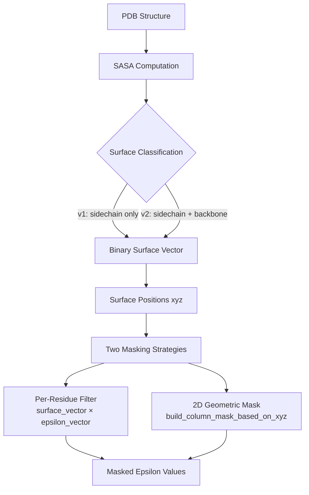
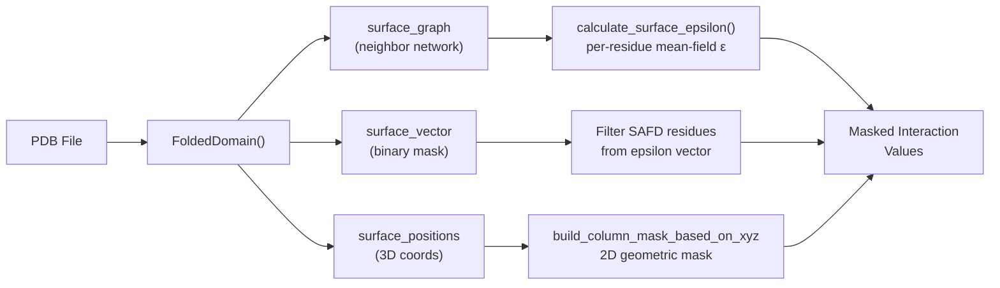

---
slug:17-spatial-accessibility-masking
blog_type:normal
---


空间可及性掩码是 finches 将折叠结构域的三维结构转换为二值掩码和几何掩码的计算流程，这些掩码用于过滤参与结构域间相互作用计算的残基。其核心原理很直观：**埋藏残基无法参与分子间接触**，因此必须将它们从 epsilon 计算中排除。finches 通过两个互补的子系统来实现这一点——`FoldedDomain` 类用于基于逐残基 SASA 的表面分类，`PDB_structure_tools` 模块用于基于坐标驱动的交互矩阵几何掩码计算。

## 概念基础：为何掩码如此重要

当计算内禀无序区（IDR）与折叠结构域（FD）之间的相互作用强度时，一种朴素的方法会将 FD 中的每个残基视为同等可用于接触。但这在物理上是不正确的：埋藏在蛋白质内部的残基对 IDR 链是不可及的。如果没有掩码处理，由于埋藏残基会产生虚假的吸引或排斥项，epsilon 值会被系统性放大。空间可及性掩码通过构建二值表面向量（1 代表溶剂暴露，0 代表埋藏）来解决此问题，然后将其作为逐残基 epsilon 向量的直接过滤器，或作为交互矩阵的二维掩码应用，其中额外的几何约束会排除在给定聚合物链连通性下物理上不可及的残基对。



来源：[folded_domain_utils.py](/finches/utils/folded_domain_utils.py#L66-L248), [PDB_structure_tools.py](/finches/PDB_structure_tools.py#L157-L244)

## FoldedDomain 类：基于 SASA 的表面分类

`FoldedDomain` 类是空间可及性分析的主要入口点。它通过 mdtraj 加载 PDB 结构，使用 Shrake-Rupley 算法计算逐残基的溶剂可及表面积（SASA），并参照由 GXG 三肽模拟推导出的最大 SASA 参考值，将每个残基分类为表面暴露或埋藏。

### 初始化与表面向量构建

在构造时，`FoldedDomain` 会执行一系列紧密耦合的序列：PDB 加载 → SASA 计算 → 表面分类 → 三维位置提取。**表面向量**是核心数据结构——一个由 0/1 值组成的列表，每个残基对应一个值，其中 1 表示溶剂可及。分类取决于 `sasa_mode` 参数，该参数控制阈值比较中使用的参考 SASA：

| 参数 | 默认值 | 描述 |
|---|---|---|
| `pdbfilename` | *(必填)* | 待分析的 PDB 文件路径 |
| `start` / `end` | `None` | 残基索引切片（两者必须同时提供或同时省略） |
| `probe_radius` | `1.4` | SASA 探针半径，单位为埃（内部转换为 nm 供 mdtraj 使用） |
| `surface_thresh` | `0.10` | 表面分类的分数阈值 |
| `sasa_mode` | `'v1'` | 表面分类模式（v1 或 v2） |
| `residue_overide_mapping` | `{}` | 将非标准残基名称映射到标准残基名称的字典 |
| `ignore_warnings` | `False` | 抑制起始/终止残基警告 |
| `SASA_ONLY` | `False` | 仅计算 SASA，跳过所有下游分析 |

```python
from finches.utils.folded_domain_utils import FoldedDomain

# 基本用法 - 加载 PDB 并分类表面残基
fd = FoldedDomain('my_protein.pdb')

# 访问二值表面向量
print(fd.surface_vector)      # 例如 [0, 1, 1, 0, 1, ...]
print(fd.surface_fraction)    # 表面残基所占比例
print(fd.surface_indices)     # 表面暴露残基的索引
print(fd.sequence)            # 完整的氨基酸序列字符串
```

来源：[folded_domain_utils.py](/finches/utils/folded_domain_utils.py#L71-L149)

### SASA 模式：v1 对比 v2

两种 SASA 模式的区别在于它们比较的参考最大 SASA 不同，这控制了残基必须暴露到何种程度才能被分类为“表面”：

**v1（默认）** 将残基的计算 SASA 仅与**侧链**最大 SASA 进行比较。这意味着甘氨酸（其侧链 SASA 为零）会被分类为表面暴露，除非它被完全埋藏（残基 SASA = 0 且最大侧链 SASA = 0，因此 0 > 0 的求值结果为假）。分类标准为：

```
residue_sasa[i] > surface_thresh × MAX_SASA_DATA[residue][0]
```

**v2** 与侧链和主链最大 SASA 的**总和**进行比较，这使得其更为严格——残基必须暴露得更多（相对于其总可能暴露度）才能被分类为表面：

```
residue_sasa[i] > surface_thresh × (MAX_SASA_DATA[residue][0] + MAX_SASA_DATA[residue][1])
```

`MAX_SASA_DATA` 字典存储了每种氨基酸的 `[sidechain_max, backbone_max]` 对，这些数据是根据 GXG 三肽的全原子排斥体积模拟计算得出的。这些是固定的经验常数——不可由用户配置——它们将分数阈值锚定到具有物理意义的参考值上。

来源：[folded_domain_utils.py](/finches/utils/folded_domain_utils.py#L17-L36), [folded_domain_utils.py](/finches/utils/folded_domain_utils.py#L198-L217)

### 表面位置与三维几何

对于每个表面残基，`FoldedDomain` 计算侧链原子的**质心**作为代表性三维坐标。如果残基缺乏侧链原子（例如甘氨酸），则使用 Cα 原子位置。这些位置存储在 `surface_positions` 中，形式为将残基索引映射到三维坐标（单位为 nm，由 mdtraj 返回）的字典。此坐标信息对于下游几何掩码计算和构建表面邻居图至关重要。

```python
fd = FoldedDomain('my_protein.pdb')

# 访问表面残基的三维位置
for idx, pos in fd.surface_positions.items():
    print(f"Residue {idx} ({fd.sequence[idx]}) at x={pos[0]:.2f}, y={pos[1]:.2f}, z={pos[2]:.2f}")
```

来源：[folded_domain_utils.py](/finches/utils/folded_domain_utils.py#L220-L231)

## 表面邻居图与距离度量

除了二值表面向量外，`FoldedDomain` 还会惰性构造一个由空间邻近关系连接的表面残基 **networkx 图**。该图不会在初始化时构建——它会在首次访问任何惰性属性（`surface_graph`、`surface_neighbours`、`surface_distance_surface`、`surface_distance_straight_line`、`all_shortest_paths`）时进行计算。

### 通过 `get_nearest_neighbour_res` 构建

`get_nearest_neighbour_res(distance_thresh=9.0)` 方法通过计算所有表面残基位置之间的成对欧氏距离矩阵来构建邻居图，然后将阈值（默认 9 Å）内的残基连接起来。每条边的权重为所连残基间的欧氏距离。从该图中可推导出两种距离度量：

| 度量 | 属性 | 描述 |
|---|---|---|
| **表面距离** | `surface_distance_surface` | 穿过图的最短路径距离（Dijkstra），反映沿蛋白质表面的测地路径 |
| **直线距离** | `surface_distance_straight_line` | 直接欧氏距离，忽略表面拓扑 |

对于大多数应用，表面距离是具有物理意义的度量——两个残基在欧氏空间中可能很近，但沿蛋白质表面却相距甚远（例如，位于结构域的相对面上）。`surface_neighbours` 字典将每个残基索引映射到 `[neighbor_index, distance]` 对列表，而 `surface_neighbour_sequences` 将邻近残基的单字母编码连接成字符串，对应于每个表面位置。

```python
fd = FoldedDomain('my_protein.pdb')

# 访问表面邻居图（触发惰性计算）
graph = fd.surface_graph
print(f"Surface graph: {graph.number_of_nodes()} nodes, {graph.number_of_edges()} edges")

# 比较两个残基之间的表面距离与直线距离
i, j = fd.surface_indices[0], fd.surface_indices[5]
print(f"Surface dist: {fd.surface_distance_surface[i][j]:.1f} Å")
print(f"Straight-line: {fd.surface_distance_straight_line[i][j]:.1f} Å")
```

来源：[folded_domain_utils.py](/finches/utils/folded_domain_utils.py#L324-L438), [folded_domain_utils.py](/finches/utils/folded_domain_utils.py#L256-L305)

## 交互矩阵的几何掩码

`FoldedDomain` 类提供逐残基的表面分类，而 `PDB_structure_tools` 模块则提供了一种补充方法：对整个交互矩阵进行**二维几何掩码**处理。核心函数是 `build_column_mask_based_on_xyz`，它根据给定聚合物链约束下每个 IDR-FD 残基对的几何可及性来构建二值掩码。

### `build_column_mask_based_on_xyz`

该函数接收一个交互矩阵（行 = FD 残基，列 = IDR 残基）、溶剂可及折叠结构域（SAFD）残基的三维坐标，以及 IDR 附着点（N 端、C 端或自定义）的位置。对于每个 SAFD 残基，它计算从 FD 上的 IDR 附着点到该残基的欧氏距离。如果该距离小于相应 IDR 残基位置的扩展聚合物极限，则矩阵项设为 1（可及），否则设为 0。聚合物极限来源于 `GS_seqs_dic` 参考数据，该数据提供了等长高斯链的预期末端距。

| 参数 | 描述 |
|---|---|
| `matrix` | 形状为 (FD_sequence, IDR_sequence) 的二维交互数组 |
| `SAFD_cords` | SAFD 残基的三维坐标（来自 `pdb_to_SDFDresidues_and_xyzs`） |
| `IDR_positon` | `'Cterm'`、`'Nterm'` 或 `'CUSTOM'`——IDR 附着到 FD 的位置 |
| `origin_index` | 自定义附着点索引（当 `IDR_positon='CUSTOM'` 时必填） |

<CgxTip>`build_column_mask_based_on_xyz` 函数在源代码中被标记为 "BROKEN"——使用时应谨慎。对于生产环境，通过 `FoldedDomain.surface_vector` 进行的逐残基掩码方法是更为稳健且经过充分测试的途径。</CgxTip>

来源：[PDB_structure_tools.py](/finches/PDB_structure_tools.py#L157-L244)

### SAFD 提取流程

在构建几何掩码之前，你必须提取溶剂可及折叠结构域（SAFD）残基及其坐标。`pdb_to_SDFDresidues_and_xyzs` 函数通过单次调用即可提供此功能：

```python
from finches.PDB_structure_tools import pdb_to_SDFDresidues_and_xyzs

SAFD_seq, SAFD_idxs, SAFD_cords = pdb_to_SDFDresidues_and_xyzs(
    pdb='my_protein.pdb',
    FD_start=50,    # 折叠结构域起始索引
    FD_end=150      # 折叠结构域终止索引
)
```

该函数返回三个值：溶剂可及残基的拼接序列、它们在完整蛋白质中的索引，以及它们在三维空间中的 Cα 坐标。在内部，它使用 `soursop` 库进行 SASA 计算（探针半径为 7，步长为 1），并使用阈值 10 进行可及性分类。对于 PDB 已被解析的工作流，`tracks_to_SAFD_residues_and_xyzs` 接受预计算的可及性和坐标轨迹，以避免冗余的 I/O 操作。

来源：[PDB_structure_tools.py](/finches/PDB_structure_tools.py#L249-L339), [PDB_structure_tools.py](/finches/PDB_structure_tools.py#L70-L99)

### 将 SAFD 向量映射回完整结构域

当仅使用 SAFD 序列计算 epsilon 向量时，必须将其映射回完整的折叠结构域以进行可视化。`map_SAFD_vector_to_full_folded_domain` 函数将部分向量（长度 = SAFD 残基数量）扩展为全长度向量（长度 = FD_end - FD_start + 1），并为埋藏位置插入 `null_value`（默认为 0）：

```python
from finches.PDB_structure_tools import map_SAFD_vector_to_full_folded_domain

full_vector, full_indices = map_SAFD_vector_to_full_folded_domain(
    partial_vector=epsilon_vector,
    SAFD_idxs=SAFD_idxs,
    FD_start=50,
    FD_end=150,
    null_value=0
)
```

来源：[PDB_structure_tools.py](/finches/PDB_structure_tools.py#L495-L567)

## 表面 Epsilon：将掩码应用于交互计算

`FoldedDomain` 类提供了三种直接将空间掩码应用于 epsilon 计算的方法，可产生考虑局部表面化学性质的逐残基或逐斑块交互值。

### `calculate_surface_epsilon`

这是核心方法。对于每个溶剂可及残基，它：（1）收集距离阈值内的邻近表面残基；（2）重新排列邻近序列，以优先排列与中心残基化学性质相似的相邻残基（疏水残基靠近疏水残基，带电残基靠近同种电荷残基）；（3）计算重排后的邻近字符串与输入序列之间的平均场 epsilon，并按邻近字符串长度归一化。这会产生一个将残基索引映射到 `[residue_type, neighbor_string, surface_epsilon_value]` 的字典。

### `calculate_attractive_surface_epsilon` / `calculate_repulsive_surface_epsilon`

这些便捷方法用于过滤表面 epsilon 值，仅返回低于阈值（吸引）或大于等于阈值（排斥）的值（默认为 0）。它们有助于识别哪些表面斑块会驱动与给定 IDR 序列的有利或不利的相互作用。

```python
from finches.utils.folded_domain_utils import FoldedDomain
from finches.frontend.mpipi_frontend import Mpipi_frontend

# 初始化 FoldedDomain 和前端
fd = FoldedDomain('my_protein.pdb')
mf = Mpipi_frontend()

# 计算针对 IDR 序列的逐残基表面 epsilon
idr_sequence = "MSTPQKLEREVD"
surface_eps = fd.calculate_surface_epsilon(idr_sequence, mf.IMC_object)

# 仅提取吸引性斑块
attractive = fd.calculate_attractive_surface_epsilon(idr_sequence, mf.IMC_object)
print(f"Attractive surface residues: {len(attractive)} out of {len(fd.surface_indices)}")
```

来源：[folded_domain_utils.py](/finches/utils/folded_domain_utils.py#L486-L584), [folded_domain_utils.py](/finches/utils/folded_domain_utils.py#L619-L696)

### IDR-表面斑块相互作用

为了进行更高分辨率的分析，`calculate_idr_surface_patch_interactions` 计算一个**逐斑块、逐 IDR 窗口**的 epsilon 矩阵。它将 IDR 序列划分为大小为 `idr_tile_size`（必须为奇数）的重叠窗口，并计算每个窗口与每个表面斑块（由距中心残基 `patch_radius` Å 范围内的残基定义）之间的 epsilon。返回值为一个元组，包含：交互字典、完整的 epsilon 矩阵（非表面残基位置为 NaN），以及所有斑块的平均 epsilon 向量。

来源：[folded_domain_utils.py](/finches/utils/folded_domain_utils.py#L891-L985)

## 表面残基聚类的逆加权距离（IWD）

`calculate_IWD` 方法使用 Schueler-Furman 和 Baker (2003) 提出的逆加权距离度量来量化特定残基类型在蛋白质表面的空间聚类。给定一组残基（按类型或显式位置指定），它计算所有残基对之间 1/d 的平均值，其中 d 为表面距离或直线距离。可以通过在表面上随机化残基位置来生成可选的零分布，从而能够统计评估观察到的聚类是否超出了随机期望。

```python
fd = FoldedDomain('my_protein.pdb')

# 表面疏水残基的 IWD
iwd, n_res, null_dist = fd.calculate_IWD(
    residues=['I', 'V', 'L', 'A', 'M'],
    distance_mode='surface',
    calculate_null=True,
    number_null_iterations=1000
)
```

来源：[folded_domain_utils.py](/finches/utils/folded_domain_utils.py#L703-L820)

## 完整工作流：从 PDB 到掩码 Epsilon

下图展示了将空间可及性掩码应用于 IDR-FD 相互作用计算的端到端流程：



<CgxTip>`FoldedDomain` 类被别名为 `FoldeDomain`（缺少末尾的 'd'）以实现向后兼容。两个名称指向同一个类——在新代码中请使用 `FoldedDomain`。</CgxTip>

来源：[folded_domain_utils.py](/finches/utils/folded_domain_utils.py#L62-L65), [folded_domain_utils.py](/finches/utils/folded_domain_utils.py#L987-L989)

## 可视化输出

有两种方法支持将掩码数据导出供外部可视化工具（例如 PyMOL 着色脚本）使用：`write_SASA_vis_file` 写入逐残基的二值表面分类，`write_epsilon_vis_file` 写入逐残基的表面 epsilon 值。两者均使用 `<residue_index> A <value>` 格式，每行对应一个残基。

来源：[folded_domain_utils.py](/finches/utils/folded_domain_utils.py#L827-L888)

---

**下一步**：关于向空间可及性掩码提供输入的 PDB 解析与表面残基提取，请参阅 [PDB 表面残基提取](16-pdb-surface-residue-extraction)。关于掩码 epsilon 值如何传播到相图计算中，请参阅 [Flory-Huggins 相图](14-flory-huggins-phase-diagrams)。关于 epsilon 计算引擎本身，请参阅 [Epsilon 计算与加权](9-epsilon-calculation-and-weighting)。