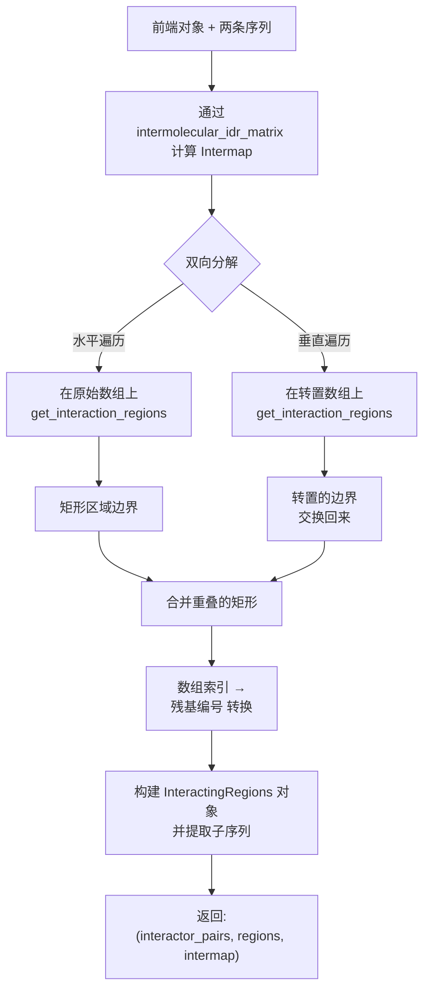
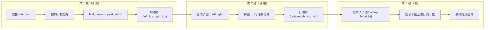

---
slug:18-domain-decomposition-and-regions
blog_type:normal
---


`finches.domain_decomposition` 模块提供了一套算法流程，用于在分子间相互作用图（intermap）中**自动识别并界定优先相互作用的空间区域**。你无需手动检查二维热图，即可通过编程方式提取出两条序列表现出强吸引或排斥行为的矩形区域，并获得残基级别的边界、子序列提取以及可视化叠加层。这是连接原始相互作用矩阵与具有生物学可解释性的结构域-结构域相互作用预测之间的桥梁。

来源：[domain_analysis.py](finches/domain_decomposition/domain_analysis.py#L1-L796)

## 概念架构

finches 中的结构域分解作为一个**三阶段流程**运行，从 1D 列计数 → 2D 矩形边界 → 双向合并区域，逐步缩小范围。其核心思想是，intermap 的列（和行）编码了一个一维信号，表示“序列 2 中有多少残基与序列 1 中该位置的相互作用低于阈值”。该信号中的峰值定义了候选的相互作用走廊，算法在子切片上递归应用峰值检测以细化二维边界。



采用双向策略的原因在于 `get_interaction_regions` 具有固有的方向偏差：它的第一次遍历作用于列，使其对“垂直方向”的相互作用块更敏感。通过同时运行原始数组和转置数组并合并重叠结果，可以捕获原本会被遗漏的水平方向相互作用块。

来源：[domain_analysis.py](finches/domain_decomposition/domain_analysis.py#L628-L696), [domain_analysis.py](finches/domain_decomposition/domain_analysis.py#L90-L198)

## `InteractingRegions` 数据结构

`InteractingRegions` 类是主要的输出对象——一个结构化容器，为每个相互作用区域对捕获了**严格峰值边界**和**窗口扩展边界**。

| 属性 | 类型 | 描述 |
|---|---|---|
| `r1_start` / `r1_end` | `int` | 序列 1 的起始/结束残基索引（峰值边界） |
| `r1_sequence` | `str` | 序列 1 在峰值边界内的子序列 |
| `r2_start` / `r2_end` | `int` | 序列 2 的起始/结束残基索引（峰值边界） |
| `r2_sequence` | `str` | 序列 2 在峰值边界内的子序列 |
| `r1_start_full` / `r1_end_full` | `int` | 包含两侧半窗口的扩展边界 |
| `r1_sequence_full` | `str` | 扩展（全窗口）边界处的子序列 |
| `rectangle_info` | `property` | 用于绘图的 `[x_start, x_end, y_start, y_end, kwargs]` 列表 |

`r1_start`/`r1_end` 与 `r1_start_full`/`r1_end_full` 之间的区别是有意为之的：峰值检测算法识别的是每个滑动窗口的中心，但实际的相互作用延伸至该中心周围的 ±半窗口残基。`_full` 属性相应地扩展了边界，为你提供了对检测到的相互作用有贡献的完整序列上下文。

<CgxTip>当使用 `InteractingRegions.rectangle_info` 进行可视化时，你可以在访问该属性之前通过设置 `ir.edgecolor` 或 `ir.rectangle_kwargs = {'facecolor': 'blue', 'alpha': 0.3}` 来自定义矩形外观。这些关键字参数会在渲染时合并到 matplotlib 的 Rectangle 参数中。</CgxTip>

来源：[domain_analysis.py](finches/domain_decomposition/domain_analysis.py#L12-L88)

## `extract_regions` 入口点

这是面向用户的主要函数，负责编排整个流程：

```python
from finches.frontend.mpipi_frontend import Mpipi_frontend
from finches.domain_decomposition.domain_analysis import extract_regions

mf = Mpipi_frontend()

s1 = 'MESNQSNNGGSGNAALNRGGRYVPPHLRGGDGGAAAAASAGGDDRRGGAGGGGYRRG'
s2 = 'LEGMSGDMRSGGGYRGRGGRGNGQRFGGRDHRYQGGSGNGGGGNGGGGGFGGGGQRSGG'

interactor_pairs, regions, intermap = extract_regions(
    frontend_obj=mf,
    seq1=s1,
    seq2=s2,
    window_size=31,
    criteria="less",
    criteria_threshold=-0.2,
    baseline=0.3,
    min_region_area=500,
    min_region_size=20
)
```

返回的元组包含：**(1)** 一个带有残基级边界和子序列的 `InteractingRegions` 对象列表，**(2)** 数组索引空间中的原始矩形边界，以及 **(3)** 完整的 intermap 数组，用于下游的可视化或分析。

来源：[domain_analysis.py](finches/domain_decomposition/domain_analysis.py#L90-L198)

## 参数参考

分解算法暴露了几个相互依赖的阈值，用于控制区域的灵敏度和特异性：

| 参数 | 默认值 | 作用 |
|---|---|---|
| `window_size` | `31` | 用于计算 intermap 的滑动窗口。必须为奇数；偶数值会被自动校正并发出警告。 |
| `criteria` | `"less"` | 阈值化方向：`"less"` 选择吸引性（负 ε）区域；`"greater"` 选择排斥性（正 ε）区域。 |
| `criteria_threshold` | `-0.2` | 应用掩码时的 ε 值。当 `criteria="less"` 时，比该值更负的值被认为是“相互作用的”。 |
| `baseline` | `0.3` | 定义峰值“边缘”的峰高比例。峰值的边界是信号降至 `baseline × peak_height` 以下的位置。 |
| `min_region_area` | `500` | 保留区域的最小面积（宽度 × 高度，以残基计）。过滤掉虚假的小斑块。 |
| `min_region_size` | `20` | 任一轴上的最小线性维度（以残基计）。确保区域在范围上具有生物学意义。 |
| `penalize_opposite` | `False` | 当为 `True` 时，从列计数中减去相反符号相互作用的计数，对与强相反特性相互作用重叠的区域进行惩罚。 |
| `offset_threshold` | `0.2` | 相反符号惩罚的阈值。与相反方向的 `criteria_threshold` 相对应。 |

**调优指南**：降低 `criteria_threshold`（例如从 -0.2 降至 -0.5）会使算法更具选择性，仅保留最强的相互作用斑块。提高 `baseline`（例如从 0.3 升至 0.5）会使峰值边缘更锐利，产生更紧密的边界。降低 `min_region_area` 和 `min_region_size` 会提高对较小相互作用斑块的灵敏度，但代价是可能会增加假阳性。

来源：[domain_analysis.py](finches/domain_decomposition/domain_analysis.py#L90-L198), [domain_analysis.py](finches/domain_decomposition/domain_analysis.py#L300-L398)

## 算法深入探讨：三趟峰值检测

分解的核心是 `get_interaction_regions`，它对二维 intermap 数组执行**递归三趟峰值检测**。每一趟都会缩小搜索空间：

### 第 1 趟 —— 列扫描

将 intermap 阈值化为二进制掩码（当 `criteria="less"` 时，值 ≤ `criteria_threshold`）。按列求和产生一维计数信号。`scipy.signal.find_peaks` 识别该信号平滑版本（3 点移动平均）中的峰值。每个峰值的宽度使用 `peak_width` 测量，该方法从峰值向外遍历，直到信号降至 `baseline × peak_height` 以下。窄于 `min_region_size` 的峰值将被丢弃。

### 第 2 趟 —— 每个列峰值内的行扫描

对于每个列峰值区域，将 intermap 的相应子切片转置，并应用相同的峰值检测。这将识别出*在*列走廊内相互作用集中的行范围。

### 第 3 趟 —— 每个行子区域内的列扫描

对于每个列峰值内的每个行子区域，算法提取二维子子图并再次对列应用峰值检测。最后一趟细化了水平边界，产生紧密的矩形边界。

每个生成的矩形在接受之前，都会在两个维度上根据 `min_region_area` 和 `min_region_size` 进行评估。



来源：[domain_analysis.py](finches/domain_decomposition/domain_analysis.py#L401-L598), [domain_analysis.py](finches/domain_decomposition/domain_analysis.py#L210-L298)

## 双向合并

由于三趟算法是列优先的，它产生的区域偏向于高窄型。`get_bidirectional_interaction_regions` 通过在原始数组和转置数组上均运行 `get_interaction_regions`，然后使用贪心成对算法**合并任何重叠的矩形**来解决此问题：

1. 在数组上运行分解 → `regions_1`
2. 在转置数组上运行分解 → `regions_2`，然后将每个边界元组从 `((x_start, x_end), (y_start, y_end))` 交换为 `((y_start, y_end), (x_start, x_end))`
3. 合并两个区域列表
4. 通过 `rectangles_overlap` 迭代检查所有对是否重叠；当发现重叠时，用**边界框**（左边缘的最小值，右边缘的最大值）替换该对，并重新启动扫描
5. 重复直到没有重叠为止

重叠测试使用标准的轴对齐矩形分离逻辑：如果一个矩形完全在另一个矩形的左侧/右侧或上方/下方，则这两个矩形不重叠；否则它们重叠。

<CgxTip>合并算法的复杂度在每次迭代时为 O(n²)，并具有合并即重启的语义。对于数量非常多的区域（>100），这可能会变慢。在实践中，大多数蛋白质-蛋白质 intermap 产生的区域少于 20 个，因此这很少成为问题。</CgxTip>

来源：[domain_analysis.py](finches/domain_decomposition/domain_analysis.py#L628-L696), [domain_analysis.py](finches/domain_decomposition/domain_analysis.py#L600-L626)

## 索引转换：数组空间 ↔ 残基空间

intermap 是使用大小为 `window_size` 的滑动窗口计算的，这意味着数组索引不直接对应于残基编号。函数 `convert_intermap_index_to_residue_number` 执行此映射：

```python
residue_number = array_index + window_half
# 其中 window_half = (window_size - 1) / 2
```

对于默认的 `window_size=31`，`window_half=15`，因此数组索引 0 对应于残基 16，数组索引 1 对应于残基 17，依此类推。此偏移量解释了这样一个事实：第一个有效窗口的中心位于第 16 个残基（每侧各有 15 个残基）。

来源：[domain_analysis.py](finches/domain_decomposition/domain_analysis.py#L200-L225)

## 使用 `plot_regions_on_intermap` 进行可视化

该模块提供了一个便捷函数，用于将检测到的区域矩形叠加在 intermap 热图上：

```python
from finches.domain_decomposition.domain_analysis import plot_regions_on_intermap

# 使用不同颜色绘制多个区域集
plot_regions_on_intermap(
    array=intermap,
    regions_lists=[regions_set_1, regions_set_2],
    colors=['red', 'blue'],
    filename='output.png'  # 设为 None 以交互式显示
)
```

该函数使用 `PRGn` 色彩映射（紫色 = 吸引，绿色 = 排斥）渲染 intermap，参数为 `vmin=-2.5, vmax=2.5`，为每个区域绘制 `matplotlib.patches.Rectangle` 轮廓，并将轴标记为“Sequence 1”和“Sequence 2”。y 轴被反转以匹配标准的 intermap 方向。

来源：[domain_analysis.py](finches/domain_decomposition/domain_analysis.py#L700-L796)

## 实用函数

几个底层函数支持该流程，并可用于自定义分析工作流：

| 函数 | 签名 | 用途 |
|---|---|---|
| `peak_width` | `(data, peak_index, baseline)` | 从峰值向左和向右遍历，直到信号降至 `baseline` 以下；返回 `(width, left_index, right_index)`。如果峰值已低于基线，则引发 `PeakError`。 |
| `remove_included_ranges` | `(ranges)` | 给定一个 `(width, left, right)` 元组列表，移除任何完全包含在另一个范围内的范围。按左边界排序，然后迭代过滤。 |
| `rectangles_overlap` | `(R1, R2)` | 使用分离轴测试，如果两个轴对齐的矩形重叠则返回 `True`。 |
| `rectangle_area` | `(rect)` | 根据 `((left, right), (bottom, top))` 边界格式计算 `width × height`。 |

来源：[domain_analysis.py](finches/domain_decomposition/domain_analysis.py#L230-L298), [domain_analysis.py](finches/domain_decomposition/domain_analysis.py#L600-L660)

## 综合应用：端到端示例

```python
from finches import Mpipi_frontend
from finches.domain_decomposition.domain_analysis import extract_regions, plot_regions_on_intermap

# 初始化前端
mf = Mpipi_frontend()

# 定义两条序列（例如，来自不同蛋白质的 IDR 区域）
s1 = 'MESNQSNNGGSGNAALNRGGRYVPPHLRGGDGGAAAAASAGGDDRRGGAGGGGYRRGGGNSGGGGGGGYDRGYNDNRDDRDNRGGSGGYGRDRNYEDRGYNGGGGGGGNRGYNNNRGGGGGGYNRQDRGDGGSSNFSRGGYNNRDEGSDNRGSGRSYNNDRRDNGGD'
s2 = 'LEGMSGDMRSGGGYRGRGGRGNGQRFGGRDHRYQGGSGNGGGGNGGGGGFGGGGQRSGGGGGFQSGGGGGRQQQQQQRAQPQQDWWS'

# 提取相互作用区域
interactor_pairs, raw_regions, intermap = extract_regions(
    frontend_obj=mf,
    seq1=s1,
    seq2=s2,
    window_size=31,
    criteria="less",          # 寻找吸引性相互作用
    criteria_threshold=-0.2,  # ε 低于 -0.2 被认为是相互作用的
    baseline=0.3,             # 峰值边缘位于峰高的 30% 处
    min_region_area=500,      # 要求至少 500 残基² 的面积
    min_region_size=20        # 要求每个维度至少 20 个残基
)

# 检查每个相互作用区域
for ir in interactor_pairs:
    print(f"Seq1 residues {ir.r1_start}-{ir.r1_end}: {ir.r1_sequence}")
    print(f"Seq2 residues {ir.r2_start}-{ir.r2_end}: {ir.r2_sequence}")
    print(f"Full-window seq1: {ir.r1_start_full}-{ir.r1_end_full}")
    print(f"Full-window seq2: {ir.r2_start_full}-{ir.r2_end_full}")
    print("---")

# 可视化叠加在 intermap 上的区域
plot_regions_on_intermap(intermap, [raw_regions], ['red'], filename='regions.png')
```

来源：[domain_analysis.py](finches/domain_decomposition/domain_analysis.py#L90-L198), [domain_analysis.py](finches/domain_decomposition/domain_analysis.py#L700-L796)

## 与相邻模块的关系

结构域分解流程位于 intermap 计算的下游，并与折叠结构域分析工具互补：

- **[相互作用图和图表](6-interaction-maps-and-figures)** —— 生成 `extract_regions` 操作所基于的原始 intermap
- **[滑动窗口矩阵计算](10-sliding-window-matrix-computation)** —— `InteractionMatrixConstructor.calculate_sliding_epsilon` 调用是 intermap 生成的基础
- **[PDB 表面残基提取](16-pdb-surface-residue-extraction)** 和 **[空间可及性掩码](17-spatial-accessibility-masking)** —— `folded_domain_utils.py` 中的 `FoldedDomain` 类提供了用于识别结构化结构域表面残基的正交功能；这些可以与结构域分解结合使用，以分析 IDR-折叠结构域界面

对于不进行区域提取的序列级相互作用分析，请参见[每残基相互作用向量](7-per-residue-interaction-vectors)。对于馈入 intermap 的底层 ε 计算，请参见[Epsilon 计算与加权](9-epsilon-calculation-and-weighting)。