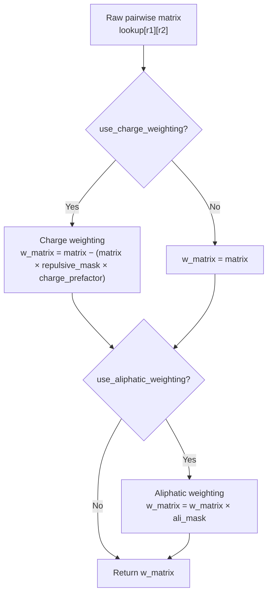

---
slug:19-sequence-context-weighting-schemes
blog_type:normal
---


Finches 实现了两种主要的**序列上下文加权方案** —— 电荷加权和脂肪族聚类加权 —— 用于校正原始成对相互作用矩阵中粗粒度力场仅在残基对水平上无法捕获的局部序列上下文效应。这两种方案在 epsilon 聚合*之前*，作为交互矩阵的乘性或减性变换进行操作，这意味着它们在不改变底层力场参数的情况下，改变了有效的逐残基相互作用强度。第三种上下文相关方案 —— 用于折叠结构域与 IDR 界面的空间可达性掩码 —— 结合了电荷加权和 3D 几何可达性，将在[空间可达性掩码](17-spatial-accessibility-masking)中讨论。

## 架构概述

加权流水线是对原始成对矩阵的顺序变换。`calculate_weighted_pairwise_matrix` 方法协调了以下顺序：原始矩阵首先进行电荷加权（减性），然后进行脂肪族加权（乘性）。此顺序很重要，因为电荷加权会原地调整排斥元素，而脂肪族加权随后会对整个矩阵进行缩放 —— 包括已经过电荷调整的值。



每种加权方案在 `parsing_aminoacid_sequences.py` 中实现为一个**掩码生成函数**，返回一个与相互作用矩阵形状相同的 2D 数组。该掩码对从局部序列上下文导出的逐位置加权因子进行编码，然后在 `epsilon_calculation.py` 中对其进行代数应用。

来源：[epsilon_calculation.py](/finches/epsilon_calculation.py#L494-L603), [parsing_aminoacid_sequences.py](/finches/parsing_aminoacid_sequences.py#L25-L306)

## 电荷上下文加权

### 物理原理

在平均场隐式溶剂模型中，两个残基之间的同种电荷排斥计算，就如同两个侧链相互指向并承受完全的静电惩罚。而在现实中，多肽链上的带电侧链可以相互重新定向，和/或经历 pKa 偏移从而减弱其有效电荷。**电荷上下文加权**方案通过削弱嵌入在**同种电荷**局部序列片段中的带电残基间的排斥相互作用来纠正这一点 —— 其物理直觉在于，同号电荷簇已通过侧链重定向部分屏蔽了彼此，因此原始模型高估了它们的跨序列排斥。

来源：[parsing_aminoacid_sequences.py](/finches/parsing_aminoacid_sequences.py#L25-L96), [epsilon_calculation.py](/finches/epsilon_calculation.py#L546-L594)

### |NCPR/FCR| 加权因子

对于每对带电残基（序列 1 中的 r₁，序列 2 中的 r₂），该方案在每个位置周围提取一个 **±1 残基的窗口**，连接两个局部片段，并计算：

$$w_{\text{charge}} = \left|\frac{\text{NCPR}}{\text{FCR}}\right|$$

其中 **NCPR** 是每个残基的净电荷，**FCR** 是连接片段中带电残基的比例。该比值具有优雅的边界行为：

| 片段组成 | NCPR | FCR | \|NCPR/FCR\| | 解释 |
|---|---|---|---|---|
| 全为同号电荷（如 `EEE`） | ±1.0 | 1.0 | **1.0** | 最大权重 —— 同种电荷簇，排斥计算高估最严重 |
| +/- 电荷等量混合（如 `KEE`） | 0.0 | 1.0 | **0.0** | 无权重 —— 电荷平衡，无系统性高估 |
| 中性环境中的单个带电残基（如 `KAA`） | 0.33 | 0.33 | **1.0** | 孤立电荷获得全权重（单电荷片段的 FCR=NCPR） |
| 无带电残基 | — | 0 | **0.0** | 无权重 —— 非带电对，掩码项为零 |

然后，该加权因子作为相互作用矩阵排斥部分的**减性校正**被应用：

```python
w_matrix = matrix - (matrix * repulsive_mask * charge_prefactor)
```

`charge_prefactor`（0 < prefactor < 1）是一个特定于力场的标量，用于控制校正的整体幅度。它会根据每个模型进行校准，并存储在力场的 `CONFIGS` 字典中。

<CgxTip>电荷加权仅生成**排斥掩码** —— 吸引掩码虽已计算但目前未使用。曾测试过一种将加权拆分为吸引和排斥两部分的替代实现，但在校准基准测试中发现其表现更差。注释掉的替代实现仍保留在源码中以供参考。</CgxTip>

来源：[parsing_aminoacid_sequences.py](/finches/parsing_aminoacid_sequences.py#L97-L194), [sequence_tools.py](/finches/sequence_tools.py#L76-L113)

### 窗口提取：`get_neighbors_window_of3`

每个带电残基周围的局部片段由 `get_neighbors_window_of3(i, sequence)` 提取，该函数返回位置 `i` 处的残基及其两侧各一个邻居（窗口大小 ≤ 3）。在序列边界处，窗口会平滑地截断为 2 或 1 个残基，而不是进行填充。来自序列 1 和序列 2 的两个窗口被连接成一个最多包含 6 个残基的单一片段，用于 NCPR/FCR 计算。

来源：[sequence_tools.py](/finches/sequence_tools.py#L164-L195)

### 折叠结构域变体：`get_charge_weighted_FD_mask`

对于**溶剂可及折叠结构域（SAFD）**表面与 IDR 之间的结构域间相互作用，电荷加权是不对称的：折叠结构域残基被孤立处理（无 ±1 窗口），而 IDR 残基仍保留其 ±1 上下文窗口。这反映了这样一个物理现实：折叠结构域上的表面残基具有由三级结构决定的固定朝向，而非由局部序列上下文决定。因此，连接片段为 `r1 + get_neighbors_window_of3(j, sequence2)`，而非对称的双窗口。

来源：[parsing_aminoacid_sequences.py](/finches/parsing_aminoacid_sequences.py#L200-L246), [epsilon_stateless.py](/finches/epsilon_stateless.py#L271-L422)

## 脂肪族聚类加权

### 物理原理

在隐式溶剂粗粒度模型中，两个脂肪族（疏水）残基之间的吸引作用反映了界面上释放水的热力学。然而，释放水是一个**量子化**的现象：两个孤立的亮氨酸可能无法形成足够大的疏水片来释放大量水分子，而两个亮氨酸簇则可以创建一个能够实现此目的的连续界面。**脂肪族聚类加权**方案提升了属于局部簇的脂肪族残基间的吸引作用，使得成簇的脂肪族残基比同等数量间隔分布的脂肪族残基具有更强的有效疏水性。

来源：[parsing_aminoacid_sequences.py](/finches/parsing_aminoacid_sequences.py#L252-L306)

### 组分配：`get_aliphatic_groups`

序列中的每个脂肪族残基 (A, V, I, L, M) 根据其局部片段内拥有的脂肪族邻居数量被分配到一个**组**中。该过程分三个阶段进行：

1. **二进制掩码**：将序列转换为二进制掩码，其中脂肪族位置 = 1，所有其他位置 = 0。
2. **最近邻计数**：`MASK_n_closest_nearest_neighbors` 计算每个脂肪族残基在其连接片段内拥有的脂肪族邻居数（片段由 `extract_fragments` 定义，`max_separation=1` 意味着脂肪族残基之间最多允许一个间隔，否则片段分裂）。
3. **组阈值划分**：原始邻居计数上限为 3，产生三个组：

| 组 | 邻居数 | 物理含义 |
|---|---|---|
| **0** | N/A（非脂肪族） | 不应用脂肪族加权 |
| **1** | 1 | 孤立脂肪族 —— 无聚类收益 |
| **2** | 2 | 小簇 —— 中等疏水增强 |
| **3** | ≥3 | 大簇 —— 强疏水增强 |

来源：[parsing_aminoacid_sequences.py](/finches/parsing_aminoacid_sequences.py#L311-L341), [sequence_tools.py](/finches/sequence_tools.py#L236-L317)

### 乘性加权表

脂肪族掩码是一个 2D 矩阵，其中每个条目由两条序列间的组配对决定。**multiplier_weighting** 字典定义了每种组组合的缩放因子：

|  | 序列2：组 1 | 序列2：组 2 | 序列2：组 3 |
|---|---|---|---|
| **序列1：组 1** | 1.0 | 1.0 | 1.0 |
| **序列1：组 2** | 1.0 | **1.5** | **1.5** |
| **序列1：组 3** | 1.0 | **1.5** | **3.0** |

从该表得出的关键观察：涉及至少一个孤立脂肪族（组 1）的相互作用**从不缩放**（乘数 = 1.0）。只有当两个残基都属于簇时，缩放才会激活。最大乘数 **3.0** 出现在两个大簇相互作用时，反映了簇-簇接触产生的超比例疏水界面。混合组 2/组 3 配对的不对称 1.5 因子代表了中等程度的增强。

该掩码作为**纯乘性**变换应用：

```python
w_matrix = w_matrix * ali_mask
```

这意味着脂肪族加权对存在脂肪族聚类的位置缩放*所有*相互作用 —— 包括吸引和排斥。非脂肪族位置的掩码值为 1.0，使其保持不变。

<CgxTip>脂肪族聚类加权在结构域间（折叠结构域–IDR）计算中**不应用**。其理由是折叠结构域表面不计算脂肪族组，因此 FD 表面上的所有脂肪族残基都被视为孤立的（组 1）。请参阅 `get_interdomain_epsilon_vectors`，其中参数列表中不存在 `use_aliphatic_weighting`。</CgxTip>

来源：[parsing_aminoacid_sequences.py](/finches/parsing_aminoacid_sequences.py#L284-L306), [epsilon_calculation.py](/finches/epsilon_calculation.py#L597-L599)

## 片段提取与邻居计数

这两种加权方案都依赖于 `sequence_tools.py` 中的实用工具来提取局部序列上下文：

### `extract_fragments(mask, max_separation=1)`

将二进制掩码转换为连续片段，其中一个片段是由最多 `max_separation` 个零分隔的 1 的连续序列。例如，当 `max_separation=1` 时：

```
输入：[0, 0, 1, 1, 1, 0, 1, 1, 0, 0, 0, 1, 0, 0, 1, 1, 0, 0, 1, 0, 1, 1, 0, 1]
输出：['111011', '1', '11', '11', '101101']
```

位置 4 和 6 之间的单个零被桥接为一个片段，而两个或更多的零则创建片段边界。

### `MASK_n_closest_nearest_neighbors(mask, max_separation=1, max_distance=4)`

对于掩码中值为 1（脂肪族）的每个位置，此函数计算在该位置周围 `max_distance=4` 残基窗口内的脂肪族邻居数量，*在其局部片段内*。结果是一个非二进制掩码，其中每个脂肪族位置保存其邻居计数，非脂肪族位置保持为 0。

来源：[sequence_tools.py](/finches/sequence_tools.py#L201-L317)

## 集成到 Epsilon 流水线

完整的加权流水线流经 `calculate_weighted_pairwise_matrix`，该函数被所有下游 epsilon 计算函数调用。下表总结了每种计算路径中处于激活状态的加权方案：

| 计算函数 | 电荷加权 | 脂肪族加权 | 空间（XYZ）掩码 |
|---|---|---|---|
| `calculate_epsilon_value` | ✓ | ✓ | ✗ |
| `calculate_epsilon_vectors` | ✓ | ✓ | ✗ |
| `calculate_sliding_epsilon` | ✓ | ✓ | ✗ |
| `get_interdomain_epsilon_vectors` | ✓（FD 变体） | ✗ | ✓ |
| `get_interdomain_epsilon_value` | ✓（FD 变体） | ✗ | ✓ |

所有 IDR–IDR 计算默认启用电荷加权和脂肪族加权。两者均可通过 `use_charge_weighting=False` 和 `use_aliphatic_weighting=False` 标志禁用。结构域间计算使用不对称的 `get_charge_weighted_FD_mask` 并应用空间可达性掩码，但完全跳过脂肪族加权。

来源：[epsilon_calculation.py](/finches/epsilon_calculation.py#L614-L701), [epsilon_stateless.py](/finches/epsilon_stateless.py#L119-L268), [epsilon_stateless.py](/finches/epsilon_stateless.py#L271-L422)

## 通过 API 控制加权

加权标志在计算栈的每一层均有暴露。在 `InteractionMatrixConstructor` 层级：

```python
from finches.forcefields.mpipi import Mpipi_model
from finches.epsilon_calculation import InteractionMatrixConstructor

params = Mpipi_model(version='Mpipi_GGv1')
IMC = InteractionMatrixConstructor(parameters=params)

# 默认：启用两种加权
eps = IMC.calculate_epsilon_value(seq1, seq2)

# 禁用电荷加权（使用原始排斥值）
eps = IMC.calculate_epsilon_value(seq1, seq2, use_charge_weighting=False)

# 禁用脂肪族加权（将所有脂肪族残基视为孤立）
eps = IMC.calculate_epsilon_value(seq1, seq2, use_aliphatic_weighting=False)

# 禁用两者（纯成对矩阵，无上下文校正）
eps = IMC.calculate_epsilon_value(seq1, seq2,
                                   use_charge_weighting=False,
                                   use_aliphatic_weighting=False)
```

`charge_prefactor` 在构造时根据力场的 `CONFIGS` 字典设定，但可以通过 `epsilon_stateless.py` 中的无状态函数在每次调用时覆盖。

来源：[epsilon_calculation.py](/finches/epsilon_calculation.py#L18-L189), [epsilon_stateless.py](/finches/epsilon_stateless.py#L119-L268)

## 设计原理与局限性

这两种加权方案处理的是完全不同的物理校正。**电荷加权**是一种*减性*校正，它削弱了对同种电荷簇高估的排斥 —— 它绝不会使相互作用更具吸引力，只会减弱排斥。**脂肪族加权**是一种*乘性*校正，它增强了聚类脂肪族位置的吸引和排斥相互作用 —— 它放大了原始矩阵中已有的任何内容。这种不对称性是有意为之的：电荷重定向只能减少排斥（绝不会将吸引增强到超越原始模型），而疏水聚类则真正放大了有效的相互作用强度。

一个重要的局限性：脂肪族加权目前**仅限于五种标准脂肪族残基** (A, V, I, L, M)。芳香族残基 (F, W, Y) 不参与聚类，尽管 π–π 堆积簇可能表现出类似的上下文相关增强。源码指出这是一个未来的研究方向。此外，电荷加权窗口固定为 ±1（共 3 个残基）；这是在捕获局部电荷上下文与计算成本之间权衡的选择，但原则上可以泛化。

来源：[parsing_aminoacid_sequences.py](/finches/parsing_aminoacid_sequences.py#L252-L267), [epsilon_calculation.py](/finches/epsilon_calculation.py#L568-L576)

## 后续步骤

- 有关定义 `charge_prefactor` 和 `null_interaction_baseline` 的力场参数，请参阅 [Mpipi 力场参数](11-mpipi-forcefield-parameters) 和 [CALVADOS 力场参数](12-calvados-forcefield-parameters)。
- 有关加权矩阵如何输入到 epsilon 聚合中，请参阅 [Epsilon 计算与加权](9-epsilon-calculation-and-weighting)。
- 有关结构域间计算中使用的空间可达性掩码方案，请参阅 [空间可达性掩码](17-spatial-accessibility-masking)。
- 有关加权流水线底层的 Cython 加速矩阵操作，请参阅 [Cython 矩阵加速](20-cython-matrix-acceleration)。