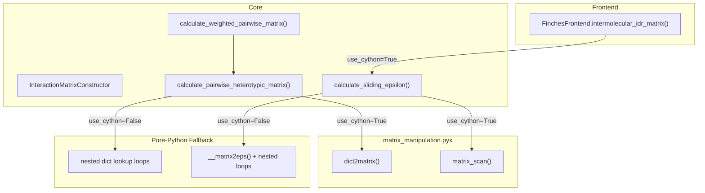

---
slug:20-cython-matrix-acceleration
blog_type:normal
---


`matrix_manipulation.pyx` Cython 扩展模块为 finches 中两个计算密集型操作提供了 C 编译的热路径：**两两交互矩阵构建**（`dict2matrix`）和**滑动窗口 epsilon 扫描**（`matrix_scan`）。通过用静态类型的 C 循环取代纯 Python 循环，消除了边界检查并利用了类型化内存视图，这些函数将实际耗时降至等效 Python 实现的约 **5–10%**——即 10–20 倍的加速，这使得大矩阵和高吞吐量分析变得切实可行。

来源：[matrix_manipulation.pyx](finches/utils/matrix_manipulation.pyx#L1-L201), [epsilon_calculation.py](finches/epsilon_calculation.py#L450-L520)

## 架构与调用图

Cython 模块位于分层计算管道的最底层。[InteractionMatrixConstructor](8-interactionmatrixconstructor) 中的高层 API 函数及前端通过显式的 `use_cython` 标志委托给它，且始终提供纯 Python 的回退方案。



当 `use_cython=True`（默认值）时，调用路径会经由编译后的 `.pyx` 函数。当为 `False` 时，相同的逻辑将在纯 Python 中执行，这在调试或 Cython 扩展编译失败的环境中非常有用。

来源：[epsilon_calculation.py](finches/epsilon_calculation.py#L450-L520), [frontend_base.py](finches/frontend/frontend_base.py#L60-L135)

## Cython 优化指令

每个加速函数都带有两个 Cython 编译器指令的装饰器，这些指令在编译时剥离了 Python 级别的安全检查：

| 指令 | 效果 | 风险 |
|---|---|---|
| `@cython.boundscheck(False)` | 禁用数组索引边界验证 | 越界访问会导致未定义行为（段错误），而非抛出 `IndexError` |
| `@cython.cdivision(True)` | 禁用 Python 风格的除零检查 | 除以零会导致 C 级别的错误，而非抛出 `ZeroDivisionError` |

这些操作在此是安全的，因为所有循环边界均派生自经过预验证的矩阵维度，且除法仅发生于已知为正数的 `window_size`。这种组合消除了每次迭代的 Python 开销，并允许内层循环编译为扁平的 C 机器码。

来源：[matrix_manipulation.pyx](finches/utils/matrix_manipulation.pyx#L8-L18)

## 函数参考

### `dict2matrix(seq1, seq2, lookup) → np.ndarray`

通过在预计算的字典中查找每个残基对，构建一个 Len(seq1) × Len(seq2) 的两两交互矩阵。这取代了在列表的列表中追加元素并通过 `np.array()` 转换的纯 Python 双重循环。

**类型化签名：**

- `seq1: str`, `seq2: str` — 氨基酸序列
- `lookup: dict` — 嵌套字典，其中 `lookup[r1][r2]` 返回一个 `float` 类型的交互参数
- **返回：** `cnp.ndarray[cnp.float_t, ndim=2]` — 一个 C 连续的 float64 矩阵

**实现策略：** 该函数预分配一个 `np.empty((l1, l2), dtype=float)` 数组，并使用 C 类型的索引变量（`cdef int r1, r2`）来填充它，避免了任何中间 Python 列表的构建。由于内层循环对每个元素执行一次字典查找，Python 中的主要开销是每次迭代的解释器分派——Cython 完全消除了这一点。

**调用自：** 当 `use_cython=True` 时，由 `InteractionMatrixConstructor.calculate_pairwise_heterotypic_matrix()` 调用。

来源：[matrix_manipulation.pyx](finches/utils/matrix_manipulation.pyx#L8-L22), [epsilon_calculation.py](finches/epsilon_calculation.py#L460-L476)

### `matrix_scan(w_matrix, window_size, null_interaction_baseline) → tuple`

[滑动窗口矩阵计算](10-sliding-window-matrix-computation)中性能关键的核心函数。通过在完整交互矩阵上滑动 `window_size × window_size` 的窗口，计算平滑后的 epsilon 矩阵，将每个子窗口相对于 `null_interaction_baseline` 分解为吸引和排斥成分，并累加其行均值。

**类型化签名：**

- `w_matrix: double[:,:]` — Cython 类型化内存视图（NumPy 数组的零拷贝视图）
- `window_size: int` — 方形滑动窗口的边长（应为奇数）
- `null_interaction_baseline: double` — 区分吸引（< 基线）与排斥（> 基线）交互的阈值
- **返回：** `(everything, seq1_indices, seq2_indices)` — 包含 3 个 NumPy 数组的元组

**返回元素：**

| 元素 | 形状 | 描述 |
|---|---|---|
| `everything` | `(L1−W+1) × (L2−W+1)` | 滑动窗口 epsilon 值 |
| `seq1_indices` | `(L1−W+1,)` | 序列 1 的蛋白质空间残基索引（从 1 开始） |
| `seq2_indices` | `(L2−W+1,)` | 序列 2 的蛋白质空间残基索引（从 1 开始） |

其中 `L1`、`L2` 为矩阵维度，`W` 为 `window_size`。

**实现策略——为何如此高效：** 该函数使用四个预分配数组（`everything`、`attractive_matrix`、`repulsive_matrix` 和 `sub`），并在 C 类型循环中逐元素手动分解每个窗口。吸引/排斥分离、行均值累加以及最终求和均被编写为使用 `cdef int` 索引和 `cdef double` 累加器的显式 `for` 循环。这避免了 NumPy 在小型 `window_size × window_size` 子矩阵上的每次操作开销（临时数组创建、数据类型强制转换、方法分派）——由于窗口操作需重复 `(L1−W+1) × (L2−W+1)` 次，这种开销在纯 Python 版本中占据主导地位。

**蛋白质空间索引：** 返回的索引数组使用从 1 开始的编号（第一个残基 = 1），计算方式为 `start = int((window_size − 1) / 2) + 1`。这符合生化惯例，并由 `len(seq_indices) == matrix.shape[i]` 的断言强制保证。

**调用自：** 当 `use_cython=True` 时，由 `InteractionMatrixConstructor.calculate_sliding_epsilon()` 调用。

来源：[matrix_manipulation.pyx](finches/utils/matrix_manipulation.pyx#L25-L127), [epsilon_calculation.py](finches/epsilon_calculation.py#L745-L800)

### `return_random_array(n) → np.ndarray` 和 `seed_C_rand(seedval)`

用于随机操作的实用函数。`return_random_array(n)` 使用 C 语言的 `rand()/RAND_MAX` 生成一个包含 `n` 个均匀随机浮点数的数组，而 `cdef`（模块私有）的 `seed_C_rand()` 封装了 `srand()` 用于设置种子。这些函数直接使用 `libc.stdlib`，绕过了 Python 的 `random` 模块，从而在紧凑循环中将开销降至最低。

来源：[matrix_manipulation.pyx](finches/utils/matrix_manipulation.pyx#L130-L201)

## 构建与编译

Cython 扩展在安装时通过 `setup.py` 编译，该文件声明了一个针对 `finches.utils.matrix_manipulation` 的单一 `Extension`：

```python
extensions = [
    Extension(
        "finches.utils.matrix_manipulation",
        ["finches/utils/matrix_manipulation.pyx"],
        include_dirs=[numpy.get_include()],
    )
]
setup(
    ext_modules=cythonize(extensions, compiler_directives={'language_level': "3"}),
)
```

`include_dirs` 引用了 NumPy 的 C API 头文件（`cimport numpy` 所需），而 `language_level="3"` 确保在 Cython 转译步骤中采用 Python 3 语义。构建依赖项——`cython` 和 `numpy`——在 `pyproject.toml` 的 `[build-system] requires` 中声明。

<CgxTip>如果 Cython 扩展编译失败（例如缺少 C 编译器或未安装 Cython），包仍会安装成功——只是 `use_cython=True` 的代码路径会在运行时失败。`calculate_pairwise_heterotypic_matrix()` 和 `calculate_sliding_epsilon()` 中的纯 Python 回退方案提供了完全一致的结果，因此设置 `use_cython=False` 是一种安全的权宜之计。</CgxTip>

来源：[setup.py](setup.py#L1-L32), [pyproject.toml](pyproject.toml#L1-L6)

## Cython 与纯 Python：算法比较

两种实现在算法上完全相同，但在执行模型上有所不同：

| 方面 | Cython (`matrix_manipulation.pyx`) | 纯 Python |
|---|---|---|
| **dict2matrix** 循环 | `cdef int` 索引 → 基于 `cnp.ndarray` 的 C `for` 循环 | Python `for` 循环追加到嵌套 `list` → `np.array()` |
| **matrix_scan** 窗口提取 | 类型化内存视图拷贝至预分配的 `sub` 数组 | NumPy 切片：`w_matrix[i:i+W, j:j+W]` |
| **吸引/排斥分离** | C 中的逐元素 `if/else` | `epsilon_stateless.get_attractive_repulsive_matrices()` 使用布尔掩码乘法 |
| **行均值累加** | 使用 `cdef double` 的显式 `row_sum += attractive_matrix[r1,r2]` | `np.sum(np.mean(attractive_matrix, axis=1))` |
| **数组分配** | 一次预分配（`np.empty`） | 每次窗口迭代时创建（NumPy 临时对象） |
| **相对性能** | **1×**（基准） | 慢 **10–20×** |

核心洞察在于，Cython 版本不仅仅是“加速 Python”——它用原生 C 循环取代了 NumPy 向量化但高开销的小数组操作。对于 `matrix_scan` 函数，其内层窗口通常为 31×31 = 961 个元素，而外层循环运行 `(L1−30) × (L2−30)` 次，每个窗口的 NumPy 分派成本（函数查找、数据类型检查、临时分配）远远超过了实际的算术运算。Cython 消除了所有这些分派开销。

来源：[matrix_manipulation.pyx](finches/utils/matrix_manipulation.pyx#L80-L127), [epsilon_calculation.py](finches/epsilon_calculation.py#L800-L874), [epsilon_stateless.py](finches/epsilon_stateless.py#L24-L56)

## 集成点与 `use_cython` 标志

`use_cython` 布尔标志贯穿三个层级：

1. **前端层** — `FinchesFrontend.intermolecular_idr_matrix()` 接受 `use_cython=True` 并将其直接传递给 `calculate_sliding_epsilon()`。

2. **InteractionMatrixConstructor** — `calculate_pairwise_heterotypic_matrix()` 和 `calculate_sliding_epsilon()` 均接受 `use_cython=True`。请注意，`calculate_weighted_pairwise_matrix()` 也接受该标志，并将其转发给 `calculate_pairwise_heterotypic_matrix()` 以用于初始矩阵构建。

3. **Cython 层** — 该标志决定了是调用 `matrix_manipulation.dict2matrix()` / `matrix_manipulation.matrix_scan()` 还是调用内联的 Python 等效实现。

这种分层设计意味着 Cython 加速同时应用于矩阵构建步骤（`dict2matrix`）和滑动窗口扫描步骤（`matrix_scan`），并且可以在任何调用层级独立切换。

<CgxTip>为了在批量分析中获得最大吞吐量（例如，扫描数百个序列对），请确保在顶层调用时设置 `use_cython=True`。该标志在所有地方均默认为 `True`，因此这是默认行为——只有显式设置 `use_cython=False` 才会禁用它。</CgxTip>

来源：[frontend_base.py](finches/frontend/frontend_base.py#L62-L135), [epsilon_calculation.py](finches/epsilon_calculation.py#L440-L520), [epsilon_calculation.py](finches/epsilon_calculation.py#L710-L800)

## 相关页面

- `matrix_scan` 所加速的滑动窗口算法文档见 [滑动窗口矩阵计算](10-sliding-window-matrix-computation)。
- 调用这些 Cython 函数的 `InteractionMatrixConstructor` 方法涵盖在 [InteractionMatrixConstructor](8-interactionmatrixconstructor) 中。
- `dict2matrix` 所使用的字典查找表（`self.lookup`）由力场参数构建——参见 [Mpipi 力场参数](11-mpipi-forcefield-parameters) 和 [CALVADOS 力场参数](12-calvados-forcefield-parameters)。